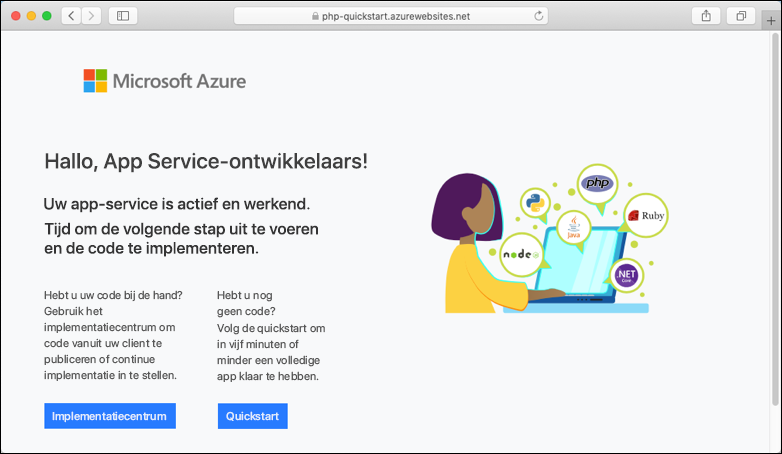

# <a name="create-a-php-web-app-in-azure"></a>Een PHP-web-app maken in Azure

> [!NOTE]
> In dit artikel gaat u een app implementeren in App Service onder Windows. Zie [Een PHP-web-app maken en implementeren in App Service onder Linux ](./containers/quickstart-php.md) om een app te implementeren in App Service onder _Linux_.
>

[Azure App Service](overview.md) biedt een zeer schaalbare, zelfpatchende webhostingservice.  In deze snelstartzelfstudie ziet u hoe u een PHP-app naar Azure App Service implementeert. U maakt de web-app via de [Azure CLI](https://docs.microsoft.com/cli/azure/get-started-with-azure-cli) in Cloud Shell en u gebruikt Git om voorbeeldcode van PHP in de web-app te implementeren.


U kunt de onderstaande stappen volgen met behulp van een Mac-, Windows- of Linux-computer. Vanaf het moment dat de vereiste onderdelen zijn geïnstalleerd, duurt het ongeveer vijf minuten om de stappen uit te voeren.

[!INCLUDE [quickstarts-free-trial-note](../../includes/quickstarts-free-trial-note.md)]

## <a name="prerequisites"></a>Vereisten

Dit zijn de vereisten voor het voltooien van deze snelstart:

* <a href="https://git-scm.com/" target="_blank">Git installeren</a>
* <a href="https://php.net/manual/install.php" target="_blank">PHP installeren</a>

## <a name="download-the-sample-locally"></a>Het voorbeeld lokaal downloaden

Voer in een terminalvenster de volgende opdrachten uit. Hiermee wordt de voorbeeldtoepassing gekloond naar uw lokale machine en navigeert u naar de map met de voorbeeldcode. 

```bash
git clone https://github.com/Azure-Samples/php-docs-hello-world
cd php-docs-hello-world
```

## <a name="run-the-app-locally"></a>De app lokaal uitvoeren

Voer de toepassing lokaal uit zodat u kunt zien hoe deze eruit ziet wanneer u de toepassing implementeert naar Azure. Open een terminalvenster en gebruik het script `php` om de ingebouwde PHP-webserver te starten.

```bash
php -S localhost:8080
```

Open een webbrowser en navigeer naar de voorbeeldapp op `http://localhost:8080`.

Het bericht **Hallo wereld** uit de voorbeeld-app wordt weergegeven op de pagina.


Druk in uw terminalvenster op **Ctrl + C** om de webserver af te sluiten.

[!INCLUDE [cloud-shell-try-it.md](../../includes/cloud-shell-try-it.md)]

[!INCLUDE [Configure deployment user](../../includes/configure-deployment-user.md)]

[!INCLUDE [Create resource group](../../includes/app-service-web-create-resource-group.md)]

[!INCLUDE [Create app service plan](../../includes/app-service-web-create-app-service-plan.md)]

## <a name="create-a-web-app"></a>Een webtoepassing maken

Maak in de Cloud Shell een web-app in het `myAppServicePlan`App Service-plan met de opdracht [`az webapp create`](/cli/azure/webapp?view=azure-cli-latest#az-webapp-create). 

Vervang in het volgende voorbeeld `<app_name>` door een unieke naam (geldige tekens zijn `a-z`, `0-9`, en `-`). De runtime is ingesteld op `PHP|7.0`. Voer alle ondersteunde runtimes [`az webapp list-runtimes`](/cli/azure/webapp?view=azure-cli-latest#az-webapp-list-runtimes)uit om alle ondersteunde runtimes te bekijken. 

```azurecli-interactive
# Bash
az webapp create --resource-group myResourceGroup --plan myAppServicePlan --name <app_name> --runtime "PHP|7.0" --deployment-local-git
# PowerShell
az --% webapp create --resource-group myResourceGroup --plan myAppServicePlan --name <app_name> --runtime "PHP|7.0" --deployment-local-git
```

Wanneer de web-app is gemaakt, toont de Azure CLI soortgelijke uitvoer als in het volgende voorbeeld:

```json
Local git is configured with url of 'https://<username>@<app_name>.scm.azurewebsites.net/<app_name>.git'
{
  "availabilityState": "Normal",
  "clientAffinityEnabled": true,
  "clientCertEnabled": false,
  "cloningInfo": null,
  "containerSize": 0,
  "dailyMemoryTimeQuota": 0,
  "defaultHostName": "<app_name>.azurewebsites.net",
  "enabled": true,
  < JSON data removed for brevity. >
}
```
U hebt een lege nieuwe web-app gemaakt, waarbij git-implementatie is ingeschakeld.

> [!NOTE]
> De URL van de externe Git wordt weergegeven in de eigenschap `deploymentLocalGitUrl`, met de indeling `https://<username>@<app_name>.scm.azurewebsites.net/<app_name>.git`. Sla deze URL op, want u hebt deze later nodig.
>

Blader naar uw nieuwe web-app. Vervang _ &lt;de naam van de app>_ door uw unieke app-naam die in de vorige stap is gemaakt.

```bash
http://<app name>.azurewebsites.net
```

Zo zou uw nieuwe web-app er moeten uitzien:



[!INCLUDE [Push to Azure](../../includes/app-service-web-git-push-to-azure.md)] 

```bash
Counting objects: 2, done.
Delta compression using up to 4 threads.
Compressing objects: 100% (2/2), done.
Writing objects: 100% (2/2), 352 bytes | 0 bytes/s, done.
Total 2 (delta 1), reused 0 (delta 0)
remote: Updating branch 'master'.
remote: Updating submodules.
remote: Preparing deployment for commit id '25f18051e9'.
remote: Generating deployment script.
remote: Running deployment command...
remote: Handling Basic Web Site deployment.
remote: Kudu sync from: '/home/site/repository' to: '/home/site/wwwroot'
remote: Copying file: '.gitignore'
remote: Copying file: 'LICENSE'
remote: Copying file: 'README.md'
remote: Copying file: 'index.php'
remote: Ignoring: .git
remote: Finished successfully.
remote: Running post deployment command(s)...
remote: Deployment successful.
To https://<app_name>.scm.azurewebsites.net/<app_name>.git
   cc39b1e..25f1805  master -> master
```

## <a name="browse-to-the-app"></a>Bladeren naar de app

Blader naar de geïmplementeerde toepassing via uw webbrowser.

```
http://<app_name>.azurewebsites.net
```

De PHP-voorbeeldcode wordt uitgevoerd in een web-app van Azure App Service.


**Gefeliciteerd!** U hebt uw eerste PHP-app geïmplementeerd in App Service.

## <a name="update-locally-and-redeploy-the-code"></a>De code lokaal bijwerken en opnieuw implementeren

Open met behulp van een lokale teksteditor het bestand `index.php` binnen de PHP-app en breng een kleine wijziging aan in de tekst in de tekenreeks naast `echo`:

```php
echo "Hello Azure!";
```

Leg in het lokale terminalvenster uw wijzigingen vast in Git en push de codewijzigingen vervolgens naar Azure.

```bash
git commit -am "updated output"
git push azure master
```

Wanneer de implementatie is voltooid, gaat u terug naar het browservenster dat is geopend tijdens de stap **Bladeren naar de app** en vernieuwt u de pagina.


## <a name="manage-your-new-azure-app"></a>Uw nieuwe Azure-app beheren

1. Ga naar <a href="https://portal.azure.com" target="_blank">Azure Portal</a> om de web-app te beheren die u hebt gemaakt. **App-services**zoeken en selecteren .

    

2. Selecteer de naam van uw Azure-app.

    

    De **overzichtspagina van** uw web-app wordt weergegeven. Hier u basisbeheertaken uitvoeren zoals **Bladeren,** **Stoppen,** **Opnieuw starten**en **verwijderen.**

    

    Het menu van de web-app biedt verschillende opties voor het configureren van uw app. 

[!INCLUDE [cli-samples-clean-up](../../includes/cli-samples-clean-up.md)]

## <a name="next-steps"></a>Volgende stappen

> [!div class="nextstepaction"]
> [PHP met MySQL](app-service-web-tutorial-php-mysql.md)
