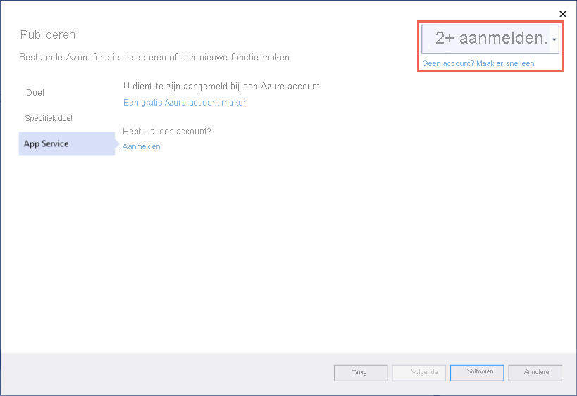
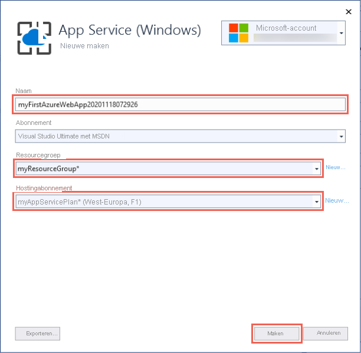

# <a name="create-an-aspnet-framework-web-app-in-azure"></a>Een ASP.NET Framework-web-app maken in Azure

[Azure App Service](overview.md) biedt een uiterst schaalbare webhostingservice met self-patchfunctie.

In deze snelstartgids ziet u hoe u uw eerste ASP.NET-web-app implementeert naar Azure App Service. Wanneer u klaar bent, hebt u een App Service-plan. U hebt ook een App Service-app met een geïmplementeerde webtoepassing.

[!INCLUDE [quickstarts-free-trial-note](../../includes/quickstarts-free-trial-note.md)]

## <a name="prerequisites"></a>Vereisten

U moet <a href="https://www.visualstudio.com/downloads/" target="_blank">Visual Studio 2019</a> met de **ASP.NET- en webontwikkelworkload** installeren om deze zelfstudie te doorlopen.

Als u Visual Studio 2019 al hebt geïnstalleerd:

- Installeer de nieuwste updates in Visual Studio door **Help** > **Controleren op updates** te selecteren.
- Voeg de workload toe door **Hulpprogramma's** > **Hulpprogramma's en functies ophalen** te selecteren.

## <a name="create-an-aspnet-web-app"></a>Een ASP.NET-web-app maken<a name="create-and-publish-the-web-app"></a>

Maak een ASP.NET-web-app door de volgende stappen uit te voeren:

1. Open Visual Studio en selecteer **Een nieuw project maken**.

2. In **Een nieuw project maken** kiest u **ASP.NET-webtoepassing (.NET Framework)** en selecteert u **Volgende**.

3. Geef in **Uw nieuwe project configureren** de toepassing de naam _myfirstazurewebapp_ en selecteer **Maken**.

   

4. U kunt elk type ASP.NET-web-app implementeren in Azure. Kies voor deze quickstart de sjabloon **MVC**.

5. Zorg dat verificatie is ingesteld op **Geen verificatie**. Selecteer **Maken**.

   

6. Selecteer in het menu van Visual Studio de optie **Foutopsporing** > **Starten zonder foutopsporing** om de web-app lokaal uit te voeren.

   

## <a name="publish-your-web-app"></a>Uw web-app publiceren <a name="launch-the-publish-wizard"></a>

1. Klik in **Solution Explorer** met de rechtermuisknop op het project **myFirstAzureWebApp** en selecteer **Publiceren**.

1. Kies **App Service** en selecteer **Profiel maken**.

   

1. In **Nieuwe App Service maken** zijn uw opties afhankelijk van het feit of u al bent aangemeld bij Azure en of u een Visual Studio-account hebt gekoppeld aan een Azure-account. Selecteer **Een account toevoegen** of **Aanmelden** om u aan te melden bij uw Azure-abonnement. Als u al bent aangemeld, selecteert u het gewenste account.

   > [!NOTE]
   > Als u al bent aangemeld, selecteert u **Maken** nog niet.
   >
   >

   

   [!INCLUDE [resource group intro text](../../includes/resource-group.md)]

1. Selecteer in **Resourcegroep** de optie **Nieuw**.

1. Voer bij **Naam van nieuwe resourcegroep** in: *myResourceGroup*. Selecteer vervolgens **OK**.

   [!INCLUDE [app-service-plan](../../includes/app-service-plan.md)]

1. Selecteer bij **Hostingabonnement** **Nieuw**.

1. Voer in het dialoogvenster **Hostingabonnement** de waarden uit de volgende tabel in en selecteer **OK**.

   | Instelling | Voorgestelde waarde | Beschrijving |
   |-|-|-|
   | Hostingabonnement| myAppServicePlan | De naam van het App Service-plan. |
   | Locatie | Europa -west | Het datacenter waar de web-app wordt gehost. |
   | Grootte | Gratis | De [prijscategorie](https://azure.microsoft.com/pricing/details/app-service/?ref=microsoft.com&utm_source=microsoft.com&utm_medium=docs&utm_campaign=visualstudio) bepaalt de hosting-functies. |

   

1. Voer bij **Naam** een unieke app-naam in die alleen deze geldige tekens bevat: `a-z`, `A-Z`, `0-9` en `-`. U kunt de automatisch gegenereerde unieke naam accepteren. De URL van de web-app is `http://<app-name>.azurewebsites.net`, waarbij `<app-name>` de naam van uw app is.

2. Selecteer **Maken** om de Azure-resources te gaan maken.

   

    Zodra de wizard is voltooid, worden de Azure-resources gemaakt en bent u klaar om te publiceren.

3. Klik op de pagina **Publiceren** op **Publiceren**. Visual Studio maakt, verpakt en publiceert de app naar Azure. Daarna wordt de app gestart in de standaardbrowser.

    

De naam van de app die is opgegeven op de pagina **Nieuwe App Service maken** wordt gebruikt als URL-voorvoegsel in de indeling `http://<app-name>.azurewebsites.net`.

**Gefeliciteerd!** Uw ASP.NET-web-app wordt live uitgevoerd in Azure App Service.

## <a name="update-the-app-and-redeploy"></a>De app bijwerken en opnieuw implementeren

1. In **Solution Explorer**, onder uw project, opent u **Weergaven** > **Start** > **Index.cshtml**.

1. Zoek ergens bovenaan de HTML-tag `<div class="jumbotron">` en vervang het volledige element door de volgende code:

   ```html
   <div class="jumbotron">
       <h1>ASP.NET in Azure!</h1>
       <p class="lead">This is a simple app that we've built that demonstrates how to deploy a .NET app to Azure App Service.</p>
   </div>
   ```

1. Als u opnieuw wilt implementeren naar Azure, klikt u in **Solution Explorer** met de rechtermuisknop op het project **myFirstAzureWebApp** en selecteert u **Publiceren**. Selecteer vervolgens **Publiceren**.

    Als het publiceren is voltooid, start Visual Studio een browser waarin de URL van de web-app wordt geladen.

    

## <a name="manage-the-azure-app"></a>De Azure-app beheren

1. Als u de web-app wilt beheren, gaat u naar de [Azure-portal](https://portal.azure.com) en selecteert u **App Services**.

   

2. Selecteer op de pagina **App Services** de naam van uw web-app.

   

   De pagina Overzicht van uw web-app wordt weergegeven. Hier kunt u algemene beheertaken uitvoeren, zoals bladeren, stoppen, starten, opnieuw starten en verwijderen.

   

   Het linkermenu bevat een aantal pagina's voor het configureren van uw app.

[!INCLUDE [Clean-up section](../../includes/clean-up-section-portal.md)]

## <a name="next-steps"></a>Volgende stappen

> [!div class="nextstepaction"]
> [ASP.NET met SQL Database](app-service-web-tutorial-dotnet-sqldatabase.md)

> [!div class="nextstepaction"]
> [ASP.NET configureren](configure-language-dotnet-framework.md)
