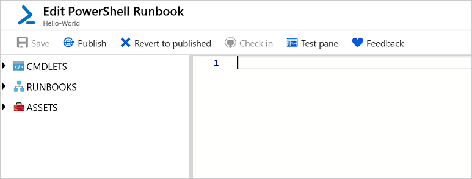
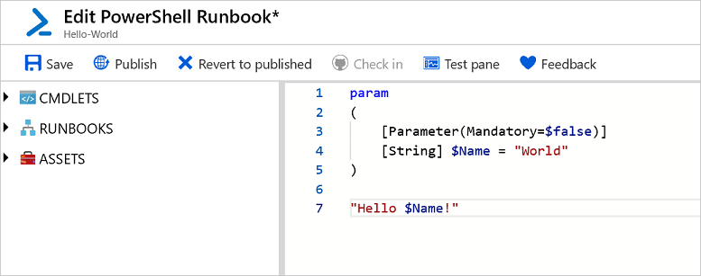
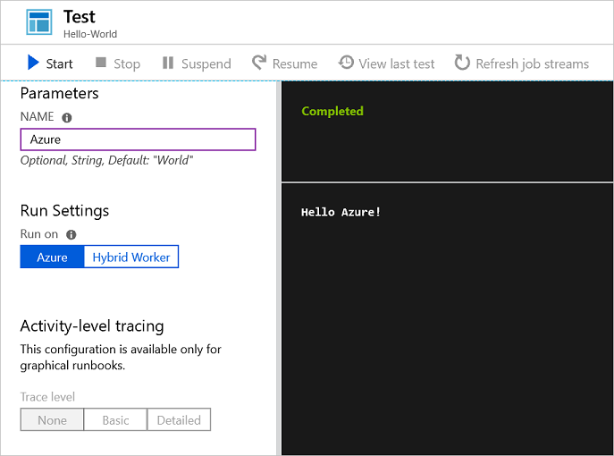
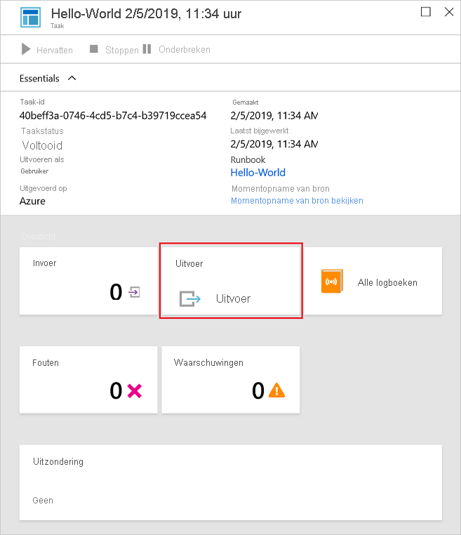
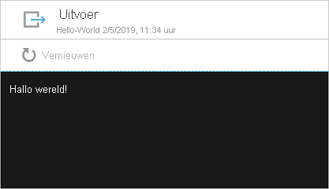

# <a name="create-an-azure-automation-runbook"></a>Een Azure Automation-runbook maken

Azure Automation-runbooks kunnen via Azure worden gemaakt. Deze methode biedt een gebruikersinterface op basis van een browser voor het maken van Automation-runbooks. Deze quickstart bevat stapsgewijze instructies voor het maken, bewerken, testen en publiceren van een Automation PowerShell-runbook.

Als u nog geen abonnement op Azure hebt, maak dan een [gratis Azure-account](https://azure.microsoft.com/free/?WT.mc_id=A261C142F) aan voordat u begint.

## <a name="sign-in-to-azure"></a>Aanmelden bij Azure

Aanmelden bij Azure op https://portal.azure.com

## <a name="create-runbook"></a>Runbook maken

Maak eerst een runbook. Het voorbeeldrunbook dat in deze quickstart is gemaakt, produceert standaard `Hello World` als uitvoer.

1. Open uw Automation-account.

1. Klik op **Runbooks** onder **PROCESAUTOMATISERING**. De lijst met runbooks wordt weergegeven.

1. Klik boven aan de lijst op de knop **een Runbook maken**

1. Voer 'Hallo wereld' in als **naam** voor het runbook en selecteer **PowerShell** als **runbooktype**. Klik op **Maken**.

   

1. Het runbook is gemaakt en de pagina **PowerShell-runbook bewerken** wordt geopend.

    

1. Typ of kopieer en plak de volgende code in het bewerkingsvenster. Er wordt een optionele invoerparameter 'Name' gemaakt met een standaardwaarde 'World', en als uitvoer wordt een tekenreeks geproduceerd die gebruikmaakt van deze invoerwaarde:

   ```powershell-interactive
   param
   (
       [Parameter(Mandatory=$false)]
       [String] $Name = "World"
   )

   "Hello $Name!"
   ```

1. Klik op **Opslaan** om een conceptversie van het runbook op te slaan.

    

## <a name="test-the-runbook"></a>Het runbook testen

Zodra het runbook is gemaakt, gaat u het testen om te zien of het werkt.

1. Klik op **Testvenster** om de pagina **Testen** te openen.

1. Voer een waarde in bij **Naam** en klik op **Starten**. De testtaak wordt gestart en de taakstatus en uitvoer worden weergegeven.

    

1. Sluit de pagina **Testen** door op de **X** in de rechterbovenhoek te klikken. Selecteer **OK** in de pop-up die wordt weergegeven.

1. Op de pagina **PowerShell-runbook bewerken** klikt u op **Publiceren** om het runbook als de officiële versie van het runbook in het account te publiceren.

   

## <a name="run-the-runbook"></a>Het runbook uitvoeren

Zodra het runbook is gepubliceerd, wordt de overzichtspagina weergegeven.

1. Klik op de overzichtspagina van runbook op **Starten** om de configuratiepagina **Runbook starten** voor dit runbook te openen.

   

1. Laat **Naam** leeg, zodat de standaardwaarde wordt gebruikt en klik op **OK**. De runbooktaak is ingediend en de pagina van de taak wordt weergegeven.

   

1. Wanneer de **taakstatus** **Wordt uitgevoerd** of **Voltooid** is, klikt u op **Uitvoer** om het deelvenster **Uitvoer** te openen en de runbookuitvoer weer te geven.

   

## <a name="clean-up-resources"></a>Resources opschonen

Wanneer u het runbook niet meer nodig hebt, kunt u het verwijderen. Om dit te doen, selecteert u het runbook in de runbooklijst en klikt u op **Verwijderen**.

## <a name="next-steps"></a>Volgende stappen

In deze quickstart hebt u geleerd om een runbook te maken, bewerken, testen en publiceren, en hebt u een runbooktaak gestart. Voor meer informatie over Automation-runbooks, gaat u verder naar het artikel over de verschillende runbooktypen die u in Automation kunt maken en gebruiken.

> [!div class="nextstepaction"]
> [Procedures voor Automation: runbooktypen](./automation-runbook-types.md)
