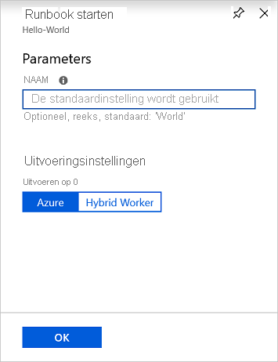

# <a name="create-an-azure-automation-runbook"></a>Een Azure Automation-runbook maken

Azure Automation-runbooks kunnen via Azure worden gemaakt. Deze methode biedt een gebruikersinterface op basis van een browser voor het maken van Automation-runbooks. Deze quickstart bevat stapsgewijze instructies voor het maken, bewerken, testen en publiceren van een Automation PowerShell-runbook.

Als u nog geen abonnement op Azure hebt, maak dan een [gratis Azure-account](https://azure.microsoft.com/free/?WT.mc_id=A261C142F) aan voordat u begint.

## <a name="sign-in-to-azure"></a>Aanmelden bij Azure

Meld u aan bij Azure https://portal.azure.comop.

## <a name="create-the-runbook"></a>Het runbook maken

Maak eerst een runbook. Het voorbeeldrunbook dat in deze quickstart is gemaakt, produceert standaard `Hello World` als uitvoer.

1. Open uw Automation-account.

1. Klik onder **proces automatisering**op **Runbooks** . De lijst met runbooks wordt weergegeven.

1. Klik boven aan de lijst op **een Runbook maken** .

1. Voer `Hello-World` in het veld **naam** de naam van het Runbook in en selecteer **Power shell** voor het veld **type runbook** . 

   

1. Klik op **maken**. Het runbook is gemaakt en de pagina PowerShell-runbook bewerken wordt geopend.

    

1. Typ of kopieer en plak de volgende code in het bewerkingsvenster. Er wordt een optionele invoer parameter met `Name` de naam standaard waarde van `World`gemaakt, en er wordt een teken reeks uitgevoerd die deze invoer waarde gebruikt:

   ```powershell-interactive
   param
   (
       [Parameter(Mandatory=$false)]
       [String] $Name = "World"
   )

   "Hello $Name!"
   ```

1. Klik op **Opslaan** om een concept kopie van het runbook op te slaan.

    

## <a name="test-the-runbook"></a>Het runbook testen

Zodra het runbook is gemaakt, moet u het runbook testen om te controleren of het werkt.

1. Klik op **Testvenster** om het testvenster te openen.

1. Voer een waarde in bij **Naam** en klik op **Starten**. De testtaak wordt gestart en de taakstatus en uitvoer worden weergegeven.

    

1. Sluit het deel venster test door te klikken op de **X** in de rechter bovenhoek. Selecteer **OK** in de pop-up die wordt weergegeven.

1. Op de pagina PowerShell-runbook bewerken klikt u op **Publiceren** om het runbook als de officiële versie van het runbook in het account te publiceren.

   

## <a name="run-the-runbook"></a>Het runbook uitvoeren

Zodra het runbook is gepubliceerd, wordt de overzichtspagina weergegeven.

1. Klik op de overzichtspagina van runbook op **Starten** om de configuratiepagina Runbook starten voor dit runbook te openen.

   

1. Laat **Naam** leeg, zodat de standaardwaarde wordt gebruikt en klik op **OK**. De runbook-taak wordt verzonden en de pagina taak wordt weer gegeven.

   

1. Wanneer de taak status is `Running` of `Completed`, klikt u op **uitvoer** om het deel venster uitvoer te openen en de uitvoer van het runbook weer te geven.

   

## <a name="clean-up-resources"></a>Resources opschonen

Wanneer u het runbook niet meer nodig hebt, kunt u het verwijderen. Om dit te doen, selecteert u het runbook in de runbooklijst en klikt u op **Verwijderen**.

## <a name="next-steps"></a>Volgende stappen

In deze quickstart hebt u geleerd om een runbook te maken, bewerken, testen en publiceren, en hebt u een runbooktaak gestart. Voor meer informatie over Automation-runbooks, gaat u verder naar het artikel over de verschillende runbooktypen die u in Automation kunt maken en gebruiken.

> [!div class="nextstepaction"]
> [Procedures voor Automation: runbooktypen](./automation-runbook-types.md)
