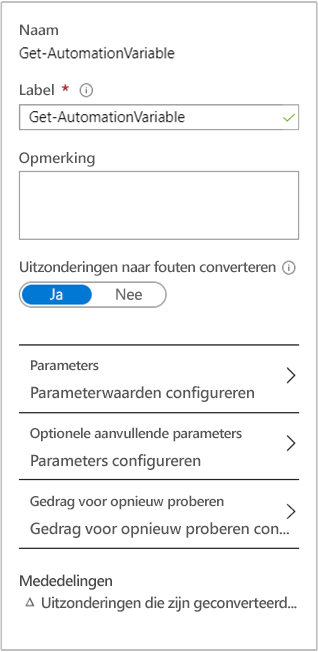
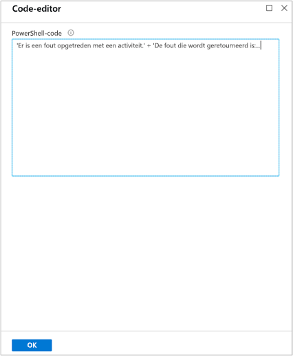

# Foutafhandeling in grafische Azure Automation-runbooks

Houd bij het ontwerpen van runbooks rekening met de verschillende problemen die een runbook kan ondervinden. Deze problemen kunnen geslaagde pogingen, verwachte foutstatussen en onverwachte foutvoorwaarden zijn.

Runbooks moeten foutafhandeling bevatten. Als u de uitvoer van een activiteit wilt valideren of een fout wilt verwerken, gebruikt u in het geval van grafische runbooks waarschijnlijk een Windows PowerShell-codeactiviteit, definieert u de voorwaardelijke logica voor de uitvoerkoppeling van de activiteit of past u een andere methode toe.          

Wanneer er tijdens een runbookactiviteit een niet-afsluitfout optreedt, wordt de activiteit die hierop volgt, vaak toch verwerkt, ongeacht de fout. De fout genereert waarschijnlijk een uitzondering, maar de volgende activiteit mag wel worden uitgevoerd. Dit is de manier waarop PowerShell fouten afhandelt.    

De typen PowerShell-fouten die zich kunnen voordoen tijdens de uitvoering, zijn afsluitfouten of niet-afsluitfouten. De verschillen tussen afsluitfouten en niet-afsluitfouten zijn als volgt:

* **Afsluitfout**: Een ernstige fout tijdens het uitvoeren waardoor de opdracht (of de uitvoering van het script) volledig wordt gestopt. Voorbeelden zijn onder andere niet-bestaande cmdlets, syntaxisfouten waardoor een cmdlet niet kan worden uitgevoerd of andere fatale fouten.

* **Niet-afsluitfout**: Een niet-ernstige fout waarbij de uitvoering ondanks de fout toch wordt voortgezet. Voorbeelden zijn onder andere operationele fouten, zoals niet-gevonden bestanden en machtigingsproblemen.

Azure Automation-grafische runbooks zijn verbeterd met de mogelijkheid om op te nemen van foutafhandeling. U kunt nu van uitzonderingen niet-afsluitfouten maken en foutkoppelingen tussen activiteiten maken. Met dit proces kunnen met een runbookauteur fouten worden gedetecteerd en kunnen gerealiseerde of onverwachte voorwaarden worden beheerd.  

## Wanneer foutafhandeling gebruiken

Telkens wanneer er in een kritieke activiteit een fout of uitzondering optreedt, is het belangrijk om te voorkomen dat de volgende activiteit in het runbook wordt uitgevoerd en de fout naar behoren af te handelen. Dit is met name cruciaal wanneer uw runbooks ondersteuning bieden voor een bedrijfsproces of servicebewerking.

Voor elke activiteit die een fout kan veroorzaken, kan de runbookauteur een foutkoppeling toevoegen die verwijst naar een willekeurige andere activiteit. De doelactiviteit kan van elk type zijn, waaronder codeactiviteit, aanroepen van een cmdlet, aanroepen van een ander runbook, enzovoort.

Bovendien kan de doelactiviteit ook uitgaande koppelingen hebben. Dit kunnen gewone koppelingen zijn of foutkoppelingen. Dit betekent dat de runbookauteur complexe foutafhandelingslogica kan implementeren zonder dat een codeactiviteit hoeft te worden opgenomen. De aanbevolen procedure is om een toegewezen runbook voor foutafhandeling te maken met algemene functionaliteit. Dit is echter niet verplicht. Foutafhandelingslogica in een PowerShell-codeactiviteit is niet de enige optie.  

Denk bijvoorbeeld aan een runbook dat probeert een virtuele machine te starten en er een toepassing op te installeren. Als de virtuele machine niet correct wordt gestart, worden er twee acties uitgevoerd:

1. Er wordt een melding over dit probleem verzonden.
2. Er wordt een ander runbook gestart dat in plaats hiervan automatisch een nieuwe VM inricht.

Een mogelijke oplossing is een foutkoppeling die wijst naar een activiteit om stap één af te handelen. U kunt bijvoorbeeld de **Write-Warning**-cmdlet koppelen aan een activiteit voor stap twee, zoals de**Start-AzureRmAutomationRunbook**-cmdlet.

U kunt dit gedrag ook generaliseren voor gebruik in meerdere runbooks en deze twee activiteiten in afzonderlijke runbooks voor foutafhandeling plaatsen, zoals eerder is voorgesteld. Voordat u dit runbook voor foutafhandeling aanroept, kunt u een aangepast bericht opstellen uit de gegevens van het oorspronkelijke runbook en dit bericht vervolgens als een parameter doorgeven aan het runbook voor foutafhandeling.

## Hoe foutafhandeling te gebruiken

Elke activiteit heeft een configuratie-instellingen waarmee van uitzonderingen niet-afsluitfouten worden gemaakt. Deze instelling is standaard uitgeschakeld. We raden u aan deze instelling in te schakelen voor elke activiteit waarvoor u fouten wilt verwerken.  

Als deze configuratie wordt ingeschakeld, worden zowel afsluitfouten als niet-afsluitfouten in de activiteit verwerkt als niet-afsluitfouten. Deze kunnen vervolgens worden verwerkt met een foutkoppeling.  

Na het configureren van deze instelling maakt u een activiteit om deze fout af te handelen. Als een activiteit een fout veroorzaakt, worden de uitgaande foutkoppelingen gevolgd en de reguliere koppelingen niet, zelfs als een activiteit ook reguliere uitvoer heeft geproduceerd.   

In het volgende voorbeeld wordt met een runbook een variabele opgehaald die de computernaam bevat van een virtuele machine. Vervolgens wordt geprobeerd de virtuele machine te starten met de volgende activiteit.           

De activiteiten **Get-AutomationVariable** en **Start AzureRmVm** zijn geconfigureerd om uitzonderingen te converteren naar fouten. Als zich problemen voordoen bij het ophalen van de variabele of bij het starten van de virtuele machine, worden er fouten gegenereerd.   

Foutkoppelingen stromen van deze activiteiten naar een enkele activiteit voor **Foutbeheer** (een codeactiviteit). Deze activiteit is geconfigureerd met een eenvoudige PowerShell-expressie met behulp van het trefwoord *Throw* om het verwerken te stoppen samen met *$Error.Exception.Message* om het bericht op te halen waarin de huidige uitzondering wordt beschreven.   

## Volgende stappen

* Zie [Grafisch ontwerpen in Azure Automation](automation-graphical-authoring-intro.md#links-and-workflow) voor meer informatie over koppelingen en koppelingstypen in grafische runbooks.

* Zie [Runbooktaken bijhouden](automation-runbook-execution.md) voor meer informatie over runbookuitvoering, het bewaken van runbooktaken en andere technische details.

