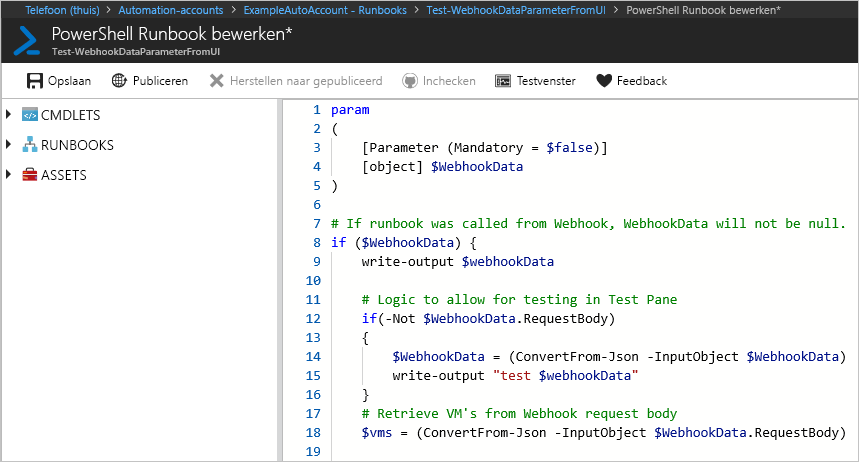
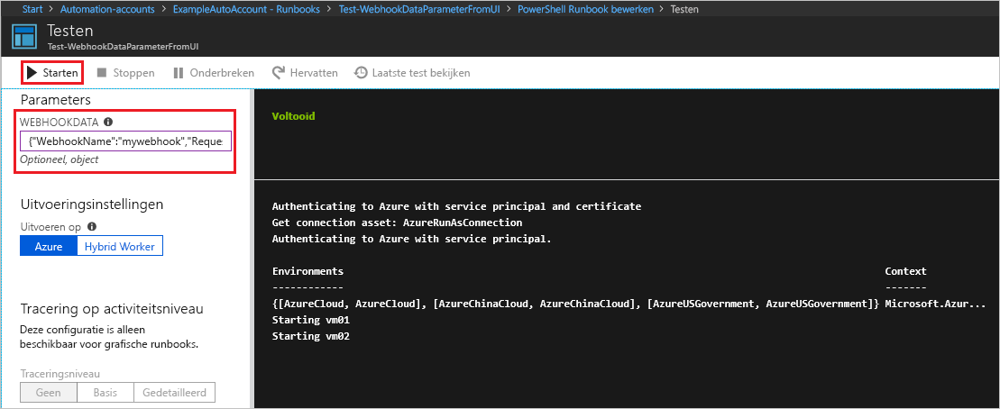
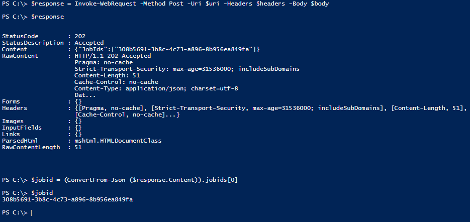

# <a name="starting-an-azure-automation-runbook-with-a-webhook"></a>Een Azure Automation runbook starten met een webhook

Met een *webhook* kunt u een bepaald runbook in azure Automation starten via één HTTP-aanvraag. Hierdoor kunnen externe services, zoals Azure DevOps Services, GitHub, Azure Monitor-Logboeken of aangepaste toepassingen, runbooks starten zonder een volledige oplossing te implementeren met behulp van de Azure Automation-API.


U kunt webhooks vergelijken met andere methoden voor het starten van een runbook bij [het starten van een runbook in azure Automation](automation-starting-a-runbook.md)

> [!NOTE]
> Het gebruik van een webhook voor het starten van een python-runbook wordt niet ondersteund.

## <a name="details-of-a-webhook"></a>Details van een webhook

In de volgende tabel worden de eigenschappen beschreven die u moet configureren voor een webhook.

| Eigenschap | Beschrijving |
|:--- |:--- |
| Name |U kunt elke gewenste naam voor een webhook opgeven, omdat deze niet beschikbaar is voor de client. Het wordt alleen gebruikt om het runbook in Azure Automation te identificeren. <br> Als best practice moet u de webhook een naam geven die betrekking heeft op de client die deze gebruikt. |
| URL |De URL van de webhook is het unieke adres dat een client aanroept met een HTTP-POST om het runbook te starten dat is gekoppeld aan de webhook. Het wordt automatisch gegenereerd wanneer u de webhook maakt. U kunt geen aangepaste URL opgeven. <br> <br> De URL bevat een beveiligings token waarmee het runbook kan worden aangeroepen door een systeem van derden zonder verdere authenticatie. Daarom moet het worden behandeld als een wacht woord. Uit veiligheids overwegingen kunt u de URL alleen weer geven in de Azure Portal op het moment dat de webhook wordt gemaakt. Noteer de URL op een veilige locatie voor toekomstig gebruik. |
| Vervaldatum |Net als bij een certificaat heeft elke webhook een verloop datum op het moment dat deze niet meer kan worden gebruikt. Deze verval datum kan worden gewijzigd nadat de webhook is gemaakt, zolang de webhook niet is verlopen. |
| Ingeschakeld |Een webhook wordt standaard ingeschakeld wanneer deze wordt gemaakt. Als u deze instelt op uitgeschakeld, kan geen enkele client deze gebruiken. U kunt de eigenschap **enabled** instellen wanneer u de webhook maakt of op elk moment wanneer deze wordt gemaakt. |

### <a name="parameters"></a>Parameters

Een webhook kan waarden voor runbook-para meters definiëren die worden gebruikt wanneer het runbook door die webhook wordt gestart. De webhook moet waarden bevatten voor alle verplichte para meters van het runbook en kan waarden bevatten voor optionele para meters. Een parameter waarde die is geconfigureerd voor een webhook kan worden gewijzigd, zelfs na het maken van de webhook. Meerdere webhooks die zijn gekoppeld aan één runbook kunnen verschillende parameter waarden gebruiken.

Wanneer een client een runbook start met een webhook, kunnen de parameter waarden die zijn gedefinieerd in de webhook niet worden overschreven. Als u gegevens van de client wilt ontvangen, kan het runbook een enkele para meter met de naam **$WebhookData**accepteren. Deze para meter is van het type [object] dat gegevens bevat die de client bevat in de POST-aanvraag.


Het **$WebhookData** -object heeft de volgende eigenschappen:

| Eigenschap | Beschrijving |
|:--- |:--- |
| WebhookName |De naam van de webhook. |
| RequestHeader |Hash-tabel met de kopteksten van de binnenkomende POST-aanvraag. |
| RequestBody |De hoofd tekst van de binnenkomende POST-aanvraag. Hiermee behoudt u alle opmaak, zoals teken reeks-, JSON-, XML-of formulier versleutelde gegevens. Het runbook moet worden geschreven om te kunnen werken met de verwachte gegevens indeling. |

Er is geen configuratie van de webhook vereist voor de ondersteuning van de para meter **$WebhookData** en het runbook is niet vereist om het te accepteren. Als het runbook de para meter niet definieert, worden de details van de aanvraag die vanaf de client is verzonden, genegeerd.

> [!NOTE]
> Wanneer u een webhook aanroept, moet u altijd alle parameter waarden opslaan als de aanroep mislukt. Als er sprake is van een netwerk storing of een verbindings probleem, kunt u geen mislukte webhook-aanroepen ophalen.

Als u een waarde voor $WebhookData opgeeft wanneer u de webhook maakt, wordt die waarde genegeerd wanneer de webhook het runbook start met de gegevens van de client POST-aanvraag, zelfs als de client geen gegevens in de aanvraag tekst bevat. Als u een runbook start dat $WebhookData met een andere methode dan een webhook, kunt u een waarde opgeven voor $Webhookdata die wordt herkend door het runbook. Deze waarde moet een object zijn met dezelfde [Eigenschappen](#details-of-a-webhook) als $Webhookdata, zodat het runbook correct kan worden gebruikt alsof het werkte met de werkelijke Webhookdata die door een webhook is door gegeven.

Als u bijvoorbeeld het volgende runbook start vanuit de Azure Portal en een voor beeld van een WebhookData voor het testen wilt door geven, omdat WebhookData een object is, moet het worden door gegeven als JSON in de gebruikers interface.



Als u de volgende eigenschappen voor de para meter WebhookData hebt, kunt u voor het volgende runbook opgeven:

* Webhooknaam: *MyWebhook*
* RequestBody: *[{'ResourceGroup': 'myResourceGroup','Name': 'vm01'},{'ResourceGroup': 'myResourceGroup','Name': 'vm02'}]*

Vervolgens geeft u de volgende JSON-waarde door in de gebruikers interface voor de para meter WebhookData. Het volgende voor beeld met de tekens regel terugloop en nieuwe regel komt overeen met de indeling die wordt door gegeven vanuit een webhook.

```json
{"WebhookName":"mywebhook","RequestBody":"[\r\n {\r\n \"ResourceGroup\": \"vm01\",\r\n \"Name\": \"vm01\"\r\n },\r\n {\r\n \"ResourceGroup\": \"vm02\",\r\n \"Name\": \"vm02\"\r\n }\r\n]"}
```



> [!NOTE]
> De waarden van alle invoer parameters worden vastgelegd met de runbook-taak. Dit betekent dat alle invoer van de client in de webhook-aanvraag wordt geregistreerd en beschikbaar is voor iedereen die toegang heeft tot de Automation-taak.  Daarom moet u voorzichtig zijn met het opnemen van gevoelige informatie in webhook-aanroepen.

## <a name="security"></a>Beveiliging

De beveiliging van een webhook is afhankelijk van de privacy van de URL, die een beveiligings token bevat waarmee het kan worden aangeroepen. Azure Automation voert geen verificatie uit voor de aanvraag zolang deze is gemaakt aan de juiste URL. Daarom mogen webhooks niet worden gebruikt voor runbooks die zeer gevoelige functies uitvoeren zonder gebruik te maken van een alternatieve manier om de aanvraag te valideren.

U kunt logica in het runbook toevoegen om te bepalen of deze is aangeroepen door een webhook door de eigenschap **webhooknaam** van de para meter $WebhookData te controleren. Het runbook kan verdere validatie uitvoeren door te zoeken naar specifieke informatie in de eigenschappen **RequestHeader** of **RequestBody** .

Een andere strategie is ervoor te hebben dat het runbook enige validatie van een externe voor waarde uitvoert bij het ontvangen van een webhook-aanvraag. Denk bijvoorbeeld aan een runbook dat wordt aangeroepen door GitHub wanneer er een nieuwe door Voer is voor een GitHub-opslag plaats. Het runbook kan verbinding maken met GitHub om te controleren of er een nieuwe doorgevoerde bewerking is uitgevoerd voordat u doorgaat.

## <a name="creating-a-webhook"></a>Een webhook maken

Gebruik de volgende procedure om een nieuwe webhook te maken die is gekoppeld aan een runbook in de Azure Portal.

1. Klik op de **pagina Runbooks** in de Azure Portal op het runbook dat de webhook start om de detail pagina ervan weer te geven. Zorg ervoor dat de **status** van het Runbook wordt **gepubliceerd**.
2. Klik boven aan de pagina op **webhook** om de pagina **webhook toevoegen** te openen.
3. Klik op **nieuwe webhook maken** om de **pagina webhook maken**te openen.
4. Geef een **naam**op voor de **verval datum** van de webhook en of deze moet worden ingeschakeld. Zie de [Details van een webhook](#details-of-a-webhook) voor meer informatie over deze eigenschappen.
5. Klik op het Kopieer pictogram en druk op CTRL + C om de URL van de webhook te kopiëren. Noteer deze vervolgens op een veilige plaats. **Wanneer u de webhook hebt gemaakt, kunt u de URL niet opnieuw ophalen.**

   

1. Klik op **para meters** om waarden voor de runbook-para meters op te geven. Als het runbook verplichte parameters heeft, kunt u de webhook niet maken, tenzij de waarden worden opgegeven.
1. Klik op **Maken** om de webhook te maken.

## <a name="using-a-webhook"></a>Een webhook gebruiken

Als u een webhook wilt gebruiken nadat deze is gemaakt, moet uw client toepassing een HTTP-bericht verzenden met de URL voor de webhook. De syntaxis van de webhook heeft de volgende indeling:

```http
http://<Webhook Server>/token?=<Token Value>
```

De client ontvangt een van de volgende retour codes van de POST-aanvraag.

| Coderen | Tekst | Beschrijving |
|:--- |:--- |:--- |
| 202 |Geaccepteerd |De aanvraag is geaccepteerd en het runbook is in de wachtrij geplaatst. |
| 400 |Onjuiste aanvraag |De aanvraag is om een van de volgende redenen niet geaccepteerd: <ul> <li>De webhook is verlopen.</li> <li>De webhook is uitgeschakeld.</li> <li>Het token in de URL is ongeldig.</li>  </ul> |
| 404 |Niet gevonden |De aanvraag is om een van de volgende redenen niet geaccepteerd: <ul> <li>De webhook is niet gevonden.</li> <li>Het runbook is niet gevonden.</li> <li>Het account is niet gevonden.</li>  </ul> |
| 500 |Interne server fout |De URL is geldig, maar er is een fout opgetreden. Verzend de aanvraag opnieuw. |

Ervan uitgaande dat de aanvraag is geslaagd, bevat de webhook-respons de taak-ID in JSON-indeling als volgt. Het bevat één taak-ID, maar de JSON-indeling biedt mogelijke toekomstige verbeteringen.

```json
{"JobIds":["<JobId>"]}
```

De client kan niet bepalen wanneer de runbook-taak is voltooid of de voltooiings status van de webhook. Deze informatie kan worden bepaald met behulp van de taak-ID met een andere methode, zoals [Windows Power shell](https://docs.microsoft.com/powershell/module/servicemanagement/azure/get-azureautomationjob) of de [Azure Automation-API](/rest/api/automation/job).

## <a name="renew-webhook"></a>Een webhook vernieuwen

Wanneer er een webhook wordt gemaakt, heeft deze een geldigheids duur van tien jaar. Na deze periode verloopt de webhook automatisch. Zodra een webhook is verlopen, kan deze niet opnieuw worden geactiveerd. deze moet worden verwijderd en opnieuw worden gemaakt. Als een webhook de verloop tijd niet heeft bereikt, kan deze worden uitgebreid.

Als u een webhook wilt uitbreiden, gaat u naar het runbook dat de webhook bevat. Selecteer **webhooks** onder **resources**. Klik op de webhook die u wilt uitbreiden. met deze actie wordt de pagina **webhook** geopend.  Kies een nieuwe verval datum en-tijd en klik op **Opslaan**.

## <a name="sample-runbook"></a>Voor beeld-runbook

Het volgende voor beeld-runbook accepteert de webhookgegevens en start de virtuele machines die zijn opgegeven in de hoofd tekst van de aanvraag. Als u dit runbook wilt testen, klikt u in uw Automation-account onder **Runbooks**op **+ een runbook toevoegen**. Als u niet weet hoe u een runbook moet maken, raadpleegt u [een Runbook maken](automation-quickstart-create-runbook.md).

```powershell
param
(
    [Parameter (Mandatory = $false)]
    [object] $WebhookData
)


# If runbook was called from Webhook, WebhookData will not be null.
if ($WebhookData) {

    # Check header for message to validate request
    if ($WebhookData.RequestHeader.message -eq 'StartedbyContoso')
    {
        Write-Output "Header has required information"}
    else
    {
        Write-Output "Header missing required information";
        exit;
    }

    # Retrieve VM's from Webhook request body
    $vms = (ConvertFrom-Json -InputObject $WebhookData.RequestBody)

    # Authenticate to Azure by using the service principal and certificate. Then, set the subscription.

    Write-Output "Authenticating to Azure with service principal and certificate"
    $ConnectionAssetName = "AzureRunAsConnection"
    Write-Output "Get connection asset: $ConnectionAssetName"

    $Conn = Get-AutomationConnection -Name $ConnectionAssetName
            if ($Conn -eq $null)
            {
                throw "Could not retrieve connection asset: $ConnectionAssetName. Check that this asset exists in the Automation account."
            }
            Write-Output "Authenticating to Azure with service principal."
            Add-AzureRmAccount -ServicePrincipal -Tenant $Conn.TenantID -ApplicationId $Conn.ApplicationID -CertificateThumbprint $Conn.CertificateThumbprint | Write-Output

        # Start each virtual machine
        foreach ($vm in $vms)
        {
            $vmName = $vm.Name
            Write-Output "Starting $vmName"
            Start-AzureRMVM -Name $vm.Name -ResourceGroup $vm.ResourceGroup
        }
}
else {
    # Error
    write-Error "This runbook is meant to be started from an Azure alert webhook only."
}
```

## <a name="test-the-example"></a>Het voor beeld testen

In het volgende voor beeld wordt Windows Power shell gebruikt om een runbook te starten met een webhook. Elke taal die een HTTP-aanvraag kan maken, kan een webhook gebruiken. Windows Power shell wordt hier als voor beeld gebruikt.

Het runbook verwacht een lijst met virtuele machines die in JSON zijn ingedeeld in de hoofd tekst van de aanvraag. Het runbook valideert en de headers bevatten een gedefinieerd bericht om te valideren dat de webhook-aanroeper geldig is.

```azurepowershell-interactive
$uri = "<webHook Uri>"

$vms  = @(
            @{ Name="vm01";ResourceGroup="vm01"},
            @{ Name="vm02";ResourceGroup="vm02"}
        )
$body = ConvertTo-Json -InputObject $vms
$header = @{ message="StartedbyContoso"}
$response = Invoke-WebRequest -Method Post -Uri $uri -Body $body -Headers $header
$jobid = (ConvertFrom-Json ($response.Content)).jobids[0]
```

In het volgende voor beeld ziet u de hoofd tekst van de aanvraag die beschikbaar is voor het runbook in de eigenschap **RequestBody** van **WebhookData**. Deze waarde wordt als JSON opgemaakt, omdat dat de indeling is die is opgenomen in de hoofd tekst van de aanvraag.

```json
[
    {
        "Name":  "vm01",
        "ResourceGroup":  "myResourceGroup"
    },
    {
        "Name":  "vm02",
        "ResourceGroup":  "myResourceGroup"
    }
]
```

In de volgende afbeelding ziet u de aanvraag die wordt verzonden vanuit Windows Power shell en de resulterende reactie. De taak-ID wordt opgehaald uit het antwoord en geconverteerd naar een teken reeks.



## <a name="next-steps"></a>Volgende stappen

* Zie [een waarschuwing gebruiken om een Azure Automation runbook te activeren](automation-create-alert-triggered-runbook.md)voor meer informatie over het gebruik van Azure Automation om actie te ondernemen voor Azure-waarschuwingen.

