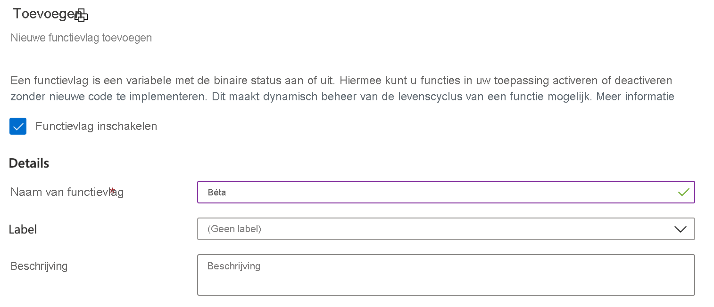

# <a name="quickstart-add-feature-flags-to-a-net-framework-app"></a>Snelstart: functievlaggen toevoegen aan een .NET Framework-app

In deze quickstart neemt u Azure App Configuration op in een .NET Framework-app om een end-to-end implementatie van functiebeheer te maken. U de app-configuratieservice gebruiken om al uw functievlaggen centraal op te slaan en hun status te beheren. 

De .NET Feature Management-bibliotheken breiden het framework uit met uitgebreide ondersteuning voor functievlag. Deze bibliotheken zijn gebouwd bovenop het .NET-configuratiesysteem. Ze integreren naadloos met app-configuratie via de .NET-configuratieprovider.

## <a name="prerequisites"></a>Vereisten

- Azure-abonnement - [maak er gratis een](https://azure.microsoft.com/free/)
- [Visual Studio 2019](https://visualstudio.microsoft.com/vs)
- [.NET Framework 4.8](https://dotnet.microsoft.com/download)

## <a name="create-an-app-configuration-store"></a>Een app-configuratiearchief maken

[!INCLUDE [azure-app-configuration-create](../../includes/azure-app-configuration-create.md)]

6. Selecteer **Functiebeheer** > **+Toevoegen** om een `Beta`functievlag toe te voegen, genaamd .

    > [!div class="mx-imgBorder"]
    > 

    Laat `label` ongedefinieerd voor nu.

## <a name="create-a-net-console-app"></a>Een .NET Core-consoletoepassing maken

1. Start Visual Studio en selecteer Nieuw**New** > **project** **bestand** > .

1. Filter **in Een nieuw project maken**op het **projecttype Console** en klik op **Console-app (.NET Framework).** Klik op **Volgende**.

1. Voer in **Uw nieuwe project configureren**een projectnaam in. Selecteer **onder Framework** **.NET Framework 4.8** of hoger. Klik **op Maken**.

## <a name="connect-to-an-app-configuration-store"></a>Verbinding maken met een app-configuratiearchief

1. Klik met de rechtermuisknop op uw project en selecteer **NuGet-pakketten beheren.** Zoek **op het** tabblad Bladeren en voeg de volgende NuGet-pakketten toe aan uw project. Als u ze niet vinden, schakelt u het selectievakje **Prerelease opnemen** in.

    ```
    Microsoft.Extensions.DependencyInjection
    Microsoft.Extensions.Configuration.AzureAppConfiguration
    Microsoft.FeatureManagement
    ```

1. Open *Program.cs* en voeg de volgende instructies toe:

    ```csharp
    using Microsoft.Extensions.DependencyInjection;
    using Microsoft.Extensions.Configuration;
    using Microsoft.Extensions.Configuration.AzureAppConfiguration;
    using Microsoft.FeatureManagement;
    ```

1. Werk `Main` de methode bij om verbinding `UseFeatureFlags` te maken met app-configuratie en geef de optie op zodat functievlaggen worden opgehaald. Geef vervolgens een `Beta` bericht weer als de functievlag is ingeschakeld.

    ```csharp
        public static async Task Main(string[] args)
        {         
            IConfigurationRoot configuration = new ConfigurationBuilder()
                .AddAzureAppConfiguration(options =>
                {
                    options.Connect(Environment.GetEnvironmentVariable("ConnectionString"))
                           .UseFeatureFlags();
                }).Build();

            IServiceCollection services = new ServiceCollection();

            services.AddSingleton<IConfiguration>(configuration).AddFeatureManagement();

            using (ServiceProvider serviceProvider = services.BuildServiceProvider())
            {
                IFeatureManager featureManager = serviceProvider.GetRequiredService<IFeatureManager>();

                if (await featureManager.IsEnabledAsync("Beta"))
                {
                    Console.WriteLine("Welcome to the beta!");
                }
            }

            Console.WriteLine("Hello World!");
        }
    ```

## <a name="build-and-run-the-app-locally"></a>De app lokaal compileren en uitvoeren

1. Stel een omgevingsvariabele met de naam **ConnectionString** in op de verbindingstekenreeks van uw App Configuration Store. Als u de opdrachtprompt van Windows gebruikt, voert u de volgende opdracht uit:

        setx ConnectionString "connection-string-of-your-app-configuration-store"

    Als u Windows PowerShell gebruikt, voert u de volgende opdracht uit:

        $Env:ConnectionString = "connection-string-of-your-app-configuration-store"

1. Start Visual Studio opnieuw op om de wijziging van kracht te laten worden. 

1. Druk op Ctrl + F5 om de console-app te bouwen en uit te voeren.

    

## <a name="clean-up-resources"></a>Resources opschonen

[!INCLUDE [azure-app-configuration-cleanup](../../includes/azure-app-configuration-cleanup.md)]

## <a name="next-steps"></a>Volgende stappen

In deze quickstart hebt u een functievlag gemaakt in App-configuratie en deze gebruikt met een .NET Framework-console-app. Ga door naar de volgende zelfstudie om te leren hoe u functievlaggen en andere configuratiewaarden dynamisch bijwerken zonder de toepassing opnieuw te starten.

> [!div class="nextstepaction"]
> [Dynamische configuratie inschakelen](./enable-dynamic-configuration-dotnet.md)
