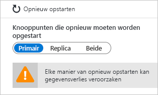

# Azure-cache beheren voor Redis
In dit onderwerp wordt beschreven hoe u beheertaken uitvoert, zoals [het opnieuw opstarten](#reboot) en plannen van [updates](#schedule-updates) voor uw Azure-cache voor Redis-exemplaren.

[!INCLUDE [updated-for-az](../../includes/updated-for-az.md)]

## Opnieuw opstarten
Met het **rebootblad** u een of meer knooppunten van uw cache opnieuw opstarten. Met deze rebootmogelijkheid u uw toepassing testen op tolerantie als er een fout van een cacheknooppunt optreedt.

Selecteer de knooppunten die u opnieuw wilt opstarten en klik op **Opnieuw opstarten**.

Als u een premium cache hebt met clustering ingeschakeld, u selecteren welke shards van de cache u opnieuw wilt opstarten.

Als u een of meer knooppunten van uw cache opnieuw wilt opstarten, selecteert u de gewenste knooppunten en klikt u op **Opnieuw opstarten.** Als u een premium cache hebt met clustering ingeschakeld, selecteert u de gewenste shards om opnieuw op te starten en klikt u vervolgens op **Opnieuw opstarten**. Na een paar minuten worden de geselecteerde knooppunten opnieuw opgestart en zijn ze een paar minuten later weer online.

De impact op clienttoepassingen is afhankelijk van welke knooppunten u opnieuw start.

* **Master** - Wanneer het hoofdknooppunt opnieuw wordt opgestart, wordt Azure Cache voor Redis niet naar het replicaknooppunt uitgevoerd en wordt het gepromoot om het te beheersen. Tijdens deze failover kan er een kort interval zijn waarin verbindingen mogelijk niet worden verbroken met de cache.
* **Slave** - Wanneer het slave-knooppunt opnieuw wordt opgestart, heeft dit meestal geen invloed op cacheclients.
* **Zowel master als slave** - Wanneer beide cacheknooppunten opnieuw worden opgestart, gaan alle gegevens verloren in de cache en mislukken de verbindingen met de cache totdat het primaire knooppunt weer online is. Als u [gegevenspersistentie](cache-how-to-premium-persistence.md)hebt geconfigureerd, wordt de meest recente back-up hersteld wanneer de cache weer online komt, maar elke cacheschrijft die is opgetreden nadat de meest recente back-up is verloren.
* **Knooppunten van een premium cache met clustering ingeschakeld** - Wanneer u een of meer knooppunten van een premium cache opnieuw opstart met clustering ingeschakeld, is het gedrag voor de geselecteerde knooppunten hetzelfde als wanneer u het bijbehorende knooppunt of knooppunten van een niet-geclusterde cache opnieuw opstart.

## Veelgestelde vragen over opnieuw opstarten
* [Welk knooppunt moet ik opnieuw opstarten om mijn toepassing te testen?](#which-node-should-i-reboot-to-test-my-application)
* [Kan ik de cache opnieuw opstarten om clientverbindingen te wissen?](#can-i-reboot-the-cache-to-clear-client-connections)
* [Verlies ik gegevens uit mijn cache als ik een reboot doe?](#will-i-lose-data-from-my-cache-if-i-do-a-reboot)
* [Kan ik mijn cache opnieuw opstarten met PowerShell, CLI of andere beheertools?](#can-i-reboot-my-cache-using-powershell-cli-or-other-management-tools)

### Welk knooppunt moet ik opnieuw opstarten om mijn toepassing te testen?
Als u de tolerantie van uw toepassing wilt testen tegen het mislukken van het primaire knooppunt van uw cache, start u het **hoofdknooppunt** opnieuw op. Als u de tolerantie van uw toepassing wilt testen tegen het mislukken van het secundaire knooppunt, start u het **Slave-knooppunt** opnieuw op. Als u de tolerantie van uw toepassing wilt testen tegen het totale falen van de cache, start u **beide** knooppunten opnieuw op.

### Kan ik de cache opnieuw opstarten om clientverbindingen te wissen?
Ja, als u de cache opnieuw opstart, worden alle clientverbindingen gewist. Opnieuw opstarten kan handig zijn in het geval dat alle clientverbindingen worden opgebruikt als gevolg van een logische fout of een bug in de clienttoepassing. Elke prijscategorie heeft verschillende [clientverbindingslimieten](cache-configure.md#default-redis-server-configuration) voor de verschillende groottes en zodra deze limieten zijn bereikt, worden geen clientverbindingen meer geaccepteerd. Het opnieuw opstarten van de cache biedt een manier om alle clientverbindingen te wissen.

> [!IMPORTANT]
> Als u uw cache opnieuw opstart om clientverbindingen te wissen, maakt StackExchange.Redis automatisch opnieuw verbinding zodra het Redis-knooppunt weer online is. Als het onderliggende probleem niet is opgelost, kunnen de clientverbindingen blijven worden opgebruikt.
> 
> 

### Verlies ik gegevens uit mijn cache als ik een reboot doe?
Als u zowel de **Master-** als **slave-knooppunten** opnieuw opstart, kunnen alle gegevens in de cache (of in die shard als u een premium cache met clustering gebruikt) verloren gaan, maar dit is ook niet gegarandeerd. Als u [gegevenspersistentie](cache-how-to-premium-persistence.md)hebt geconfigureerd, wordt de meest recente back-up hersteld wanneer de cache weer online komt, maar alle cacheschrijft die is opgetreden nadat de back-up is gemaakt, gaat verloren.

Als u slechts één van de knooppunten opnieuw opstart, gaan gegevens doorgaans niet verloren, maar het kan nog steeds. Als het hoofdknooppunt bijvoorbeeld opnieuw wordt opgestart en er een cache-schrijfwerk wordt uitgevoerd, gaan de gegevens uit de cache schrijven verloren. Een ander scenario voor gegevensverlies zou zijn als u een knooppunt opnieuw opstart en het andere knooppunt toevallig naar beneden gaat als gevolg van een storing op hetzelfde moment. Zie [Wat is er met mijn gegevens in Redis gebeurd voor](https://gist.github.com/JonCole/b6354d92a2d51c141490f10142884ea4#file-whathappenedtomydatainredis-md) meer informatie over mogelijke oorzaken voor gegevensverlies?

### Kan ik mijn cache opnieuw opstarten met PowerShell, CLI of andere beheertools?
Ja, voor PowerShell-instructies zie [Een Azure-cache opnieuw opstarten voor Redis](cache-how-to-manage-redis-cache-powershell.md#to-reboot-an-azure-cache-for-redis).

## Updates plannen
Met het blade **Updates van schema** u een onderhoudsvenster voor uw cache-exemplaar aanwijzen. Wanneer het onderhoudsvenster is opgegeven, worden in dit venster updates van de Redis-server uitgevoerd. 

> [!NOTE] 
> Het onderhoudsvenster is alleen van toepassing op Redis-serverupdates en niet op Azure-updates of -updates voor het besturingssysteem van de VM's die de cache hosten.
>

Als u een onderhoudsvenster wilt opgeven, controleert u de gewenste dagen en geeft u het beginuur van het onderhoudsvenster voor elke dag op en klikt u op **OK**. Houd er rekening mee dat de tijd van het onderhoudsvenster zich in UTC bevindt. 

Het standaard- en minimumvenster voor updates is vijf uur. Deze waarde is niet configureerbaar vanaf de Azure-portal, `MaintenanceWindow` maar u deze configureren in PowerShell met behulp van de parameter van de cmdlet [Nieuw-AzRedisCacheScheduleEntry.](/powershell/module/az.rediscache/new-azrediscachescheduleentry) Zie Kan ik geplande updates beheren met PowerShell, CLI of andere beheertools?

## Veelgestelde vragen over updates plannen
* [Wanneer vinden updates plaats als ik de functie schema-updates niet gebruik?](#when-do-updates-occur-if-i-dont-use-the-schedule-updates-feature)
* [Wat voor soort updates worden uitgevoerd tijdens het geplande onderhoudsvenster?](#what-type-of-updates-are-made-during-the-scheduled-maintenance-window)
* [Kan ik geplande updates beheren met PowerShell, CLI of andere beheertools?](#can-i-managed-scheduled-updates-using-powershell-cli-or-other-management-tools)

### Wanneer vinden updates plaats als ik de functie schema-updates niet gebruik?
Als u geen onderhoudsvenster opgeeft, kunnen er op elk gewenst moment updates worden uitgevoerd.

### Wat voor soort updates worden uitgevoerd tijdens het geplande onderhoudsvenster?
Alleen Redis server updates worden uitgevoerd tijdens het geplande onderhoudsvenster. Het onderhoudsvenster is niet van toepassing op Azure-updates of -updates op het VM-besturingssysteem.

### Kan ik geplande updates beheren met PowerShell, CLI of andere beheertools?
Ja, u uw geplande updates beheren met de volgende PowerShell-cmdlets:

* [Get-AzRedisCachePatchSchedule](/powershell/module/az.rediscache/get-azrediscachepatchschedule)
* [Nieuw-AzRedisCachePatchSchedule](/powershell/module/az.rediscache/new-azrediscachepatchschedule)
* [Nieuwe azRedisCacheScheduleEntry](/powershell/module/az.rediscache/new-azrediscachescheduleentry)
* [AzRedisCachePatchSchedule verwijderen](/powershell/module/az.rediscache/remove-azrediscachepatchschedule)

## Volgende stappen
* Ontdek meer [Azure-cache voor functies van de premiumlaag van Redis.](cache-premium-tier-intro.md)

