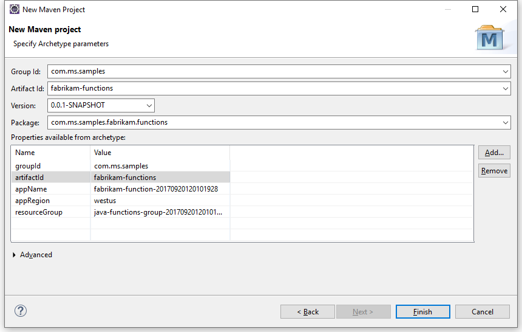

# <a name="create-your-first-function-with-java-and-eclipse"></a>Maak uw eerste functie met Java en eclips 

In dit artikel wordt beschreven hoe u een functie project zonder [Server](https://azure.microsoft.com/solutions/serverless/) maakt met de eclips IDE en Apache Maven, het testen en fouten opspoort en vervolgens implementeert op Azure functions. 

<!-- TODO  -->

[!INCLUDE [quickstarts-free-trial-note](../../includes/quickstarts-free-trial-note.md)]

## <a name="set-up-your-development-environment"></a>De ontwikkelomgeving instellen

Als u een functions-app met Java en intereclips wilt ontwikkelen, moet u het volgende hebben geïnstalleerd:

-  [Java Developer Kit](https://www.azul.com/downloads/zulu/), versie 8.
-  [Apache Maven](https://maven.apache.org), versie 3.0 of hoger.
-  [Eclips](https://www.eclipse.org/downloads/packages/), met Java-en Maven-ondersteuning.
-  [Azure CLI](https://docs.microsoft.com/cli/azure)

> [!IMPORTANT] 
> De omgevingsvariabele JAVA_HOME moet zijn ingesteld op de installatielocatie van de JDK om deze quickstart te kunnen voltooien.

Het is raadzaam om ook [Azure functions core tools, versie 2](functions-run-local.md#v2), te installeren die een lokale omgeving bieden voor het uitvoeren en opsporen van fouten in azure functions. 

## <a name="create-a-functions-project"></a>Een functions-project maken

1. In eclips selecteert u het menu **bestand** en selecteert u **Nieuw-&gt; Maven-project**. 
1. Accepteer de standaard instellingen in het dialoog venster **Nieuw Maven-project** en selecteer **volgende**.
1. Selecteer **archetype toevoegen** en voeg de vermeldingen voor de [Azure-functions-archetype](https://mvnrepository.com/artifact/com.microsoft.azure/azure-functions-archetype)toe.
    - Archetype-groeps-ID: com. micro soft. Azure
    - Archetype artefact-ID: Azure-functions-archetype
    - Versie: Controleer en gebruik de meest recente versie van [de centrale opslag plaats](https://mvnrepository.com/artifact/com.microsoft.azure/azure-functions-archetype)
      
1. Klik op **OK** en klik op **Volgende**.  Vul waarden in voor alle velden, met inbegrip van `resourceGroup`, `appName`en `appRegion` (gebruik een andere appName dan **fabrikam-function-20170920120101928**) en sluit uiteindelijk **af**.
      

Maven maakt de projectbestanden in een nieuwe map met de naam _artifactId_. De gegenereerde code in het project is een eenvoudige, door [http getriggerde](/azure/azure-functions/functions-bindings-http-webhook) functie die de hoofd tekst van de TRIGGERENDE HTTP-aanvraag echot.

## <a name="run-functions-locally-in-the-ide"></a>Functies lokaal uitvoeren in de IDE

> [!NOTE]
> [Azure functions core tools versie 2](functions-run-local.md#v2) moet zijn geïnstalleerd om lokale functies uit te voeren en fouten op te sporen.

1. Klik met de rechter muisknop op het gegenereerde project en kies vervolgens **uitvoeren als** en **maven build**.
1. Voer in het dialoog venster **configuratie bewerken** `package` in de velden **doelen** en **naam** in en selecteer vervolgens **uitvoeren**. Hiermee wordt de functie code gemaakt en verpakt.
1. Zodra de build is voltooid, maakt u een nieuwe uitvoerings configuratie zoals hierboven, met behulp van `azure-functions:run` als doel en naam. Selecteer **uitvoeren** om de functie in de IDE uit te voeren.

Beëindig de runtime in het console venster wanneer u klaar bent met het testen van de functie. Er kan slechts één functie-host actief zijn en lokaal worden uitgevoerd.

### <a name="debug-the-function-in-eclipse"></a>Fout opsporing voor de functie in eclips

In de in de vorige stap ingestelde **Run as** -configuratie wijzigt u `azure-functions:run` in `azure-functions:run -DenableDebug` en voert u de bijgewerkte configuratie uit om de functie-app in de foutopsporingsmodus te starten.

Selecteer het menu **uitvoeren** en open **configuratie van fout opsporing**. Kies **externe Java-toepassing** en maak een nieuwe. Geef uw configuratie een naam en vul de instellingen in. De poort moet consistent zijn met de poort voor fout opsporing die geopend is door de functie host, die standaard is `5005`. Klik na de installatie op `Debug` om de fout opsporing te starten.


Stel onderbrekings punten in en Inspecteer objecten in uw functie met behulp van de IDE. Wanneer u klaar bent, stopt u het fout opsporingsprogramma en de actieve functie-host. Er kan slechts één functie-host actief zijn en lokaal worden uitgevoerd.

## <a name="deploy-the-function-to-azure"></a>De functie implementeren in Azure

Bij het implementeren naar Azure Functions worden accountreferenties uit de Azure CLI gebruikt. [Meld u aan met de Azure cli](/cli/azure/authenticate-azure-cli?view=azure-cli-latest) voordat u doorgaat met de opdracht prompt van de computer.

```azurecli
az login
```

Implementeer uw code in een nieuwe functie-app met behulp van het `azure-functions:deploy` maven-doel in een nieuwe **Run as** -configuratie.

Als het implementeren is voltooid, ziet u de URL die u kunt gebruiken voor toegang tot de Azure-functie-app:

```output
[INFO] Successfully deployed Function App with package.
[INFO] Deleting deployment package from Azure Storage...
[INFO] Successfully deleted deployment package fabrikam-function-20170920120101928.20170920143621915.zip
[INFO] Successfully deployed Function App at https://fabrikam-function-20170920120101928.azurewebsites.net
[INFO] ------------------------------------------------------------------------
```

## <a name="next-steps"></a>Volgende stappen

- Neem de [Azure Functions Java-handleiding voor ontwikkelaars](functions-reference-java.md) door voor meer informatie over het ontwikkelen van Java-functies. Deze handleiding is vooralsnog door een vertaalmachine vertaald.
- U kunt extra functies met verschillende triggers toevoegen aan uw project met behulp van de Maven-target `azure-functions:add`.
