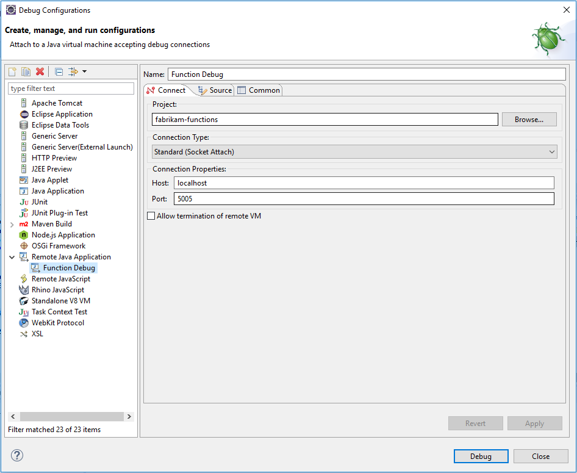

# <a name="create-your-first-function-with-java-and-eclipse"></a>Maak je eerste functie met Java en Eclipse 

In dit artikel ziet u hoe u een [serverloos](https://azure.microsoft.com/solutions/serverless/) functieproject maakt met de Eclipse IDE en Apache Maven, het test en debugt en vervolgens implementeert naar Azure Functions. 

<!-- TODO  -->

[!INCLUDE [quickstarts-free-trial-note](../../includes/quickstarts-free-trial-note.md)]

## <a name="set-up-your-development-environment"></a>De ontwikkelomgeving instellen

Als u een functies-app met Java en Eclipse wilt ontwikkelen, moet u het volgende hebben geïnstalleerd:

-  [Java Developer Kit](https://www.azul.com/downloads/zulu/), versie 8.
-  [Apache Maven](https://maven.apache.org), versie 3.0 of hoger.
-  [Eclipse](https://www.eclipse.org/downloads/packages/), met Java en Maven ondersteuning.
-  [Azure-CLI](https://docs.microsoft.com/cli/azure)

> [!IMPORTANT] 
> De omgevingsvariabele JAVA_HOME moet zijn ingesteld op de installatielocatie van de JDK om deze quickstart te kunnen voltooien.

Het wordt ten zeerste aanbevolen om ook [Azure Functions Core Tools, versie 2,](functions-run-local.md#v2)te installeren, die een lokale omgeving bieden voor het uitvoeren en debuggen van Azure-functies. 

## <a name="create-a-functions-project"></a>Een project Functies maken

1. Selecteer in Eclipse het menu **Bestand** en selecteer **Vervolgens Nieuw -&gt; Maven Project**. 
1. Accepteer de standaardinstellingen in de dialoog **met het Nieuwe Maven-project** en selecteer **Volgende**.
1. Selecteer **Archetype toevoegen** en voeg de vermeldingen toe voor het [azure-functions-archetype.](https://mvnrepository.com/artifact/com.microsoft.azure/azure-functions-archetype)
    - Archetype Group ID: com.microsoft.azure
    - Archetype Artefact ID: azure-functions-archetype
    - Versie: Check and use latest version from the central repository Eclipse Maven create Version: Check and use latest version from the central repository Eclipse Maven create Version: Check and use latest version from [the central repository](https://mvnrepository.com/artifact/com.microsoft.azure/azure-functions-archetype)
      
1. Klik **op OK** en klik vervolgens op **Volgende.**  Zorg ervoor dat u waarden invult `resourceGroup` `appName`voor `appRegion` alle velden, waaronder , en (gebruik een andere appNaam dan **fabrikam-function-20170920120101928**) en uiteindelijk **Voltooien**.
      

Maven maakt de projectbestanden in een nieuwe map met de naam _artifactId_. De gegenereerde code in het project is een eenvoudige [HTTP-geactiveerde](/azure/azure-functions/functions-bindings-http-webhook) functie die de hoofdtekst van de triggering HTTP-aanvraag weerspiegelt.

## <a name="run-functions-locally-in-the-ide"></a>Functies lokaal uitvoeren in de IDE

> [!NOTE]
> [Azure Functions Core Tools, versie 2](functions-run-local.md#v2) moet worden geïnstalleerd om functies lokaal uit te voeren en te debuggen.

1. Klik met de rechtermuisknop op het gegenereerde project en kies **Vervolgens Run As** en **Maven build**.
1. Voer **Edit Configuration** in het dialoogvenster `package` Configuratie bewerken in de velden **Doelen** en **Naam** in en selecteer **Vervolgens Uitvoeren**. Hiermee wordt de functiecode gebouwd en verpakt.
1. Zodra de build is voltooid, maakt u `azure-functions:run` een andere Run-configuratie zoals hierboven, met als doel en naam. Selecteer **Uitvoeren** om de functie uit te voeren in de IDE.

Beëindig de looptijd in het consolevenster wanneer u klaar bent met het testen van uw functie. Er kan slechts één functiehost actief zijn en lokaal worden uitgevoerd.

### <a name="debug-the-function-in-eclipse"></a>Debuggen van de functie in Eclipse

Wijzig in de vorige stap **de** bijgewerkte `azure-functions:run` `azure-functions:run -DenableDebug` configuratie in en voer de bijgewerkte configuratie uit om de functie-app in de foutopsporingsmodus te starten.

Selecteer het menu **Uitvoeren** en open **Foutopsporingsconfiguraties**. Kies **Remote Java-toepassing** en maak een nieuwe. Geef uw configuratie een naam en vul de instellingen in. De poort moet consistent zijn met de foutopsporingspoort die `5005`wordt geopend door de functiehost, wat standaard is . Na de installatie `Debug` klikt u op om te beginnen met debuggen.



Stel breekpunten in en inspecteer objecten in uw functie met behulp van de IDE. Wanneer u klaar bent, stopt u de foutopsporing en de running function host. Er kan slechts één functiehost actief zijn en lokaal worden uitgevoerd.

## <a name="deploy-the-function-to-azure"></a>De functie implementeren in Azure

Bij het implementeren naar Azure Functions worden accountreferenties uit de Azure CLI gebruikt. [Meld u aan bij de Azure CLI](/cli/azure/authenticate-azure-cli?view=azure-cli-latest) voordat u de opdrachtprompt van uw computer blijft gebruiken.

```azurecli
az login
```

Implementeer uw code in een `azure-functions:deploy` nieuwe functie-app met het doel Maven in een nieuwe **Run As-configuratie.**

Als het implementeren is voltooid, ziet u de URL die u kunt gebruiken voor toegang tot de Azure-functie-app:

```output
[INFO] Successfully deployed Function App with package.
[INFO] Deleting deployment package from Azure Storage...
[INFO] Successfully deleted deployment package fabrikam-function-20170920120101928.20170920143621915.zip
[INFO] Successfully deployed Function App at https://fabrikam-function-20170920120101928.azurewebsites.net
[INFO] ------------------------------------------------------------------------
```

## <a name="next-steps"></a>Volgende stappen

- Neem de [Azure Functions Java-handleiding voor ontwikkelaars](functions-reference-java.md) door voor meer informatie over het ontwikkelen van Java-functies. Deze handleiding is vooralsnog door een vertaalmachine vertaald.
- U kunt extra functies met verschillende triggers toevoegen aan uw project met behulp van de Maven-target `azure-functions:add`.
