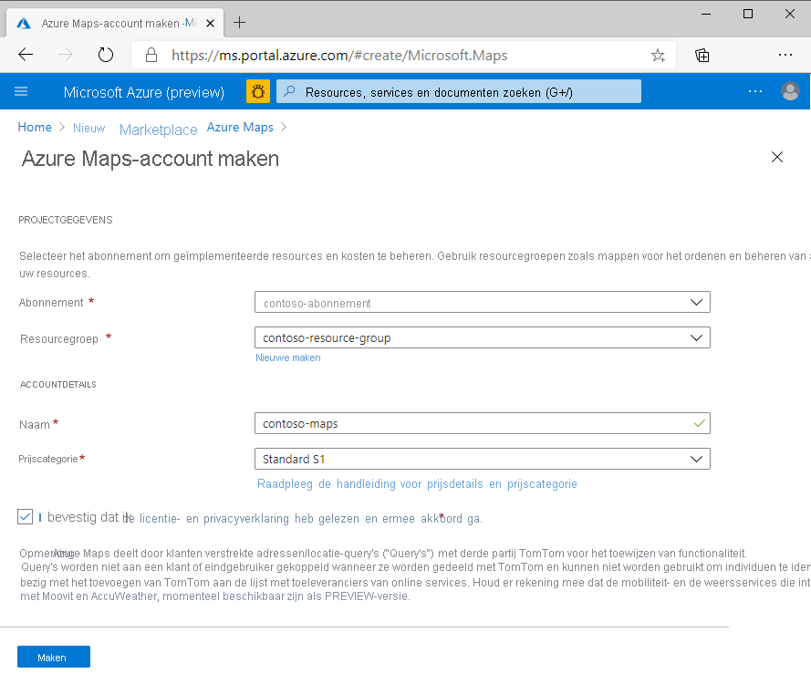
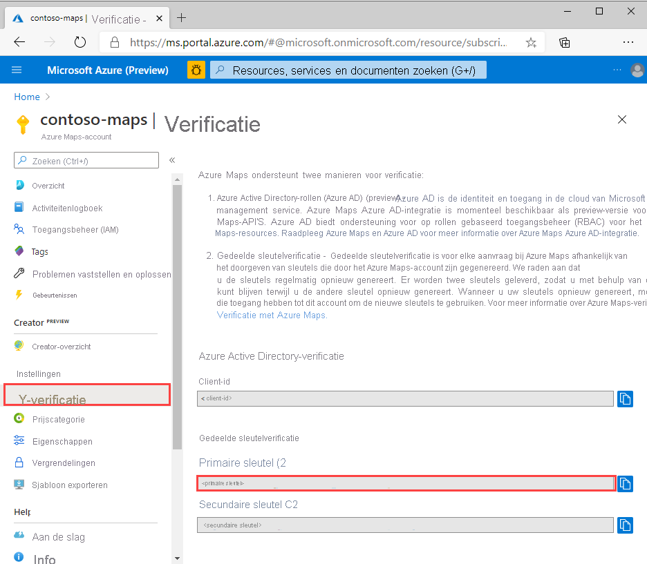
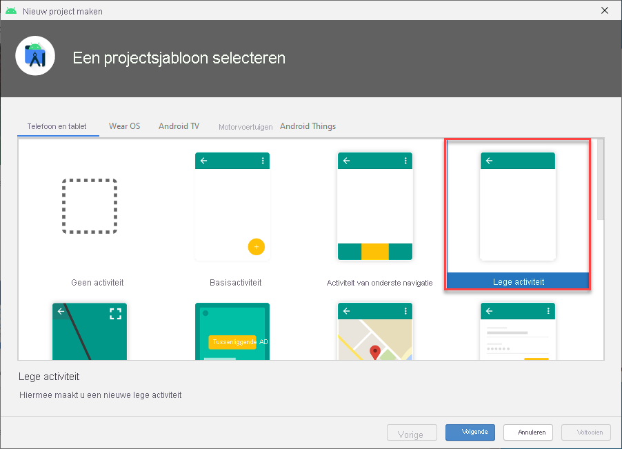
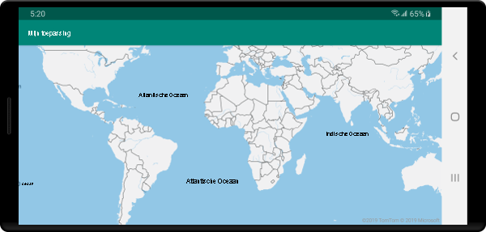

# <a name="quickstart-create-an-android-app-with-azure-maps"></a>Quickstart: een Android-app maken met Azure Maps

In dit artikel wordt beschreven hoe u Azure Maps kunt toevoegen aan een Android-app. U wordt door de volgende basisstappen geleid:

* De ontwikkelomgeving instellen.
* Uw eigen Azure Maps-account maken.
* De primaire Azure Maps-sleutel voor gebruik in de app ophalen.
* De Azure Maps-bibliotheken vanuit het project raadplegen.
* Een Azure Maps-besturingselement aan de app toevoegen.

## <a name="prerequisites"></a>Vereisten

1. Maak een Azure Maps-account door u aan te melden bij de [Azure-portal](https://portal.azure.com). Als u nog geen abonnement op Azure hebt, maak dan een [gratis account](https://azure.microsoft.com/free/) aan voordat u begint.
2. [Een Azure Maps-account maken](quick-demo-map-app.md#create-an-azure-maps-account)
3. [Een primaire sleutel voor een abonnement verkrijgen](quick-demo-map-app.md#get-the-primary-key-for-your-account), ook wel bekend als de primaire sleutel of de abonnementssleutel. Zie [Verificatie beheren in Azure Maps](how-to-manage-authentication.md) voor meer informatie over verificatie in Azure Maps.
4. [Download Android Studio](https://developer.android.com/studio/) gratis van Google.

## <a name="create-an-azure-maps-account"></a>Een Azure Maps-account maken

Voer de volgende stappen uit om een nieuw Azure Maps-account te maken:

1. Klik in de linkerbovenhoek van [Azure Portal](https://portal.azure.com) op **Een resource maken**.
2. Typ **Azure Maps** in het vak *Marketplace doorzoeken*.
3. Selecteer **Azure Maps** in de *Resultaten*. Klik op de knop **Maken** die onder de kaart wordt weergegeven.
4. Voer de volgende waarden in op de pagina **Azure Kaarten-account maken**:
    * Het *Abonnement* dat u wilt gebruiken voor dit account.
    * De naam van de *Resourcegroep* voor dit account. U kunt kiezen om een *Nieuwe* of *Bestaande* resourcegroep te gebruiken.
    * De *Naam* van uw nieuwe account.
    * De *Prijscategorie* voor dit account.
    * Lees de *licentie* en de *privacyverklaring*, en schakel het selectievakje in om de voorwaarden te accepteren.
    * Klik op de knop **Maken**.

    

## <a name="get-the-primary-key-for-your-account"></a>De primaire sleutel voor uw account ophalen

Als het Azure Kaarten-account is gemaakt, haalt u de primaire sleutel op waarmee u query's kunt uitvoeren op de API's van kaarten.

1. Open uw Maps-account in de portal.
2. Selecteer **Verificatie** in de sectie Instellingen.
3. Kopieer de **Primaire Sleutel** naar het Klembord. Sla de sleutel lokaal op voor gebruik verderop in deze zelfstudie.

>[!NOTE]
> Als u de Azure-abonnementssleutel gebruikt in plaats van de primaire Azure Maps-sleutel, wordt uw kaart niet juist weergegeven. Bovendien wordt om veiligheidsredenen aanbevolen dat u roteert tussen de primaire en secundaire sleutel. Als u sleutels wilt roteren, werkt u de app bij om de secundaire sleutel te gebruiken. Vervolgens implementeert u en drukt u op de knop voor cyclus/vernieuwen naast de primaire sleutel om een nieuwe primaire sleutel te genereren. De oude primaire sleutel wordt uitgeschakeld. Zie [Azure Key Vault instellen met wisselen en controleren van sleutels](https://docs.microsoft.com/azure/key-vault/secrets/key-rotation-log-monitoring) voor meer informatie over het roteren van sleutels



## <a name="create-a-project-in-android-studio"></a>Een project maken in Android Studio

Maak eerst een nieuw project met een lege activiteit. Voer de volgende stappen uit om een Android Studio-project te maken:

1. Bij **Project kiezen** selecteert u **Telefoon en tablet**. Uw toepassing wordt uitgevoerd op deze formulierfactor.
2. Op het tabblad **Lege activiteit** selecteert u **Project kiezen** en vervolgens **Volgende**.
3. Bij **Project configureren** selecteert u `API 21: Android 5.0.0 (Lollipop)` als de minimum SDK. Dit is de oudste versie die wordt ondersteund door de Azure Maps Android SDK.
4. Accepteer de standaardnamen `Activity Name` en `Layout Name` en selecteer **Voltooien**.

Raadpleeg de [Android Studio documentation](https://developer.android.com/studio/intro/) (Android Studio-documentatie) voor meer informatie over het installeren van Android Studio en het maken van een nieuw project.



## <a name="set-up-a-virtual-device"></a>Een virtueel apparaat instellen

Met Android Studio kunt u een virtueel Android-apparaat op uw computer instellen. Dit kan u helpen bij het testen van uw toepassing tijdens de ontwikkeling. Als u een virtueel apparaat wilt instellen, selecteert u het AVD-Manager-pictogram (Android Virtual Device) in de rechter bovenhoek van het projectvenster en selecteert u **Virtueel apparaat maken**. U kunt ook toegang krijgen tot AVD Manager door **Hulpmiddelen** > **Android** > **AVD Manager** op de werkbalk te selecteren. In de categorie **Telefoons** selecteert u **Nexus 5X** en vervolgens **Volgende**.

Meer informatie over het instellen van een AVD vindt u in de [Android Studio-documentation](https://developer.android.com/studio/run/managing-avds) (Android Studio-documentatie).


## <a name="install-the-azure-maps-android-sdk"></a>De Azure Maps Android SDK installeren

De volgende stap bij het bouwen van uw toepassing betreft het installeren van de Azure Maps Android SDK. Volg deze stappen om de SDK te installeren:

1. Open het bestand **build.gradle** op het hoogste niveau en voeg de volgende code toe aan de bloksectie **all projects**, **repositories**:

    ```java
    maven {
        url "https://atlas.microsoft.com/sdk/android"
    }
    ```

2. Werk uw **app/build.gradle** bij en voeg de volgende code eraan toe:

    1. Zorg ervoor dat de **minSdkVersion** van uw project API 21 of hoger is.

    2. Voeg de volgende code toe aan de Android-sectie:

        ```java
        compileOptions {
            sourceCompatibility JavaVersion.VERSION_1_8
            targetCompatibility JavaVersion.VERSION_1_8
        }
        ```

    3. Werk uw afhankelijkhedenblok bij en voeg een nieuwe implementatieafhankelijkheidsregel toe voor de nieuwste Azure Maps Android SDK:

        ```java
        implementation "com.microsoft.azure.maps:mapcontrol:0.6"
        ```

        > [!Note]
        > U kunt het versienummer wijzigen in 0+ zodat uw code altijd naar de nieuwste versie verwijst.

    4. Ga op de werkbalk naar **Bestand** en klik vervolgens op **Project met Gradle-bestanden synchroniseren**.
3. Voeg een kaartfragment toe aan de hoofdactiviteit (res \> layout \> activity\_main.xml):

    ```XML
    <?xml version="1.0" encoding="utf-8"?>
    <FrameLayout
        xmlns:android="http://schemas.android.com/apk/res/android"
        xmlns:app="http://schemas.android.com/apk/res-auto"
        android:layout_width="match_parent"
        android:layout_height="match_parent"
        >

        <com.microsoft.azure.maps.mapcontrol.MapControl
            android:id="@+id/mapcontrol"
            android:layout_width="match_parent"
            android:layout_height="match_parent"
            />
    </FrameLayout>
    ```

4. In het bestand **MainActivity.java** moet u het volgende doen:

    * imports voor de Azure Maps SDK toevoegen
    * de Azure Maps-verificatiegegevens instellen
    * het exemplaar van het kaartbesturingselement ophalen in de methode **onCreate**

    Als u de verificatiegegevens voor de klasse `AzureMaps` globaal instelt met behulp van de methode `setSubscriptionKey` of `setAadProperties`, is het niet nodig om uw verificatiegegevens toe te voegen aan elke weergave.

    Het kaartbesturingselement bevat eigen levenscyclusmethoden voor het beheren van de OpenGL-levenscyclus van Android. Deze levenscyclusmethoden moeten rechtstreeks vanuit de opgenomen activiteit worden aangeroepen. U moet de volgende levenscyclusmethoden overschrijven in de activiteit die het kaartbesturingselement bevat zodat de app de levenscyclusmethoden van het kaartbesturingselement correct kan aanroepen. En u dient de desbetreffende kaartbeheermethode aan te roepen.

    * `onCreate(Bundle)`
    * `onStart()`
    * `onResume()`
    * `onPause()`
    * `onStop()`
    * `onDestroy()`
    * `onSaveInstanceState(Bundle)`
    * `onLowMemory()`

    Bewerk het bestand **MainActivity.java** als volgt:

    ```Java
    package com.example.myapplication;
    
    //For older versions use: import android.support.v7.app.AppCompatActivity; 
    import androidx.appcompat.app.AppCompatActivity;
    import com.microsoft.azure.maps.mapcontrol.AzureMaps;
    import com.microsoft.azure.maps.mapcontrol.MapControl;
    import com.microsoft.azure.maps.mapcontrol.layer.SymbolLayer;
    import com.microsoft.azure.maps.mapcontrol.options.MapStyle;
    import com.microsoft.azure.maps.mapcontrol.source.DataSource;
    
    public class MainActivity extends AppCompatActivity {
        
    static {
        AzureMaps.setSubscriptionKey("<Your Azure Maps subscription key>");

        //Alternatively use Azure Active Directory authenticate.
        //AzureMaps.setAadProperties("<Your aad clientId>", "<Your aad AppId>", "<Your aad Tenant>");
    }

    MapControl mapControl;

    @Override
    protected void onCreate(Bundle savedInstanceState) {
        super.onCreate(savedInstanceState);
        setContentView(R.layout.activity_main);

        mapControl = findViewById(R.id.mapcontrol);

        mapControl.onCreate(savedInstanceState);

        //Wait until the map resources are ready.
        mapControl.onReady(map -> {
            //Add your post map load code here.

        });
    }

    @Override
    public void onResume() {
        super.onResume();
        mapControl.onResume();
    }

    @Override
    protected void onStart(){
        super.onStart();
        mapControl.onStart();
    }

    @Override
    public void onPause() {
        super.onPause();
        mapControl.onPause();
    }

    @Override
    public void onStop() {
        super.onStop();
        mapControl.onStop();
    }

    @Override
    public void onLowMemory() {
        super.onLowMemory();
        mapControl.onLowMemory();
    }

    @Override
    protected void onDestroy() {
        super.onDestroy();
        mapControl.onDestroy();
    }

    @Override
    protected void onSaveInstanceState(Bundle outState) {
        super.onSaveInstanceState(outState);
        mapControl.onSaveInstanceState(outState);
    }}
    ```

    > [!NOTE]
    > Nadat u de voorgaande stappen hebt voltooid, krijgt u waarschijnlijk waarschuwingen van Android Studio over een deel van de code. Als u deze waarschuwingen wilt oplossen, importeert u de klassen waarnaar wordt verwezen in `MainActivity.java`.
    > U kunt deze klassen automatisch importeren door `Alt` + `Enter` te selecteren (`Option` + `Return` op een Mac).

5. Selecteer de uitvoerknop, zoals weergegeven in de volgende afbeelding (of druk op `Control` + `R` op een Mac) om uw toepassing te bouwen.

    

Na enkele seconden wordt begonnen met het bouwen van de toepassing. Nadat de build is voltooid, kunt u de toepassing testen in het geëmuleerde Android-apparaat. U krijgt een kaart te zien zoals deze:



## <a name="clean-up-resources"></a>Resources opschonen

>[!WARNING]
> In de zelfstudies in de sectie [Volgende stappen](#next-steps) vindt u gedetailleerde informatie over het gebruik en de configuratie van Azure Maps met uw account. Als u wilt doorgaan met de zelfstudies, verwijder de resources die u in deze quickstart hebt gemaakt dan niet.

Als u niet van plan bent om door te gaan naar de zelfstudies, voert u deze stappen uit voor het opschonen van de resources:

1. Sluit Android Studio en verwijder de toepassing die u hebt gemaakt.
2. Als u de toepassing op een extern apparaat hebt getest, verwijdert u de toepassing van dat apparaat.

Ga als volgt te werk als u niet wilt door gaan met ontwikkelen met de Azure Maps Android SDK:

1. Navigeer naar de Azure-portalpagina. Selecteer **Alle resources** op de hoofdpagina van de portal. Of klik op het menupictogram in de linkerbovenhoek. Selecteer **Alle resources**.
2. Klik op uw Azure Maps-account. Klik bovenaan de pagina op **Verwijderen**.
3. Als u niet wilt doorgaan met ontwikkelen van Android-apps, kunt u desgewenst Android Studio verwijderen.

Zie de volgende handleidingen voor meer codevoorbeelden:

* [Verificatie in Azure Maps beheren](how-to-manage-authentication.md)
* [Kaartstijlen wijzigen in Android-kaarten](set-android-map-styles.md)
* [Een symboollaag toevoegen](how-to-add-symbol-to-android-map.md)
* [Een lijnlaag toevoegen](android-map-add-line-layer.md)
* [Een polygoonlaag toevoegen](how-to-add-shapes-to-android-map.md)

## <a name="next-steps"></a>Volgende stappen

In deze quickstart hebt u een Azure Maps-account en een demo-toepassing gemaakt. Bekijk de volgende zelfstudies voor meer informatie over Azure Maps:

> [!div class="nextstepaction"]
> [GeoJSON-gegevens in Azure Maps laden](tutorial-load-geojson-file-android.md)
