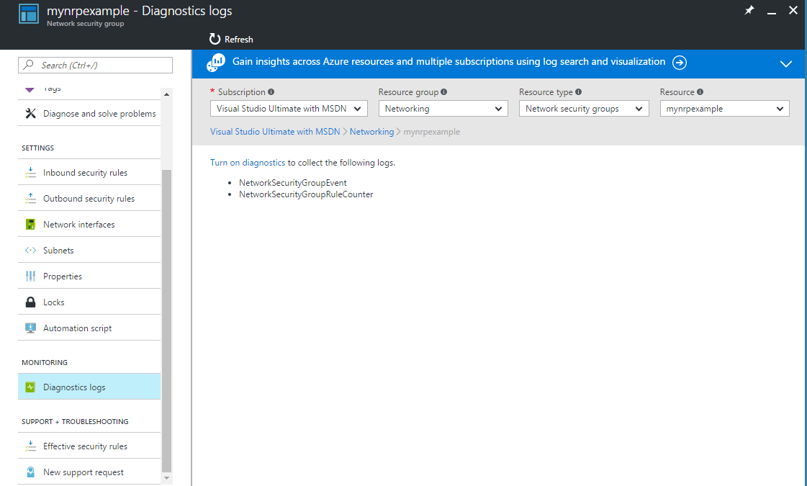
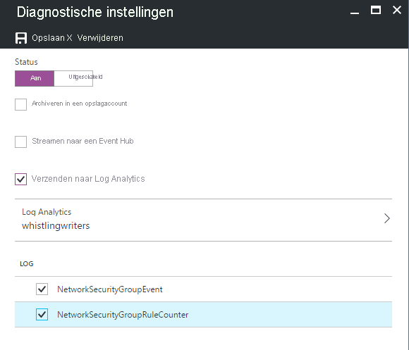
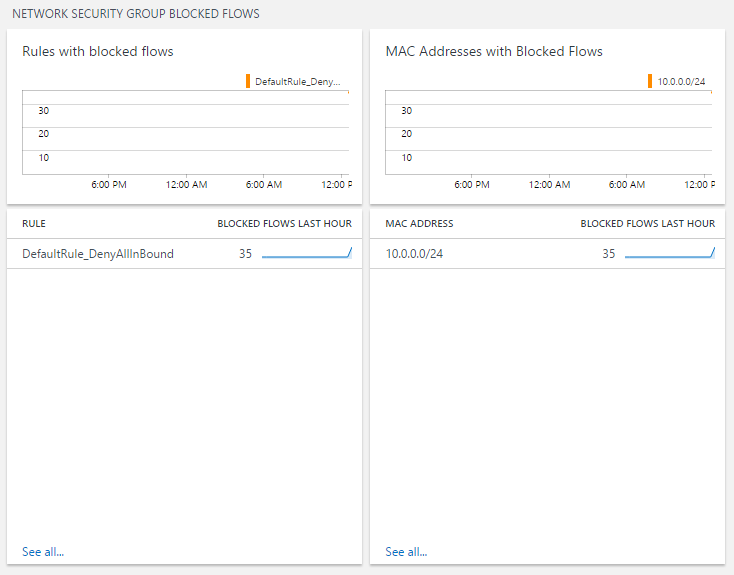

# <a name="azure-networking-monitoring-solutions-in-azure-monitor"></a>Azure-netwerk bewakings oplossingen in Azure Monitor

[!INCLUDE [updated-for-az](../../../includes/updated-for-az.md)]

Azure Monitor biedt de volgende oplossingen voor het bewaken van uw netwerken:
* Netwerkprestatiemeter (NPM) naar
    * De status van uw netwerk controleren
* Azure-toepassing gateway analyse die u wilt controleren
    * Azure-toepassing gateway-logboeken
    * Metrische gegevens van Azure-toepassing gateway
* Oplossingen voor het bewaken en controleren van de netwerk activiteit in uw Cloud netwerk
    * [Traffic Analytics](https://docs.microsoft.com/azure/networking/network-monitoring-overview#traffic-analytics) 
    * Azure Analyse van netwerkbeveiligingsgroep

## <a name="network-performance-monitor-npm"></a>Netwerkprestatiemeter (NPM)

De oplossing voor het beheer van [Netwerkprestatiemeter](https://docs.microsoft.com/azure/networking/network-monitoring-overview) is een netwerk bewakings oplossing, die de status, Beschik baarheid en bereikbaarheid van netwerken bewaakt.  Het wordt gebruikt voor het bewaken van de connectiviteit tussen:

* Open bare Cloud en on-premises
* Data centers en gebruikers locaties (filialen)
* Subnetten die als host fungeren voor verschillende lagen van een toepassing met meerdere lagen.

Zie [Netwerkprestatiemeter](https://docs.microsoft.com/azure/networking/network-monitoring-overview)voor meer informatie.

## <a name="azure-application-gateway-and-network-security-group-analytics"></a>Analyse van Azure-toepassing gateway en netwerk beveiligings groep
Voor het gebruik van de oplossingen:
1. Voeg de beheer oplossing toe aan Azure Monitor en
2. Schakel diagnostische gegevens in om de diagnostische gegevens om te leiden naar een Log Analytics werk ruimte in Azure Monitor. Het is niet nodig om de logboeken te schrijven naar Azure Blob-opslag.

U kunt Diagnostische gegevens en de bijbehorende oplossing inschakelen voor een of beide Application Gateway-en netwerk beveiligings groepen.

Als u diagnostische logboek registratie niet inschakelt voor een bepaald bron type, maar u de oplossing installeert, zijn de dashboard bladen voor die resource leeg en wordt er een fout bericht weer gegeven.

> [!NOTE]
> In januari 2017 wordt de ondersteunde manier voor het verzenden van logboeken van toepassings gateways en netwerk beveiligings groepen naar een Log Analytics werk ruimte gewijzigd. Als u de oplossing **Azure Networking Analytics (afgeschaft)** ziet, raadpleegt u [migreren van de oude netwerk analyse oplossing voor de](#migrating-from-the-old-networking-analytics-solution) stappen die u moet volgen.
>
>

## <a name="review-azure-networking-data-collection-details"></a>Details van Azure Networking-gegevens verzameling controleren
De Analytics-beheer oplossingen van de analyse van het Azure-toepassing gateway en de netwerk beveiligings groep verzamelen Diagnostische logboeken rechtstreeks vanuit Azure-toepassing gateways en netwerk beveiligings groepen. Het is niet nodig om de logboeken te schrijven naar Azure Blob-opslag en er is geen agent vereist voor het verzamelen van gegevens.

De volgende tabel toont methoden voor gegevens verzameling en andere informatie over hoe gegevens worden verzameld voor Azure-toepassing gateway Analytics en de analyse van de netwerk beveiligings groep.

| Platform | Directe agent | Operations Manager agent voor Systems Center | Azure | Operations Manager vereist? | Operations Manager agent gegevens die via een beheer groep zijn verzonden | Verzamelingsfrequentie |
| --- | --- | --- | --- | --- | --- | --- |
| Azure |  |  |&#8226; |  |  |Wanneer geregistreerd |


## <a name="azure-application-gateway-analytics-solution-in-azure-monitor"></a>Azure-toepassing gateway Analytics-oplossing in Azure Monitor


De volgende logboeken worden ondersteund voor toepassings gateways:

* ApplicationGatewayAccessLog
* ApplicationGatewayPerformanceLog
* ApplicationGatewayFirewallLog

De volgende metrische gegevens worden ondersteund voor toepassings gateways: opnieuw


* doorvoer snelheid van 5 minuten

### <a name="install-and-configure-the-solution"></a>De oplossing installeren en configureren
Gebruik de volgende instructies om de Azure-toepassing gateway Analytics-oplossing te installeren en configureren:

1. Schakel de Azure-toepassing gateway Analytics-oplossing in op [Azure Marketplace](https://azuremarketplace.microsoft.com/marketplace/apps/Microsoft.AzureAppGatewayAnalyticsOMS?tab=Overview) of gebruik het proces dat wordt beschreven in [Azure monitor oplossingen toevoegen van de Oplossingengalerie](../../azure-monitor/insights/solutions.md).
2. Schakel logboek registratie van diagnostische gegevens in voor de [toepassings gateways](../../application-gateway/application-gateway-diagnostics.md) die u wilt bewaken.

#### <a name="enable-azure-application-gateway-diagnostics-in-the-portal"></a>Diagnostische gegevens van Azure-toepassing gateway inschakelen in de portal

1. Navigeer in het Azure Portal naar de Application Gateway resource die u wilt bewaken.
2. Selecteer *Diagnostische logboeken* om de volgende pagina te openen.

   
3. Klik op *Diagnostische gegevens inschakelen* om de volgende pagina te openen.

   
4. Als u Diagnostische gegevens wilt inschakelen *, klikt u op onder* *status*.
5. Klik op het selectie vakje voor *verzenden naar log Analytics*.
6. Selecteer een bestaande Log Analytics werk ruimte of maak een werk ruimte.
7. Klik op het selectie vakje onder **logboek** voor elk van de logboek typen die u wilt verzamelen.
8. Klik op *Opslaan* om de logboek registratie van diagnostische gegevens in te scha kelen op Azure monitor.

#### <a name="enable-azure-network-diagnostics-using-powershell"></a>Diagnostische gegevens van Azure Network inschakelen met Power shell

Het volgende Power shell-script biedt een voor beeld van het inschakelen van diagnostische logboek registratie voor toepassings gateways.

```powershell
$workspaceId = "/subscriptions/d2e37fee-1234-40b2-5678-0b2199de3b50/resourcegroups/oi-default-east-us/providers/microsoft.operationalinsights/workspaces/rollingbaskets"

$gateway = Get-AzApplicationGateway -Name 'ContosoGateway'

Set-AzDiagnosticSetting -ResourceId $gateway.ResourceId  -WorkspaceId $workspaceId -Enabled $true
```

### <a name="use-azure-application-gateway-analytics"></a>Azure-toepassing gateway-analyse gebruiken


Nadat u op de tegel **Azure-toepassing gateway Analytics** in het overzicht hebt geklikt, kunt u samen vattingen van uw logboeken weer geven en vervolgens inzoomen op Details voor de volgende categorieën:

* Application Gateway Access-logboeken
  * Client-en Server fouten voor Application Gateway Access-logboeken
  * Aanvragen per uur voor elke Application Gateway
  * Mislukte aanvragen per uur voor elke Application Gateway
  * Fouten door de gebruikers agent voor toepassings gateways
* Prestaties Application Gateway
  * Host-status voor Application Gateway
  * Maximum-en 95e percentiel voor mislukte Application Gateway-aanvragen


Controleer op het **Azure-toepassing gateway Analytics** -dash board de samenvattings informatie op een van de Blades en klik vervolgens op een van de pagina's om gedetailleerde informatie weer te geven op de pagina zoeken in Logboeken.

Op een van de zoek pagina's in Logboeken kunt u de resultaten weer geven op tijd, gedetailleerde resultaten en de Zoek geschiedenis van het logboek. U kunt ook filteren op facetten om de resultaten te beperken.


## <a name="azure-network-security-group-analytics-solution-in-azure-monitor"></a>Analyse oplossing voor Azure-netwerk beveiligings groep in Azure Monitor


> [!NOTE]
> De analyse oplossing voor netwerk beveiligings groepen wordt verplaatst naar de ondersteuning van de Community omdat de functionaliteit ervan is vervangen door [Traffic Analytics](../../network-watcher/traffic-analytics.md).
> - De oplossing is nu beschikbaar in [Azure Quick](https://azure.microsoft.com/resources/templates/oms-azurensg-solution/) start-sjablonen en is binnenkort niet meer beschikbaar op de Azure Marketplace.
> - Voor bestaande klanten die de oplossing al aan hun werk ruimte hebben toegevoegd, blijft deze werken zonder wijzigingen.
> - Micro soft blijft ondersteuning bieden voor het verzenden van Diagnostische logboeken voor NSG naar uw werk ruimte met Diagnostische instellingen.

De volgende logboeken worden ondersteund voor netwerk beveiligings groepen:

* NetworkSecurityGroupEvent
* NetworkSecurityGroupRuleCounter

### <a name="install-and-configure-the-solution"></a>De oplossing installeren en configureren
Gebruik de volgende instructies voor het installeren en configureren van de Azure Networking Analytics-oplossing:

1. Schakel de oplossing voor de analyse van Azure-netwerk beveiligings groepen in via [Azure Marketplace](https://azuremarketplace.microsoft.com/marketplace/apps/Microsoft.AzureNSGAnalyticsOMS?tab=Overview) of gebruik het proces beschreven in [Azure monitor oplossingen toevoegen van de Oplossingengalerie](../../azure-monitor/insights/solutions.md).
2. Schakel de diagnostische logboek registratie in voor de resources van de [netwerk beveiligings groep](../../virtual-network/virtual-network-nsg-manage-log.md) die u wilt bewaken.

### <a name="enable-azure-network-security-group-diagnostics-in-the-portal"></a>Diagnostische gegevens van Azure Network-beveiligings groep inschakelen in de portal

1. Navigeer in het Azure Portal naar de resource van de netwerk beveiligings groep die u wilt bewaken
2. Selecteer *Diagnostische logboeken* om de volgende pagina te openen

   
3. Klik op *Diagnostische gegevens inschakelen* om de volgende pagina te openen

   
4. Als u Diagnostische gegevens wilt inschakelen *, klikt u op onder* *status*
5. Klik op het selectie vakje voor *verzenden naar log Analytics*
6. Een bestaande Log Analytics-werk ruimte selecteren of een werk ruimte maken
7. Klik op het selectie vakje onder **logboek** voor elk van de te verzamelen logboek typen
8. Klik op *Opslaan* om de logboek registratie van diagnostische gegevens in te scha kelen op Log Analytics

### <a name="enable-azure-network-diagnostics-using-powershell"></a>Diagnostische gegevens van Azure Network inschakelen met Power shell

Het volgende Power shell-script biedt een voor beeld van het inschakelen van diagnostische logboek registratie voor netwerk beveiligings groepen
```powershell
$workspaceId = "/subscriptions/d2e37fee-1234-40b2-5678-0b2199de3b50/resourcegroups/oi-default-east-us/providers/microsoft.operationalinsights/workspaces/rollingbaskets"

$nsg = Get-AzNetworkSecurityGroup -Name 'ContosoNSG'

Set-AzDiagnosticSetting -ResourceId $nsg.ResourceId  -WorkspaceId $workspaceId -Enabled $true
```

### <a name="use-azure-network-security-group-analytics"></a>Analyse van Azure-netwerk beveiligings groep gebruiken
Nadat u op de tegel **Azure Network Security Group Analytics** in het overzicht hebt geklikt, kunt u samen vattingen van uw logboeken weer geven en vervolgens inzoomen op Details voor de volgende categorieën:

* Geblokkeerde stromen in de netwerk beveiligings groep
  * Regels voor netwerk beveiligings groepen met geblokkeerde stromen
  * MAC-adressen met geblokkeerde stromen
* Toegestane stromen in de netwerk beveiligings groep
  * Regels voor netwerk beveiligings groepen met toegestane stromen
  * MAC-adressen met toegestane stromen




Bekijk in het dash board van de **Azure Network-beveiligings groep Analytics** de samenvattings informatie op een van de Blades en klik vervolgens op één om gedetailleerde informatie weer te geven op de pagina zoeken in Logboeken.

Op een van de zoek pagina's in Logboeken kunt u de resultaten weer geven op tijd, gedetailleerde resultaten en de Zoek geschiedenis van het logboek. U kunt ook filteren op facetten om de resultaten te beperken.

## <a name="migrating-from-the-old-networking-analytics-solution"></a>Migreren van de oude oplossing voor netwerk analyse
In januari 2017 wordt de ondersteunde manier voor het verzenden van logboeken van Azure-toepassing gateways en Azure-netwerk beveiligings groepen naar een Log Analytics werk ruimte gewijzigd. Deze wijzigingen bieden de volgende voor delen:
+ Logboeken worden rechtstreeks naar Azure Monitor geschreven, zonder dat u een opslag account hoeft te gebruiken
+ Minder latentie vanaf het moment dat Logboeken worden gegenereerd, zodat ze beschikbaar zijn in Azure Monitor
+ Minder configuratie stappen
+ Een algemene indeling voor alle typen Azure Diagnostics

De bijgewerkte oplossingen gebruiken:

1. [Diagnostische gegevens configureren die rechtstreeks naar Azure Monitor worden verzonden vanuit Azure-toepassing gateways](#enable-azure-application-gateway-diagnostics-in-the-portal)
2. [Configureren dat diagnostische gegevens rechtstreeks naar Azure Monitor worden verzonden vanuit Azure-netwerk beveiligings groepen](#enable-azure-network-security-group-diagnostics-in-the-portal)
2. Schakel de *Azure Application Gateway-analyse* en de *Azure analyse van netwerkbeveiligingsgroep* oplossing in met behulp van het proces dat wordt beschreven in [Azure monitor-oplossingen toevoegen van de Oplossingengalerie](solutions.md)
3. Alle opgeslagen query's, Dash boards of waarschuwingen bijwerken voor gebruik van het nieuwe gegevens type
   + Typ AzureDiagnostics. U kunt het resource type gebruiken om te filteren op Azure-netwerk Logboeken.

     | In plaats van: | Gebruiken |
     | --- | --- |
     | NetworkApplicationgateways &#124; waarbij operationname = = "ApplicationGatewayAccess" | AzureDiagnostics &#124; waarbij resource type = = "APPLICATIONGATEWAYS" en operationname = = "ApplicationGatewayAccess" |
     | NetworkApplicationgateways &#124; waarbij operationname = = "ApplicationGatewayPerformance" | AzureDiagnostics &#124; waarbij resource type = = "APPLICATIONGATEWAYS" en operationname = = "ApplicationGatewayPerformance" |
     | NetworkSecuritygroups | AzureDiagnostics &#124; waarbij resource type = = "NETWORKSECURITYGROUPS" |

   + Voor een veld met een achtervoegsel van \_s, \_d of \_g in de naam, wijzigt u het eerste teken in kleine letters
   + Voor een veld met een achtervoegsel van \_o in naam, worden de gegevens gesplitst in afzonderlijke velden op basis van de geneste veld namen.
4. Verwijder de oplossing *Azure Networking Analytics (afgeschaft)* .
   + Als u Power shell gebruikt, gebruikt u `Set-AzureOperationalInsightsIntelligencePack -ResourceGroupName <resource group that the workspace is in> -WorkspaceName <name of the log analytics workspace> -IntelligencePackName "AzureNetwork" -Enabled $false`

Gegevens die vóór de wijziging zijn verzameld, zijn niet zichtbaar in de nieuwe oplossing. U kunt door gaan met het zoeken naar deze gegevens met behulp van het oude type en de veld namen.

## <a name="troubleshooting"></a>Problemen oplossen
[!INCLUDE [log-analytics-troubleshoot-azure-diagnostics](../../../includes/log-analytics-troubleshoot-azure-diagnostics.md)]

## <a name="next-steps"></a>Volgende stappen
* Gebruik [logboek query's in azure monitor](../log-query/log-query-overview.md) om gedetailleerde Azure Diagnostics-gegevens weer te geven.
