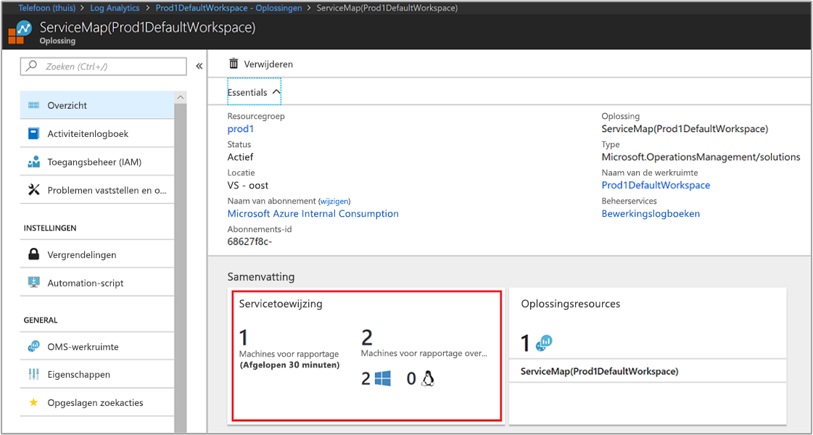
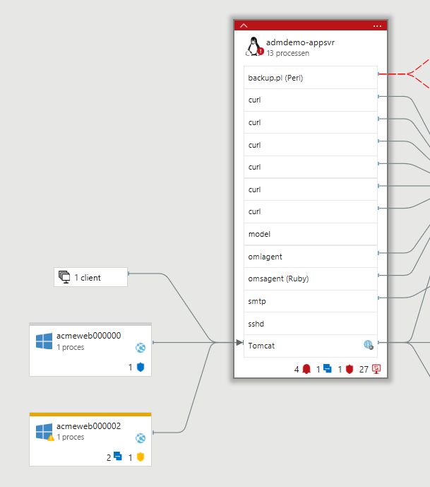
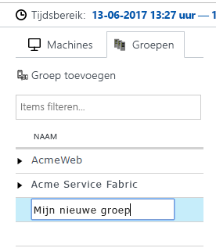
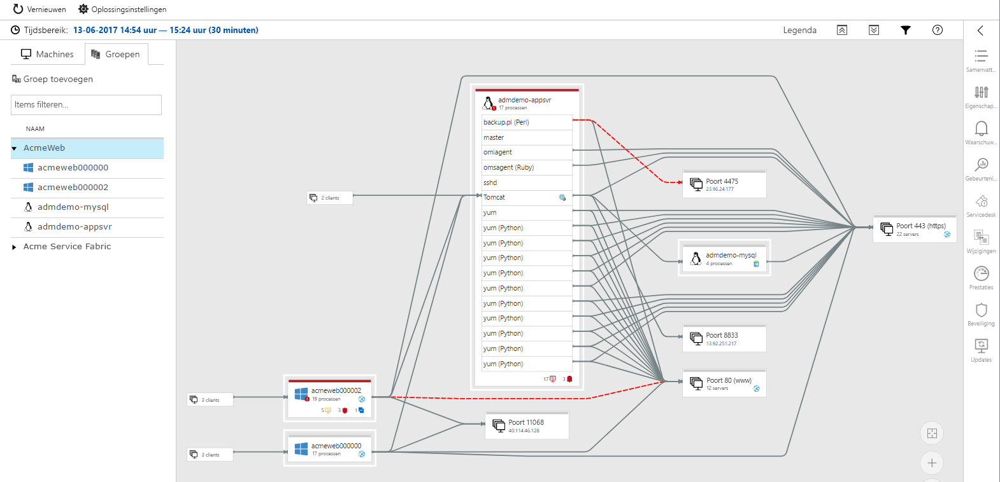
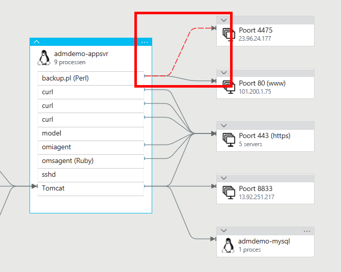
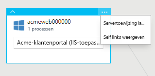
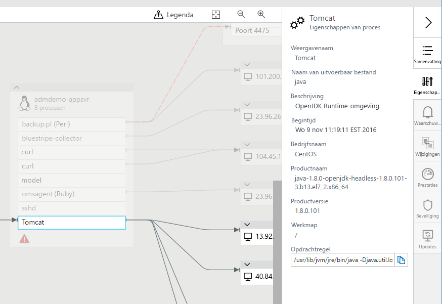
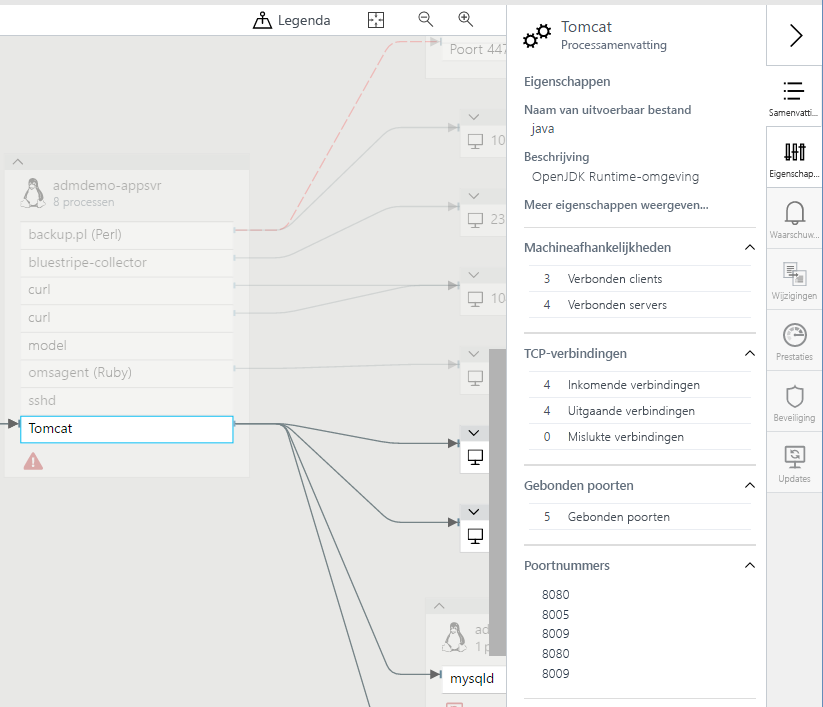
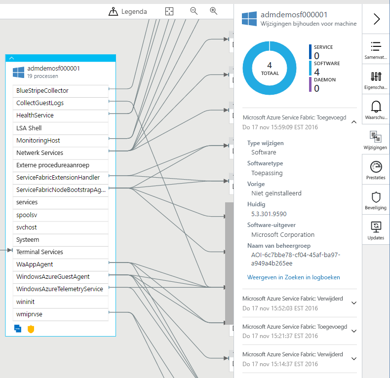
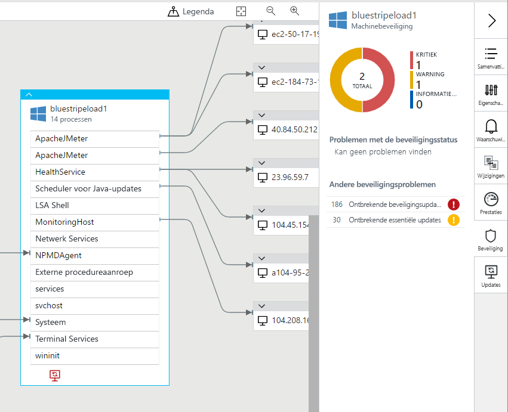

# <a name="using-service-map-solution-in-azure"></a>Met behulp van de oplossing Serviceoverzicht in Azure
Serviceoverzicht ontdekt automatisch toepassingsonderdelen op Windows- en Linux-systemen en wijst de communicatie tussen services toe. Met Servicetoewijzing kun u uw servers weergeven op de manier waarop ze hun waarde voor u hebben: als onderling verbonden systemen die essentiële services leveren. Servicetoewijzing toont verbindingen tussen servers, processen, latentie van binnenkomende en uitgaande verbindingen en poorten voor elke via TCP verbonden architectuur. Na installatie van een agent is er geen verdere configuratie vereist.

Dit artikel beschrijft de details van onboarding- en het gebruik van Service-toewijzing. Zie voor meer informatie over het configureren van Serviceoverzicht en onboarding agents [oplossing Serviceoverzicht configureren in Azure]( service-map-configure.md).

>[!NOTE]
>Als u Serviceoverzicht al hebt geïmplementeerd, kunt u nu ook bekijken uw kaarten in Azure Monitor voor virtuele machines, waaronder extra functies voor het bewaken van VM-status en prestaties. Zie voor meer informatie, [Azure Monitor voor virtuele machines overzicht](../../azure-monitor/insights/vminsights-overview.md).


## <a name="sign-in-to-azure"></a>Aanmelden bij Azure
Meld u aan bij de Azure Portal op [https://portal.azure.com](https://portal.azure.com).

## <a name="enable-service-map"></a>Service-kaart inschakelen
1. Klik in de Azure-portal op **+ een resource maken**.
2. Typ in de zoekbalk typt, **Serviceoverzicht** en druk op **Enter**.
3. Selecteer in de marketplace pagina met zoekresultaten, **Serviceoverzicht** in de lijst.<br><br> <br>
4. Op de **Serviceoverzicht** in het overzichtsdeelvenster details van de oplossing bekijken en klik vervolgens op **maken** om te beginnen met het onboarding-proces aan uw Log Analytics-werkruimte.<br><br> .
5. In de **configureren van een oplossing** deelvenster, selecteer een bestaande of maak een nieuwe Log Analytics-werkruimte.  Zie voor meer informatie over het maken van een nieuwe werkruimte [een Log Analytics-werkruimte maken in Azure portal](../../azure-monitor/learn/quick-create-workspace.md). Nadat u de vereiste gegevens hebt, klikt u op **maken**.  

Hoewel de informatie wordt gecontroleerd en de oplossing is geïmplementeerd, u kunt de voortgang bijhouden onder **meldingen** in het menu. 

U toegang tot Service Map in de Azure-portal van uw Log Analytics-werkruimte en selecteer de optie **oplossingen** in het linkerdeelvenster.<br><br> .<br> Selecteer in de lijst met oplossingen **ServiceMap(workspaceName)** en in het Serviceoverzicht oplossing overzicht pagina klikt u op op de tegel Serviceoverzicht samenvatting.<br><br> .

## <a name="use-cases-make-your-it-processes-dependency-aware"></a>Use-cases: Maken van uw IT-afdeling verwerkt op de hoogte van afhankelijkheid

### <a name="discovery"></a>Detectie
Serviceoverzicht is een algemene verwijzing-kaart van afhankelijkheden automatisch gebaseerd op uw servers, processen en services van derden. Er wordt gedetecteerd en alle TCP-afhankelijkheden, identificeren verrassing verbindingen, externe externe systemen die u afhankelijk bent en afhankelijkheden van traditionele donkere gebieden van uw netwerk, zoals Active Directory-kaarten. Service Map detecteert mislukte netwerkverbindingen die uw beheerde systemen proberen te maken, zodat u identificeren van mogelijke onjuiste configuratie van server, serviceonderbreking en netwerkproblemen.

### <a name="incident-management"></a>incidentbeheer
Serviceoverzicht helpt het raadwerk van probleem isolatie door die laat zien hoe systemen met elkaar zijn verbonden en die betrekking hebben op elkaar worden verbonden. Naast het identificeren van mislukte verbindingen, helpt het identificeren van onjuist geconfigureerde load balancers, verrassende of overmatige belasting van kritieke services en rogue clients, zoals machines van ontwikkelaars praten op productiesystemen. Met behulp van geïntegreerde werkstromen met wijzigingen bijhouden, kunt u ook zien of een wijzigingsgebeurtenis op een back-end virtuele machine of service de hoofdoorzaak van een incident wordt uitgelegd.

### <a name="migration-assurance"></a>Migratie assurance
Met behulp van Service Map, kunt u effectief plannen, versnellen en valideren van Azure-migraties, die helpt ervoor te zorgen dat er niets is overgebleven en onverwachte storingen, niet wordt uitgevoerd. U kunt alle onderling afhankelijke systemen die moeten samen te migreren, Evalueer systeemconfiguratie en de capaciteit en bepalen of een actief systeem gebruikers nog steeds bedient of een kandidaat is voor het buiten gebruik stellen in plaats van de migratie kunt detecteren. Nadat de verplaatsing voltooid is, kunt u controleren clientbelasting en identiteit om te controleren dat de testsystemen en klanten zijn verbonden. Als uw subnetdefinities plannings- en firewall problemen hebt, verwijzen mislukte verbindingen van Serviceoverzicht maps u naar de systemen die connectiviteit moeten op te geven.

### <a name="business-continuity"></a>Bedrijfscontinuïteit
Als u Azure Site Recovery worden gebruikt en moet hulp bij het definiëren van de recovery-reeks voor de toepassingsomgeving van uw, Service Map automatisch wordt weergegeven hoe systemen zijn afhankelijk van elkaar om ervoor te zorgen dat is uw plan voor herstel betrouwbaar. Door een kritieke server of een groep te kiezen en de clients weergeven, kunt u bepalen welke front-end-systemen om te herstellen nadat de server hersteld en beschikbaar is is. Door te kijken op kritieke servers back-end afhankelijkheden, kunt u ook welke systemen te herstellen voordat uw focus-systemen worden teruggezet identificeren.

### <a name="patch-management"></a>Beheer van Softwarebeveiligingspatches
Serviceoverzicht verbetert uw gebruik van de systeemupdate-evaluatie door u die andere teams en -servers afhankelijk van uw service, zijn zodat u deze vooraf in kennis stellen kunt voordat u uw systeem voor het patchen van weer te geven. Beheer van softwarebeveiligingspatches verbetert Serviceoverzicht ook door u of uw services beschikbaar en goed verbonden nadat zijn ze zijn herstel en opnieuw opgestart.

## <a name="mapping-overview"></a>Overzicht van toewijzing
Serviceoverzicht agents verzamelen van informatie over alle TCP verbonden processen op de server waarop ze zijn geïnstalleerd en meer informatie over het binnenkomende en uitgaande verbindingen voor elk proces.

U kunt computers of groepen met Service Map agents hun afhankelijkheden visualiseren gedurende een opgegeven tijdsbereik selecteren in de lijst in het linkerdeelvenster. Afhankelijkheid van de machine zich richten op een specifieke virtuele machine wordt toegewezen, en ze alle machines die rechtstreekse TCP-clients of servers van die machine zijn weergegeven.  Computergroep maps weergeven sets van servers en de bijbehorende afhankelijkheden.


Machines kunnen worden uitgebreid in de kaart om weer te geven van de actieve groepen en -processen met actieve netwerkverbindingen verwerkt tijdens het geselecteerde tijdsbereik. Wanneer een externe computer met een Serviceoverzicht-agent wordt uitgevouwen om details van proces weer te geven, worden de processen die met de focus machine communiceren weergegeven. Het aantal zonder agent front-computers die verbinding met de focus-machine maken wordt aan de linkerkant van de processen die ze verbinding met maken aangegeven. Als de focus-machine is een verbinding met een back-end-machine waarop geen agent is, wordt de back-endserver is opgenomen in een groep van een Server-poort, samen met andere verbindingen met hetzelfde poortnummer.

Standaard tonen Serviceoverzicht maps de laatste 30 minuten van afhankelijkheidsinformatie. Met behulp van de besturingselementen in de linkerbovenhoek, kunt u een query-toewijzingen voor historische tijdsbereik van maximaal één uur om weer te geven hoe afhankelijkheden in het verleden hebt bekeken (bijvoorbeeld tijdens een incident, of voordat er een wijziging is opgetreden). Serviceoverzicht gegevens worden opgeslagen voor 30 dagen in betaalde werkruimten en 7 dagen gratis werkruimten.

## <a name="status-badges-and-border-coloring"></a>Status badges en het inkleuren van de rand
Aan de onderkant van elke server in de kaart, kan een lijst met status badges overbrengen van statusinformatie over de server zijn. De badges erop duiden dat er een relevante informatie voor de server uit een van de oplossing-integraties. Een badge te klikken gaat u rechtstreeks naar de details van de status in het rechter deelvenster. De status van de momenteel beschikbare badges bevatten waarschuwingen, servicedesk, wijzigingen, beveiliging en Updates.

Afhankelijk van de ernst van de badges status machine knooppunt randen worden gekleurde rood (Kritiek), geel (waarschuwing) of blauw (informatief). De kleur vertegenwoordigt de meest ernstige status van een van de badges status. Een grijze rand geeft aan dat een knooppunt dat geen statusindicators is.



## <a name="process-groups"></a>Verwerken van groepen
Verwerken van groepen combineren processen die gekoppeld aan een algemene product of service in een verwerkingsgroep zijn.  Zelfstandige processen samen met het verwerken van groepen worden weergegeven wanneer een machine-knooppunt wordt uitgevouwen.  Als binnenkomende en uitgaande verbindingen met een proces in een procesgroep vervolgens de verbinding is mislukt, wordt weergegeven als voor de groep hele proces is mislukt.

## <a name="machine-groups"></a>Machinegroepen
Computergroepen kunnen u om te zien van kaarten die zijn gericht op een set servers, niet alleen een zodat u alle leden van een meerlagige toepassings- of -cluster op een kaart kunt zien.

Gebruikers selecteren welke servers deel uitmaken van een groep samen en kies een naam voor de groep.  U kunt vervolgens de groep met alle processen en -verbindingen weergeven of weergeven met alleen de processen en verbindingen die rechtstreeks betrekking op de andere leden van de groep hebben.


### <a name="creating-a-machine-group"></a>Het maken van een Machine-groep
Voor het maken van een groep selecteert u de machine of computers die u wilt weergeven in de virtuele Machines en op **toevoegen aan groep**.


Daar kunt u **nieuw** en geef een naam op voor de groep.



>[!NOTE]
>Computergroepen zijn beperkt tot 10 servers.

### <a name="viewing-a-group"></a>Een groep weergeven
Als u bepaalde groepen hebt gemaakt, kunt u ze kunt weergeven door het tabblad groepen te kiezen.


Selecteer vervolgens de naam van de groep om de kaart voor die groep Machine weer te geven.
 de machines die deel uitmaken van de groep worden beschreven in wit op de kaart.

De machines die gezamenlijk de computergroep wordt een lijst uitbreiden van de groep.


### <a name="filter-by-processes"></a>Filteren op processen
U kunt de kaartweergave tussen alle processen en verbindingen worden weergegeven in de groep en alleen de virtuele machines die rechtstreeks betrekking op de Machine-groep hebben in-of uitschakelen.  De standaardweergave is om alle processen weer te geven.  U kunt de weergave wijzigen door te klikken op het filterpictogram boven de kaart.


Wanneer **alle processen** is geselecteerd, de kaart bevat alle processen en -verbindingen op elk van de machines in de groep.



Als u de weer wijzigt te geven alleen **groepsgebonden processen**, de kaart wordt worden verkleind zodat alleen de processen en verbindingen die rechtstreeks zijn verbonden met andere virtuele machines in de groep, het maken van een vereenvoudigde weergave.


 
### <a name="adding-machines-to-a-group"></a>Machines worden toegevoegd aan een groep
Als u wilt computers toevoegen aan een bestaande groep, schakel de selectievakjes naast de machines die u wilt en klik vervolgens op **toevoegen aan groep**.  Kies vervolgens de groep die u wilt de machines aan toevoegen.
 
### <a name="removing-machines-from-a-group"></a>Machines verwijderen uit een groep
Vouw in de lijst met groepen, de naam van de groep om de machines in de groep van de Machine weer te geven.  Klik vervolgens op het menu van de drie puntjes naast de computer die u wilt verwijderen en kies **verwijderen**.


### <a name="removing-or-renaming-a-group"></a>Verwijderen of wijzigen van een groep
Klik op het menu van de drie puntjes naast de groepnaam van de in de lijst met groepen.


## <a name="role-icons"></a>Rolpictogrammen
Bepaalde processen bepaalde functies op machines bedienen: web-servers, toepassingsservers en -database. Serviceoverzicht annotates proces- en machinegrenzen vakken met Rolpictogrammen voor het identificeren van in een oogopslag de rol van een proces of de server wordt afgespeeld.

| Functiepictogram | Description |
|:--|:--|
|  | Webserver |
|  | Toepassingsserver |
|  | Database-server |
|  | LDAP-server |
|  | SMB-server |


## <a name="failed-connections"></a>Mislukte verbindingen
Mislukte verbindingen worden weergegeven in de Serviceoverzicht-toewijzingen voor processen en computers, met een rode stippellijn die aangeeft dat een clientsysteem te bereiken een proces of de poort is mislukt. Mislukte verbindingen worden gerapporteerd door een systeem met een geïmplementeerde Service Map-agent als dit systeem is geprobeerd de mislukte verbinding. Serviceoverzicht meet dit proces met inachtneming van TCP-sockets die niet voldoen aan een verbinding tot stand brengen. Deze fout kan worden veroorzaakt door een firewall, een onjuiste configuratie van de client of server of een externe service niet beschikbaar.



Informatie over mislukte verbindingen kunnen helpen bij het oplossen van problemen, validatie van de migratie, beveiligingsanalyse en algemene architectuur begrijpen. Mislukte verbindingen soms onschadelijk zijn, maar ze vaak rechtstreeks verwijzen naar een probleem is, zoals een failover-omgeving plotseling is onbereikbaar of twee toepassingslagen niet kan communiceren na de cloudmigratie van een.

## <a name="client-groups"></a>Clientgroepen
Clientgroepen worden vakken op de kaart die clientcomputers waarvoor geen afhankelijkheid Agents vertegenwoordigen. Een enkele Client groep vertegenwoordigt de clients voor een afzonderlijk proces of de machine.


Selecteer de groep IP-adressen van de servers in de groep van een Client. De inhoud van de groep worden weergegeven in de **Client groepseigenschappen** deelvenster.


## <a name="server-port-groups"></a>Groepen van de server-poort
Serverpoort groepen zijn vakken die staan voor server-poorten op servers waarop geen afhankelijkheden Agents. Het vak bevat de server-poort en een telling van het aantal servers met verbinding naar die poort. Vouw in het vak om de afzonderlijke servers en verbindingen te bekijken. Als er slechts één server in het vak, wordt de naam of IP-adres vermeld.


## <a name="context-menu"></a>Contextmenu
Te klikken op het weglatingsteken (...) aan de bovenkant rechts van een server wordt het contextmenu voor die server weergegeven.



### <a name="load-server-map"></a>Servertoewijzing laden
Te klikken op **Servertoewijzing** gaat u naar een nieuw overzicht met de geselecteerde server als de nieuwe focus-machine.

### <a name="show-self-links"></a>Self links weergeven
Te klikken op **Self-Links weergeven** opnieuw getekend het serverknooppunt, inclusief alle Self link-elementen, die TCP-verbindingen die beginnen en eindigen op processen binnen de server. Als self link-elementen worden weergegeven, de opdracht menuwijzigingen **verbergen Self-Links**, zodat u ze kunt uitschakelen.

## <a name="computer-summary"></a>Samenvatting van computer
De **Machine samenvatting** deelvenster bevat een overzicht van het besturingssysteem, afhankelijkheid aantallen en gegevens van andere oplossingen van een server. Deze gegevens omvatten maatstaven voor prestaties, helpdesk servicetickets, bijhouden van wijzigingen, beveiliging en updates.


## <a name="computer-and-process-properties"></a>Eigenschappen van computer- en verwerken
Wanneer u een kaart Serviceoverzicht navigeert, kunt u de machines en processen te krijgen van aanvullende context over de eigenschappen kunt selecteren. Machines bevatten informatie over DNS-naam, IPv4-adressen, CPU en geheugen capaciteit, VM-type, besturingssysteem en versie, laatst opnieuw tijd en de id's van de OMS- en Service Map-agents.


U kunt details van proces van het besturingssysteem metagegevens over het uitvoeren van processen, zoals naam, beschrijving van proces, gebruikersnaam en domein (op Windows), bedrijfsnaam, productnaam, versie van het product, werkmap, vanaf de opdrachtregel en proces verzamelen de begintijd.



De **overzicht van proces** deelvenster bevat aanvullende informatie over de connectiviteit van het proces, met inbegrip van de gebonden poorten, binnenkomende en uitgaande verbindingen en mislukte verbindingen.



## <a name="alerts-integration"></a>Waarschuwingen-integratie
Service Map kan worden geïntegreerd met Azure-waarschuwingen om weer te geven van geactiveerde waarschuwingen voor de geselecteerde server in het geselecteerde tijdsbereik. De server wordt een pictogram weergegeven als er huidige waarschuwingen en de **Machine waarschuwingen** deelvenster geeft een lijst van de waarschuwingen.


Om in te schakelen Serviceoverzicht relevante waarschuwingen worden weergegeven, maakt u een waarschuwingsregel die wordt geactiveerd voor een specifieke computer. Juiste om waarschuwingen te maken:
- Een component aan groep opnemen door computer (bijvoorbeeld **door Computer interval van 1 minuut**).
- Kies een waarschuwing moet op basis van de meting van metrische gegevens.

## <a name="log-events-integration"></a>Gebeurtenissen-Logboekintegratie
Service Map kan worden geïntegreerd met zoeken in Logboeken om weer te geven van een telling van alle beschikbare logboekgebeurtenissen voor de geselecteerde server tijdens het geselecteerde tijdsbereik. U kunt klikken op elke rij in de lijst van het aantal gebeurtenissen gaat u naar zoeken in Logboeken en bekijkt u de afzonderlijke gebeurtenissen.


## <a name="service-desk-integration"></a>Servicedesk-integratie
Serviceoverzicht integratie met de IT Service Management-Connector is automatische wanneer beide oplossingen zijn ingeschakeld en geconfigureerd in uw Log Analytics-werkruimte. De integratie in Service Map heet "servicedesk." Zie voor meer informatie, [centraal beheren met behulp van IT Service Management Connector ITSM-werkitems](https://docs.microsoft.com/azure/log-analytics/log-analytics-itsmc-overview).

De **Machine servicedesk** deelvenster geeft een lijst van alle IT Service Management-gebeurtenissen voor de geselecteerde server in het geselecteerde tijdsbereik. De server, wordt er een pictogram weergegeven als er actieve objecten en de Machine Service Desk-deelvenster deze toont.


Het item in uw verbonden ITSM-oplossing, klikt u op **werkitem weergeven**.

Als u wilt de details van het item weergeven in zoeken in Logboeken, klikt u op **weergeven in zoeken in logboeken**.
Metrische verbindingsgegevens worden geschreven naar twee nieuwe tabellen in Log Analytics 

## <a name="change-tracking-integration"></a>Tracerings-integratie wijzigen
Serviceoverzicht integratie met wijzigingen bijhouden is automatische wanneer beide oplossingen zijn ingeschakeld en geconfigureerd in uw Log Analytics-werkruimte.

De **Machine bijhouden** deelvenster geeft een lijst van alle wijzigingen, met de meest recente eerst, samen met een koppeling naar het inzoomen op Zoeken in Logboeken voor meer informatie.



De volgende afbeelding wordt een gedetailleerde weergave van een ConfigurationChange gebeurtenis die u ziet nadat u hebt geselecteerd **weergeven in Log Analytics**.


## <a name="performance-integration"></a>Integratie van prestaties
De **Machine prestaties** deelvenster geeft standaardprestaties metrische gegevens voor de geselecteerde server weer. De metrische gegevens omvatten CPU-gebruik, geheugengebruik bytes van netwerk verzonden en ontvangen en een lijst van de belangrijkste processen door bytes van netwerk verzonden en ontvangen.


Om prestatiegegevens te bekijken, moet u mogelijk [inschakelen van de juiste Log Analytics-prestatiemeteritems](https://docs.microsoft.com/azure/log-analytics/log-analytics-data-sources-performance-counters).  De items die u wilt inschakelen:

Windows:
- Processor(*)\\% processortijd
- Geheugen\\% toegewezen Bytes In gebruik
- Netwerk Adapter(*)\\verzonden Bytes per seconde
- Netwerk Adapter(*)\\ontvangen Bytes per seconde

Linux:
- Processor(*)\\% processortijd
- Memory(*)\\percentage gebruikt geheugen
- Netwerk Adapter(*)\\verzonden Bytes per seconde
- Netwerk Adapter(*)\\ontvangen Bytes per seconde

Als u de netwerk-prestatiegegevens, moet u ook hebt ingeschakeld de Wire Data 2.0-oplossing in uw werkruimte.
 
## <a name="security-integration"></a>Beveiligingsintegratie van
Serviceoverzicht integratie met beveiliging en controle is automatische wanneer beide oplossingen zijn ingeschakeld en geconfigureerd in uw Log Analytics-werkruimte.

De **Machine Security** deelvenster ziet u gegevens van de oplossing beveiliging en controle voor de geselecteerde server. Het deelvenster geeft een samenvatting weer van alle openstaande beveiligingsproblemen voor de server tijdens het geselecteerde tijdsbereik. Te klikken op een van de problemen met beveiliging oefeningen omlaag in een zoeken in Logboeken voor meer informatie over deze.



## <a name="updates-integration"></a>Integratie van updates
Serviceoverzicht integratie met beheer van updates is automatisch als beide oplossingen zijn ingeschakeld en geconfigureerd in uw Log Analytics-werkruimte.

De **Updates voor virtuele machines** deelvenster worden gegevens uit de updatebeheer-oplossing voor de geselecteerde server weergegeven. Het deelvenster geeft een samenvatting weer van alle ontbrekende updates voor de server tijdens het geselecteerde tijdsbereik.


## <a name="log-analytics-records"></a>Log Analytics-records
Serviceoverzicht computer- en inventarisgegevens is beschikbaar voor [zoeken](../../azure-monitor/log-query/log-query-overview.md) in Log Analytics. U kunt deze gegevens toepassen op scenario's met migratieplanning, analyse, detectie en het oplossen van prestaties op aanvraag.

Een record wordt gegenereerd per uur voor elke unieke computernaam en het proces, naast de records die worden gegenereerd wanneer een proces of de computer wordt gestart of toegevoegd aan Service-kaart is. Deze records hebben de eigenschappen in de volgende tabellen. De velden en waarden in de ServiceMapComputer_CL-gebeurtenissen toewijzen aan velden van de bron van de Machine in de ServiceMap Azure Resource Manager-API. De velden en waarden in de gebeurtenissen ServiceMapProcess_CL worden toegewezen aan de velden van de proces-resource in de ServiceMap Azure Resource Manager-API. Het veld ResourceName_s komt overeen met het naamveld in de overeenkomende Resource Manager-resource. 

>[!NOTE]
>Als Service Map functies toenemen, worden deze velden zijn onderhevig aan wijzigingen.

Er zijn intern gegenereerde eigenschappen die u gebruiken kunt om unieke processen en computers te identificeren:

- Computer: Gebruik *ResourceId* of *ResourceName_s* voor het aanduiden van een computer binnen een Log Analytics-werkruimte.
- Proces: Gebruik *ResourceId* voor het aanduiden van een proces in een Log Analytics-werkruimte. *ResourceName_s* uniek is binnen de context van de computer waarop het proces (MachineResourceName_s) wordt uitgevoerd 

Omdat meerdere records kunnen voor een opgegeven proces en de computer in een opgegeven tijdperiode, kunnen meer dan één record voor dezelfde computer of proces-query's retourneren. Zodat alleen de meest recente record toevoegen ' | Ontdubbeling ResourceId"aan de query.

### <a name="connections"></a>Verbindingen
Metrische verbindingsgegevens worden geschreven naar een nieuwe tabel in Log Analytics - VMConnection. Deze tabel bevat informatie over de verbindingen voor een virtuele machine (binnenkomend en uitgaand). Metrische verbindingsgegevens worden ook weergegeven met API's die de mogelijkheid om op te halen van specifieke metrische gegevens gedurende een bepaalde periode.  TCP-verbindingen die voortvloeien uit "*accepteren*- ing op een socket die luisteren naar binnenkomende, terwijl deze die zijn gemaakt door zijn *verbinding*- doorsturen naar een bepaald IP en poort uitgaande zijn. De richting van een verbinding wordt vertegenwoordigd door de eigenschap Direction, die kan worden ingesteld op **inkomende** of **uitgaande**. 

Records in deze tabellen zijn gegenereerd op basis van gegevens die zijn gerapporteerd door de agent voor afhankelijkheden. Elke record vertegenwoordigt een waarneming gedurende een tijdsinterval van één minuut. De eigenschap TimeGenerated geeft het begin van het tijdsinterval. Elke record bevat informatie om te identificeren van de respectieve entiteit, dat wil zeggen, de verbinding of poort, evenals metrische gegevens die zijn gekoppeld aan die entiteit. Op dit moment wordt alleen netwerkactiviteit die wordt uitgevoerd met behulp van de TCP via IPv4 gerapporteerd.

Voor het beheren van kosten en complexiteit, vertegenwoordigen verbinding records geen afzonderlijke fysieke netwerkverbindingen. Verbindingen van meerdere fysieke netwerk zijn gegroepeerd in een logische verbinding, die vervolgens wordt weergegeven in de bijbehorende tabel.  Betekenis, registreert in *VMConnection* tabel staan voor een logische groepering en niet de afzonderlijke fysieke verbindingen die zijn waargenomen. Fysieke netwerkverbinding delen dezelfde waarde voor de volgende kenmerken tijdens een interval van bepaalde één minuut worden samengevoegd in één logische record in *VMConnection*. 

| Eigenschap | Description |
|:--|:--|
| `Direction` |Richting van de verbinding met de waarde is *inkomende* of *uitgaande* |
| `Machine` |De FQDN-naam van de computer |
| `Process` |Identiteit van het proces of groepen van processen, de verbinding initiëren/accepteren |
| `SourceIp` |IP-adres van de bron |
| `DestinationIp` |IP-adres van de bestemming |
| `DestinationPort` |Poortnummer van de bestemming |
| `Protocol` |Het protocol dat wordt gebruikt voor de verbinding.  Waarden is *tcp*. |

Voor het account voor de impact van groepering, informatie over het aantal gegroepeerde fysieke verbindingen vindt u in de volgende eigenschappen van de record:

| Eigenschap | Description |
|:--|:--|
| `LinksEstablished` |Het aantal fysieke netwerkverbindingen die zijn gemaakt tijdens de rapportage venster |
| `LinksTerminated` |Het aantal fysieke netwerkverbindingen die tijdens de rapportage venster zijn beëindigd |
| `LinksFailed` |Het aantal fysieke netwerkverbindingen die zijn mislukt tijdens het rapportage venster. Deze informatie is momenteel alleen beschikbaar voor uitgaande verbindingen. |
| `LinksLive` |Het aantal fysieke netwerkverbindingen die aan het einde van de rapportage venster geopend waren|

#### <a name="metrics"></a>Metrische gegevens

Naast de verbinding aantal metrische gegevens, informatie over de hoeveelheid gegevens verzonden en ontvangen op een bepaalde logische verbinding of netwerkpoort zijn ook opgenomen in de volgende eigenschappen van de record:

| Eigenschap | Description |
|:--|:--|
| `BytesSent` |Totaal aantal bytes dat is verzonden tijdens het rapportage venster |
| `BytesReceived` |Totaal aantal bytes dat is ontvangen tijdens het rapportage venster |
| `Responses` |Het aantal antwoorden is waargenomen tijdens het rapportage venster. 
| `ResponseTimeMax` |De grootste reactietijd (milliseconden) waargenomen tijdens het rapportage venster.  Als er geen waarde is de eigenschap leeg.|
| `ResponseTimeMin` |De kleinste reactietijd (milliseconden) waargenomen tijdens het rapportage venster.  Als er geen waarde is de eigenschap leeg.|
| `ResponseTimeSum` |De som van alle reactietijden (milliseconden) die is waargenomen tijdens het rapportage venster.  Als er geen waarde, is de eigenschap leeg|

Het derde type gegevens dat wordt gerapporteerd reactietijd is: hoe lang bij een aanroeper wachten op een aanvraag die wordt verzonden via een verbinding moet worden verwerkt en beantwoord door het externe eindpunt uitgeven. De reactietijd gerapporteerd is een schatting van de waarde true reactietijd van de onderliggende toepassingsprotocol. Dit wordt berekend op basis van heuristiek op basis van de observatie van de stroom van gegevens tussen de bron en doel-end van een fysieke netwerkverbinding. Conceptueel gezien, is het verschil tussen het moment dat de laatste byte van een aanvraag verlaat de afzender, en de tijd wanneer de laatste byte van het antwoord terug naar het binnenkomt. Deze twee tijdstempels worden gebruikt om de aanvraag- en gebeurtenissen op een bepaalde fysieke verbinding afbakenen. Het verschil tussen deze vertegenwoordigt de reactietijd van een enkele aanvraag. 

In deze eerste versie van deze functie is onze algoritme een benadering die met verschillende mate van succes, afhankelijk van de werkelijke toepassingsprotocol gebruikt voor een bepaalde netwerkverbinding werken. Bijvoorbeeld, de huidige methode werkt goed voor de request response-gebaseerde protocollen zoals HTTP (S), maar niet werken met één richting of message queue-protocollen.

Hier volgen enkele belangrijke punten om te overwegen:

1. Als een proces op hetzelfde IP-adres, maar meerdere netwerkinterfaces accepteert, kunt u een afzonderlijke record voor elke interface worden gerapporteerd. 
2. Records met jokertekens IP-adres bevat geen activiteiten. Ze zijn opgenomen om weer te geven van het feit dat een poort op de machine geopend voor inkomend verkeer is.
3. Als u wilt verkleinen uitgebreidheid en gegevensvolume, wordt records met jokertekens IP-adres worden weggelaten wanneer er een overeenkomende record (voor de hetzelfde proces, poort en protocol) met een specifiek IP-adres. Wanneer een jokerteken IP-adresrecord wordt weggelaten, wordt de record, eigenschap IsWildcardBind met specifieke IP-adres, worden ingesteld op 'True' om aan te geven dat de poort beschikbaar wordt gemaakt via elke interface van de rapportage-machine.
4. Poorten die afhankelijk zijn van alleen op een specifieke interface hebben IsWildcardBind ingesteld op 'False'.

#### <a name="naming-and-classification"></a>Naamgeving en classificatie
Het IP-adres van het externe uiteinde van een verbinding is voor het gemak opgenomen in de eigenschap RemoteIp. Voor binnenkomende verbindingen, RemoteIp is hetzelfde als SourceIp, terwijl voor uitgaande verbindingen, is hetzelfde als DestinationIp. De eigenschap RemoteDnsCanonicalNames vertegenwoordigt de DNS-namen canonieke gerapporteerd door de virtuele machine voor RemoteIp. De eigenschappen RemoteDnsQuestions en RemoteClassification zijn gereserveerd voor toekomstig gebruik. 

#### <a name="geolocation"></a>Geolocatie
*VMConnection* omvat ook geolocatie-informatie voor het externe einde van elke verbindingsrecord in de volgende eigenschappen van de record: 

| Eigenschap | Description |
|:--|:--|
| `RemoteCountry` |De naam van het land/de regio die als host fungeert RemoteIp.  Bijvoorbeeld, *Verenigde Staten* |
| `RemoteLatitude` |De breedtegraad geolocatie.  Bijvoorbeeld, *47.68* |
| `RemoteLongitude` |De lengtegraad geolocatie.  Bijvoorbeeld, *-122.12* |

#### <a name="malicious-ip"></a>Schadelijk IP-adres
Elke eigenschap RemoteIp in *VMConnection* tabel aan de hand van IP-adressen is ingeschakeld met bekende schadelijke activiteiten. Als de RemoteIp wordt geïdentificeerd als schadelijk de volgende eigenschappen worden ingevuld (ze zijn leeg is, wanneer het IP-adres wordt niet als schadelijk beschouwd) in de volgende eigenschappen van de record:

| Eigenschap | Description |
|:--|:--|
| `MaliciousIp` |Het adres RemoteIp |
| `IndicatorThreadType` |Threat indicator gedetecteerd is een van de volgende waarden *Botnet*, *C2*, *CryptoMining*, *Darknet*, *DDos* , *MaliciousUrl*, *Malware*, *Phishing*, *Proxy*, *pua's*, *Watchlist*.   |
| `Description` |Beschrijving van de waargenomen bedreiging. |
| `TLPLevel` |Niveau van stoplicht Protocol (TLP) is een van de gedefinieerde waarden, *wit*, *groen*, *oranje*, *Red*. |
| `Confidence` |Waarden zijn *0-100*. |
| `Severity` |Waarden zijn *0 – 5*, waarbij *5* is het meest ernstige en *0* is helemaal niet ernstig. Standaardwaarde is *3*.  |
| `FirstReportedDateTime` |De eerste keer dat de provider meldt de indicator. |
| `LastReportedDateTime` |De laatste keer dat de indicator is gezien door Interflow. |
| `IsActive` |Geeft aan dat indicatoren zijn uitgeschakeld met *waar* of *False* waarde. |
| `ReportReferenceLink` |Koppelingen naar rapporten met betrekking tot een bepaalde zichtbaar zijn. |
| `AdditionalInformation` |Bevat aanvullende informatie, indien van toepassing, over de bedreiging waargenomen. |

### <a name="servicemapcomputercl-records"></a>ServiceMapComputer_CL records
Records met een type *ServiceMapComputer_CL* inventarisgegevens voor servers met Service Map agents hebt. Deze records hebben de eigenschappen in de volgende tabel:

| Eigenschap | Description |
|:--|:--|
| `Type` | *ServiceMapComputer_CL* |
| `SourceSystem` | *OpsManager* |
| `ResourceId` | De unieke id voor een computer in de werkruimte |
| `ResourceName_s` | De unieke id voor een computer in de werkruimte |
| `ComputerName_s` | De FQDN-naam van de computer |
| `Ipv4Addresses_s` | Een lijst van de server IPv4-adressen |
| `Ipv6Addresses_s` | Een lijst van de server IPv6-adressen |
| `DnsNames_s` | Een matrix van DNS-namen |
| `OperatingSystemFamily_s` | Windows- of Linux |
| `OperatingSystemFullName_s` | De volledige naam van het besturingssysteem  |
| `Bitness_s` | De bitness van de machine (32-bits of 64-bits)  |
| `PhysicalMemory_d` | Het fysieke geheugen in MB |
| `Cpus_d` | Het aantal CPU 's |
| `CpuSpeed_d` | De CPU-snelheid in MHz|
| `VirtualizationState_s` | *unknown*, *physical*, *virtual*, *hypervisor* |
| `VirtualMachineType_s` | *Hyper-v*, *vmware*, enzovoort |
| `VirtualMachineNativeMachineId_g` | De ID van de VM zoals die door de hypervisor toegewezen |
| `VirtualMachineName_s` | De naam van de virtuele machine |
| `BootTime_t` | De opstarttijd |

### <a name="servicemapprocesscl-type-records"></a>Type ServiceMapProcess_CL records
Records met een type *ServiceMapProcess_CL* beschikken over inventarisgegevens voor TCP verbonden processen op servers met Service Map-agents. Deze records hebben de eigenschappen in de volgende tabel:

| Eigenschap | Description |
|:--|:--|
| `Type` | *ServiceMapProcess_CL* |
| `SourceSystem` | *OpsManager* |
| `ResourceId` | De unieke id voor een proces in de werkruimte |
| `ResourceName_s` | De unieke id voor een proces binnen de computer waarop deze wordt uitgevoerd|
| `MachineResourceName_s` | De naam van de resource van de machine |
| `ExecutableName_s` | De naam van het uitvoerbare bestand van proces |
| `StartTime_t` | De begintijd van de proces-groep |
| `FirstPid_d` | De eerste PID in de procesgroep |
| `Description_s` | De beschrijving van proces |
| `CompanyName_s` | De naam van het bedrijf |
| `InternalName_s` | De interne naam |
| `ProductName_s` | De naam van het product |
| `ProductVersion_s` | De versie van het product |
| `FileVersion_s` | Versie van het bestand |
| `CommandLine_s` | Vanaf de opdrachtregel |
| `ExecutablePath _s` | Het pad naar het uitvoerbare bestand |
| `WorkingDirectory_s` | De werkmap |
| `UserName` | Het account waaronder het proces wordt uitgevoerd |
| `UserDomain` | Het domein waarin het proces wordt uitgevoerd |

## <a name="sample-log-searches"></a>Voorbeeldzoekopdrachten in logboeken

### <a name="list-all-known-machines"></a>Lijst van alle bekende machines
ServiceMapComputer_CL | summarize arg_max(TimeGenerated, *) by ResourceId

### <a name="list-the-physical-memory-capacity-of-all-managed-computers"></a>Een lijst van de capaciteit van het fysieke geheugen van alle beheerde computers.
ServiceMapComputer_CL | samenvatten arg_max(TimeGenerated, *) door ResourceId | Project PhysicalMemory_d, ComputerName_s

### <a name="list-computer-name-dns-ip-and-os"></a>Computernaam van de lijst, DNS, IP- en OS.
ServiceMapComputer_CL | samenvatten arg_max(TimeGenerated, *) door ResourceId | Project ComputerName_s, OperatingSystemFullName_s, DnsNames_s, Ipv4Addresses_s

### <a name="find-all-processes-with-sql-in-the-command-line"></a>Alle processen met 'sql' niet vinden in de opdrachtregel
ServiceMapProcess_CL | where CommandLine_s contains_cs "sql" | summarize arg_max(TimeGenerated, *) by ResourceId

### <a name="find-a-machine-most-recent-record-by-resource-name"></a>Een virtuele machine (meest recente record) vinden op resourcenaam
zoeken in (ServiceMapComputer_CL) "m-4b9c93f9-bc37-46df-b43c-899ba829e07b" | samenvatten arg_max(TimeGenerated, *) door ResourceId

### <a name="find-a-machine-most-recent-record-by-ip-address"></a>Een virtuele machine (meest recente record) vinden door IP-adres
zoeken in (ServiceMapComputer_CL) "10.229.243.232" | samenvatten arg_max(TimeGenerated, *) door ResourceId

### <a name="list-all-known-processes-on-a-specified-machine"></a>Lijst van alle bekende processen op een opgegeven computer
ServiceMapProcess_CL | waar MachineResourceName_s == "m-559dbcd8-3130-454d-8d1d-f624e57961bc" | samenvatten arg_max(TimeGenerated, *) door ResourceId

### <a name="list-all-computers-running-sql"></a>Lijst van alle computers met SQL
ServiceMapComputer_CL | waar ResourceName_s in ((zoeken in (ServiceMapProcess_CL) "\*sql\*" | afzonderlijke MachineResourceName_s)) | afzonderlijke ComputerName_s

### <a name="list-all-unique-product-versions-of-curl-in-my-datacenter"></a>Lijst van alle unieke productversies van curl in mijn datacenter
ServiceMapProcess_CL | waar ExecutableName_s == "curl" | afzonderlijke ProductVersion_s

### <a name="create-a-computer-group-of-all-computers-running-centos"></a>Maak een computergroep van alle computers waarop CentOS wordt uitgevoerd
ServiceMapComputer_CL | where OperatingSystemFullName_s contains_cs "CentOS" | distinct ComputerName_s

### <a name="summarize-the-outbound-connections-from-a-group-of-machines"></a>Samenvatting van de uitgaande verbindingen van een groep machines
```
// the machines of interest
let machines = datatable(m: string) ["m-82412a7a-6a32-45a9-a8d6-538354224a25"];
// map of ip to monitored machine in the environment
let ips=materialize(ServiceMapComputer_CL
| summarize ips=makeset(todynamic(Ipv4Addresses_s)) by MonitoredMachine=ResourceName_s
| mvexpand ips to typeof(string));
// all connections to/from the machines of interest
let out=materialize(VMConnection
| where Machine in (machines)
| summarize arg_max(TimeGenerated, *) by ConnectionId);
// connections to localhost augmented with RemoteMachine
let local=out
| where RemoteIp startswith "127."
| project ConnectionId, Direction, Machine, Process, ProcessName, SourceIp, DestinationIp, DestinationPort, Protocol, RemoteIp, RemoteMachine=Machine;
// connections not to localhost augmented with RemoteMachine
let remote=materialize(out
| where RemoteIp !startswith "127."
| join kind=leftouter (ips) on $left.RemoteIp == $right.ips
| summarize by ConnectionId, Direction, Machine, Process, ProcessName, SourceIp, DestinationIp, DestinationPort, Protocol, RemoteIp, RemoteMachine=MonitoredMachine);
// the remote machines to/from which we have connections
let remoteMachines = remote | summarize by RemoteMachine;
// all augmented connections
(local)
| union (remote)
//Take all outbound records but only inbound records that come from either //unmonitored machines or monitored machines not in the set for which we are computing dependencies.
| where Direction == 'outbound' or (Direction == 'inbound' and RemoteMachine !in (machines))
| summarize by ConnectionId, Direction, Machine, Process, ProcessName, SourceIp, DestinationIp, DestinationPort, Protocol, RemoteIp, RemoteMachine
// identify the remote port
| extend RemotePort=iff(Direction == 'outbound', DestinationPort, 0)
// construct the join key we'll use to find a matching port
| extend JoinKey=strcat_delim(':', RemoteMachine, RemoteIp, RemotePort, Protocol)
// find a matching port
| join kind=leftouter (VMBoundPort 
| where Machine in (remoteMachines) 
| summarize arg_max(TimeGenerated, *) by PortId 
| extend JoinKey=strcat_delim(':', Machine, Ip, Port, Protocol)) on JoinKey
// aggregate the remote information
| summarize Remote=makeset(iff(isempty(RemoteMachine), todynamic('{}'), pack('Machine', RemoteMachine, 'Process', Process1, 'ProcessName', ProcessName1))) by ConnectionId, Direction, Machine, Process, ProcessName, SourceIp, DestinationIp, DestinationPort, Protocol
```

## <a name="rest-api"></a>REST-API
Alle de gegevens verwerken, server en afhankelijkheid in Serviceoverzicht beschikbaar via is de [REST-API voor Service-kaart](https://docs.microsoft.com/rest/api/servicemap/).

## <a name="diagnostic-and-usage-data"></a>Diagnostische en gebruiksgegevens
Microsoft verzamelt automatisch gebruiks- en prestatiegegevens gegevens via uw gebruik van de Service Map-service. Microsoft gebruikt deze gegevens te bieden en de kwaliteit, beveiliging en integriteit van de Service Map-service te verbeteren. De gegevens omvatten informatie over de configuratie van uw software, zoals het besturingssysteem en versie, IP-adres, DNS-naam en Werkstationnaam om nauwkeurige en efficiënte mogelijkheden voor probleemoplossing. Microsoft verzamelt geen namen, adressen of andere contactgegevens.

Zie voor meer informatie over het verzamelen van gegevens en het gebruik, de [privacyverklaring van Microsoft Online Services](https://go.microsoft.com/fwlink/?LinkId=512132).


## <a name="next-steps"></a>Volgende stappen
Meer informatie over [zoekopdrachten](../../azure-monitor/log-query/log-query-overview.md) in Log Analytics om gegevens die worden verzameld door Serviceoverzicht te halen.


## <a name="troubleshooting"></a>Problemen oplossen
Zie de [sectie van het configureren van Service Map-document Troubleshooting]( service-map-configure.md#troubleshooting).


## <a name="feedback"></a>Feedback
Hebt u feedback voor ons over Serviceoverzicht of deze documentatie?  Ga naar onze [Uservoice-pagina](https://feedback.azure.com/forums/267889-log-analytics/category/184492-service-map), waar u kunt functies voorstellen en van bestaande suggesties stemmen.
