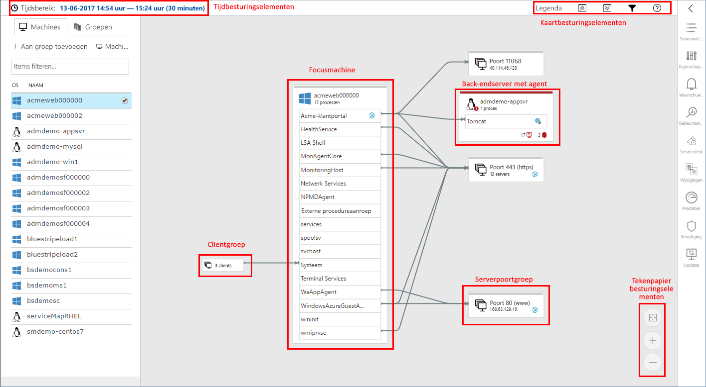
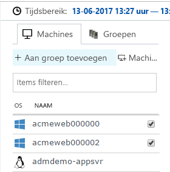
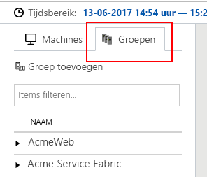
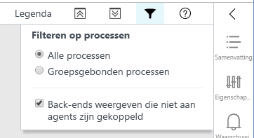
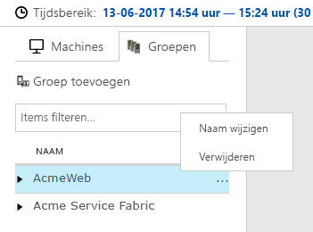
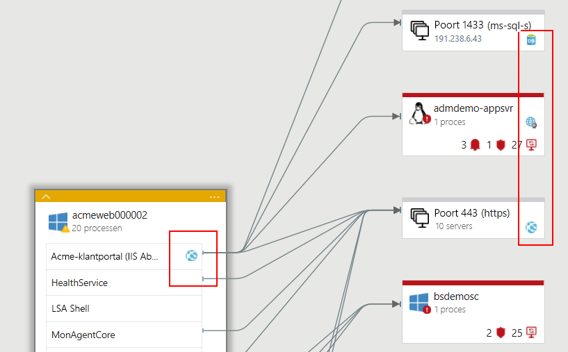
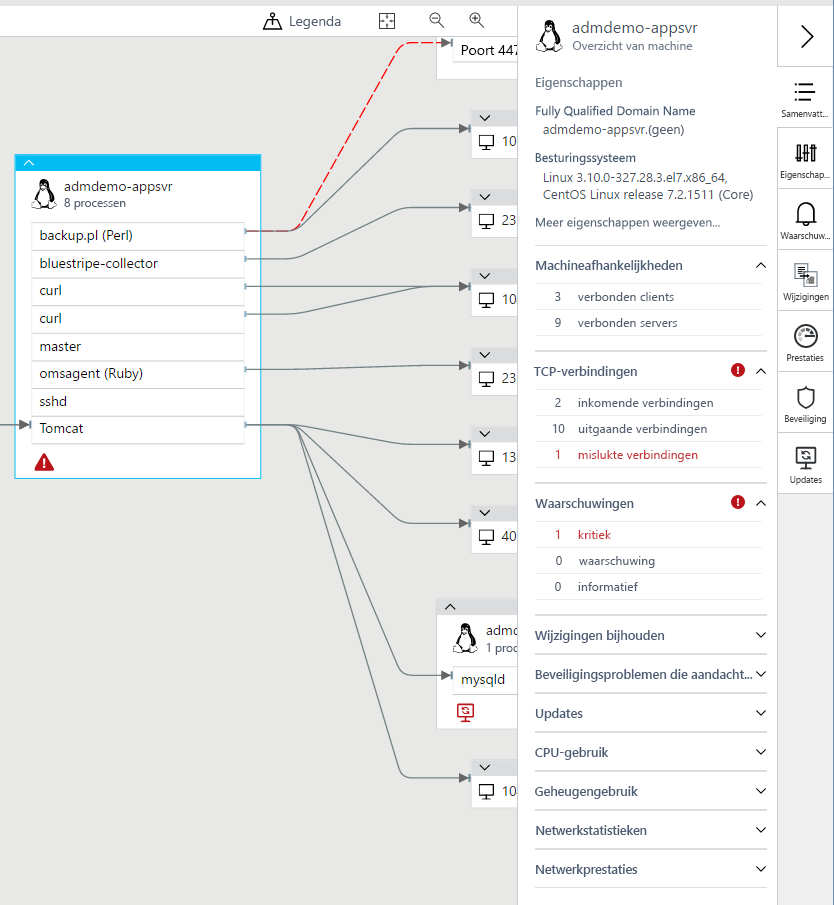
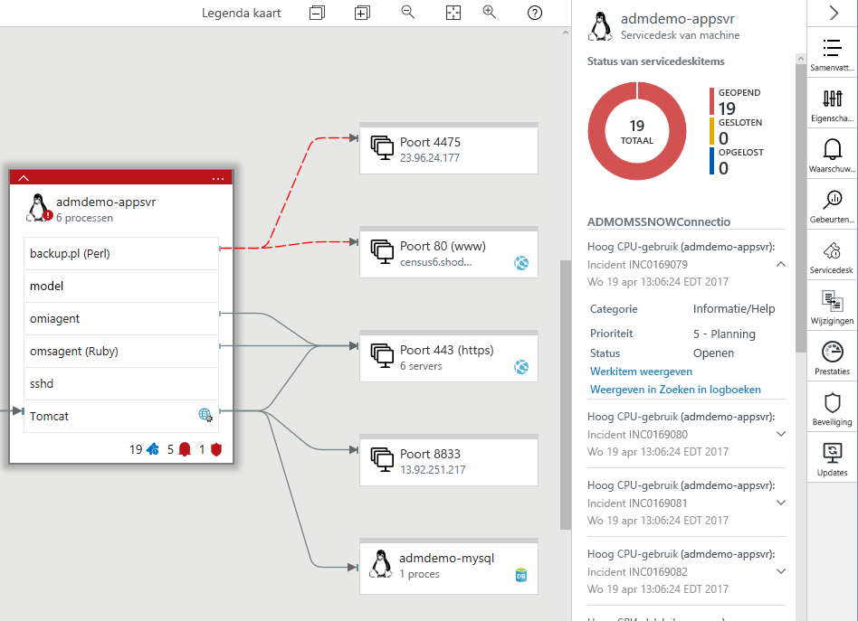
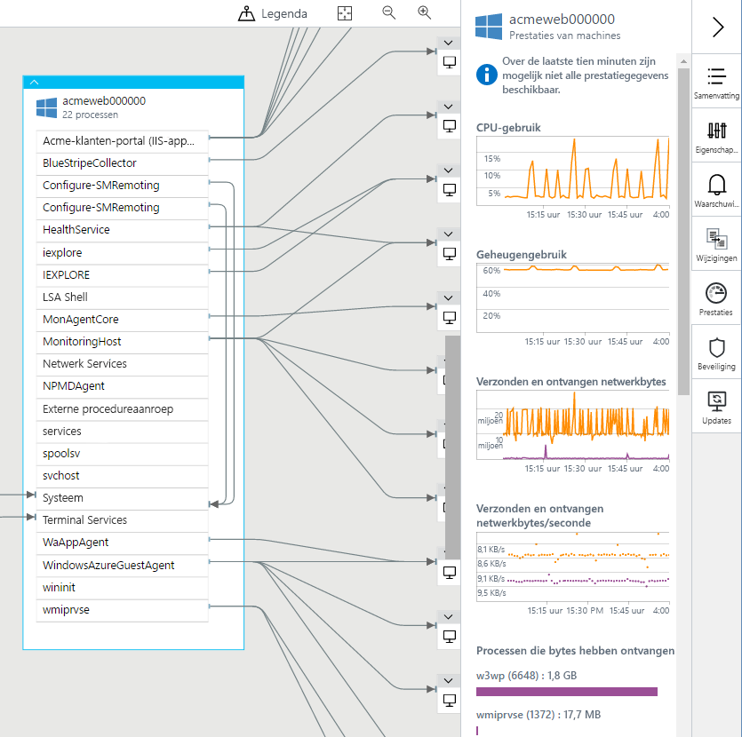

# <a name="using-service-map-solution-in-azure"></a>Servicetoewijzing gebruiken in Azure

Serviceoverzicht ontdekt automatisch toepassingsonderdelen op Windows- en Linux-systemen en wijst de communicatie tussen services toe. Met Servicetoewijzing kunt u uw servers weergeven op de manier zoals u ze ziet: als onderling verbonden systemen die essentiële services leveren. Servicetoewijzing toont verbindingen tussen servers, processen, latentie van binnenkomende en uitgaande verbindingen en poorten voor elke via TCP verbonden architectuur. Na installatie van een agent is er geen verdere configuratie vereist.

In dit artikel worden de details van onboarding en het gebruik van Service Map beschreven. Zie Overzicht van [azure monitor voor VM's inschakelen](vminsights-enable-overview.md#prerequisites)voor informatie over het configureren van de vereisten voor deze oplossing. Om samen te vatten, heb je het volgende nodig:

* Een Log Analytics-werkruimte om deze oplossing in te schakelen.

* De loganalytics-agent die is geïnstalleerd op de Windows-computer of Linux-server die is geconfigureerd om dezelfde werkruimte te rapporteren waarmee u de oplossing hebt ingeschakeld.

* De afhankelijkheidsagent die is geïnstalleerd op de Windows-computer of Linux-server.

>[!NOTE]
>Als u Service Map al hebt geïmplementeerd, u nu ook uw kaarten bekijken in Azure Monitor voor VM's, die extra functies bevatten om de VM-status en -prestaties te controleren. Zie overzicht [van Azure Monitor voor VM's voor](../../azure-monitor/insights/vminsights-overview.md)meer informatie. Zie de volgende [veelgestelde vragen voor](../faq.md#azure-monitor-for-vms)meer informatie over de verschillen tussen de functie Servicemap en Azure Monitor for VMs Map.

## <a name="sign-in-to-azure"></a>Aanmelden bij Azure

Meld u aan bij [https://portal.azure.com](https://portal.azure.com)de Azure-portal op .

## <a name="enable-service-map"></a>Servicekaart inschakelen

1. Schakel de Service Map-oplossing in vanuit de [Azure-marktplaats](https://azuremarketplace.microsoft.com/marketplace/apps/Microsoft.ServiceMapOMS?tab=Overview) of met behulp van het proces dat is beschreven in [Bewakingsoplossingen toevoegen vanuit de Galerie Oplossingen](solutions.md).
1. [Installeer de afhankelijkheidsagent op Windows](vminsights-enable-hybrid-cloud.md#install-the-dependency-agent-on-windows) of [Installeer de afhankelijkheidsagent op Linux](vminsights-enable-hybrid-cloud.md#install-the-dependency-agent-on-linux) op elke computer waar u gegevens wilt opvragen. De agent voor afhankelijkheden kan verbindingen met computers in de directe nabijheid controleren, zodat er wellicht geen agent op elke computer nodig is.

U opent Servicemap in de Azure-portal vanuit uw Log Analytics-werkruimte en selecteert de **optieoplossingen** in het linkerdeelvenster.<br><br> Oplossingen in werkruimte .<br> Selecteer **servicemap(workspaceName)** en klik in de overzichtspagina Servicemap oplossing in de overzichtstegel Servicemap.<br><br> servicekaart .

## <a name="use-cases-make-your-it-processes-dependency-aware"></a>Use cases: Maak uw IT-processen afhankelijkheidbewust

### <a name="discovery"></a>Detectie

Servicemap bouwt automatisch een algemene referentiekaart van afhankelijkheden voor uw servers, processen en services van derden. Het detecteert en brengt alle TCP-afhankelijkheden in kaart, identificeert verrassingsverbindingen, externe systemen waarvan u afhankelijk bent en afhankelijkheden van traditionele donkere gebieden van uw netwerk, zoals Active Directory. Servicemap detecteert mislukte netwerkverbindingen die uw beheerde systemen proberen te maken, zodat u potentiële foutconfiguratie van de server, serviceuitval en netwerkproblemen identificeren.

### <a name="incident-management"></a>Incidentbeheer

Service Map helpt het giswerk van probleemisolatie te elimineren door u te laten zien hoe systemen zijn verbonden en elkaar beïnvloeden. Naast het identificeren van mislukte verbindingen, helpt het bij het identificeren van verkeerd geconfigureerde load balancers, verrassende of overmatige belasting van kritieke services en malafide clients, zoals ontwikkelaarsmachines die met productiesystemen praten. Door geïntegreerde workflows te gebruiken met Change Tracking, u ook zien of een wijzigingsgebeurtenis op een back-endmachine of -service de hoofdoorzaak van een incident verklaart.

### <a name="migration-assurance"></a>Migratiezekerheid

Door Servicemap te gebruiken, u Azure-migraties effectief plannen, versnellen en valideren, waardoor er niets achterblijft en verrassingsonderbrekingen zich niet voordoen. U alle onderling afhankelijke systemen ontdekken die samen moeten migreren, de systeemconfiguratie en -capaciteit moeten beoordelen en bepalen of een lopend systeem nog steeds gebruikers bedient of een kandidaat is voor ontmanteling in plaats van migratie. Nadat de verhuizing is voltooid, u controleren of de taak en identiteit van de client zijn om te controleren of testsystemen en klanten verbinding maken. Als uw subnetplanning en firewalldefinities problemen hebben, wijzen mislukte verbindingen in servicekaartkaarten u naar de systemen die connectiviteit nodig hebben.

### <a name="business-continuity"></a>Bedrijfscontinuïteit

Als u Azure Site Recovery gebruikt en hulp nodig hebt bij het definiëren van de herstelreeks voor uw toepassingsomgeving, kan Service Map u automatisch laten zien hoe systemen op elkaar vertrouwen om ervoor te zorgen dat uw herstelplan betrouwbaar is. Door een kritieke server of groep te kiezen en de clients te bekijken, u bepalen welke front-endsystemen u moet herstellen nadat de server is hersteld en beschikbaar is. Omgekeerd, door te kijken naar de back-end afhankelijkheden van kritieke servers, u bepalen welke systemen u moet herstellen voordat uw focussystemen worden hersteld.

### <a name="patch-management"></a>Patchbeheer

Service Map verbetert uw gebruik van de System Update Assessment door u te laten zien welke andere teams en servers afhankelijk zijn van uw service, zodat u ze van tevoren op de hoogte stellen voordat u uw systemen voor patching neerhaalt. Service Map verbetert ook patchbeheer door u te laten zien of uw services beschikbaar en goed zijn verbonden nadat ze zijn gepatcht en opnieuw zijn opgestart.

## <a name="mapping-overview"></a>Overzicht van toewijzing

Servicemap-medewerkers verzamelen informatie over alle met TCP verbonden processen op de server waar ze zijn geïnstalleerd en details over de inkomende en uitgaande verbindingen voor elk proces.

In de lijst in het linkerdeelvenster u machines of groepen selecteren met servicemapagents om hun afhankelijkheden over een bepaald tijdsbereik te visualiseren. Machineafhankelijkheidskaarten richten zich op een specifieke machine en tonen alle machines die directe TCP-clients of servers van die machine zijn.  Machine Group-kaarten tonen sets van servers en hun afhankelijkheden.



Machines kunnen in de kaart worden uitgebreid om de lopende procesgroepen en -processen met actieve netwerkverbindingen tijdens het geselecteerde tijdsbereik weer te geven. Wanneer een externe machine met een Service Map-agent wordt uitgebreid om procesdetails weer te geven, worden alleen die processen weergegeven die met de focusmachine communiceren. De telling van agentless front-end machines die verbinding maken met de focus machine is aangegeven aan de linkerkant van de processen waarmee ze verbinding maken. Als de focusmachine een verbinding maakt met een back-endmachine die geen agent heeft, wordt de back-endserver opgenomen in een serverpoortgroep, samen met andere verbindingen met hetzelfde poortnummer.

Standaard worden in servicekaartkaarten de laatste 30 minuten aan afhankelijkheidsgegevens weergegeven. Door de tijdbesturingselementen linksboven te gebruiken, u kaarten opvragen voor historische tijdsbereiken van maximaal een uur om te laten zien hoe afhankelijkheden er in het verleden uitzagen (bijvoorbeeld tijdens een incident of voordat er een wijziging plaatsvond). Servicemapgegevens worden gedurende 30 dagen opgeslagen in betaalde werkruimten en gedurende 7 dagen in gratis werkruimten.

## <a name="status-badges-and-border-coloring"></a>Statusbadges en randkleuren

Aan de onderkant van elke server in de kaart kan een lijst van status badges overbrengen status informatie over de server. De badges geven aan dat er een aantal relevante informatie voor de server van een van de oplossing integraties. Als u op een badge klikt, brengt u direct de details van de status in het rechterdeelvenster. De momenteel beschikbare statusbadges zijn waarschuwingen, servicedesk, wijzigingen, beveiliging en updates.

Afhankelijk van de ernst van de statusbadges kunnen de randen van het machineknooppunt rood (kritiek), geel (waarschuwing) of blauw (informatief) worden gekleurd. De kleur vertegenwoordigt de meest ernstige status van een van de statusbadges. Een grijze rand geeft een knooppunt aan dat geen statusindicatoren heeft.


## <a name="process-groups"></a>Procesgroepen

Procesgroepen combineren processen die zijn gekoppeld aan een gemeenschappelijk product of service in een procesgroep.  Wanneer een machineknooppunt wordt uitgebreid, worden zelfstandige processen weergegeven, samen met procesgroepen.  Als inkomende en uitgaande verbindingen met een proces binnen een procesgroep zijn mislukt, wordt de verbinding weergegeven als mislukt voor de hele procesgroep.

## <a name="machine-groups"></a>Machinegroepen

Met machinegroepen u kaarten zien die gecentreerd zijn rond een set servers, niet slechts één, zodat u alle leden van een toepassing of servercluster met meerdere lagen in één kaart zien.

Gebruikers selecteren welke servers bij elkaar horen in een groep en kiezen een naam voor de groep.  U er vervolgens voor kiezen om de groep met al zijn processen en verbindingen te bekijken, of deze alleen te bekijken met de processen en verbindingen die rechtstreeks betrekking hebben op de andere leden van de groep.


### <a name="creating-a-machine-group"></a>Een machinegroep maken

Als u een groep wilt maken, selecteert u de gewenste machine of machines in de lijst Machines en klikt u op **Toevoegen aan groep**.



Daar u **Nieuw maken** kiezen en de groep een naam geven.


>[!NOTE]
>Machinegroepen zijn beperkt tot 10 servers.

### <a name="viewing-a-group"></a>Een groep bekijken

Zodra u een aantal groepen hebt gemaakt, u deze bekijken door het tabblad Groepen te kiezen.



Selecteer vervolgens de groepsnaam om de kaart voor die machinegroep weer te geven.
 groep De machines die tot de groep behoren, worden in het wit op de kaart beschreven.

Als u de groep uitbreidt, worden de machines vermeld die deel uitmaken van de Machine Group.


### <a name="filter-by-processes"></a>Filteren op processen

U de kaartweergave schakelen tussen het weergeven van alle processen en verbindingen in de groep en alleen de processen die rechtstreeks betrekking hebben op de machinegroep.  De standaardweergave is om alle processen weer te geven.  U de weergave wijzigen door op het filterpictogram boven de kaart te klikken.



Wanneer **Alle processen** zijn geselecteerd, bevat de kaart alle processen en verbindingen op elk van de machines in de groep.


Als u de weergave wijzigt om alleen **met groepen verbonden processen**weer te geven, wordt de kaart beperkt tot alleen die processen en verbindingen die rechtstreeks zijn verbonden met andere machines in de groep, waardoor een vereenvoudigde weergave wordt gemaakt.


 
### <a name="adding-machines-to-a-group"></a>Machines toevoegen aan een groep

Als u machines aan een bestaande groep wilt toevoegen, schakelt u de selectievakjes in naast de gewenste machines en klikt u op **Toevoegen aan groep**.  Kies vervolgens de groep waaraan u de machines wilt toevoegen.
 
### <a name="removing-machines-from-a-group"></a>Machines uit een groep verwijderen

Vouw in de lijst met groepen de groepsnaam uit om de machines in de machinegroep weer te geven.  Klik vervolgens op het menu ellipsen naast de machine die u wilt verwijderen en kies **Verwijderen**.


### <a name="removing-or-renaming-a-group"></a>Een groep verwijderen of de naam van een groep wijzigen

Klik op het menu ellipsen naast de groepsnaam in de groepslijst.




## <a name="role-icons"></a>Rolpictogrammen

Bepaalde processen vervullen bepaalde rollen op machines: webservers, toepassingsservers, database, enzovoort. Service Map annoteert proces- en machinevakken met rolpictogrammen om in één oogopslag de rol te identificeren die een proces of server speelt.

| Pictogram Rol | Beschrijving |
|:--|:--|
|  | Webserver |
|  | Toepassingsserver |
|  | Databaseserver |
|  | LDAP-server |
|  | SMB-server |




## <a name="failed-connections"></a>Mislukte verbindingen

Mislukte verbindingen worden weergegeven in servicekaartkaarten voor processen en computers, met een onderbroken rode lijn die aangeeft dat een clientsysteem een proces of poort niet bereikt. Mislukte verbindingen worden gerapporteerd vanuit elk systeem met een geïmplementeerde ServiceMap-agent als dat systeem de verbinding probeert te maken. Service Map meet dit proces door TCP-sockets te observeren die geen verbinding tot stand brengen. Deze fout kan het gevolg zijn van een firewall, een verkeerde configuratie in de client of server of dat een externe service niet beschikbaar is.


Het begrijpen van mislukte verbindingen kan helpen bij het oplossen van problemen, migratievalidatie, beveiligingsanalyse en algemeen architectuurbegrip. Mislukte verbindingen zijn soms onschadelijk, maar ze wijzen vaak direct op een probleem, zoals een failover-omgeving die plotseling onbereikbaar wordt, of twee toepassingslagen die niet kunnen praten na een cloudmigratie.

## <a name="client-groups"></a>Clientgroepen

Clientgroepen zijn vakken op de kaart die clientmachines vertegenwoordigen die geen afhankelijkheidsagents hebben. Eén clientgroep vertegenwoordigt de clients voor een individueel proces of machine.


Als u de IP-adressen van de servers in een clientgroep wilt bekijken, selecteert u de groep. De inhoud van de groep wordt weergegeven in het deelvenster **Eigenschappen van clientgroep.**


## <a name="server-port-groups"></a>Serverpoortgroepen

Serverpoortgroepen zijn vakken die serverpoorten vertegenwoordigen op servers die geen afhankelijkheidsagents hebben. Het vak bevat de serverpoort en een telling van het aantal servers met verbindingen met die poort. Vouw het vak uit om de afzonderlijke servers en verbindingen te bekijken. Als er slechts één server in het vak is, wordt de naam of het IP-adres weergegeven.


## <a name="context-menu"></a>Contextmenu

Als u op de ellips klikt (...) rechtsboven in een server, wordt het contextmenu voor die server weergegeven.


### <a name="load-server-map"></a>Serverkaart laden

Als u op **Load Server Map** klikt, gaat u naar een nieuwe kaart met de geselecteerde server als de nieuwe focusmachine.

### <a name="show-self-links"></a>Zelfkoppelingen weergeven

Als u op **Zelfkoppelingen weergeven** klikt, wordt het serverknooppunt opnieuw gestart, inclusief alle zelfkoppelingen, namelijk TCP-verbindingen die beginnen en eindigen op processen binnen de server. Als zelfkoppelingen worden weergegeven, wordt de menuopdracht gewijzigd in **Zelfkoppelingen verbergen,** zodat u deze uitschakelen.

## <a name="computer-summary"></a>Computeroverzicht

Het deelvenster **Machineoverzicht** bevat een overzicht van het besturingssysteem van een server, het aantal afhankelijkheidsgegevens en gegevens van andere oplossingen. Dergelijke gegevens omvatten prestatiestatistieken, servicedesktickets, wijzigingstracking, beveiliging en updates.



## <a name="computer-and-process-properties"></a>Computer- en proceseigenschappen

Wanneer u door een servicekaartnavigeert, u machines en processen selecteren om extra context te krijgen over hun eigenschappen. Machines bieden informatie over DNS-naam, IPv4-adressen, CPU- en geheugencapaciteit, VM-type, besturingssysteem en -versie, de laatste herstarttijd en de ID's van hun OMS- en ServiceMap-agents.


U procesgegevens verzamelen uit metagegevens van het besturingssysteem over lopende processen, waaronder procesnaam, procesbeschrijving, gebruikersnaam en domein (op Windows), bedrijfsnaam, productnaam, productversie, werkmap, opdrachtregel en proces begintijd.


Het deelvenster **Procesoverzicht** bevat aanvullende informatie over de connectiviteit van het proces, inclusief de gebonden poorten, inkomende en uitgaande verbindingen en mislukte verbindingen.


## <a name="alerts-integration"></a>Integratie met waarschuwingen

Servicemap integreert met Azure Alerts om ontslagen waarschuwingen voor de geselecteerde server in het geselecteerde tijdsbereik weer te geven. De server geeft een pictogram weer als er huidige waarschuwingen zijn en in het deelvenster **Machinewaarschuwingen** worden de waarschuwingen weergegeven.


Als u Service Map wilt inschakelen om relevante waarschuwingen weer te geven, maakt u een waarschuwingsregel die wordt geactiveerd voor een specifieke computer. Ga als u op de juiste waarschuwingen:
- Een clausule opnemen om te groeperen op computer (bijvoorbeeld **op Computerinterval 1 minuut).**
- Kies ervoor om te waarschuwen op basis van metrische meting.

## <a name="log-events-integration"></a>Integratie van loggebeurtenissen

Servicemap integreert met Log Search om een aantal beschikbare logboekgebeurtenissen voor de geselecteerde server tijdens het geselecteerde tijdsbereik weer te geven. U op een rij in de lijst met gebeurtenistellingen klikken om naar Logboekzoeken te springen en de afzonderlijke logboekgebeurtenissen te bekijken.


## <a name="service-desk-integration"></a>Service Desk integratie

Servicemap-integratie met de IT Service Management Connector is automatisch wanneer beide oplossingen zijn ingeschakeld en geconfigureerd in uw Log Analytics-werkruimte. De integratie in Service Map heeft het label 'Service Desk'. Zie [ITSM-werkitems centraal beheren met IT Service Management Connector](https://docs.microsoft.com/azure/log-analytics/log-analytics-itsmc-overview)voor meer informatie.

In het deelvenster **Machine Service Desk** worden alle IT-servicebeheergebeurtenissen voor de geselecteerde server in het geselecteerde tijdsbereik weergegeven. De server geeft een pictogram weer als er huidige items zijn en in het deelvenster Machine Service Desk worden deze weergegeven.



Als u het item in uw verbonden ITSM-oplossing wilt openen, klikt u op **Werkitem weergeven**.

Als u de details van het item wilt weergeven in Zoeken bij logboek, klikt u op **Weergeven in Logboekzoeken**.
Verbindingsstatistieken worden geschreven naar twee nieuwe tabellen in Log Analytics 

## <a name="change-tracking-integration"></a>Integratie bij het bijhouden van wijzigingen

Servicemap-integratie met Change Tracking is automatisch wanneer beide oplossingen zijn ingeschakeld en geconfigureerd in uw Log Analytics-werkruimte.

In het venster **Machinechange Tracking** worden alle wijzigingen weergegeven, met de meest recente eerste, samen met een koppeling om in te zoomen om te zoeken naar aanvullende details.


De volgende afbeelding is een gedetailleerde weergave van een gebeurtenis ConfigurationChange die u mogelijk ziet nadat u **Weergeven in Logboekanalyse hebt geselecteerd.**


## <a name="performance-integration"></a>Prestatie-integratie

In het deelvenster **Machineprestaties** worden standaardprestatiestatistieken voor de geselecteerde server weergegeven. De statistieken omvatten CPU-gebruik, geheugengebruik, verzonden en ontvangen netwerkbytes en een lijst met de belangrijkste processen per verzonden en ontvangen netwerkbytes.



Als u prestatiegegevens wilt zien, moet u mogelijk [de juiste prestatiemeteritems van Log Analytics inschakelen.](https://docs.microsoft.com/azure/log-analytics/log-analytics-data-sources-performance-counters)  De tellers die u wilt inschakelen:

Windows:
- Processor(*)\\% processortijd
- Memory\\% Committed Bytes In Use
- Verzonden netwerkadapter(*)\\Verzonden per seconde
- Ontvangen bytes per\\seconde van netwerkadapter(*)

Linux:
- Processor(*)\\% processortijd
- Geheugen(*)\\% gebruikt geheugen
- Verzonden netwerkadapter(*)\\Verzonden per seconde
- Ontvangen bytes per\\seconde van netwerkadapter(*)

Om de netwerkprestatiegegevens te krijgen, moet u ook de Wire Data 2.0-oplossing in uw werkruimte hebben ingeschakeld.
 
## <a name="security-integration"></a>Beveiligingsintegratie

Servicemap-integratie met Beveiliging en Audit is automatisch wanneer beide oplossingen zijn ingeschakeld en geconfigureerd in uw Log Analytics-werkruimte.

In het deelvenster **Machinebeveiliging** worden gegevens van de beveiligings- en auditoplossing voor de geselecteerde server weergegeven. In het deelvenster vindt u een overzicht van eventuele openstaande beveiligingsproblemen voor de server tijdens het geselecteerde tijdsbereik. Als u op een van de beveiligingsproblemen klikt, wordt in een logboekzoekopdracht naar informatie over deze opties inzoomen.


## <a name="updates-integration"></a>Integratie bij werken

Servicemap-integratie met UpdateManagement is automatisch wanneer beide oplossingen zijn ingeschakeld en geconfigureerd in uw Log Analytics-werkruimte.

In het deelvenster **Machine-updates** worden gegevens uit de oplossing Updatebeheer voor de geselecteerde server weergegeven. In het deelvenster vindt u een overzicht van eventuele ontbrekende updates voor de server tijdens het geselecteerde tijdsbereik.


## <a name="log-analytics-records"></a>Log Analytics-records

ServiceMap-computer- en procesvoorraadgegevens zijn beschikbaar voor [zoeken](../../azure-monitor/log-query/log-query-overview.md) in Log Analytics. U deze gegevens toepassen op scenario's zoals migratieplanning, capaciteitsanalyse, detectie en probleemoplossing voor prestaties op aanvraag.

Voor elke unieke computer en elk proces wordt één record per uur gegenereerd, naast de records die worden gegenereerd wanneer een proces of computer wordt gestart of aan de servicekaart is geënterd. Deze records hebben de eigenschappen in de volgende tabellen. De velden en waarden in de ServiceMapComputer_CL gebeurtenissen worden toegewezen aan velden van de machinebron in de API van ServiceMap Azure Resource Manager. De velden en waarden in de ServiceMapProcess_CL gebeurtenissen worden toegewezen aan de velden van de procesbron in de API van ServiceMap Azure Resource Manager. Het veld ResourceName_s komt overeen met het naamveld in de bijbehorende Resource Manager-bron. 

>[!NOTE]
>Naarmate de functies van servicekaart toenemen, kunnen deze velden worden gewijzigd.

Er zijn intern gegenereerde eigenschappen die u gebruiken om unieke processen en computers te identificeren:

- Computer: gebruik *ResourceId* of *ResourceName_s* om een computer in een Log Analytics-werkruimte op unieke wijze te identificeren.
- Proces: Gebruik *ResourceId* om een proces binnen een Log Analytics-werkruimte op unieke wijze te identificeren. *ResourceName_s* is uniek in de context van de machine waarop het proces draait (MachineResourceName_s) 

Omdat er meerdere records kunnen bestaan voor een opgegeven proces en computer in een opgegeven tijdsbereik, kunnen query's meer dan één record retourneren voor dezelfde computer of proces. Als u alleen de meest recente record wilt opnemen, voegt u '| dedup ResourceId" aan de query.

### <a name="connections"></a>Verbindingen

Verbindingsstatistieken worden geschreven naar een nieuwe tabel in Log Analytics - VMConnection. In deze tabel vindt u informatie over de verbindingen voor een machine (inkomende en uitgaande). Verbindingsstatistieken worden ook weergegeven met API's die de middelen bieden om een specifieke statistiek te verkrijgen tijdens een tijdvenster.  TCP-verbindingen die het gevolg zijn van het accepteren op een luistersocket zijn binnenkomend, terwijl verbindingen die worden gemaakt door verbinding te maken met een bepaald IP en een bepaalde poort uitgaand zijn. De richting van een verbinding wordt weergegeven door de eigenschap Richting, die kan worden ingesteld op **binnenkomend** of **uitgaand**. 

Records in deze tabellen worden gegenereerd op gegevens die zijn gerapporteerd door de afhankelijkheidsagent. Elke record vertegenwoordigt een observatie over een tijdsinterval van één minuut. De eigenschap TimeGenerated geeft het begin van het tijdsinterval aan. Elke record bevat informatie om de betreffende entiteit te identificeren, dat wil zeggen, verbinding of poort, evenals statistieken die aan die entiteit zijn gekoppeld. Momenteel wordt alleen netwerkactiviteit gerapporteerd die optreedt met TCP via IPv4.

Om kosten en complexiteit te beheren, vertegenwoordigen verbindingsrecords geen afzonderlijke fysieke netwerkverbindingen. Meerdere fysieke netwerkverbindingen worden gegroepeerd in een logische verbinding, die vervolgens wordt weerspiegeld in de desbetreffende tabel.  Records in *de tabel VMConnection* vertegenwoordigen dus een logische groepering en niet de afzonderlijke fysieke verbindingen die worden waargenomen. Fysieke netwerkverbinding die dezelfde waarde deelt voor de volgende kenmerken gedurende een bepaald interval van één minuut, wordt samengevoegd tot één logische record in *VMConnection*. 

| Eigenschap | Beschrijving |
|:--|:--|
| `Direction` |Richting van de verbinding, waarde is *binnenkomend* of *uitgaand* |
| `Machine` |De computer FQDN |
| `Process` |Identiteit van proces of groepen processen, initiëren/accepteren van de verbinding |
| `SourceIp` |IP-adres van de bron |
| `DestinationIp` |IP-adres van de bestemming |
| `DestinationPort` |Havennummer van de bestemming |
| `Protocol` |Protocol gebruikt voor de verbinding.  Waarden is *tcp*. |

Om rekening te houden met de impact van de groepering, wordt informatie over het aantal gegroepeerde fysieke verbindingen verstrekt in de volgende eigenschappen van de record:

| Eigenschap | Beschrijving |
|:--|:--|
| `LinksEstablished` |Het aantal fysieke netwerkverbindingen dat is gemaakt tijdens het rapportagetijdvenster |
| `LinksTerminated` |Het aantal fysieke netwerkverbindingen dat is beëindigd tijdens het venster voor rapportagetijd |
| `LinksFailed` |Het aantal fysieke netwerkverbindingen dat is mislukt tijdens het venster rapportagetijd. Deze informatie is momenteel alleen beschikbaar voor uitgaande verbindingen. |
| `LinksLive` |Het aantal fysieke netwerkverbindingen dat aan het einde van het rapportagetijdvenster open was|

#### <a name="metrics"></a>Metrische gegevens

Naast de statistieken voor het aantal verbindingen wordt informatie over de hoeveelheid verzonden en ontvangen gegevens op een bepaalde logische verbinding of netwerkpoort ook opgenomen in de volgende eigenschappen van de record:

| Eigenschap | Beschrijving |
|:--|:--|
| `BytesSent` |Totaal aantal bytes dat is verzonden tijdens het venster voor rapportagetijd |
| `BytesReceived` |Totaal aantal bytes dat is ontvangen tijdens het rapportagetijdvenster |
| `Responses` |Het aantal reacties dat tijdens het rapportagetijdvenster is waargenomen. 
| `ResponseTimeMax` |De grootste responstijd (milliseconden) die tijdens het rapportagetijdvenster wordt waargenomen.  Als er geen waarde is, is de eigenschap leeg.|
| `ResponseTimeMin` |De kleinste responstijd (milliseconden) die tijdens het rapportagetijdvenster wordt waargenomen.  Als er geen waarde is, is de eigenschap leeg.|
| `ResponseTimeSum` |De som van alle responstijden (milliseconden) waargenomen tijdens het rapportagetijdvenster.  Als er geen waarde is, is de eigenschap leeg|

Het derde type gegevens dat wordt gerapporteerd, is de reactietijd - hoe lang besteedt een beller wachten d.m.v. een verzoek dat via een verbinding wordt verzonden en waarop het externe eindpunt moet reageren. De gerapporteerde reactietijd is een schatting van de werkelijke responstijd van het onderliggende toepassingsprotocol. Het wordt berekend met behulp van heuristiek op basis van de observatie van de stroom van gegevens tussen de bron en het doel einde van een fysieke netwerkverbinding. Conceptueel is het het verschil tussen het moment dat de laatste byte van een aanvraag de afzender verlaat en het tijdstip waarop de laatste byte van het antwoord naar binnen komt. Deze twee tijdstempels worden gebruikt om aanvraag- en antwoordgebeurtenissen op een bepaalde fysieke verbinding af te definiëren. Het verschil tussen hen vertegenwoordigt de reactietijd van één aanvraag. 

In deze eerste versie van deze functie is ons algoritme een benadering die met wisselend succes kan werken, afhankelijk van het werkelijke toepassingsprotocol dat wordt gebruikt voor een bepaalde netwerkverbinding. De huidige aanpak werkt bijvoorbeeld goed voor op aanvragen gebaseerde protocollen zoals HTTP(S), maar werkt niet met protocollen op basis van een enkele reis of berichtenwachtrij.

Hier zijn een aantal belangrijke punten te overwegen:

1. Als een proces verbindingen op hetzelfde IP-adres accepteert, maar via meerdere netwerkinterfaces, wordt een afzonderlijke record voor elke interface gerapporteerd. 
2. Records met wildcard IP bevatten geen activiteit. Ze zijn opgenomen om het feit te vertegenwoordigen dat een poort op de machine open staat voor binnenkomend verkeer.
3. Om de verbositeit en het gegevensvolume te verminderen, worden records met wildcard-IP weggelaten wanneer er een overeenkomende record (voor hetzelfde proces, poort en protocol) met een specifiek IP-adres is. Wanneer een IP-record met jokertekens wordt weggelaten, wordt de eigenschap IsWildcardBind-record met het specifieke IP-adres ingesteld op 'True' om aan te geven dat de poort wordt blootgesteld via elke interface van de rapportagemachine.
4. Poorten die alleen op een specifieke interface zijn gebonden, hebben IsWildcardBind ingesteld op 'False'.

#### <a name="naming-and-classification"></a>Naamgeving en classificatie

Voor het gemak is het IP-adres van het externe uiteinde van een verbinding opgenomen in de eigenschap RemoteIp. Voor binnenkomende verbindingen is RemoteIp hetzelfde als SourceIp, terwijl het voor uitgaande verbindingen hetzelfde is als DestinationIp. De eigenschap RemoteDnsCanonicalNames vertegenwoordigt de DNS-canonieke namen die door de machine voor RemoteIp zijn gerapporteerd. De eigenschappen RemoteDnsQuestions en RemoteClassification zijn gereserveerd voor toekomstig gebruik. 

#### <a name="geolocation"></a>Geolocatie

*VMConnection* bevat ook geolocatiegegevens voor het externe uiteinde van elke verbindingsrecord in de volgende eigenschappen van de record: 

| Eigenschap | Beschrijving |
|:--|:--|
| `RemoteCountry` |De naam van het land/regio dat RemoteIp host.  Verenigde *Staten* bijvoorbeeld |
| `RemoteLatitude` |De geolocatie breedtegraad.  Bijvoorbeeld, *47.68* |
| `RemoteLongitude` |De geolocatie longitude.  *Bijvoorbeeld -122,12* |

#### <a name="malicious-ip"></a>Kwaadaardig IP

Elke remoteip-eigenschap in *de VMConnection-tabel* wordt gecontroleerd op basis van een set IP's met bekende schadelijke activiteiten. Als de RemoteIp als kwaadaardig wordt geïdentificeerd, worden de volgende eigenschappen ingevuld (ze zijn leeg, wanneer het IP niet als kwaadaardig wordt beschouwd) in de volgende eigenschappen van de record:

| Eigenschap | Beschrijving |
|:--|:--|
| `MaliciousIp` |Het RemoteIp-adres |
| `IndicatorThreadType` |Bedreiging indicator gedetecteerd is een van de volgende waarden, *Botnet*, *C2*, *CryptoMining*, *Darknet*, *DDos*, *MaliciousUrl*, *Malware*, *Phishing*, *Proxy*, *PUA*, *Watchlist*.   |
| `Description` |Beschrijving van de waargenomen bedreiging. |
| `TLPLevel` |Traffic Light Protocol (TLP) Level is een van de gedefinieerde waarden, *Wit*, *Groen*, *Amber*, *Red*. |
| `Confidence` |Waarden zijn *0 – 100*. |
| `Severity` |Waarden zijn *0 – 5*, waar *5* is de meest ernstige en *0* is helemaal niet ernstig. Standaardwaarde is *3*.  |
| `FirstReportedDateTime` |De eerste keer dat de provider de indicator rapporteerde. |
| `LastReportedDateTime` |De laatste keer dat de indicator werd gezien door Interflow. |
| `IsActive` |Geeft aan dat indicatoren worden gedeactiveerd met de waarde *Waar* of *False.* |
| `ReportReferenceLink` |Links naar rapporten met betrekking tot een bepaalde waarneembare. |
| `AdditionalInformation` |Biedt aanvullende informatie, indien van toepassing, over de waargenomen dreiging. |

### <a name="servicemapcomputer_cl-records"></a>ServiceMapComputer_CL records

Records met een type *ServiceMapComputer_CL* voorraadgegevens voor servers met Service Map-agents bevatten. Deze records hebben de eigenschappen in de volgende tabel:

| Eigenschap | Beschrijving |
|:--|:--|
| `Type` | *ServiceMapComputer_CL* |
| `SourceSystem` | *OpsManager* |
| `ResourceId` | De unieke id voor een machine in de werkruimte |
| `ResourceName_s` | De unieke id voor een machine in de werkruimte |
| `ComputerName_s` | De computer FQDN |
| `Ipv4Addresses_s` | Een lijst met de IPv4-adressen van de server |
| `Ipv6Addresses_s` | Een lijst met de IPv6-adressen van de server |
| `DnsNames_s` | Een array met DNS-namen |
| `OperatingSystemFamily_s` | Windows of Linux |
| `OperatingSystemFullName_s` | De volledige naam van het besturingssysteem  |
| `Bitness_s` | De bitness van de machine (32-bits of 64-bits)  |
| `PhysicalMemory_d` | Het fysieke geheugen in MB |
| `Cpus_d` | Het aantal CPU's |
| `CpuSpeed_d` | De CPU-snelheid in MHz|
| `VirtualizationState_s` | *onbekend,* *fysiek,* *virtueel,* *hypervisor* |
| `VirtualMachineType_s` | *hyperv*, *vmware*, enzovoort |
| `VirtualMachineNativeMachineId_g` | De VM-id zoals toegewezen door de hypervisor |
| `VirtualMachineName_s` | De naam van de VM |
| `BootTime_t` | De opstarttijd |

### <a name="servicemapprocess_cl-type-records"></a>ServiceMapProcess_CL Type records

Records met een type *ServiceMapProcess_CL* voorraadgegevens voor met TCP verbonden processen op servers met Service Map-agents bevatten. Deze records hebben de eigenschappen in de volgende tabel:

| Eigenschap | Beschrijving |
|:--|:--|
| `Type` | *ServiceMapProcess_CL* |
| `SourceSystem` | *OpsManager* |
| `ResourceId` | De unieke id voor een proces binnen de werkruimte |
| `ResourceName_s` | De unieke id voor een proces binnen de machine waarop deze wordt uitgevoerd|
| `MachineResourceName_s` | De resourcenaam van de machine |
| `ExecutableName_s` | De naam van het uitvoerbare proces |
| `StartTime_t` | De begintijd van de procespool |
| `FirstPid_d` | De eerste PID in de procespool |
| `Description_s` | De procesbeschrijving |
| `CompanyName_s` | De naam van het bedrijf |
| `InternalName_s` | De interne naam |
| `ProductName_s` | De naam van het product |
| `ProductVersion_s` | De productversie |
| `FileVersion_s` | De bestandsversie |
| `CommandLine_s` | De opdrachtregel |
| `ExecutablePath _s` | Het pad naar het uitvoerbare bestand |
| `WorkingDirectory_s` | De werkmap |
| `UserName` | De rekening waaronder het proces wordt uitgevoerd |
| `UserDomain` | Het domein waaronder het proces wordt uitgevoerd |

## <a name="sample-log-searches"></a>Voorbeeldzoekopdrachten in logboeken

### <a name="list-all-known-machines"></a>Alle bekende machines weergeven

ServiceMapComputer_CL | samenvatten arg_max(TimeGenerated, *) door ResourceId

### <a name="list-the-physical-memory-capacity-of-all-managed-computers"></a>Vermeld de fysieke geheugencapaciteit van alle beheerde computers.

ServiceMapComputer_CL | samenvatten arg_max(TimeGenerated, *) door ResourceId | project PhysicalMemory_d, ComputerName_s

### <a name="list-computer-name-dns-ip-and-os"></a>Geef de naam van de computer, DNS, IP en besturingssysteem weer.

ServiceMapComputer_CL | samenvatten arg_max(TimeGenerated, *) door ResourceId | project ComputerName_s, OperatingSystemFullName_s, DnsNames_s, Ipv4Addresses_s

### <a name="find-all-processes-with-sql-in-the-command-line"></a>Alle processen zoeken met 'sql' in de opdrachtregel

ServiceMapProcess_CL | waar CommandLine_s contains_cs "sql" | samenvatten arg_max(TimeGenerated, *) door ResourceId

### <a name="find-a-machine-most-recent-record-by-resource-name"></a>Een machine zoeken (meest recente record) op resourcenaam

zoeken in (ServiceMapComputer_CL) "m-4b9c93f9-bc37-46df-b43c-899ba829e07b" | samenvatten arg_max(TimeGenerated, *) door ResourceId

### <a name="find-a-machine-most-recent-record-by-ip-address"></a>Een machine zoeken (meest recente record) op IP-adres

zoeken in (ServiceMapComputer_CL) "10.229.243.232" | samenvatten arg_max(TimeGenerated, *) door ResourceId

### <a name="list-all-known-processes-on-a-specified-machine"></a>Alle bekende processen op een bepaalde machine weergeven

ServiceMapProcess_CL | waar MachineResourceName_s == "m-559dbcd8-3130-454d-8d1d-f624e57961bc" | samenvatten arg_max(TimeGenerated, *) door ResourceId

### <a name="list-all-computers-running-sql"></a>Alle computers met SQL weergeven

ServiceMapComputer_CL | waar ResourceName_s in ((zoeken in\*\*(ServiceMapProcess_CL) " sql " | onderscheiden MachineResourceName_s)) | duidelijke ComputerName_s

### <a name="list-all-unique-product-versions-of-curl-in-my-datacenter"></a>Alle unieke productversies van curl in mijn datacenter weergeven

ServiceMapProcess_CL | waar ExecutableName_s == "krul" | duidelijke ProductVersion_s

### <a name="create-a-computer-group-of-all-computers-running-centos"></a>Een computergroep maken van alle computers waarop CentOS wordt uitgevoerd

ServiceMapComputer_CL | waar OperatingSystemFullName_s contains_cs "CentOS" | duidelijke ComputerName_s

### <a name="summarize-the-outbound-connections-from-a-group-of-machines"></a>De uitgaande verbindingen van een groep machines samenvatten

```
// the machines of interest
let machines = datatable(m: string) ["m-82412a7a-6a32-45a9-a8d6-538354224a25"];
// map of ip to monitored machine in the environment
let ips=materialize(ServiceMapComputer_CL
| summarize ips=makeset(todynamic(Ipv4Addresses_s)) by MonitoredMachine=ResourceName_s
| mvexpand ips to typeof(string));
// all connections to/from the machines of interest
let out=materialize(VMConnection
| where Machine in (machines)
| summarize arg_max(TimeGenerated, *) by ConnectionId);
// connections to localhost augmented with RemoteMachine
let local=out
| where RemoteIp startswith "127."
| project ConnectionId, Direction, Machine, Process, ProcessName, SourceIp, DestinationIp, DestinationPort, Protocol, RemoteIp, RemoteMachine=Machine;
// connections not to localhost augmented with RemoteMachine
let remote=materialize(out
| where RemoteIp !startswith "127."
| join kind=leftouter (ips) on $left.RemoteIp == $right.ips
| summarize by ConnectionId, Direction, Machine, Process, ProcessName, SourceIp, DestinationIp, DestinationPort, Protocol, RemoteIp, RemoteMachine=MonitoredMachine);
// the remote machines to/from which we have connections
let remoteMachines = remote | summarize by RemoteMachine;
// all augmented connections
(local)
| union (remote)
//Take all outbound records but only inbound records that come from either //unmonitored machines or monitored machines not in the set for which we are computing dependencies.
| where Direction == 'outbound' or (Direction == 'inbound' and RemoteMachine !in (machines))
| summarize by ConnectionId, Direction, Machine, Process, ProcessName, SourceIp, DestinationIp, DestinationPort, Protocol, RemoteIp, RemoteMachine
// identify the remote port
| extend RemotePort=iff(Direction == 'outbound', DestinationPort, 0)
// construct the join key we'll use to find a matching port
| extend JoinKey=strcat_delim(':', RemoteMachine, RemoteIp, RemotePort, Protocol)
// find a matching port
| join kind=leftouter (VMBoundPort 
| where Machine in (remoteMachines) 
| summarize arg_max(TimeGenerated, *) by PortId 
| extend JoinKey=strcat_delim(':', Machine, Ip, Port, Protocol)) on JoinKey
// aggregate the remote information
| summarize Remote=makeset(iff(isempty(RemoteMachine), todynamic('{}'), pack('Machine', RemoteMachine, 'Process', Process1, 'ProcessName', ProcessName1))) by ConnectionId, Direction, Machine, Process, ProcessName, SourceIp, DestinationIp, DestinationPort, Protocol
```

## <a name="rest-api"></a>REST API

Alle server-, proces- en afhankelijkheidsgegevens in ServiceMap zijn beschikbaar via de [Service Map REST API.](https://docs.microsoft.com/rest/api/servicemap/)

## <a name="diagnostic-and-usage-data"></a>Diagnostische en gebruiksgegevens

Microsoft verzamelt automatisch gebruiks- en prestatiegegevens via uw gebruik van de Service Map-service. Microsoft gebruikt deze gegevens om de kwaliteit, beveiliging en integriteit van de Service Map-service te bieden en te verbeteren. Om nauwkeurige en efficiënte probleemoplossingsmogelijkheden te bieden, bevatten de gegevens informatie over de configuratie van uw software, zoals besturingssysteem en versie, IP-adres, DNS-naam en werkstationnaam. Microsoft verzamelt geen namen, adressen of andere contactgegevens.

Zie de [privacyverklaring van Microsoft Online Services](https://go.microsoft.com/fwlink/?LinkId=512132)voor meer informatie over het verzamelen en gebruiken van gegevens.

## <a name="next-steps"></a>Volgende stappen

Meer informatie over [logboekzoekopdrachten](../../azure-monitor/log-query/log-query-overview.md) in Log Analytics om gegevens op te halen die zijn verzameld door Service Map.

## <a name="troubleshooting"></a>Problemen oplossen

Als u problemen hebt met het installeren of uitvoeren van servicekaart, kan deze sectie u helpen. Als u uw probleem nog steeds niet oplossen, neemt u contact op met Microsoft Support.

### <a name="dependency-agent-installation-problems"></a>Installatieproblemen met afhankelijkheidsagent

#### <a name="installer-prompts-for-a-reboot"></a>Installer vraagt om een reboot
De afhankelijkheidsagent vereist *over het algemeen* geen herstart bij installatie of verwijdering. In bepaalde zeldzame gevallen vereist Windows Server echter een reboot om door te gaan met een installatie. Dit gebeurt wanneer een afhankelijkheid, meestal de Microsoft Visual C++ Redistributable-bibliotheek, opnieuw moet worden opgestart vanwege een vergrendeld bestand.

#### <a name="message-unable-to-install-dependency-agent-visual-studio-runtime-libraries-failed-to-install-code--code_number-appears"></a>Bericht 'Kan afhankelijkheidsagent niet installeren: Visual Studio Runtime-bibliotheken kunnen niet worden geïnstalleerd (code = [code_number])" wordt weergegeven

De Microsoft Dependency-agent is gebouwd op de runtime-bibliotheken van Microsoft Visual Studio. U ontvangt een bericht als er een probleem is tijdens de installatie van de bibliotheken. 

De installatieprogramma's voor runtime-bibliotheek maken logboeken in de map %LOCALAPPDATA%\temp. Het bestand `dd_vcredist_arch_yyyymmddhhmmss.log`is , `x86` `amd64` waar *boog* is of en *yyyymmddhhmmss* is de datum en tijd (24-uurs klok) wanneer het logboek werd gemaakt. Het logboek bevat details over het probleem dat de installatie blokkeert.

Het kan handig zijn om eerst de [nieuwste runtime-bibliotheken](https://support.microsoft.com/help/2977003/the-latest-supported-visual-c-downloads) te installeren.

In de volgende tabel worden codenummers en voorgestelde resoluties weergegeven.

| Code | Beschrijving | Oplossing |
|:--|:--|:--|
| 0x17 | Het bibliotheekinstallatieprogramma vereist een Windows-update die niet is geïnstalleerd. | Kijk in het meest recente bibliotheekinstallatielogboek.<br><br>Als een `Windows8.1-KB2999226-x64.msu` verwijzing naar wordt `Error 0x80240017: Failed to execute MSU package,` gevolgd door een regel, hebt u niet de vereisten om KB2999226 te installeren. Volg de instructies in de sectie Vereisten in [Universal C Runtime in](https://support.microsoft.com/kb/2999226) Windows-artikel. Mogelijk moet u Windows Update meerdere keren uitvoeren en opnieuw opstarten om de vereisten te installeren.<br><br>Voer het installatieprogramma van de Microsoft Dependency agent opnieuw uit. |

### <a name="post-installation-issues"></a>Problemen na de installatie

#### <a name="server-doesnt-appear-in-service-map"></a>Server wordt niet weergegeven in servicekaart

Als de installatie van uw afhankelijkheidsagent is geslaagd, maar u uw machine niet ziet in de servicekaartoplossing:
* Is de afhankelijkheidsagent geïnstalleerd? U dit valideren door te controleren of de service is geïnstalleerd en uitgevoerd.<br><br>
**Windows:** Zoek naar de service met de naam **Microsoft Dependency agent**.
**Linux**: Kijk voor het lopende proces **microsoft-afhankelijkheid-agent**.

* Bent u op de [Log Analytics gratis laag?](https://azure.microsoft.com/pricing/details/monitor/) Het gratis abonnement biedt maximaal vijf unieke Service Map-machines. Latere machines worden niet weergegeven in servicekaart, zelfs niet als de voorgaande vijf geen gegevens meer verzenden.

* Verzendt uw server logboek- en perf-gegevens naar Azure Monitor-logboeken? Ga naar Azure Monitor\Logs en voer de volgende query voor uw computer uit: 

    ```kusto
    Usage | where Computer == "admdemo-appsvr" | summarize sum(Quantity), any(QuantityUnit) by DataType
    ```

Heb je een verscheidenheid aan gebeurtenissen in de resultaten? Zijn de gegevens recent? Als dat het zo is, werkt uw Log Analytics-agent correct en communiceert u met de werkruimte. Zo niet, controleer dan de agent op uw machine: [Log Analytics-agent voor Windows-probleemoplossing](../platform/agent-windows-troubleshoot.md) of [Log Analytics-agent voor het oplossen van problemen met Linux.](../platform/agent-linux-troubleshoot.md)

#### <a name="server-appears-in-service-map-but-has-no-processes"></a>Server wordt weergegeven in servicekaart, maar heeft geen processen

Als u uw machine in Servicemap ziet, maar geen proces- of verbindingsgegevens heeft, geeft dit aan dat de afhankelijkheidsagent is geïnstalleerd en uitgevoerd, maar dat het kernelstuurprogramma niet is geladen. 

Controleer `C:\Program Files\Microsoft Dependency Agent\logs\wrapper.log file` de (Windows) of `/var/opt/microsoft/dependency-agent/log/service.log file` (Linux). De laatste regels van het bestand moeten aangeven waarom de kernel niet is geladen. De kernel wordt bijvoorbeeld mogelijk niet ondersteund op Linux als u uw kernel hebt bijgewerkt.

## <a name="feedback"></a>Feedback

Heeft u feedback voor ons over Service Map of deze documentatie?  Bezoek onze [user voice-pagina,](https://feedback.azure.com/forums/267889-log-analytics/category/184492-service-map)waar u functies voorstellen of bestaande suggesties stemmen.
