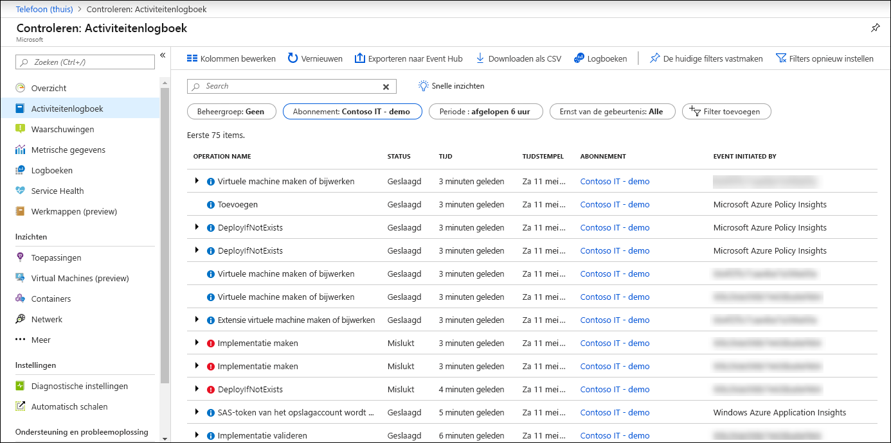

# <a name="view-and-retrieve-azure-activity-log-events"></a>Weergeven en gebeurtenissen in het Azure-activiteitenlogboek op te halen

De [Azure Activity Log](activity-logs-overview.md) biedt inzicht in gebeurtenissen op abonnementsniveau die hebben plaatsgevonden in Azure. Dit artikel bevat informatie over de verschillende methoden voor het weergeven en het ophalen van gebeurtenissen in activiteitenlogboeken.

## <a name="azure-portal"></a>Azure Portal
Raadpleeg het activiteitenlogboek voor alle resources uit de **Monitor** in het menu in de Azure-portal. Raadpleeg het activiteitenlogboek voor een bepaalde resource uit de **activiteitenlogboek** optie in het menu van die resource.



U kunt gebeurtenissen in activiteitenlogboeken van de volgende velden filteren:

* **Timespan**: De begin- en -tijd voor gebeurtenissen.
* **Categorie**: De categorie van de gebeurtenis zoals beschreven in [categorieën in het activiteitenlogboek](activity-logs-overview.md#categories-in-the-activity-log).
* **Abonnement**: Een of meer namen van Azure-abonnement.
* **Resourcegroep**: Een of meer resourcegroepen binnen de geselecteerde abonnementen.
* **Bron (naam)** :-de naam van een specifieke resource.
* **Resourcetype**: Het type resource, bijvoorbeeld _Microsoft.Compute/virtualmachines_.
* **De naam van bewerking** -de naam van een Azure Resource Manager-bewerking, bijvoorbeeld _Microsoft.SQL/servers/Write_.
* **Ernst**: De ernst van de gebeurtenis. Beschikbare waarden zijn _informatief_, _waarschuwing_, _fout_, _kritieke_.
* **Gebeurtenis gestart door**: De gebruiker die de bewerking heeft uitgevoerd.
* **Open search**: Open tekstzoekvak waarin wordt gezocht die tekenreeks voor alle velden in alle gebeurtenissen.

### <a name="view-change-history"></a>Geschiedenis van de wijziging weergeven

Bij het beoordelen van het activiteitenlogboek, kan helpen om te zien welke wijzigingen is opgetreden tijdens de tijd van die gebeurtenis. U vindt deze informatie met **wijzigingsoverzicht**. Selecteer een gebeurtenis in het activiteitenlogboek die u wilt zoeken naar meer. Selecteer de **wijzigingsoverzicht (Preview)** tabblad om alle wijzigingen aan die gebeurtenis is gekoppeld.


Als er gerelateerde wijzigingen aan de gebeurtenis, ziet u een lijst met wijzigingen die u kunt selecteren. Hiermee opent u de **wijzigingsoverzicht (Preview)** pagina. Op deze pagina ziet u de wijzigingen in de resource. Zoals u in het volgende voorbeeld zien kunt, zijn we niet alleen zien dat de VM-grootten, maar de vorige VM-grootte is voordat de wijziging en wat het is gewijzigd in gewijzigd.


Zie voor meer informatie over de wijzigingsgeschiedenis, [wijzigingen van resources ophalen](../../governance/resource-graph/how-to/get-resource-changes.md).


## <a name="log-analytics-workspace"></a>Log Analytics-werkruimte
Klik op **logboeken** aan de bovenkant van de **activiteitenlogboek** pagina wordt geopend de [Activity Log Analytics-oplossing voor de controle](activity-log-collect.md) voor het abonnement. Hierdoor kunt u analyses weergeven voor het activiteitenlogboek en om uit te voeren [query's bijgehouden](../log-query/log-query-overview.md) met de **AzureActivity** tabel. Als uw activiteitenlogboek wordt niet met een Log Analytics-werkruimte verbonden, wordt u gevraagd om uit te voeren van deze configuratie.


## <a name="powershell"></a>PowerShell
Gebruik de [Get-AzLog](https://docs.microsoft.com/powershell/module/az.monitor/get-azlog) cmdlet voor het ophalen van het activiteitenlogboek van PowerShell. Hier volgen enkele algemene voorbeelden.

> [!NOTE]
> `Get-AzLog` biedt alleen 15 dagen. Gebruik de **- MaxEvents** parameter om op te vragen van de laatste N-gebeurtenissen langer dan 15 dagen. Voor toegang tot gebeurtenissen die ouder zijn dan 15 dagen, de REST-API of de SDK te gebruiken. Als u geen **StartTime**, dan is de standaardwaarde **EndTime** min één uur. Als u geen **EndTime**, en vervolgens de standaardwaarde is de huidige tijd. Alle tijden zijn in UTC.


Haal de logboekvermeldingen die zijn gemaakt na een bepaalde datum en tijd:

```powershell
Get-AzLog -StartTime 2016-03-01T10:30
```

Logboekvermeldingen tussen een datumbereik voor tijd ophalen:

```powershell
Get-AzLog -StartTime 2015-01-01T10:30 -EndTime 2015-01-01T11:30
```

Logboekvermeldingen ophalen uit een specifieke resourcegroep:

```powershell
Get-AzLog -ResourceGroup 'myrg1'
```

Logboekvermeldingen ophalen uit een specifieke resourceprovider tussen een datumbereik voor de tijd:

```powershell
Get-AzLog -ResourceProvider 'Microsoft.Web' -StartTime 2015-01-01T10:30 -EndTime 2015-01-01T11:30
```

Logboekvermeldingen met een specifieke aanroeper ophalen:

```powershell
Get-AzLog -Caller 'myname@company.com'
```

De laatste 1000 gebeurtenissen ophalen:

```powershell
Get-AzLog -MaxEvents 1000
```


## <a name="cli"></a>CLI
Gebruik [az monitor-activiteitenlogboek](cli-samples.md#view-activity-log-for-a-subscription) om op te halen van het activiteitenlogboek van CLI. Hier volgen enkele algemene voorbeelden.


Bekijk alle beschikbare opties.

```azurecli
az monitor activity-log list -h
```

Logboekvermeldingen ophalen uit een specifieke resourcegroep:

```azurecli
az monitor activity-log list --resource-group <group name>
```

Logboekvermeldingen met een specifieke aanroeper ophalen:

```azurecli
az monitor activity-log list --caller myname@company.com
```

Logboeken door de oproepende functie ophalen op een resourcetype binnen een bepaalde periode:

```azurecli
az monitor activity-log list --resource-provider Microsoft.Web \
    --caller myname@company.com \
    --start-time 2016-03-08T00:00:00Z \
    --end-time 2016-03-16T00:00:00Z
```

## <a name="rest-api"></a>REST-API
Gebruik de [Azure Monitor REST API](https://docs.microsoft.com/rest/api/monitor/) om op te halen van het activiteitenlogboek van een REST-client. Hier volgen enkele algemene voorbeelden.

Aan de activiteitenlogboeken met filter:

``` HTTP
GET https://management.azure.com/subscriptions/089bd33f-d4ec-47fe-8ba5-0753aa5c5b33/providers/microsoft.insights/eventtypes/management/values?api-version=2015-04-01&$filter=eventTimestamp ge '2018-01-21T20:00:00Z' and eventTimestamp le '2018-01-23T20:00:00Z' and resourceGroupName eq 'MSSupportGroup'
```

Aan de activiteitenlogboeken met het filter en selecteer:

```HTTP
GET https://management.azure.com/subscriptions/089bd33f-d4ec-47fe-8ba5-0753aa5c5b33/providers/microsoft.insights/eventtypes/management/values?api-version=2015-04-01&$filter=eventTimestamp ge '2015-01-21T20:00:00Z' and eventTimestamp le '2015-01-23T20:00:00Z' and resourceGroupName eq 'MSSupportGroup'&$select=eventName,id,resourceGroupName,resourceProviderName,operationName,status,eventTimestamp,correlationId,submissionTimestamp,level
```

Aan de activiteitenlogboeken met selecteren:

```HTTP
GET https://management.azure.com/subscriptions/089bd33f-d4ec-47fe-8ba5-0753aa5c5b33/providers/microsoft.insights/eventtypes/management/values?api-version=2015-04-01&$select=eventName,id,resourceGroupName,resourceProviderName,operationName,status,eventTimestamp,correlationId,submissionTimestamp,level
```

Aan de activiteitenlogboeken, zonder of Selecteer een filter:

```HTTP
GET https://management.azure.com/subscriptions/089bd33f-d4ec-47fe-8ba5-0753aa5c5b33/providers/microsoft.insights/eventtypes/management/values?api-version=2015-04-01
```


## <a name="next-steps"></a>Volgende stappen

* [Lees een overzicht van het activiteitenlogboek](activity-logs-overview.md)
* [Het activiteitenlogboek naar opslag archiveren op of het streamen naar Event Hubs](activity-log-export.md)
* [Stream het Azure-activiteitenlogboek naar Eventhubs](activity-logs-stream-event-hubs.md)
* [Archiveren van de Azure-activiteitenlogboek naar opslag](archive-activity-log.md)

