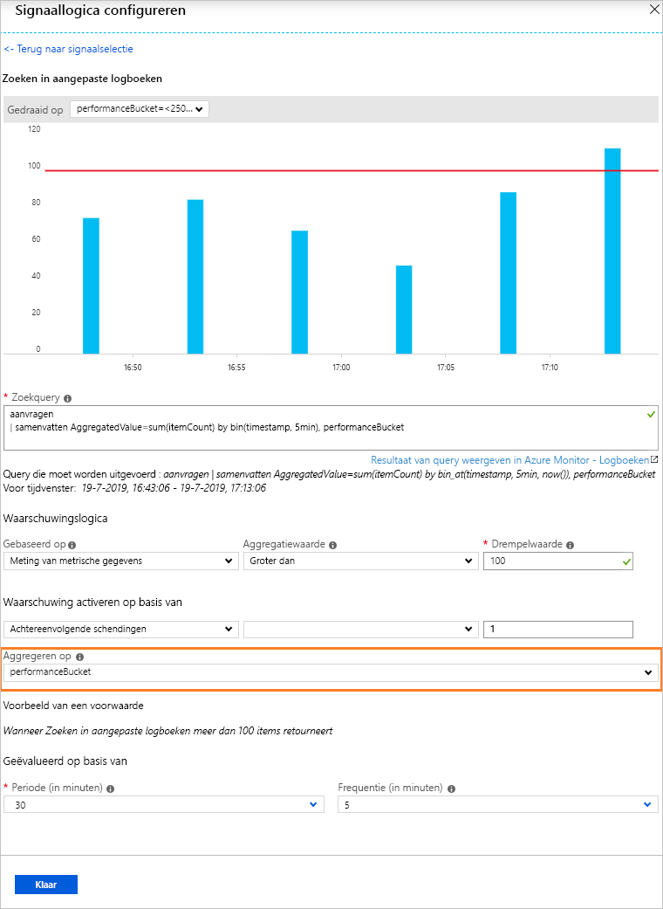
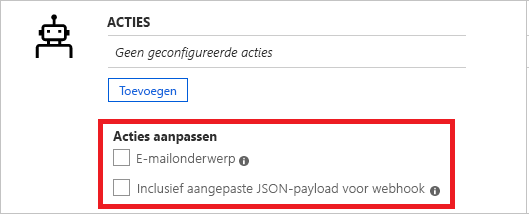
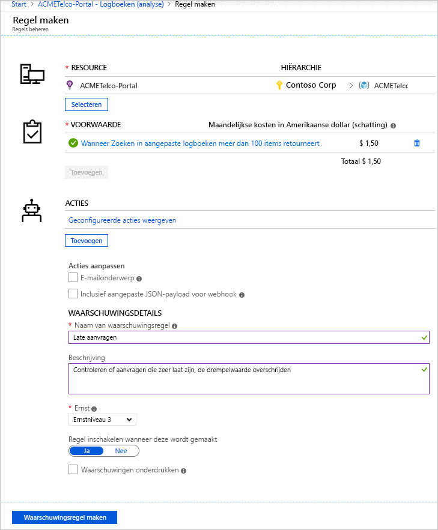

# <a name="create-view-and-manage-log-alerts-using-azure-monitor"></a>Logboek waarschuwingen maken, weer geven en beheren met behulp van Azure Monitor

## <a name="overview"></a>Overzicht
In dit artikel wordt beschreven hoe u logboek waarschuwingen maakt en beheert met behulp van de waarschuwingen interface in de Azure Portal. Waarschuwings regels worden gedefinieerd door drie onderdelen:
- Doel: een specifieke Azure-resource om te bewaken
- Criteria: een voor waarde of logica om op waarheid te evalueren. Als deze eigenschap waar is, wordt de waarschuwing geactiveerd.  
- Actie: er is een specifieke aanroep verzonden naar een ontvanger van een melding: e-mail, SMS, webhook, enzovoort.

De term **logboek waarschuwing** bevat waarschuwingen waarbij een logboek query in [log Analytics werk ruimte](../log-query/get-started-portal.md) of [Application Insights](../log-query/log-query-overview.md) wordt geëvalueerd en een waarschuwing wordt geactiveerd als het resultaat waar is. Meer informatie over de functionaliteit, terminologie en typen in [logboek waarschuwingen-overzicht](alerts-unified-log.md).

> [!NOTE]
> Logboek gegevens van [een log Analytics-werk ruimte](../log-query/get-started-portal.md) kunnen ook worden doorgestuurd naar de data base van Azure monitor Metrics. Waarschuwingen voor metrische gegevens hebben een [ander gedrag](alerts-metric-overview.md), wat wenselijker is, afhankelijk van de data waarmee u werkt.   Zie [metrische waarschuwingen voor logboeken](alerts-metric-logs.md)voor meer informatie over hoe en hoe u Logboeken kunt routeren naar metrische gegevens.

## <a name="create-a-log-alert-rule-with-the-azure-portal"></a>Een waarschuwings regel voor het logboek maken met de Azure Portal

1. Selecteer in de [Portal](https://portal.azure.com/) **monitor**. Kies in dat gedeelte **waarschuwingen**.

    

1. Klik op **nieuwe waarschuwings regel**. 

    

1. Het deel venster **waarschuwing maken** wordt weer gegeven. Er zijn vier onderdelen: 
    - De resource waarop de waarschuwing van toepassing is
    - De voor waarde die moet worden gecontroleerd
    - De actie die moet worden uitgevoerd als de voor waarde waar is
    - De Details voor de naam en beschrijving van de waarschuwing. 

    

1. Definieer de waarschuwings voorwaarde met behulp van de **resource koppeling selecteren** en geef het doel op door een resource te selecteren. Filter door het *abonnement*, het *resource type*en de vereiste *resource*te kiezen. 

   

1. Zorg ervoor dat het **resource type** een analyse bron is, zoals *log Analytics* , *Application Insights* en signaal type als *logboek*. Klik op **Gereed**. Gebruik vervolgens de knop **criteria toevoegen** om een lijst weer te geven met signaal opties die beschikbaar zijn voor de resource. Zoek en kies **aangepaste zoek optie voor logboeken** voor *log Analytics* of *Application Insights*, afhankelijk van waar de gegevens voor uw logboek waarschuwingen zich bevinden.

   

   > [!NOTE]
   > 
   > In waarschuwings lijsten kunnen analyse query's worden geïmporteerd als signaal type- **logboek (opgeslagen query)**, zoals in de bovenstaande afbeelding wordt weer gegeven. Gebruikers kunnen uw query in analyse verbeteren en ze vervolgens opslaan voor toekomstig gebruik in waarschuwingen. Zie voor meer informatie over het gebruik van opgeslagen query's [logboek query gebruiken in azure monitor](../log-query/log-query-overview.md) en [gedeelde query's in Application Insights Analytics](../app/app-insights-overview.md).

1. Nadat u de meldings query hebt geselecteerd, maakt u deze in het **Zoek query** veld. Als de query syntaxis onjuist is, wordt het veld weer gegeven met een rood fout. 

1. Als de query syntaxis juist is, worden historische gegevens voor de query weer gegeven als een grafiek met de optie om het tijd venster van de laatste zes uur tot de vorige week te verfijnen.

    

   De historische gegevens visualisatie wordt alleen weer gegeven als de query resultaten tijd details bevatten. Als uw query resulteert in samenvattings gegevens of specifieke kolom waarden, toont de weer gave één tekening.
  
   Voor metrische metingen met Application Insights of [de log Analytics-API](/rest/api/monitor/scheduledqueryrules)kunt u opgeven welke specifieke variabele de gegevens moet groeperen met behulp **van de optie aggregate on** . zoals hier wordt weer gegeven: 
  
   


1. Kies vervolgens de **logica logische waarschuwing** , aggregatie en drempel waarde. 

1. Kies de tijds periode gedurende welke de opgegeven voor waarde moet worden geëvalueerd, met behulp van de **periode** optie. 

1. Kies hoe vaak de waarschuwing wordt uitgevoerd in **frequentie**. 

    **Logboek waarschuwingen** kunnen worden gebaseerd op:
    - [Aantal records](./alerts-unified-log.md#number-of-results-alert-rules): er wordt een waarschuwing gemaakt als het aantal records dat door de query wordt geretourneerd, groter is dan of kleiner is dan de opgegeven waarde.
    - [Metrische meting](./alerts-unified-log.md#metric-measurement-alert-rules): er wordt een waarschuwing gemaakt als elke *cumulatieve waarde* in de resultaten de opgegeven drempel waarde overschrijdt en wordt *gegroepeerd op basis van* de gekozen waarde. Het aantal schendingen voor een waarschuwing is het aantal keren dat de drempel waarde wordt overschreden in de gekozen tijds periode. U kunt het totale aantal schendingen opgeven voor elke combi natie van inbreuken in de resultatenset of opeenvolgende inbreuken om te vereisen dat de schendingen in opeenvolgende steek proeven moeten plaatsvinden.


1. Klik op **Gereed**. 

1. Geef een naam op voor uw waarschuwing in het veld **naam van waarschuwings regel** , samen met een **Beschrijving** van Details voor de waarschuwing en **Ernst** waarde van de opgegeven opties. Deze details worden opnieuw gebruikt in alle waarschuwings-e-mails, meldingen of pushes die door Azure Monitor worden uitgevoerd. Daarnaast kunt u ervoor kiezen om de waarschuwings regel direct te activeren door op **regel inschakelen bij het maken**te klikken.

1. Kies of u waarschuwingen voor een bepaalde tijd wilt **onderdrukken** .  Wanneer u onderdrukking inschakelt voor de waarschuwings regel, worden acties voor de regel gedurende een gedefinieerde tijds duur uitgeschakeld nadat een nieuwe waarschuwing is gemaakt. De regel wordt nog uitgevoerd en er worden waarschuwings records gemaakt aan de criteria waaraan wordt voldaan. Met deze instelling kunt u het probleem oplossen zonder dat er dubbele acties worden uitgevoerd.

   

    > [!TIP]
    > Geef een waarschuwings waarde voor onderdrukking op die groter is dan de frequentie van de waarschuwing om te voor komen dat meldingen worden gestopt zonder overlap ping

1. Geef als derde en laatste stap op of de waarschuwings regel een of meer **actie groepen** moet activeren wanneer aan de waarschuwings voorwaarde wordt voldaan. U kunt een bestaande actie groep kiezen of een nieuwe maken. Met actie groepen kunt u een aantal acties uitvoeren, zoals het verzenden van e-mail berichten (s), het verzenden van SMS (s), het aanroepen van webhook (s), het oplossen van Azure-Runbooks, het pushen van uw ITSM-hulp programma, en meer. Meer informatie over [actie groepen](action-groups.md).

    > [!NOTE]
    > Raadpleeg de [service limieten voor Azure-abonnementen](../../azure-resource-manager/management/azure-subscription-service-limits.md) voor limieten voor de acties die kunnen worden uitgevoerd.  

    Er is aanvullende functionaliteit beschikbaar om de standaard acties te overschrijven:

    - **E-mail melding**: onderdrukt het onderwerp van de *e-mail* in het e-mail bericht dat is verzonden via de actie groep. U kunt de hoofd tekst van de e-mail niet wijzigen en dit veld is **niet** voor e-mail adres.
    - **Aangepaste JSON-nettolading toevoegen**: overschrijft de JSON van de webhook die wordt gebruikt door actie groepen, ervan uitgaande dat de actie groep een type webhook bevat. Zie [webhook-actie voor logboek waarschuwingen](./alerts-log-webhook.md)voor meer informatie over de indeling van webhooks. U kunt de optie webhook weer geven gebruiken om de indeling te controleren met behulp van JSON-voorbeeld gegevens.

        


1. Als alle velden geldig zijn en met het groene deel streepje op de knop **waarschuwings regel maken** kan worden geklikt en er een waarschuwing wordt gemaakt in azure monitor-waarschuwingen. Alle waarschuwingen kunnen worden weer gegeven in het dash board waarschuwingen.

     

     Binnen een paar minuten is de waarschuwing actief en worden triggers zoals eerder beschreven.

Gebruikers kunnen ook hun analyse query in [log Analytics](../log-query/log-query-overview.md) volt ooien en vervolgens pushen om een waarschuwing te maken met de knop ' waarschuwing instellen ', gevolgd door de volgende instructies van stap 6 en hoger in de bovenstaande zelf studie.

 

### <a name="view--manage-log-alerts-in-azure-portal"></a>Waarschuwingen voor logboeken in Azure Portal weer geven & beheren

1. Selecteer in de [Portal](https://portal.azure.com/) **bewaken** en klik onder de sectie monitor op **waarschuwingen**.

1. Het **dash board waarschuwingen** wordt weer gegeven: alle Azure-waarschuwingen (inclusief logboek waarschuwingen) worden weer gegeven in een enkel bord. inclusief elk exemplaar van wanneer uw logboek waarschuwings regel is geactiveerd. Zie [Waarschuwingenbeheer](https://aka.ms/managealertinstances)voor meer informatie.
    > [!NOTE]
    > Waarschuwings regels voor logboeken bestaan uit aangepaste op query's gebaseerde logica die door gebruikers wordt verschaft en daarom zonder een opgeloste status. Omdat er telkens wordt voldaan aan de voor waarden die zijn opgegeven in de waarschuwings regel voor logboeken, wordt deze geactiveerd.

1. Selecteer de knop **regels beheren** op de bovenste balk om naar de sectie regel beheer te gaan, waarin alle gemaakte waarschuwings regels worden weer gegeven. inclusief waarschuwingen die zijn uitgeschakeld.
    

## <a name="managing-log-alerts-using-azure-resource-template"></a>Logboek waarschuwingen beheren met Azure-resource sjabloon

Waarschuwingen in het logboek in Azure Monitor zijn gekoppeld aan het resource type `Microsoft.Insights/scheduledQueryRules/` . Zie [Azure monitor-geplande query regels API-verwijzing](/rest/api/monitor/scheduledqueryrules/)voor meer informatie over dit resource type. Logboek waarschuwingen voor Application Insights of Log Analytics kunnen worden gemaakt met behulp van [geplande query regel-API](/rest/api/monitor/scheduledqueryrules/).

> [!NOTE]
> Waarschuwingen voor logboeken voor Log Analytics kunnen ook worden beheerd met verouderde [log Analytics waarschuwings-API](api-alerts.md) en verouderde sjablonen van [log Analytics opgeslagen Zoek opdrachten en waarschuwingen](../insights/solutions.md) . Zie voor meer informatie over het gebruik van de nieuwe ScheduledQueryRules-API die hier wordt beschreven, [overschakelen naar nieuwe API voor log Analytics-waarschuwingen](alerts-log-api-switch.md).


### <a name="sample-log-alert-creation-using-azure-resource-template"></a>Voorbeeld logboek waarschuwing maken met behulp van Azure-resource sjabloon

Hieronder volgt de structuur voor [geplande query regels maken](/rest/api/monitor/scheduledqueryrules/createorupdate) op basis van een resource sjabloon met behulp van de standaard zoekopdracht zoek opdracht van het [aantal resultaten van het type logboek](alerts-unified-log.md#number-of-results-alert-rules), waarbij voorbeeld gegevens zijn ingesteld als variabelen.

```json
{
    "$schema": "https://schema.management.azure.com/schemas/2015-01-01/deploymentTemplate.json#",
    "contentVersion": "1.0.0.0",
    "parameters": {
    },
    "variables": {
        "alertLocation": "southcentralus",
        "alertName": "samplelogalert",
        "alertDescription": "Sample log search alert",
        "alertStatus": "true",
        "alertSource":{
            "Query":"requests",
            "SourceId": "/subscriptions/a123d7efg-123c-1234-5678-a12bc3defgh4/resourceGroups/myRG/providers/microsoft.insights/components/sampleAIapplication",
            "Type":"ResultCount"
        },
        "alertSchedule":{
            "Frequency": 15,
            "Time": 60
        },
        "alertActions":{
            "SeverityLevel": "4"
        },
        "alertTrigger":{
            "Operator":"GreaterThan",
            "Threshold":"1"
        },
        "actionGrp":{
            "ActionGroup": "/subscriptions/a123d7efg-123c-1234-5678-a12bc3defgh4/resourceGroups/myRG/providers/microsoft.insights/actiongroups/sampleAG",
            "Subject": "Customized Email Header",
            "Webhook": "{ \"alertname\":\"#alertrulename\", \"IncludeSearchResults\":true }"
        }
    },
    "resources":[ {
        "name":"[variables('alertName')]",
        "type":"Microsoft.Insights/scheduledQueryRules",
        "apiVersion": "2018-04-16",
        "location": "[variables('alertLocation')]",
        "properties":{
            "description": "[variables('alertDescription')]",
            "enabled": "[variables('alertStatus')]",
            "source": {
                "query": "[variables('alertSource').Query]",
                "dataSourceId": "[variables('alertSource').SourceId]",
                "queryType":"[variables('alertSource').Type]"
            },
            "schedule":{
                "frequencyInMinutes": "[variables('alertSchedule').Frequency]",
                "timeWindowInMinutes": "[variables('alertSchedule').Time]"
            },
            "action":{
                "odata.type": "Microsoft.WindowsAzure.Management.Monitoring.Alerts.Models.Microsoft.AppInsights.Nexus.DataContracts.Resources.ScheduledQueryRules.AlertingAction",
                "severity":"[variables('alertActions').SeverityLevel]",
                "aznsAction":{
                    "actionGroup":"[array(variables('actionGrp').ActionGroup)]",
                    "emailSubject":"[variables('actionGrp').Subject]",
                    "customWebhookPayload":"[variables('actionGrp').Webhook]"
                },
                "trigger":{
                    "thresholdOperator":"[variables('alertTrigger').Operator]",
                    "threshold":"[variables('alertTrigger').Threshold]"
                }
            }
        }
    } ]
}

```

De bovenstaande voorbeeld JSON kan worden opgeslagen als (zeg) sampleScheduledQueryRule.jsvoor het doel van deze procedure en kan worden geïmplementeerd met behulp van [Azure Resource Manager in azure Portal](../../azure-resource-manager/templates/deploy-portal.md#deploy-resources-from-custom-template).


### <a name="log-alert-with-cross-resource-query-using-azure-resource-template"></a>Logboek waarschuwing met een query tussen meerdere resources met behulp van een Azure-resource sjabloon

Hieronder ziet u de structuur voor het maken van een resource sjabloon op basis van een [geplande query regel](/rest/api/monitor/scheduledqueryrules/createorupdate) met behulp van een logboek registratie voor het vastleggen van gegevens in [Logboeken](../log-query/cross-workspace-query.md) van het [metrische meet type](./alerts-unified-log.md#metric-measurement-alert-rules), waarbij een voor beeld van gegevensset als variabelen is ingesteld.

```json

{
    "$schema": "https://schema.management.azure.com/schemas/2015-01-01/deploymentTemplate.json#",
    "contentVersion": "1.0.0.0",
    "parameters": {
    },
    "variables": {
        "alertLocation": "Region Name for your Application Insights App or Log Analytics Workspace",
        "alertName": "sample log alert",
        "alertDescr": "Sample log search alert",
        "alertStatus": "true",
        "alertSource":{
            "Query":"union workspace(\"servicews\").Update, app('serviceapp').requests | summarize AggregatedValue = count() by bin(TimeGenerated,1h), Classification",
            "Resource1": "/subscriptions/a123d7efg-123c-1234-5678-a12bc3defgh4/resourceGroups/contosoRG/providers/microsoft.OperationalInsights/workspaces/servicews",
            "Resource2": "/subscriptions/a123d7efg-123c-1234-5678-a12bc3defgh4/resourceGroups/contosoRG/providers/microsoft.insights/components/serviceapp",
            "SourceId": "/subscriptions/a123d7efg-123c-1234-5678-a12bc3defgh4/resourceGroups/contosoRG/providers/microsoft.OperationalInsights/workspaces/servicews",
            "Type":"ResultCount"
        },
        "alertSchedule":{
            "Frequency": 15,
            "Time": 60
        },
        "alertActions":{
            "SeverityLevel": "4",
            "SuppressTimeinMin": 20
        },
        "alertTrigger":{
            "Operator":"GreaterThan",
            "Threshold":"1"
        },
        "metricMeasurement": {
            "thresholdOperator": "Equal",
            "threshold": "1",
            "metricTriggerType": "Consecutive",
            "metricColumn": "Classification"
        },
        "actionGrp":{
            "ActionGroup": "/subscriptions/a123d7efg-123c-1234-5678-a12bc3defgh4/resourceGroups/contosoRG/providers/microsoft.insights/actiongroups/sampleAG",
            "Subject": "Customized Email Header",
            "Webhook": "{ \"alertname\":\"#alertrulename\", \"IncludeSearchResults\":true }"
        }
    },
    "resources":[ {
        "name":"[variables('alertName')]",
        "type":"Microsoft.Insights/scheduledQueryRules",
        "apiVersion": "2018-04-16",
        "location": "[variables('alertLocation')]",
        "properties":{
            "description": "[variables('alertDescr')]",
            "enabled": "[variables('alertStatus')]",
            "source": {
                "query": "[variables('alertSource').Query]",
                "authorizedResources": "[concat(array(variables('alertSource').Resource1), array(variables('alertSource').Resource2))]",
                "dataSourceId": "[variables('alertSource').SourceId]",
                "queryType":"[variables('alertSource').Type]"
            },
            "schedule":{
                "frequencyInMinutes": "[variables('alertSchedule').Frequency]",
                "timeWindowInMinutes": "[variables('alertSchedule').Time]"
            },
            "action":{
                "odata.type": "Microsoft.WindowsAzure.Management.Monitoring.Alerts.Models.Microsoft.AppInsights.Nexus.DataContracts.Resources.ScheduledQueryRules.AlertingAction",
                "severity":"[variables('alertActions').SeverityLevel]",
                "throttlingInMin": "[variables('alertActions').SuppressTimeinMin]",
                "aznsAction":{
                    "actionGroup": "[array(variables('actionGrp').ActionGroup)]",
                    "emailSubject":"[variables('actionGrp').Subject]",
                    "customWebhookPayload":"[variables('actionGrp').Webhook]"
                },
                "trigger":{
                    "thresholdOperator":"[variables('alertTrigger').Operator]",
                    "threshold":"[variables('alertTrigger').Threshold]",
                    "metricTrigger":{
                        "thresholdOperator": "[variables('metricMeasurement').thresholdOperator]",
                        "threshold": "[variables('metricMeasurement').threshold]",
                        "metricColumn": "[variables('metricMeasurement').metricColumn]",
                        "metricTriggerType": "[variables('metricMeasurement').metricTriggerType]"
                    }
                }
            }
        }
    } ]
}

```

> [!IMPORTANT]
> Wanneer u een query voor meerdere resources gebruikt in de logboek waarschuwing, is het gebruik van [authorizedResources](/rest/api/monitor/scheduledqueryrules/createorupdate#source) verplicht en moet de gebruiker toegang hebben tot de vermelde lijst met resources

De bovenstaande voorbeeld JSON kan worden opgeslagen als (zeg) sampleScheduledQueryRule.jsvoor het doel van deze procedure en kan worden geïmplementeerd met behulp van [Azure Resource Manager in azure Portal](../../azure-resource-manager/templates/deploy-portal.md#deploy-resources-from-custom-template).

## <a name="managing-log-alerts-using-powershell"></a>Logboek waarschuwingen beheren met Power shell

[!INCLUDE [updated-for-az](../../../includes/updated-for-az.md)]

Azure Monitor- [geplande query regels-API](/rest/api/monitor/scheduledqueryrules/) is een rest API en volledig compatibel met Azure Resource Manager rest API. En Power shell-cmdlets die hieronder worden weer gegeven, zijn beschikbaar voor gebruik van de [geplande query regels API](/rest/api/monitor/scheduledqueryrules/).

- [New-AzScheduledQueryRule](/powershell/module/az.monitor/new-azscheduledqueryrule) : Power shell-cmdlet voor het maken van een nieuwe waarschuwings regel voor het logboek.
- [Set-AzScheduledQueryRule](/powershell/module/az.monitor/set-azscheduledqueryrule) : Power shell-cmdlet om een bestaande waarschuwings regel voor het logboek bij te werken.
- [New-AzScheduledQueryRuleSource](/powershell/module/az.monitor/new-azscheduledqueryrulesource) : Power shell-cmdlet voor het maken of bijwerken van een object dat de bron parameters voor een logboek waarschuwing opgeeft. Wordt gebruikt als invoer door de cmdlet [New-AzScheduledQueryRule](/powershell/module/az.monitor/new-azscheduledqueryrule) en [set-AzScheduledQueryRule](/powershell/module/az.monitor/set-azscheduledqueryrule) .
- [New-AzScheduledQueryRuleSchedule](/powershell/module/az.monitor/new-azscheduledqueryruleschedule): Power shell-cmdlet voor het maken of bijwerken van een object dat de plannings parameters voor een logboek waarschuwing opgeeft. Wordt gebruikt als invoer door de cmdlet [New-AzScheduledQueryRule](/powershell/module/az.monitor/new-azscheduledqueryrule) en [set-AzScheduledQueryRule](/powershell/module/az.monitor/set-azscheduledqueryrule) .
- [New-AzScheduledQueryRuleAlertingAction](/powershell/module/az.monitor/new-azscheduledqueryrulealertingaction) : Power shell-cmdlet voor het maken of bijwerken van een object waarmee actie parameters voor een logboek waarschuwing worden opgegeven. Wordt gebruikt als invoer door de cmdlet [New-AzScheduledQueryRule](/powershell/module/az.monitor/new-azscheduledqueryrule) en [set-AzScheduledQueryRule](/powershell/module/az.monitor/set-azscheduledqueryrule) .
- [New-AzScheduledQueryRuleAznsActionGroup](/powershell/module/az.monitor/new-azscheduledqueryruleaznsactiongroup) : Power shell-cmdlet voor het maken of bijwerken van een object waarmee actie groepen para meters voor een logboek waarschuwing worden opgegeven. Wordt gebruikt als invoer door de cmdlet [New-AzScheduledQueryRuleAlertingAction](/powershell/module/az.monitor/new-azscheduledqueryrulealertingaction) .
- [New-AzScheduledQueryRuleTriggerCondition](/powershell/module/az.monitor/new-azscheduledqueryruletriggercondition) : Power shell-cmdlet voor het maken of bijwerken van een object waarmee trigger voorwaarde parameters voor de logboek waarschuwing worden opgegeven. Wordt gebruikt als invoer door de cmdlet [New-AzScheduledQueryRuleAlertingAction](/powershell/module/az.monitor/new-azscheduledqueryrulealertingaction) .
- [New-AzScheduledQueryRuleLogMetricTrigger](/powershell/module/az.monitor/new-azscheduledqueryrulelogmetrictrigger) : Power shell-cmdlet voor het maken of bijwerken van een object waarvoor metrische trigger voorwaarde parameters worden opgegeven voor de waarschuwing voor het [meting type van metrische](./alerts-unified-log.md#metric-measurement-alert-rules)gegevens. Wordt gebruikt als invoer door de cmdlet [New-AzScheduledQueryRuleTriggerCondition](/powershell/module/az.monitor/new-azscheduledqueryruletriggercondition) .
- [Get-AzScheduledQueryRule](/powershell/module/az.monitor/get-azscheduledqueryrule) : Power shell-cmdlet voor het weer geven van de bestaande logboek waarschuwings regels of een specifieke waarschuwings regel voor het logboek
- [Update-AzScheduledQueryRule](/powershell/module/az.monitor/update-azscheduledqueryrule) : Power shell-cmdlet voor het in-of uitschakelen van de waarschuwings regel voor logboek registratie
- [Remove-AzScheduledQueryRule](/powershell/module/az.monitor/remove-azscheduledqueryrule): Power shell-cmdlet voor het verwijderen van een bestaande waarschuwings regel voor het logboek

> [!NOTE]
> ScheduledQueryRules Power shell-cmdlets kunnen alleen regels maken die zelf de cmdlet zelf hebben gemaakt of die gebruikmaken van Azure Monitor- [geplande query regels-API](/rest/api/monitor/scheduledqueryrules/). Waarschuwings regels in logboek registreren die zijn gemaakt met verouderde [log Analytics-waarschuwings-API](api-alerts.md) en verouderde sjablonen van [log Analytics opgeslagen Zoek opdrachten en waarschuwingen](../insights/solutions.md) kunnen worden beheerd met behulp van ScheduledQueryRules Power shell-cmdlets, nadat de gebruikers-API-voor [keur voor log Analytics](alerts-log-api-switch.md)

Hieronder ziet u de stappen voor het maken van een waarschuwings regel voor een voorbeeld logboek met behulp van de scheduledQueryRules Power shell-cmdlets.

```powershell
$source = New-AzScheduledQueryRuleSource -Query 'Heartbeat | summarize AggregatedValue = count() by bin(TimeGenerated, 5m), _ResourceId' -DataSourceId "/subscriptions/a123d7efg-123c-1234-5678-a12bc3defgh4/resourceGroups/contosoRG/providers/microsoft.OperationalInsights/workspaces/servicews"

$schedule = New-AzScheduledQueryRuleSchedule -FrequencyInMinutes 15 -TimeWindowInMinutes 30

$metricTrigger = New-AzScheduledQueryRuleLogMetricTrigger -ThresholdOperator "GreaterThan" -Threshold 2 -MetricTriggerType "Consecutive" -MetricColumn "_ResourceId"

$triggerCondition = New-AzScheduledQueryRuleTriggerCondition -ThresholdOperator "LessThan" -Threshold 5 -MetricTrigger $metricTrigger

$aznsActionGroup = New-AzScheduledQueryRuleAznsActionGroup -ActionGroup "/subscriptions/a123d7efg-123c-1234-5678-a12bc3defgh4/resourceGroups/contosoRG/providers/microsoft.insights/actiongroups/sampleAG" -EmailSubject "Custom email subject" -CustomWebhookPayload "{ `"alert`":`"#alertrulename`", `"IncludeSearchResults`":true }"

$alertingAction = New-AzScheduledQueryRuleAlertingAction -AznsAction $aznsActionGroup -Severity "3" -Trigger $triggerCondition

New-AzScheduledQueryRule -ResourceGroupName "contosoRG" -Location "Region Name for your Application Insights App or Log Analytics Workspace" -Action $alertingAction -Enabled $true -Description "Alert description" -Schedule $schedule -Source $source -Name "Alert Name"
```

## <a name="managing-log-alerts-using-cli-or-api"></a>Logboek waarschuwingen beheren met CLI of API

Azure Monitor- [geplande query regels-API](/rest/api/monitor/scheduledqueryrules/) is een rest API en volledig compatibel met Azure Resource Manager rest API. Dit kan daarom worden gebruikt via Power shell met behulp van Resource Manager-opdrachten voor Azure CLI.


> [!NOTE]
> Waarschuwingen voor logboeken voor Log Analytics kunnen ook worden beheerd met verouderde [log Analytics waarschuwings-API](api-alerts.md) en verouderde sjablonen van [log Analytics opgeslagen Zoek opdrachten en waarschuwingen](../insights/solutions.md) . Zie voor meer informatie over het gebruik van de nieuwe ScheduledQueryRules-API die hier wordt beschreven, [overschakelen naar nieuwe API voor log Analytics-waarschuwingen](alerts-log-api-switch.md).

Er zijn momenteel geen speciale CLI-opdrachten voor logboek waarschuwingen; maar zoals hieronder wordt beschreven, kunnen worden gebruikt via Azure Resource Manager CLI-opdracht voor een voor beeld van een resource sjabloon die eerder is weer gegeven (sampleScheduledQueryRule.jsaan) in het gedeelte resource sjabloon:

```azurecli
az group deployment create --resource-group contosoRG --template-file sampleScheduledQueryRule.json
```

Bij een geslaagde bewerking wordt 201 geretourneerd naar een status nieuwe waarschuwings regel maken of wordt 200 geretourneerd als een bestaande waarschuwings regel is gewijzigd.

## <a name="next-steps"></a>Volgende stappen

* Meer informatie over [logboek waarschuwingen in azure-waarschuwingen](./alerts-unified-log.md)
* Informatie [over webhook-acties voor logboek waarschuwingen](./alerts-log-webhook.md)
* Meer informatie over [Application Insights](../log-query/log-query-overview.md)
* Meer informatie over [logboek query's](../log-query/log-query-overview.md).

