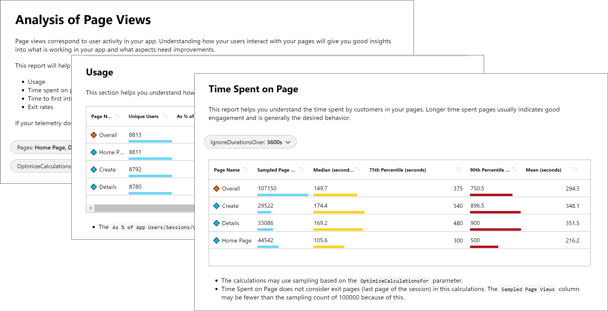
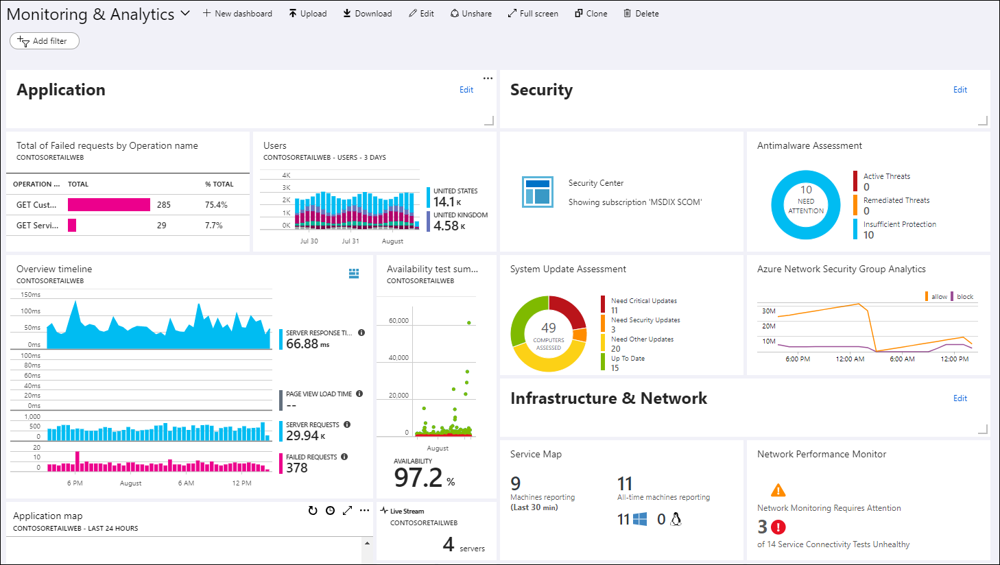
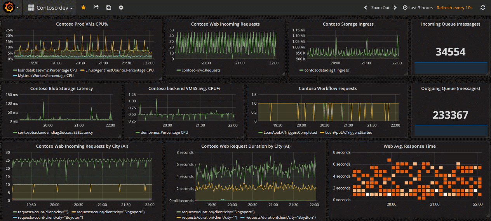
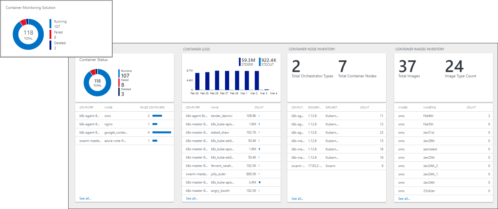

# Gegevens van Azure Monitor visualiseren
In dit artikel vindt u een overzicht van de beschikbare methoden om logboek- en metrische gegevens te visualiseren die zijn opgeslagen in Azure Monitor.

Visualisaties zoals grafieken en grafieken kunnen u helpen uw bewakingsgegevens te analyseren om problemen in te zoomen en patronen te identificeren. Afhankelijk van de tool die u gebruikt, u ook de mogelijkheid hebben om visualisaties te delen met andere gebruikers binnen en buiten uw organisatie.

## Werkmappen
[Werkmappen](../azure-monitor/app/usage-workbooks.md) zijn interactieve documenten die diepgaande inzichten bieden in uw gegevens, onderzoek en samenwerking binnen het team. Specifieke voorbeelden waarbij werkmappen nuttig zijn, zijn het oplossen van problemen met gidsen en incidentpostmortem.

### Voordelen
- Ondersteunt zowel statistieken als logboeken.
- Hiermee worden parameters ondersteund die interactieve rapporten mogelijk maken wanneer het selecteren van een element in een tabel de bijbehorende grafieken en visualisaties dynamisch bijwerkt.
- Documentachtige stroom.
- Optie voor persoonlijke of gedeelde werkmappen.
- Eenvoudige, samenwerkingsvriendelijke ontwerpervaring.
- Sjablonen ondersteunen openbare GitHub-sjabloongalerie.

### Beperkingen
- Geen automatische vernieuwing.
- Geen dichte lay-out zoals dashboards, die werkmappen minder nuttig maken als een enkel glas. Meer bedoeld voor het geven van diepere inzichten.

## Azure Dashboards
[Azure-dashboards](../azure-portal/azure-portal-dashboards.md) zijn de primaire dashboardtechnologie voor Azure. Ze zijn vooral handig bij het leveren van één ruit over uw Azure-infrastructuur en -services, zodat u snel belangrijke problemen identificeren.

### Voordelen
- Diepe integratie in Azure. Visualisaties kunnen worden vastgemaakt aan dashboards van meerdere Azure-pagina's, waaronder Metrics Explorer, Log Analytics en Toepassingsinzichten.
- Ondersteunt zowel statistieken als logboeken.
- Combineer gegevens uit meerdere bronnen, waaronder uitvoer uit [metrics explorer,](platform/metrics-charts.md) [Logboekquery's](log-query/log-query-overview.md)en [kaarten](app/app-map.md) en beschikbaarheid in Application Insights.
- Optie voor persoonlijke of gedeelde dashboards. Geïntegreerd met Azure [role based authentication (RBAC)](../role-based-access-control/overview.md).
- Automatisch vernieuwen. Het vernieuwen van statistieken is afhankelijk van het tijdsbereik met minimaal vijf minuten. Logboeken vernieuwen elk uur, met een handmatige vernieuwingsoptie op aanvraag door op het pictogram 'vernieuwen' op een bepaalde visualisatie te klikken of door het volledige dashboard te vernieuwen.
- Geparametriseerde dashboards met tijdstempels en aangepaste parameters.
- Flexibele lay-outopties.
- Volledig scherm modus.

### Beperkingen
- Beperkte controle over logboekvisualisaties zonder ondersteuning voor gegevenstabellen. Het totale aantal gegevensreeksen is beperkt tot 10 met verdere gegevensreeksen die onder een _andere_ emmer worden gegroepeerd.
- Er zijn geen aangepaste parametersondersteuning voor logboekdiagrammen.
- Logboekdiagrammen zijn beperkt tot de laatste 30 dagen.
- Logboekdiagrammen kunnen alleen worden vastgemaakt aan gedeelde dashboards.
- Geen interactiviteit met dashboardgegevens.
- Beperkte contextuele drill-down.

## Power BI
[Power BI](https://powerbi.microsoft.com/documentation/powerbi-service-get-started/) is vooral handig voor het maken van bedrijfsgerichte dashboards en rapporten, evenals rapporten die kpi-trends op lange termijn analyseren. U [de resultaten van een logboekquery importeren](platform/powerbi.md) in een Power BI-gegevensset, zodat u profiteren van de functies, zoals het combineren van gegevens uit verschillende bronnen en het delen van rapporten op het web en mobiele apparaten.

### Voordelen
- Uitgebreide visualisaties.
- Uitgebreide interactiviteit inclusief zoom-in en cross-filtering.
- Eenvoudig te delen in uw hele organisatie.
- Integratie met andere gegevens uit meerdere gegevensbronnen.
- Betere prestaties met resultaten in de cache in een kubus.

### Beperkingen
- Ondersteunt logboeken, maar geen statistieken.
- Geen Azure-integratie. Kan dashboards en modellen niet beheren via Azure Resource Manager.
- Queryresultaten moeten worden geïmporteerd in het Power BI-model om te configureren. Beperking van de resultaatgrootte en vernieuwing.
- Beperkte gegevens vernieuwen van acht keer per dag.

## Grafana
[Grafana](https://grafana.com/) is een open platform dat uitblinkt in operationele dashboards. Het is vooral handig voor het opsporen en isoleren en triaging van operationele incidenten. U [de plug-in grafana Azure Monitor-gegevensbron toevoegen](platform/grafana-plugin.md) aan uw Azure-abonnement om uw Azure-metrische gegevens te laten visualiseren.

### Voordelen
- Uitgebreide visualisaties.
- Rijk ecosysteem van databronnen.
- Gegevensinteractiviteit inclusief inzoomen.
- Ondersteunt parameters.

### Beperkingen
- Geen Azure-integratie. Kan dashboards en modellen niet beheren via Azure Resource Manager.
- Kosten voor het ondersteunen van extra Grafana-infrastructuur of extra kosten voor Grafana Cloud.

## Bouw je eigen aangepaste applicatie
U hebt toegang tot gegevens in logboek- en metrische gegevens in Azure Monitor via hun API met behulp van elke REST-client, waarmee u uw eigen aangepaste websites en toepassingen bouwen.

### Voordelen
- Volledige flexibiliteit in gebruikersinterface, visualisatie, interactiviteit en functies.
- Combineer statistieken en log gegevens met andere gegevensbronnen.

### Nadelen
- Aanzienlijke technische inspanning vereist.

## Azure-monitorweergaven

> [!IMPORTANT]
> Standpunten worden momenteel afgeschaft. Zie de overgangshandleiding voor [de overgang van de azure-monitor-weergave ontwerper naar werkmappen](platform/view-designer-conversion-overview.md) voor richtlijnen voor het converteren van weergaven naar werkmappen.

[Met weergaven in Azure Monitor](platform/view-designer.md) u aangepaste visualisaties maken met logboekgegevens. Ze worden gebruikt door [het monitoren van oplossingen](insights/solutions.md) om de gegevens die ze verzamelen te presenteren.

### Voordelen
- Uitgebreide visualisaties voor logboekgegevens.
- Weergaven exporteren en importeren om deze over te zetten naar andere resourcegroepen en -abonnementen.
- Integreert in azure monitorbeheermodel met werkruimten en bewakingsoplossingen.
- [Filters](platform/view-designer-filters.md) voor aangepaste parameters.
- Interactief, ondersteunt inzoomen op meerdere niveaus (weergave die in een andere weergave wordt ingeboord)

### Beperkingen
- Ondersteunt logboeken, maar geen statistieken.
- Geen persoonlijke opvattingen. Beschikbaar voor alle gebruikers met toegang tot de werkruimte.
- Geen automatische vernieuwing.
- Beperkte indelingsopties.
- Geen ondersteuning voor query's in meerdere werkruimten of Application Insights-toepassingen.
- Query's zijn beperkt in responsgrootte tot 8MB en query uitvoeringstijd van 110 seconden.

## Volgende stappen
- Meer informatie over de [gegevens die worden verzameld door Azure Monitor](platform/data-platform.md).
- Meer informatie over [Azure-dashboards](../azure-portal/azure-portal-dashboards.md).
- Meer informatie over [weergaven in Azure Monitor](platform/view-designer.md).
- Meer informatie over [werkmappen](../azure-monitor/app/usage-workbooks.md).
- Meer informatie over [het importeren van logboekgegevens in Power BI](../azure-monitor/platform/powerbi.md).
- Meer informatie over de [plug-in voor gegevensbron van Grafana Azure Monitor](../azure-monitor/platform/grafana-plugin.md).

