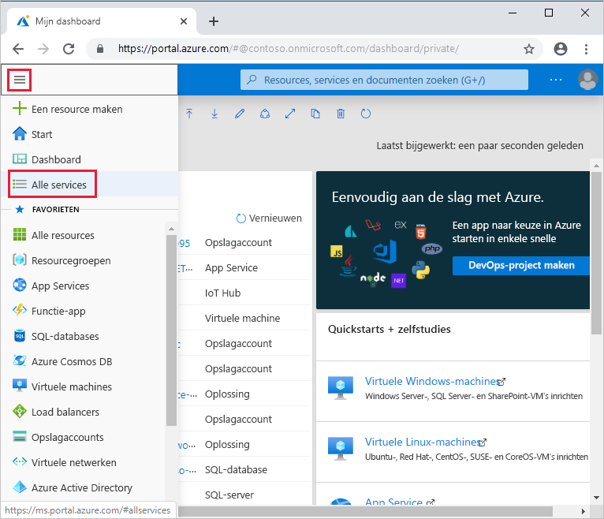
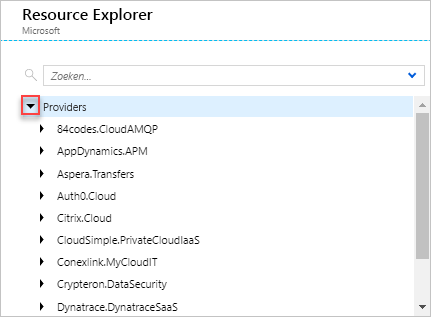
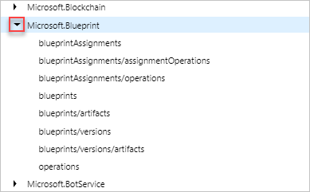

# <a name="azure-resource-providers-and-types"></a>Azure-resourceproviders en -typen

Wanneer u resources implementeert, moet u regel matig informatie over de resource providers en typen ophalen. Als u bijvoorbeeld sleutels en geheimen wilt opslaan, werkt u met de resourceprovider Microsoft.KeyVault. Deze resourceprovider biedt een resourcetype kluizen voor het maken van de sleutelkluis.

De naam van een resourcetype heeft deze syntaxis: **{resourceprovider}/{resourcetype}**. Het resourcetype voor een sleutelkluis is **Microsoft.keyvault\vaults**.

In dit artikel leert u het volgende:

* Alle resource providers in azure weer geven
* De registratie status van een resource provider controleren
* Registreer een resourceprovider
* Resource typen voor een resource provider weer geven
* Geldige locaties voor een resource type weer geven
* Geldige API-versies voor een resource type weer geven

U kunt deze stappen uitvoeren via de Azure Portal, Azure PowerShell of Azure CLI.

Zie [resource providers voor Azure-Services](azure-services-resource-providers.md)voor een lijst waarin resource providers worden toegewezen aan Azure-Services.

## <a name="register-resource-provider"></a>Resourceprovider registreren

Voordat u een resource provider gebruikt, moet uw Azure-abonnement zijn geregistreerd voor de resource provider. Met registratie configureert u uw abonnement voor samen werking met de resource provider. Sommige resource providers zijn standaard geregistreerd. Andere resource providers worden automatisch geregistreerd wanneer u bepaalde acties uitvoert. Wanneer u bijvoorbeeld een bron maakt via de portal, wordt de resource provider doorgaans voor u geregistreerd. Voor andere scenario's moet u mogelijk hand matig een resource provider registreren.

In dit artikel leest u hoe u de registratie status van een resource provider kunt controleren en waar nodig kunt registreren. U moet gemachtigd zijn om de `/register/action` bewerking voor de resource provider uit te voeren. De machtiging is opgenomen in de rollen Inzender en eigenaar.

De toepassings code mag het maken van resources voor een resource provider die zich in de **registratie** status bevindt, niet blok keren. Wanneer u de resource provider registreert, wordt de bewerking afzonderlijk voor elke ondersteunde regio uitgevoerd. Voor het maken van resources in een regio moet de registratie alleen worden uitgevoerd in die regio. Door de resource provider niet te blok keren in de registratie status, kan uw toepassing veel sneller worden uitgevoerd dan het wachten op alle regio's.

U kunt de registratie van een resource provider niet ongedaan maken wanneer u nog steeds resource typen van die resource provider in uw abonnement hebt.

## <a name="azure-portal"></a>Azure Portal

Als u alle resource providers en de registratie status voor uw abonnement wilt weer geven:

1. Meld u aan bij [Azure Portal](https://portal.azure.com).
2. Selecteer **Alle services** in het menu van Azure Portal.

    

3. Voer in het vak **alle services** het **abonnement** in en selecteer vervolgens **abonnementen**.
4. Selecteer het abonnement dat u wilt weer geven in de lijst met abonnementen.
5. **Resource providers** selecteren en de lijst met beschik bare resource providers weer geven.

    

6. Als u een resource provider wilt registreren, selecteert u **registreren**. In de vorige scherm afbeelding is de koppeling **registreren** gemarkeerd voor **micro soft. blauw druk**.

Informatie weer geven voor een bepaalde resource provider:

1. Meld u aan bij [Azure Portal](https://portal.azure.com).
2. Selecteer **Alle services** in het menu van Azure Portal.
3. In het vak **alle services** voert u **resource Explorer** in en selecteert u vervolgens **resource Explorer**.

    

4. Vouw **providers** uit door de pijl-rechts te selecteren.

    

5. Vouw een resource provider en resource type uit die u wilt weer geven.

    

6. Resource Manager wordt in alle regio's ondersteund, maar de resources die u implementeert, worden mogelijk niet ondersteund in alle regio's. Het is ook mogelijk dat er beperkingen gelden voor uw abonnement, waardoor u bepaalde regio's die ondersteuning bieden voor de resource niet kunt gebruiken. In resource Explorer worden geldige locaties voor het bron type weer gegeven.

    

7. De API-versie komt overeen met een versie van REST API bewerkingen die door de resource provider worden vrijgegeven. Als resource provider nieuwe functies maakt, wordt een nieuwe versie van de REST API vrijgegeven. In resource Explorer worden geldige API-versies voor het bron type weer gegeven.

    

## <a name="azure-powershell"></a>Azure PowerShell

Als u alle resource providers in Azure en de registratie status voor uw abonnement wilt weer geven, gebruikt u:

```azurepowershell-interactive
Get-AzResourceProvider -ListAvailable | Select-Object ProviderNamespace, RegistrationState
```

Hiermee worden resultaten geretourneerd die vergelijkbaar zijn met:

```output
ProviderNamespace                RegistrationState
-------------------------------- ------------------
Microsoft.ClassicCompute         Registered
Microsoft.ClassicNetwork         Registered
Microsoft.ClassicStorage         Registered
Microsoft.CognitiveServices      Registered
...
```

Als u alle geregistreerde resource providers voor uw abonnement wilt weer geven, gebruikt u:

```azurepowershell-interactive
 Get-AzResourceProvider -ListAvailable | Where-Object RegistrationState -eq "Registered" | Select-Object ProviderNamespace, RegistrationState | Sort-Object ProviderNamespace
```

Als u een resource provider wilt registreren, gebruikt u:

```azurepowershell-interactive
Register-AzResourceProvider -ProviderNamespace Microsoft.Batch
```

Hiermee worden resultaten geretourneerd die vergelijkbaar zijn met:

```output
ProviderNamespace : Microsoft.Batch
RegistrationState : Registering
ResourceTypes     : {batchAccounts, operations, locations, locations/quotas}
Locations         : {West Europe, East US, East US 2, West US...}
```

Als u informatie wilt weer geven voor een bepaalde resource provider, gebruikt u:

```azurepowershell-interactive
Get-AzResourceProvider -ProviderNamespace Microsoft.Batch
```

Hiermee worden resultaten geretourneerd die vergelijkbaar zijn met:

```output
{ProviderNamespace : Microsoft.Batch
RegistrationState : Registered
ResourceTypes     : {batchAccounts}
Locations         : {West Europe, East US, East US 2, West US...}

...
```

Als u de resource typen voor een resource provider wilt zien, gebruikt u:

```azurepowershell-interactive
(Get-AzResourceProvider -ProviderNamespace Microsoft.Batch).ResourceTypes.ResourceTypeName
```

Hiermee wordt het volgende geretourneerd:

```output
batchAccounts
operations
locations
locations/quotas
```

De API-versie komt overeen met een versie van REST API bewerkingen die door de resource provider worden vrijgegeven. Als resource provider nieuwe functies maakt, wordt een nieuwe versie van de REST API vrijgegeven.

Als u de beschik bare API-versies voor een resource type wilt ophalen, gebruikt u:

```azurepowershell-interactive
((Get-AzResourceProvider -ProviderNamespace Microsoft.Batch).ResourceTypes | Where-Object ResourceTypeName -eq batchAccounts).ApiVersions
```

Hiermee wordt het volgende geretourneerd:

```output
2017-05-01
2017-01-01
2015-12-01
2015-09-01
2015-07-01
```

Resource Manager wordt in alle regio's ondersteund, maar de resources die u implementeert, worden mogelijk niet ondersteund in alle regio's. Het is ook mogelijk dat er beperkingen gelden voor uw abonnement, waardoor u bepaalde regio's die ondersteuning bieden voor de resource niet kunt gebruiken.

Als u de ondersteunde locaties voor een resource type wilt ophalen, gebruikt u.

```azurepowershell-interactive
((Get-AzResourceProvider -ProviderNamespace Microsoft.Batch).ResourceTypes | Where-Object ResourceTypeName -eq batchAccounts).Locations
```

Hiermee wordt het volgende geretourneerd:

```output
West Europe
East US
East US 2
West US
...
```

## <a name="azure-cli"></a>Azure CLI

Als u alle resource providers in Azure en de registratie status voor uw abonnement wilt weer geven, gebruikt u:

```azurecli-interactive
az provider list --query "[].{Provider:namespace, Status:registrationState}" --out table
```

Hiermee worden resultaten geretourneerd die vergelijkbaar zijn met:

```output
Provider                         Status
-------------------------------- ----------------
Microsoft.ClassicCompute         Registered
Microsoft.ClassicNetwork         Registered
Microsoft.ClassicStorage         Registered
Microsoft.CognitiveServices      Registered
...
```

Als u alle geregistreerde resource providers voor uw abonnement wilt weer geven, gebruikt u:

```azurecli-interactive
az provider list --query "sort_by([?registrationState=='Registered'].{Provider:namespace, Status:registrationState}, &Provider)" --out table
```

Als u een resource provider wilt registreren, gebruikt u:

```azurecli-interactive
az provider register --namespace Microsoft.Batch
```

Retourneert een bericht dat de registratie is doorlopend.

Als u informatie wilt weer geven voor een bepaalde resource provider, gebruikt u:

```azurecli-interactive
az provider show --namespace Microsoft.Batch
```

Hiermee worden resultaten geretourneerd die vergelijkbaar zijn met:

```output
{
    "id": "/subscriptions/####-####/providers/Microsoft.Batch",
    "namespace": "Microsoft.Batch",
    "registrationsState": "Registering",
    "resourceTypes:" [
        ...
    ]
}
```

Als u de resource typen voor een resource provider wilt zien, gebruikt u:

```azurecli-interactive
az provider show --namespace Microsoft.Batch --query "resourceTypes[*].resourceType" --out table
```

Hiermee wordt het volgende geretourneerd:

```output
Result
---------------
batchAccounts
operations
locations
locations/quotas
```

De API-versie komt overeen met een versie van REST API bewerkingen die door de resource provider worden vrijgegeven. Als resource provider nieuwe functies maakt, wordt een nieuwe versie van de REST API vrijgegeven.

Als u de beschik bare API-versies voor een resource type wilt ophalen, gebruikt u:

```azurecli-interactive
az provider show --namespace Microsoft.Batch --query "resourceTypes[?resourceType=='batchAccounts'].apiVersions | [0]" --out table
```

Hiermee wordt het volgende geretourneerd:

```output
Result
---------------
2017-05-01
2017-01-01
2015-12-01
2015-09-01
2015-07-01
```

Resource Manager wordt in alle regio's ondersteund, maar de resources die u implementeert, worden mogelijk niet ondersteund in alle regio's. Het is ook mogelijk dat er beperkingen gelden voor uw abonnement, waardoor u bepaalde regio's die ondersteuning bieden voor de resource niet kunt gebruiken.

Als u de ondersteunde locaties voor een resource type wilt ophalen, gebruikt u.

```azurecli-interactive
az provider show --namespace Microsoft.Batch --query "resourceTypes[?resourceType=='batchAccounts'].locations | [0]" --out table
```

Hiermee wordt het volgende geretourneerd:

```output
Result
---------------
West Europe
East US
East US 2
West US
...
```

## <a name="next-steps"></a>Volgende stappen

* Zie [Azure Resource Manager sjablonen ontwerpen](../templates/template-syntax.md)voor meer informatie over het maken van Resource Manager-sjablonen. 
* Zie [sjabloon verwijzing voor informatie](/azure/templates/)over het weer geven van de sjabloon schema's van de resource provider.
* Zie [resource providers voor Azure-Services](azure-services-resource-providers.md)voor een lijst waarin resource providers worden toegewezen aan Azure-Services.
* Zie [Azure rest API](/rest/api/)om de bewerkingen voor een resource provider weer te geven.
