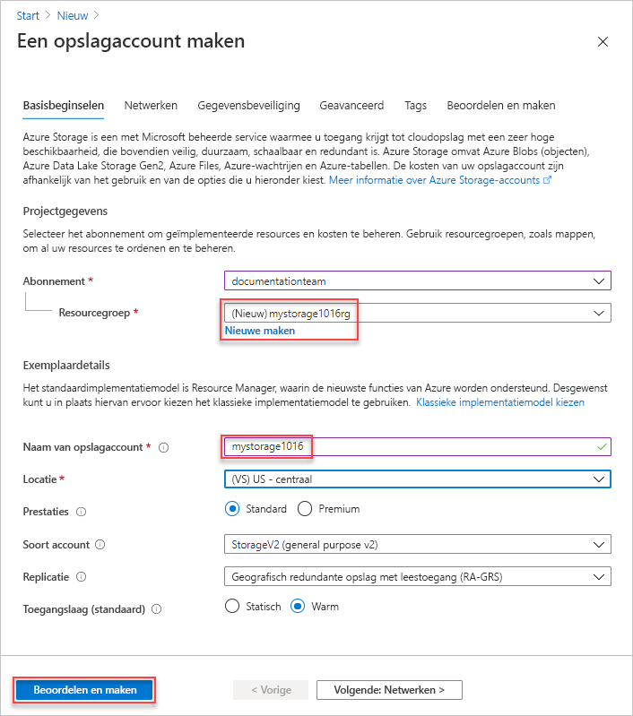
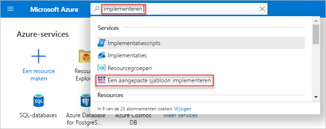

# <a name="quickstart-create-and-deploy-arm-templates-by-using-the-azure-portal"></a>Snelstart: ARM-sjablonen maken en implementeren met behulp van de Azure-portal

Meer informatie over het genereren van een ARM-sjabloon (Azure Resource Manager) met behulp van de Azure-portal en het proces van het bewerken en implementeren van de sjabloon vanuit de portal. ARM-sjablonen zijn JSON-bestanden die de resources definiëren die u voor uw oplossing moet implementeren. Zie overzicht van de implementatie van sjablonen voor het implementeren en beheren van de concepten die zijn gekoppeld aan het implementeren en beheren van uw [Azure-oplossingen.](overview.md)


Na het voltooien van de zelfstudie implementeert u een Azure Storage-account. Hetzelfde proces kan worden gebruikt voor het implementeren van andere Azure-resources.

Als u geen Azure-abonnement hebt, [maakt u een gratis account](https://azure.microsoft.com/free/) voordat u begint.

## <a name="generate-a-template-using-the-portal"></a>Een sjabloon maken via de portal

Het maken van een ARM-sjabloon vanaf nul is geen gemakkelijke taak, vooral als u nieuw bent in Azure-implementatie en u niet bekend bent met de JSON-indeling. Met behulp van de Azure-portal kunt u een resource configureren, bijvoorbeeld een Azure Storage-account. Voordat u de resource implementeert, u uw configuratie exporteren naar een sjabloon. U kunt de sjabloon opslaan voor later gebruik.

Veel ervaren sjabloonontwikkelaars gebruiken deze methode om sjablonen te genereren wanneer ze Azure-resources proberen te implementeren die ze niet kennen. Zie [Resourcegroepen exporteren naar sjablonen voor](../management/manage-resource-groups-portal.md#export-resource-groups-to-templates)meer informatie over het exporteren van sjablonen met behulp van de portal. De andere manier om een werksjabloon te vinden, is van [Azure Quickstart-sjablonen.](https://azure.microsoft.com/resources/templates/)

1. Ga in een webbrowser naar de [Azure-portal](https://portal.azure.com) en meld u aan.
1. Selecteer in het menu azure portal de optie **Een resource maken**.

    

1. Selecteer > **Opslagopslagaccount**. **Storage**

    
1. Voer de volgende informatie in:

    |Name|Waarde|
    |----|----|
    |**Resourcegroep**|Selecteer **Nieuwe maken** en geef een resourcegroepnaam naar keuze op. In de schermafbeelding is de naam van de resourcegroep *mystorage1016rg*. Een resourcegroep is een container voor Azure-resources. Een resourcegroep maakt het gemakkelijker Azure-resources te beheren. |
    |**Naam**|geef uw opslagaccount een unieke naam. De naam van het opslagaccount moet uniek zijn voor alle Azure's en alleen kleine letters en cijfers bevatten. De naam moet tussen de 3 en 24 tekens zijn. Als u een foutmelding krijgt met de tekst 'De naam van het opslagaccount 'mystorage1016' is al genomen", probeer ** &lt;dan uw naam>opslag&lt;de datum van vandaag in MMDD->**, bijvoorbeeld **johndolestorage1016**. Zie [Naamgevingsregels en beperkingen voor](/azure/architecture/best-practices/resource-naming)meer informatie.|

    Voor de overige eigenschappen kunt u de standaardwaarden gebruiken.

    

    > [!NOTE]
    > Sommige geëxporteerde sjablonen moeten worden bewerkt voordat u ze implementeren.

1. Selecteer **Controleren + maken** onderaan in het scherm. Selecteer **Niet maken** in de volgende stap.
1. Selecteer **Een sjabloon voor automatisering downloaden** onderaan in het scherm. In de portal wordt de gegenereerde sjabloon weergegeven:

    

    In het hoofdvenster wordt de sjabloon getoond. Het is een JSON-bestand met zes elementen van het hoogste niveau: `schema`, `contentVersion`, `parameters`, `variables`, `resources` en `output`. Zie [De structuur en syntaxis van ARM-sjablonen begrijpen voor](./template-syntax.md) meer informatie

    Er zijn zes parameters gedefinieerd. Een van deze parameters heet **storageAccountName**. In het tweede gemarkeerde gedeelte van de bovenstaande schermopname ziet u hoe u in de sjabloon naar deze parameter kunt verwijzen. In het volgende gedeelte bewerkt u de sjabloon zodat er voor het opslagaccount gebruik wordt gemaakt van een gegenereerde naam.

    In de sjabloon is er één Azure-resource gedefinieerd. Het type `Microsoft.Storage/storageAccounts`is . Neem een kijkje van hoe de resource is gedefinieerd, en de definitiestructuur.
1. Selecteer **Downloaden** vanaf de bovenkant van het scherm.
1. Open het gedownloade zip-bestand en sla **template.json** op uw computer op. In het volgende gedeelte gebruikt u een implementatiehulpprogramma voor sjablonen om de sjabloon te bewerken.
1. Selecteer het tabblad **Parameter** om de waarden te bekijken die u voor de parameters hebt opgegeven. Schrijf deze waarden op. U hebt ze in het volgende gedeelte (bij het implementeren van de sjabloon) weer nodig.

    

    Met behulp van zowel het sjabloonbestand als het parametersbestand u in deze zelfstudie een Azure-opslagaccount maken.

## <a name="edit-and-deploy-the-template"></a>De sjabloon bewerken en implementeren

U kunt de Azure-portal gebruiken om eenvoudige wijzigingen door te voeren in sjablonen. In deze snelstart gebruikt u het portalhulpprogramma *Sjabloonimplementatie*. In deze zelfstudie wordt *Sjabloonimplementatie* gebruikt, zodat u de hele zelfstudie kunt doen met behulp van één interface: de Azure-portal. Als u een complexere sjabloon wilt bewerken, u [overwegen visual studiocode](quickstart-create-templates-use-visual-studio-code.md)te gebruiken, die uitgebreidere bewerkingsfunctionaliteiten biedt.

> [!IMPORTANT]
> Sjabloonimplementatie biedt een interface voor het testen van eenvoudige sjablonen. Het wordt afgeraden om deze functie in productie te gebruiken. Sla in plaats daarvan uw sjablonen op in een Azure-opslagaccount of een broncodeopslagplaats zoals GitHub.

Azure vereist dat elke Azure-service een unieke naam heeft. De implementatie mislukt als u de naam van een opslagaccount invoert dat al bestaat. Om dit probleem te vermijden, voegt u een aanroep naar de sjabloonfunctie `uniquestring()` toe aan de sjabloon om een unieke naam voor de opslagaccount te genereren.

1. Selecteer in het menu azure portal of op de **startpagina** de optie **Een bron maken**.
1. In **Marketplace doorzoeken** typt u **sjabloonimplementatie**. Druk vervolgens op **ENTER**.
1. Selecteer **Sjabloonimplementatie**.

    
1. Selecteer **Maken**.
1. Selecteer **Bouw uw eigen sjabloon in de editor**.
1. Selecteer **Bestand laden** en volg de instructies voor het laden van het bestand template.json dat u in het vorige gedeelte hebt gedownload.
1. Breng de volgende drie wijzigingen aan in de sjabloon:

    

   - Verwijder de parameter **storageAccountName** zoals weergegeven in de vorige schermafbeelding.
   - Voeg één variabele genaamd **storageAccountName** toe, zoals in de vorige schermafbeelding wordt weergegeven:

       ```json
       "storageAccountName": "[concat(uniqueString(subscription().subscriptionId), 'storage')]"
       ```

       Er worden hier twee sjabloonfuncties gebruikt: `concat()` en `uniqueString()`.
   - Werk het naamelement bij van de resource **Microsoft.Storage/storageAccounts** voor gebruik van de nieuw gedefinieerde variabele in plaats van de parameter:

       ```json
       "name": "[variables('storageAccountName')]",
       ```

     De uiteindelijke sjabloon moet er als volgt uitzien:

     ```json
     {
       "$schema": "https://schema.management.azure.com/schemas/2015-01-01/deploymentTemplate.json#",
       "contentVersion": "1.0.0.0",
       "parameters": {
           "location": {
               "type": "string"
           },
           "accountType": {
               "type": "string"
           },
           "kind": {
               "type": "string"
           },
           "accessTier": {
               "type": "string"
           },
           "supportsHttpsTrafficOnly": {
               "type": "bool"
           }
       },
       "variables": {
           "storageAccountName": "[concat(uniqueString(subscription().subscriptionId), 'storage')]"
       },
       "resources": [
           {
               "name": "[variables('storageAccountName')]",
               "type": "Microsoft.Storage/storageAccounts",
               "apiVersion": "2018-07-01",
               "location": "[parameters('location')]",
               "properties": {
                   "accessTier": "[parameters('accessTier')]",
                   "supportsHttpsTrafficOnly": "[parameters('supportsHttpsTrafficOnly')]"
               },
               "dependsOn": [],
               "sku": {
                   "name": "[parameters('accountType')]"
               },
               "kind": "[parameters('kind')]"
           }
       ],
       "outputs": {}
     }
     ```
1. Selecteer **Opslaan**.
1. Voer de volgende waarden in:

    |Name|Waarde|
    |----|----|
    |**Resourcegroep**|Selecteer de naam van de resourcegroep die u in de laatste sectie hebt gemaakt. |
    |**Locatie**|Selecteer een locatie voor het opslagaccount. Bijvoorbeeld **VS - centraal**. |
    |**Accounttype**|voer voor deze snelstart **Standard_LRS** in. |
    |**Soort**|voer voor deze snelstart **StorageV2** in. |
    |**Toegangslaag**|voer voor deze snelstart **Dynamisch** in. |
    |**Alleen https-verkeer ingeschakeld**| Selecteer voor deze snelstart **true**. |
    |**Ik ga akkoord met de hierboven genoemde algemene voorwaarden**|(selecteren)|

    Dit is een schermafbeelding van een voorbeeldimplementatie:

    

1. Selecteer **Aankoop**.
1. Selecteer het belpictogram (meldingen) boven in het scherm om de implementatiestatus te zien. U ziet **Implementatie wordt uitgevoerd**. Wacht tot de implementatie is voltooid.

    

1. Selecteer **Ga naar de resourcegroep** in het deelvenster meldingen. U ziet een scherm dat vergelijkbaar is met:

    

    U ziet dat de status van de implementatie is voltooid en er slechts één opslagaccount in de resourcegroep is. De naam van het opslagaccount is een unieke tekenreeks gegenereerd door de sjabloon. Zie voor meer informatie over het gebruik van Azure storage-accounts [Snelstart: blobs uploaden, downloaden, en noteren met behulp van de Azure Portal](../../storage/blobs/storage-quickstart-blobs-portal.md).

## <a name="clean-up-resources"></a>Resources opschonen

Schoon de geïmplementeerd Azure-resources, wanneer u deze niet meer nodig hebt, op door de resourcegroep te verwijderen.

1. Selecteer **Resourcegroep** in het linkermenu van Azure Portal.
1. Voer de naam van de resourcegroep in het veld **Filter by name** in.
1. Selecteer de naam van de resourcegroep.  U ziet het opslagaccount in de resourcegroep.
1. Selecteer **Resourcegroep verwijderen** in het bovenste menu.

## <a name="next-steps"></a>Volgende stappen

In deze zelfstudie hebt u geleerd hoe u een sjabloon genereert in Azure Portal en hoe u de sjabloon via de portal implementeert. De gebruikte sjabloon in deze snelstart is een eenvoudige sjabloon met één Azure-resource. Als de sjabloon complex is, kunt u beter Visual Studio Code of Visual Studio gebruiken om de sjabloon te ontwikkelen. Zie onze nieuwe beginnerszelfstudiereeks voor meer informatie over sjabloonontwikkeling:

> [!div class="nextstepaction"]
> [Zelfstudies voor beginners](./template-tutorial-create-first-template.md)