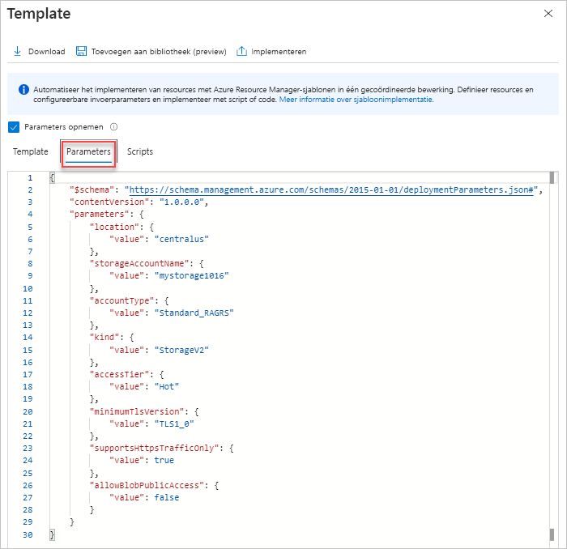
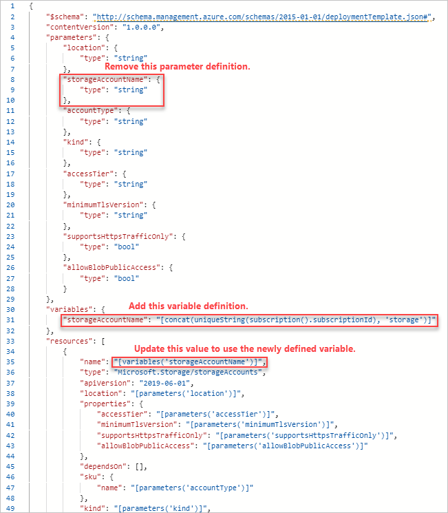

# <a name="quickstart-create-and-deploy-arm-templates-by-using-the-azure-portal"></a>Quickstart: ARM-sjablonen maken en implementeren met behulp van Azure Portal

Leer hoe u een ARM-sjabloon (Azure Resource Manager) genereert met behulp van Azure Portal en hoe u de sjabloon vanuit de portal bewerkt en implementeert. ARM-sjablonen zijn JSON-bestanden waarmee de resources worden gedefinieerd die u voor uw oplossing moet implementeren. Zie het [overzicht van het implementeren van sjablonen](overview.md) om de concepten te begrijpen die verband houden met het implementeren en beheren van Azure-oplossingen.


Na het voltooien van de zelfstudie implementeert u een Azure Storage-account. Hetzelfde proces kan worden gebruikt voor het implementeren van andere Azure-resources.

Als u geen abonnement op Azure hebt, maakt u een [gratis account](https://azure.microsoft.com/free/) voordat u begint.

## <a name="generate-a-template-using-the-portal"></a>Een sjabloon maken via de portal

Het maken van een geheel nieuwe Resource Manager-sjabloon is geen gemakkelijke taak, vooral als Azure-implementatie nieuw voor u is en u niet bekend bent met de JSON-indeling. Met behulp van de Azure-portal kunt u een resource configureren, bijvoorbeeld een Azure Storage-account. Voordat u de resource implementeert, kunt u uw configuratie naar een sjabloon exporteren. U kunt de sjabloon opslaan voor later gebruik.

Veel ervaren sjabloonontwikkelaars gebruiken deze methode om sjablonen te genereren wanneer ze Azure-resources proberen te implementeren waarmee ze niet vertrouwd zijn. Zie [Resourcegroepen exporteren naar sjablonen](../management/manage-resource-groups-portal.md#export-resource-groups-to-templates) voor meer informatie over het exporteren van sjablonen met behulp van de portal. U kunt een werksjabloon ook zoeken in [Azure-quickstart-sjablonen](https://azure.microsoft.com/resources/templates/).

1. Ga in een webbrowser naar [Azure Portal](https://portal.azure.com) en meld u aan.
1. Selecteer **Een resource maken** in het menu van de Azure-portal.

    

1. Selecteer **Opslag** > **Opslagaccount**.

    
1. Voer de volgende informatie in:

    |Naam|Waarde|
    |----|----|
    |**Resourcegroep**|Selecteer **Nieuwe maken** en geef een resourcegroepnaam naar keuze op. In de schermafbeelding is de naam van de resourcegroep *mystorage1016rg*. Een resourcegroep is een container voor Azure-resources. Een resourcegroep maakt het gemakkelijker Azure-resources te beheren. |
    |**Naam**|geef uw opslagaccount een unieke naam. De naam van het opslagaccount moet uniek zijn in Azure en mag alleen kleine letters en cijfers bevatten. De naam moet uit minimaal 3 en maximaal 24 tekens bestaan. Als er een foutbericht wordt weergegeven dat de opslagaccountnaam mystorage1016 al wordt gebruikt, probeert u **&lt;uw naam>storage&lt;huidige datum in MMDD >** , bijvoorbeeld **jandoelenstorage1016**. Zie [Naamgevingsregels en -beperkingen](/azure/architecture/best-practices/resource-naming) voor meer informatie.|

    Voor de overige eigenschappen kunt u de standaardwaarden gebruiken.

    

    > [!NOTE]
    > Sommige geëxporteerde sjablonen moeten worden bewerkt voordat u ze implementeren.

1. Selecteer **Controleren + maken** onderaan in het scherm. Selecteer in de volgende stap niet **Maken**.
1. Selecteer **Een sjabloon voor automatisering downloaden** onderaan in het scherm. In de portal wordt de gegenereerde sjabloon weergegeven:

    

    In het hoofdvenster wordt de sjabloon getoond. Het is een JSON-bestand met zes elementen van het hoogste niveau: `schema`, `contentVersion`, `parameters`, `variables`, `resources` en `output`. Zie [Informatie over de structuur en de syntaxis van ARM-sjablonen](./template-syntax.md) voor meer informatie

    Er zijn acht parameters gedefinieerd. Een van deze parameters heet **storageAccountName**. In het tweede gemarkeerde gedeelte van de bovenstaande schermopname ziet u hoe u in de sjabloon naar deze parameter kunt verwijzen. In het volgende gedeelte bewerkt u de sjabloon zodat er voor het opslagaccount gebruik wordt gemaakt van een gegenereerde naam.

    In de sjabloon is er één Azure-resource gedefinieerd. Het type is `Microsoft.Storage/storageAccounts`. Bekijk hoe de resource wordt gedefinieerd en wat de definitiestructuur is.
1. Selecteer **Downloaden** bovenin het scherm.
1. Open het gedownloade zip-bestand en sla **templat.json** op uw computer op. In het volgende gedeelte gebruikt u een implementatiehulpprogramma voor sjablonen om de sjabloon te bewerken.
1. Selecteer het tabblad **Parameter** om de waarden te bekijken die u voor de parameters hebt opgegeven. Schrijf deze waarden op. U hebt ze in het volgende gedeelte (bij het implementeren van de sjabloon) weer nodig.

    

    Met behulp van zowel het sjabloon- als het parameterbestand kunt u een resource maken: in deze zelfstudie een Azure-opslagaccount.

## <a name="edit-and-deploy-the-template"></a>De sjabloon bewerken en implementeren

U kunt de Azure-portal gebruiken om eenvoudige wijzigingen door te voeren in sjablonen. In deze snelstart gebruikt u het portalhulpprogramma *Sjabloonimplementatie*. In deze zelfstudie wordt *Sjabloonimplementatie* gebruikt, zodat u de hele zelfstudie kunt doen met behulp van één interface: de Azure-portal. Als u een complexere sjabloon wilt bewerken, kunt u gebruikmaken van [Visual Studio Code](quickstart-create-templates-use-visual-studio-code.md), dat meer bewerkingsfuncties heeft.

> [!IMPORTANT]
> De sjabloonimplementatie biedt een interface voor het testen van eenvoudige sjablonen. Het is niet raadzaam om deze functie in productie te gebruiken. Sla uw sjablonen in plaats daarvan op in een Azure-opslagaccount of op een opslagplaats voor broncode, zoals GitHub.

Azure vereist dat elke Azure-service een unieke naam heeft. De implementatie mislukt als u de naam van een opslagaccount invoert dat al bestaat. Om dit probleem te vermijden, voegt u een aanroep naar de sjabloonfunctie `uniquestring()` toe aan de sjabloon om een unieke naam voor de opslagaccount te genereren.

1. Typ in het Azure Portal-menu in het zoekvak **implementeren** en selecteer vervolgens **Een aangepaste sjabloon implementeren**.

    

1. Selecteer **Bouw uw eigen sjabloon in de editor**.
1. Selecteer **Bestand laden** en volg de instructies voor het laden van het bestand template.json dat u in het vorige gedeelte hebt gedownload.
1. Breng de volgende drie wijzigingen aan in de sjabloon:

    

   - Verwijder de parameter **storageAccountName** , zoals in de vorige schermopname wordt weergegeven.
   - Voeg een variabele toe met de naam **storageAccountName** , zoals in de vorige schermopname wordt weergegeven:

       ```json
       "storageAccountName": "[concat(uniqueString(subscription().subscriptionId), 'storage')]"
       ```

       Er worden hier twee sjabloonfuncties gebruikt: `concat()` en `uniqueString()`.
   - Werk het naamelement bij van de resource **Microsoft.Storage/storageAccounts** voor gebruik van de nieuw gedefinieerde variabele in plaats van de parameter:

       ```json
       "name": "[variables('storageAccountName')]",
       ```

     De uiteindelijke sjabloon moet er als volgt uitzien:

     ```json
     {
       "$schema": "http://schema.management.azure.com/schemas/2015-01-01/deploymentTemplate.json#",
       "contentVersion": "1.0.0.0",
       "parameters": {
         "location": {
           "type": "string"
         },
         "accountType": {
           "type": "string"
         },
         "kind": {
           "type": "string"
         },
         "accessTier": {
           "type": "string"
         },
         "minimumTlsVersion": {
           "type": "string"
         },
         "supportsHttpsTrafficOnly": {
          "type": "bool"
         },
         "allowBlobPublicAccess": {
           "type": "bool"
         }
       },
       "variables": {
         "storageAccountName": "[concat(uniqueString(subscription().subscriptionId), 'storage')]"
       },
       "resources": [
         {
           "name": "[variables('storageAccountName')]",
           "type": "Microsoft.Storage/storageAccounts",
           "apiVersion": "2019-06-01",
           "location": "[parameters('location')]",
           "properties": {
             "accessTier": "[parameters('accessTier')]",
             "minimumTlsVersion": "[parameters('minimumTlsVersion')]",
             "supportsHttpsTrafficOnly": "[parameters('supportsHttpsTrafficOnly')]",
             "allowBlobPublicAccess": "[parameters('allowBlobPublicAccess')]"
           },
           "dependsOn": [],
           "sku": {
             "name": "[parameters('accountType')]"
           },
           "kind": "[parameters('kind')]",
           "tags": {}
         }
       ],
       "outputs": {}
     }
     ```

1. Selecteer **Opslaan**.
1. Voer de volgende waarden in:

    |Naam|Waarde|
    |----|----|
    |**Resourcegroep**|Selecteer de resourcegroepsnaam die u in de vorige sectie hebt gemaakt. |
    |**Regio**|Selecteer een locatie voor de resourcegroep. Bijvoorbeeld **VS - centraal**. |
    |**Locatie**|Selecteer een locatie voor het opslagaccount. Bijvoorbeeld **VS - centraal**. |
    |**Accounttype**|voer voor deze snelstart **Standard_LRS** in. |
    |**Soort**|voer voor deze snelstart **StorageV2** in. |
    |**Toegangslaag**|voer voor deze snelstart **Dynamisch** in. |
    |**Minimale TLS-versie**|Voer **TLS1_0** in. |
    |**Ondersteunt alleen HTTPS-verkeer**| Selecteer voor deze snelstart **true**. |
    |**Openbare blobtoegang toestaan**| Selecteer voor deze snelstart **false**. |

1. Selecteer **Controleren + maken**.
1. Selecteer **Maken**.
1. Selecteer het belpictogram (meldingen) boven in het scherm om de implementatiestatus te zien. U ziet **Implementatie wordt uitgevoerd**. Wacht tot de implementatie is voltooid.

    

1. Selecteer **Ga naar de resourcegroep** in het deelvenster meldingen. U ziet een scherm dat vergelijkbaar is met:

    

    U ziet dat de status van de implementatie is voltooid en er slechts één opslagaccount in de resourcegroep is. De naam van het opslagaccount is een unieke tekenreeks gegenereerd door de sjabloon. Meer informatie over Azure-opslagaccounts vindt u in [Quickstart: blobs uploaden, downloaden en vermelden met behulp van Azure Portal](../../storage/blobs/storage-quickstart-blobs-portal.md).

## <a name="clean-up-resources"></a>Resources opschonen

Schoon de geïmplementeerd Azure-resources, wanneer u deze niet meer nodig hebt, op door de resourcegroep te verwijderen.

1. Selecteer **Resourcegroep** in het linkermenu van Azure Portal.
1. Voer de naam van de resourcegroep in het veld **Filter by name** in.
1. Selecteer de naam van de resourcegroep.  U ziet het opslagaccount in de resourcegroep.
1. Selecteer **Resourcegroep verwijderen** in het bovenste menu.

## <a name="next-steps"></a>Volgende stappen

In deze zelfstudie hebt u geleerd hoe u een sjabloon genereert in Azure Portal en hoe u de sjabloon via de portal implementeert. De gebruikte sjabloon in deze snelstart is een eenvoudige sjabloon met één Azure-resource. Als de sjabloon complex is, kunt u beter Visual Studio Code of Visual Studio gebruiken om de sjabloon te ontwikkelen. Zie voor meer informatie over het ontwikkelen van sjablonen onze nieuwe zelfstudiereeks voor beginners:

> [!div class="nextstepaction"]
> [Zelfstudies voor beginners](./template-tutorial-create-first-template.md)
