# Quickstart: Een Azure SQL Managed Instance maken
[!INCLUDE[appliesto-sqlmi](../includes/appliesto-sqlmi.md)]

In deze quickstart leert u hoe u een [met Azure SQL beheerd exemplaar](sql-managed-instance-paas-overview.md) maakt in de Azure-portal.

> [!IMPORTANT]
> Raadpleeg [Ondersteunde regio’s](resource-limits.md#supported-regions) en [Ondersteunde abonnementstypen](resource-limits.md#supported-subscription-types) voor de beperkingen.

## Door SQL beheerd exemplaar maken

Volg deze stappen om een Azure SQL Manged Instance te maken: 

### Meld u aan bij Azure Portal

Als u nog geen abonnement op Azure hebt, [maak dan een gratis account](https://azure.microsoft.com/free/).

1. Meld u aan bij de [Azure-portal](https://portal.azure.com/).
1. Selecteer **Azure SQL** in het linkermenu van de Azure-portal. Als **Azure SQL** niet in de lijst staat, selecteert u **Alle services** en voert u vervolgens **Azure SQL** in het zoekvak in.
1. Selecteer **+ Toevoegen** om de pagina **SQL-implementatieoptie selecteren** te openen. U kunt aanvullende informatie over een met Azure SQL beheerd exemplaar bekijken door **Details weergeven** te selecteren op de tegel **SQL Managed Instance**.
1. Selecteer **Maken**.

   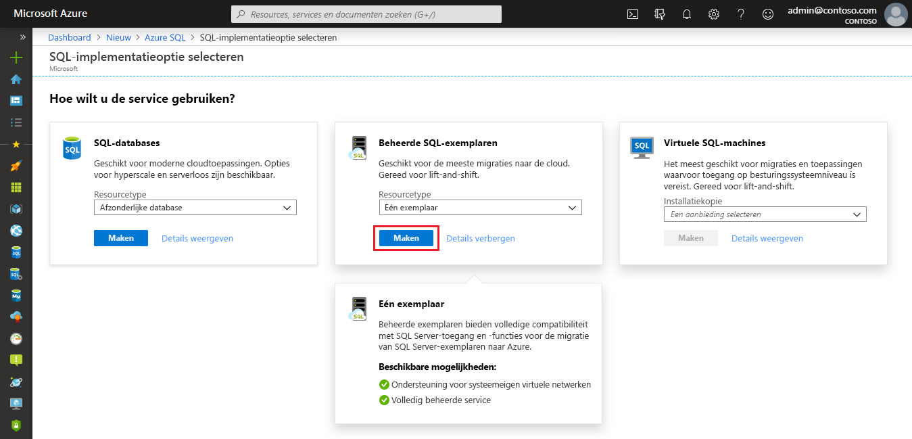

4. Gebruik de tabbladen in het inrichtingsformulier **Een met Azure SQL beheerd exemplaar maken** om vereiste en optionele informatie toe te voegen. In de volgende secties worden deze tabbladen in meer detail beschreven.

### Tabblad Basisbeginselen

- Vul verplichte gegevens in die vereist zijn op het tabblad **Basisbeginselen**. Dit is een set informatie die minimaal is vereist voor het inrichten van een met SQL beheerd exemplaar.

   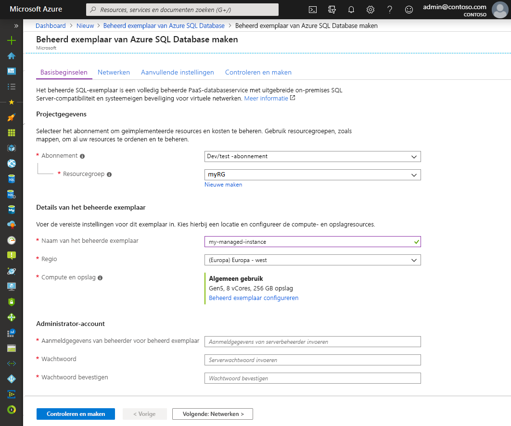

   Gebruik de onderstaande tabel als referentie voor informatie die op dit tabblad is vereist.

   | Instelling| Voorgestelde waarde | Beschrijving |
   | ------ | --------------- | ----------- |
   | **Abonnement** | Uw abonnement. | Een abonnement met toestemming voor het maken van nieuwe resources. |
   | **Resourcegroep** | een nieuwe of bestaande resourcegroep.|Zie [Naming conventions](/azure/architecture/best-practices/resource-naming) (Naamgevingsconventies) voor geldige resourcegroepnamen.|
   | **Naam van het beheerde exemplaar** | Een geldige naam.|Zie [Naming conventions](/azure/architecture/best-practices/resource-naming) (Naamgevingsconventies) voor geldige namen.|
   | **Regio** |De regio waarin u een met SQL beheerd exemplaar wilt maken.|Zie [Azure-regio's](https://azure.microsoft.com/regions/) voor informatie over regio's.|
   | **Beheerdersaanmeldgegevens voor het beheerde exemplaar** | Een geldige gebruikersnaam. | Zie [Naming conventions](/azure/architecture/best-practices/resource-naming) (Naamgevingsconventies) voor geldige namen. Maak geen gebruik van 'serverbeheerder' aangezien dit een rol is die op serverniveau is gereserveerd.|
   | **Wachtwoord** | Een geldig wachtwoord.| Het wachtwoord moet minstens 16 tekens lang zijn en moet voldoen aan de [gedefinieerde complexiteitsvereisten](../../virtual-machines/windows/faq.md#what-are-the-password-requirements-when-creating-a-vm).|

- Selecteer **Beheerd exemplaar configureren** om de grootte van reken- en opslagresources te bepalen en de prijscategorieën te controleren. Gebruik de schuifregelaars of tekstvakken om de hoeveelheid opslagruimte en het aantal virtuele kernen op te geven. Wanneer u klaar bent, selecteert u **Toepassen** om uw selectie op te slaan. 

   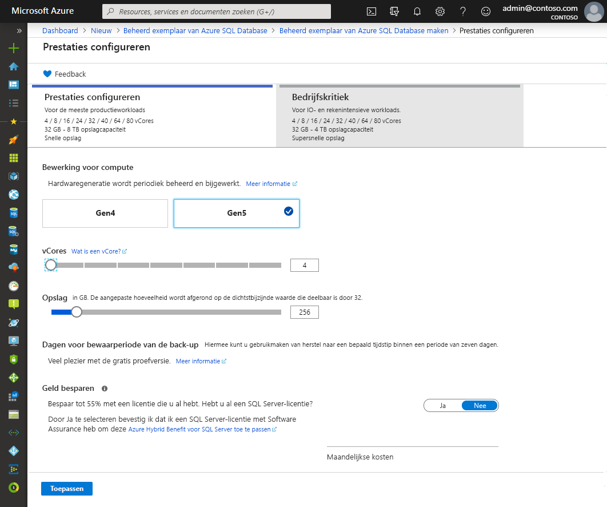

- Als u uw keuzes wilt bekijken voordat u een met SQL beheerd exemplaar maakt, selecteert u **Controleren en maken**. U kunt ook de netwerkopties configureren door te selecteren **Volgende: Netwerken**.

### Tabblad Netwerken

- Vul optionele informatie in op het tabblad **Netwerken**. Als u deze informatie weglaat, worden de standaardinstellingen toegepast via de portal.

   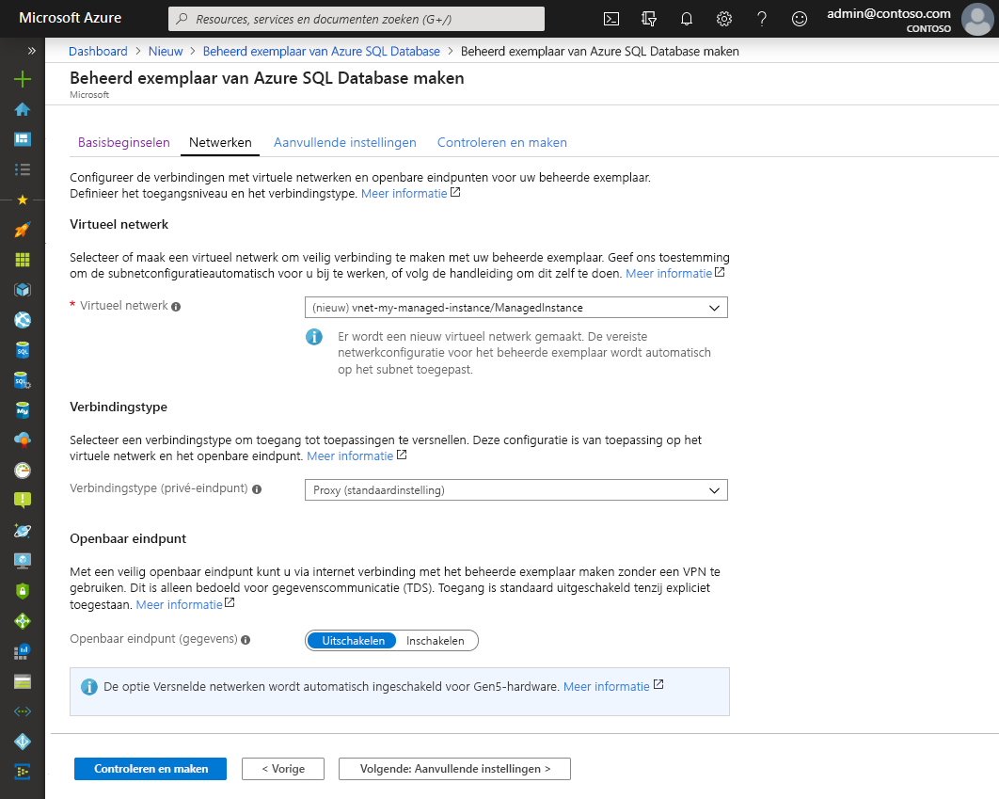

   Gebruik de onderstaande tabel als referentie voor informatie die op dit tabblad is vereist.

   | Instelling| Voorgestelde waarde | Beschrijving |
   | ------ | --------------- | ----------- |
   | **Virtueel netwerk** | Selecteer **Nieuw virtueel netwerk maken** of een geldig virtueel netwerk en subnet.| Als een netwerk/subnet niet beschikbaar is, moet het worden [gewijzigd om te voldoen aan de netwerkvereisten](vnet-existing-add-subnet.md) voordat u het kunt selecteren als doel voor het nieuwe met SQL beheerd exemplaar. Zie [Een virtueel netwerk configureren voor een met SQL beheerd exemplaar](connectivity-architecture-overview.md) voor informatie over de vereisten voor het configureren van de netwerkomgeving voor een met SQL beheerd exemplaar. |
   | **Verbindingstype** | Kies tussen het verbindingstype Proxy of Omleiding.|Zie [Verbindingstype voor Azure SQL Managed Instance](../database/connectivity-architecture.md#connection-policy) voor meer informatie over verbindingstypen.|
   | **Openbaar eindpunt**  | Selecteer **Inschakelen**. | Als u wilt dat een met SQL beheerd exemplaar toegankelijk is via het openbare gegevenseindpunt, moet u deze optie inschakelen. | 
   | **Toegang toestaan vanaf** (als**Openbaar eindpunt** is ingeschakeld) | Selecteer een van de opties.   |In de portal kunt u een beveiligingsgroep configureren met een openbaar eindpunt.     Selecteer op basis van uw scenario een van de volgende opties:   <ul> <li>**Azure-services**: We raden deze optie aan wanneer u verbinding maakt vanuit Power BI of een andere service voor meerdere tenants. </li> <li> **Internet**: Gebruik dit voor testdoeleinden wanneer u snel een met SQL beheerd exemplaar wilt maken. Dit wordt niet aanbevolen voor productieomgevingen. </li> <li> **Geen toegang**: Met deze optie maakt u een beveiligingsregel voor **Weigeren**. Wijzig deze regel om een met SQL beheerd exemplaar te maken dat toegankelijk is via een openbaar eindpunt. </li> </ul>   Zie [Een met Azure SQL beheerd exemplaar veilig gebruiken met een openbaar eindpunt](public-endpoint-overview.md) voor meer informatie over de beveiliging van een openbaar eindpunt.|

- Selecteer **Controleren en maken** om uw keuzes te controleren voordat u een met SQL beheerd exemplaar maakt. Of configureer meer aangepaste instellingen door te selecteren **Volgende: Aanvullende instellingen**.

### Aanvullende instellingen

- Vul optionele informatie in op het tabblad **Aanvullende instellingen**. Als u deze informatie weglaat, worden in de portal de standaardinstellingen toegepast.

   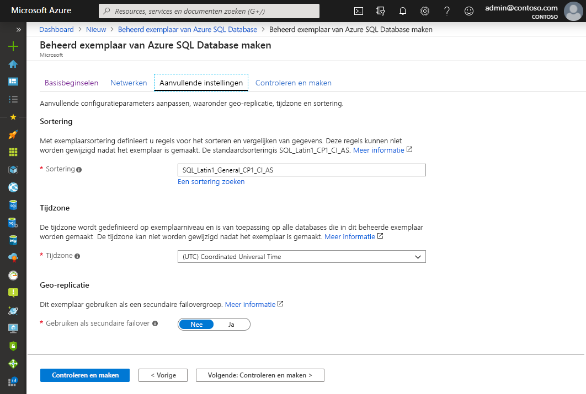

   Gebruik de onderstaande tabel als referentie voor informatie die op dit tabblad is vereist.

   | Instelling| Voorgestelde waarde | Beschrijving |
   | ------ | --------------- | ----------- |
   | **Sortering** | Kies de sortering die u wilt gebruiken voor het met SQL beheerde exemplaar. Als u databases migreert vanuit SQL Server, controleert u de bronsortering met behulp van `SELECT SERVERPROPERTY(N'Collation')` en door deze waarde te gebruiken.| Raadpleeg [De serversortering instellen of wijzigen](https://docs.microsoft.com/sql/relational-databases/collations/set-or-change-the-server-collation) voor informatie over sorteringen.|   
   | **Tijdzone** | Selecteer de tijdzone die het met SQL beheerde exemplaar gaat observeren.|Zie [Tijdzones](timezones-overview.md) voor meer informatie.|
   | **Gebruiken als secundaire failover** | Selecteer **Ja**. | Schakel deze optie in om het met SQL beheerde exemplaar te gebruiken als een secundaire failovergroep.|
   | **Primair met SQL beheerd exemplaar** (als **Gebruiken als secundaire failover** is ingesteld op **Ja**) | Kies een bestaand primair met SQL beheerd exemplaar dat in dezelfde DNS-zone wordt gekoppeld aan het met SQL beheerde exemplaar dat u gaat maken. | Met deze stap wordt configuratie van de failovergroep na het maken ingeschakeld. Zie [Zelfstudie: Een met SQL beheerd exemplaar toevoegen aan een failovergroep](failover-group-add-instance-tutorial.md).|

## Beoordelen en maken

1. Selecteer het tabblad **Controleren en maken** om uw keuzes te controleren voordat u het met SQL beheerde exemplaar maakt.

   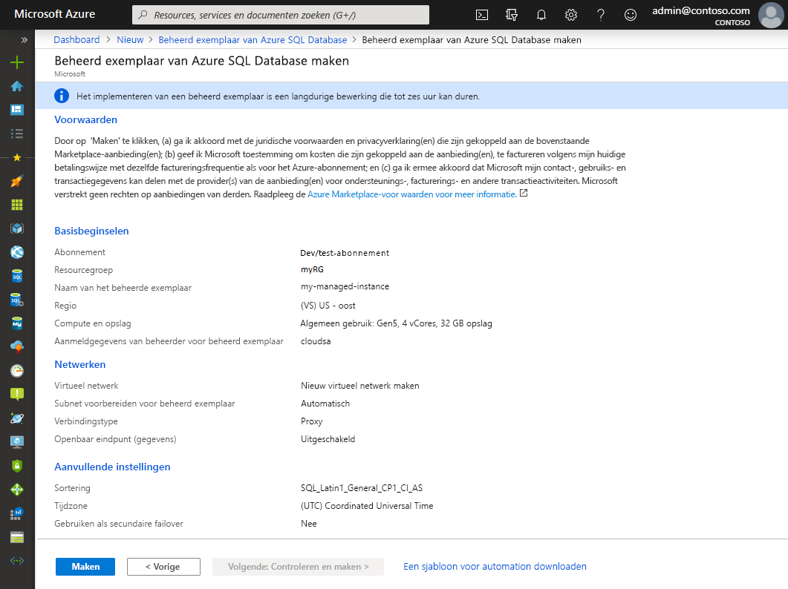

1. Selecteer **Maken** om te beginnen met inrichten van het met SQL beheerde exemplaar.

> [!IMPORTANT]
> Een met SQL beheerd exemplaar implementeren is een langlopende bewerking. De implementatie van het eerste exemplaar in het subnet duurt doorgaans veel langer dan implementeren in een subnet dat al bestaande met SQL beheerd exemplaren bevat. Raadpleeg [Bewerkingen voor SQL Managed Instance-beheer](sql-managed-instance-paas-overview.md#management-operations) voor de gemiddelde inrichtingsduur.

## Implementatievoortgang bewaken

1. Selecteer het pictogram **Meldingen** om de status van de implementatie te bekijken.

   

1. Selecteer **Implementatie in uitvoering** in de melding om het SQL Managed Instance-venster te openen en de implementatievoortgang verder te bewaken. 

> [!TIP]
> Als u de webbrowser of het scherm met de implementatievoortgang hebt afgesloten, volgt u deze stappen om dit scherm weer te vinden:
> 1. Open in de Azure-portal de resourcegroep (op het tabblad **Basisbeginselen**) waarin u een met SQL beheerd exemplaar gaat implementeren.
> 2. Selecteer **Implementaties**.
> 3. Selecteer de SQL Managed Instance-implementatie die wordt uitgevoerd.

> [!IMPORTANT]
> Als u de aanmaakstatus van het met SQL beheerde exemplaar wilt ophalen, moet u over **leesmachtigingen** beschikken voor de resourcegroep. Als u deze machtigingen niet hebt of als deze zijn ingetrokken tijdens het maken van het met SQL beheerde exemplaar, is het exemplaar mogelijk niet zichtbaar in de lijst met implementaties voor resourcegroepen.
>

## Gemaakte resources weergeven

Nadat het met SQL beheerde exemplaar is geïmplementeerd, kunt u als volgt de gemaakte resources weergeven:

1. Open de resourcegroep voor het met SQL beheerde exemplaar. 

   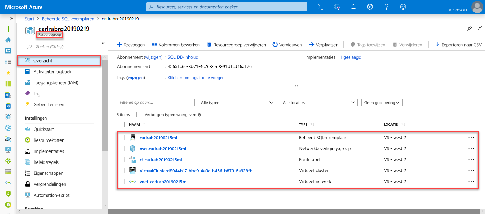

## Netwerkinstellingen weergeven en aanpassen

Als u de netwerkinstellingen wilt aanpassen, bekijkt u het volgende:

1. Selecteer de routetabel om de UDR (door de gebruiker gedefinieerde route) op te geven die voor u is gemaakt.

   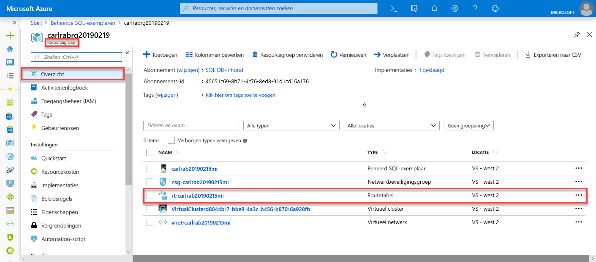

2. Bekijk de vermeldingen in de routetabel om verkeer vanuit en binnen het virtuele netwerk van het met SQL beheerde exemplaar door te sturen. Als u de routetabel handmatig maakt of configureert, moet u deze vermeldingen maken in de routetabel van het met SQL beheerde exemplaar.

   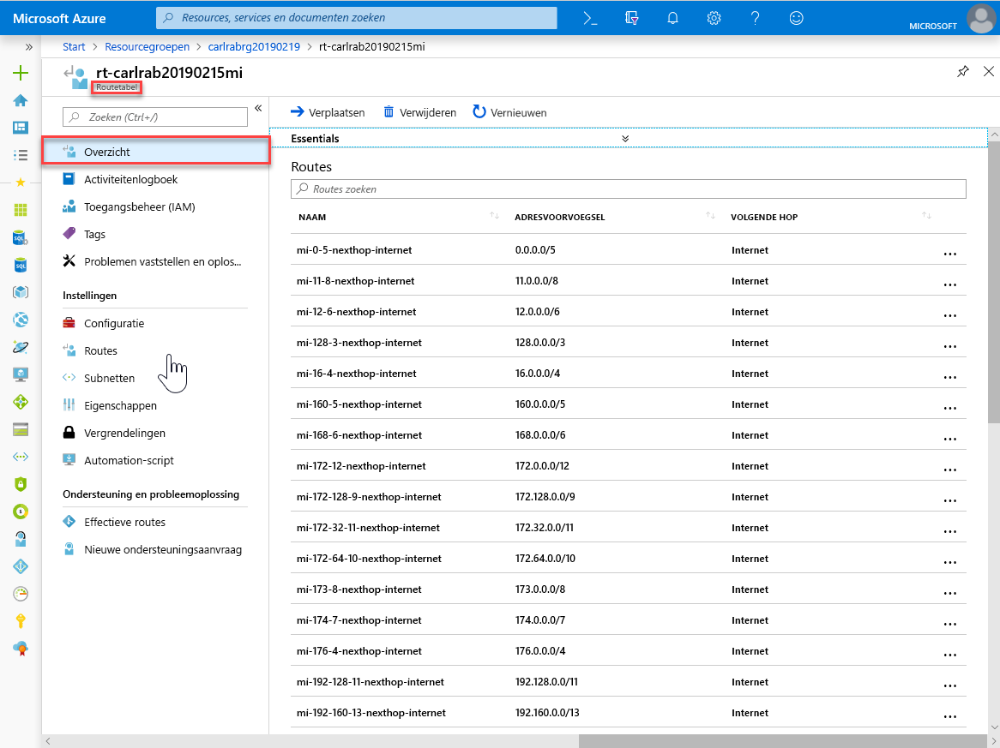

3. Ga terug naar de resourcegroep en selecteer de netwerkbeveiligingsgroep.

   

4. Bekijk de inkomende en uitgaande beveiligingsregels. 

   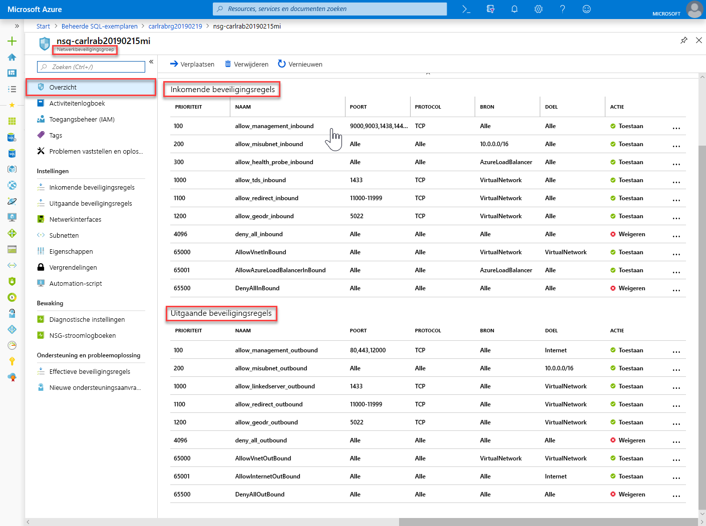

> [!IMPORTANT]
> Als u een openbaar eindpunt hebt geconfigureerd voor het met SQL beheerde exemplaar, moet u poorten openen voor netwerkverkeer dat verbindingen met SQL Managed Instance toestaat via openbaar internet. Zie [Een openbaar eindpunt configureren voor SQL Managed Instance](public-endpoint-configure.md#allow-public-endpoint-traffic-on-the-network-security-group) voor meer informatie.
>

## Details over de verbinding met SQL Managed Instance ophalen

Als u verbinding wilt maken met SQL Managed Instance, voert u de volgende stappen uit om de hostnaam en de FQDN (Fully Qualified Domain Name) op te halen:

1. Ga terug naar de resourcegroep en selecteer uw met SQL beheerde exemplaar.

   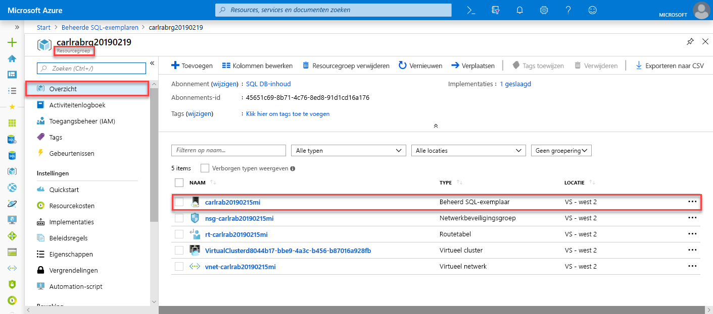

2. Ga naar het tabblad **Overzicht** naar de eigenschap **Host**. Kopieer de hostnaam voor het met SQL beheerde exemplaar voor gebruik in de volgende quickstart.

   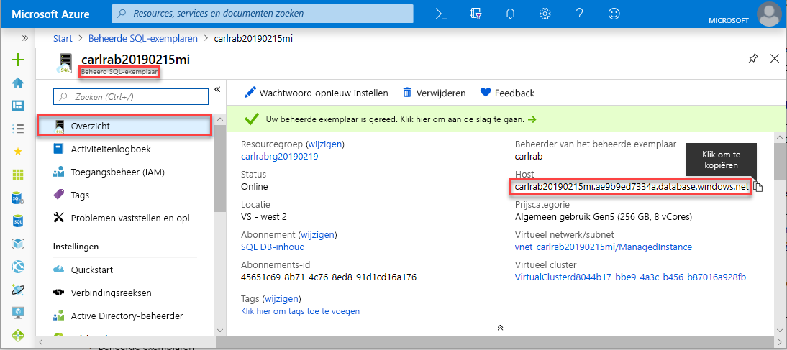

   De gekopieerde waarde vertegenwoordigt een FQDN die kan worden gebruikt om verbinding te maken met SQL Managed Instance. Deze is vergelijkbaar met het volgende voorbeeld: *uw_hostnaam.a1b2c3d4e5f6.database.windows.net*.

## Volgende stappen

Meer informatie over het verbinding maken met een met SQL beheerd exemplaar:
- Zie [Uw toepassingen verbinden met een met SQL beheerd exemplaar](connect-application-instance.md) voor een overzicht van de verbindingsopties voor toepassingen.
- Zie [Een verbinding vanaf een virtuele Azure-machine configureren](connect-vm-instance-configure.md) voor een quickstart over verbinding maken met een met SQL beheerd exemplaar vanaf een virtuele Azure-machine.
- Zie [Een punt-naar-site-verbinding configureren](point-to-site-p2s-configure.md) voor een quickstart over verbinding maken met een met SQL beheerd exemplaar vanaf een on-premises clientcomputer met behulp van een punt-naar-site-verbinding.

Als u een bestaande SQL Server-database van on-premises wilt herstellen naar een met SQL beheerd exemplaar: 
- Gebruik de [Azure Database Migration Service voor migratie](../../dms/tutorial-sql-server-to-managed-instance.md) om te herstellen vanuit een back-upbestand van de database. 
- Gebruik de [opdracht T-SQL RESTORE](restore-sample-database-quickstart.md) om te herstellen vanuit een back-upbestand van een database.

Zie [Azure SQL Managed Instance bewaken met Azure SQL-analyse](../../azure-monitor/insights/azure-sql.md) voor geavanceerde bewaking van de databaseprestaties in SQL Managed Instance, met ingebouwde intelligentie voor het oplossen van problemen.
