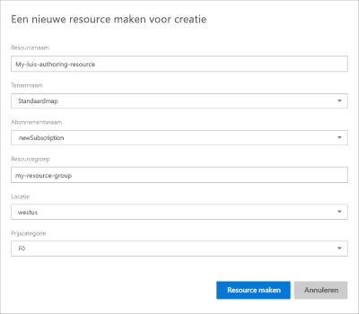

# <a name="steps-to-migrate-to-the-azure-authoring-resource"></a>Stappen voor het migreren naar de Azure-ontwerp bron

Migreer vanuit de Language Understanding-Portal (LUIS) alle apps die u hebt aangeschaft voor het gebruik van de Azure-ontwerp bron.

## <a name="prerequisites"></a>Vereisten

* U **kunt ook**een back-up maken van de apps uit de lijst met apps van de Luis-portal door elke app te exporteren of de export- [API](https://westus.dev.cognitive.microsoft.com/docs/services/5890b47c39e2bb17b84a55ff/operations/5890b47c39e2bb052c5b9c40)te gebruiken.
* U **kunt desgewenst**de collaborator's-lijst van elke app opslaan. Alle deel nemers kunnen een e-mail verzenden als onderdeel van het migratie proces.
* **Vereist**, u moet een Azure- [abonnement](https://azure.microsoft.com/free/)hebben. Voor een deel van het abonnements proces zijn facturerings gegevens vereist. U kunt echter gratis (F0) prijs categorieën gebruiken wanneer u LUIS gebruikt. Mogelijk hebt u uiteindelijk een betaalde laag nodig, omdat uw gebruik toeneemt. 

Als u geen Azure-abonnement hebt, [meldt u zich](https://azure.microsoft.com/free/)aan. 

## <a name="access-the-migration-process"></a>Toegang tot het migratie proces

U wordt wekelijks gevraagd uw apps te migreren. U kunt dit venster annuleren zonder te migreren. Als u vóór de volgende geplande periode wilt migreren, kunt u beginnen met het migratie proces vanaf het **vergrendelings** pictogram op de bovenste werk balk van de Luis-Portal. 

## <a name="app-owner-begins-the-migration-process"></a>App-eigenaar begint met het migratie proces

Het migratie proces is beschikbaar als u de eigenaar bent van een LUIS-app. 

1. Meld u aan bij de [Luis-Portal](https://www.luis.ai) en ga akkoord met de gebruiks voorwaarden.
1. In het pop-upvenster migratie kunt u de migratie voortzetten of later migreren. Selecteer **nu migreren**. Als u ervoor kiest om later te migreren, hebt u negen maanden om te migreren naar de nieuwe ontwerp sleutel in Azure.

    

1. Als een van uw apps deel nemers heeft, wordt u gevraagd **hen een e-mail te sturen** om hen te laten weten over de migratie. Dit is een optionele stap. 

    Wanneer u uw account hebt gemigreerd naar Azure, zijn uw apps niet langer beschikbaar voor deel nemers.

    Voor elke samen werker en app wordt de standaard e-mail toepassing geopend met een e-mail met een lichte opmaak. U kunt de e-mail bewerken voordat u deze verzendt.

    De e-mail sjabloon bevat de exacte App-ID en app-naam. 

    ```html
    Dear Sir/Madam,
    
    I will be migrating my LUIS account to Azure. Consequently, you will no longer have access to the following app:
    
    App Id: <app-ID-omitted>
    App name: Human Resources
    
    Thank you
    ```

1. Kies voor het maken van een LUIS-ontwerp bron door starten te selecteren door een bewerkings **resource te maken om uw apps naar te migreren**. 

    

1. Voer in het volgende venster de gegevens van de resource sleutel in. Nadat u de gegevens hebt ingevoerd, selecteert u **resource maken**. U kunt per regio een gratis beschik bare versie van het ontwerp van resources hebben.

    

    Wanneer **u een nieuwe ontwerp bron maakt**, geeft u de volgende informatie op: 

    * **Resource naam** : een door u gekozen aangepaste naam, die wordt gebruikt als onderdeel van de URL voor uw ontwerp-en Voorspellings eindpunt query's.
    * **Tenant** : de Tenant waaraan uw Azure-abonnement is gekoppeld. 
    * **Abonnements naam** : het abonnement dat wordt gefactureerd voor de resource.
    * **Resource groep** : de naam van een aangepaste resource groep die u kiest of maakt. Met resource groepen kunt u Azure-resources groeperen voor toegang en beheer. 
    * **Locatie** : de locatie keuze is gebaseerd op de selectie van de **resource groep** .
    * **Prijs categorie** : de prijs categorie bepaalt de maximale trans actie per seconde en maand. 

1. Valideer uw ontwerp bron en **Migreer nu**.

    

1. Wanneer de ontwerp bron is gemaakt, wordt het bericht weer gegeven. Selecteer **sluiten** om het pop-upvenster te sluiten.

    

    In de lijst **mijn apps** worden de apps weer gegeven die zijn gemigreerd naar de nieuwe ontwerp bron. 

    U hoeft niet de sleutel van de ontwerp bron te weten om uw apps in de LUIS-portal te kunnen bewerken. Als u van plan bent om uw apps programmatisch te bewerken, hebt u de sleutel waarden van de ontwerp functie nodig. Deze waarden worden weer gegeven op de pagina **Manage-> Azure-resources** in de Luis-Portal en zijn ook beschikbaar in de Azure Portal op de pagina **sleutels** van de resource.  

1. Voordat u toegang krijgt tot uw apps, selecteert u het abonnement en de LUIS-ontwerp bron om de apps te zien die u kunt ontwerpen.

    


## <a name="app-contributor-begins-the-migration-process"></a>De Inzender voor apps start het migratie proces

Volg dezelfde stappen als de eigenaar van de app voor migratie. Het proces maakt een nieuwe ontwerp bron van het type `LUIS.Authoring`. 

U moet uw account migreren om als bijdrager toe te voegen aan gemigreerde apps waarvan anderen eigenaar zijn.  

## <a name="after-the-migration-process-add-contributors-to-your-authoring-resource"></a>Voeg na het migratie proces mede werkers toe aan uw ontwerp bron

[!INCLUDE [Manage contributors for the Azure authoring resource for language understanding](./includes/manage-contributors-authoring-resource.md)]

Meer informatie [over het toevoegen van mede](luis-how-to-collaborate.md)werkers. 

## <a name="troubleshooting-errors-with-the-migration-process"></a>Problemen met het migratie proces oplossen

Als er tijdens het migratie proces een `MissingSubscriptionRegistration` fout in de LUIS-portal wordt weer gegeven, maakt u een cognitieve service resource in de [Azure Portal](luis-how-to-azure-subscription.md#create-resources-in-the-azure-portal) of [Azure cli](luis-how-to-azure-subscription.md#create-resources-in-azure-cli). Meer informatie over [oorzaken van deze fout](../../azure-resource-manager/resource-manager-register-provider-errors.md#cause).

## <a name="next-steps"></a>Volgende stappen


* [Begrippen](luis-concept-keys.md) over het ontwerpen en runtime-sleutels bekijken
* Controleren [hoe sleutels worden toegewezen](luis-how-to-azure-subscription.md) en [mede](luis-how-to-collaborate.md) werkers toevoegen
