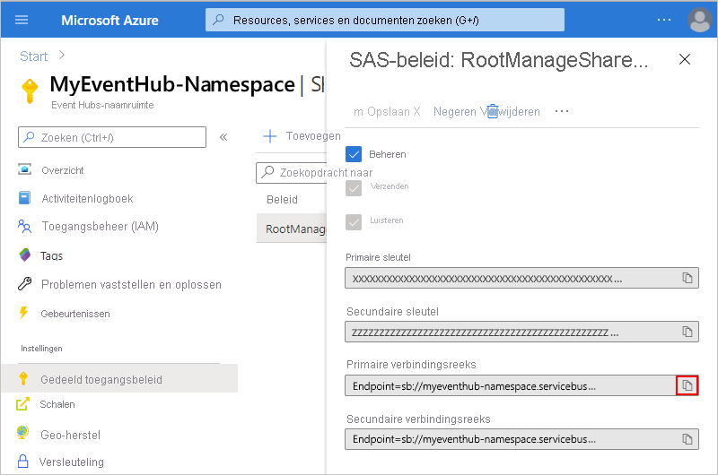
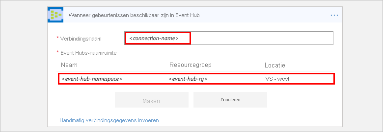

# Bewaken, ontvangen en verzenden van gebeurtenissen met Azure Event Hubs en Azure Logic Apps

Dit artikel wordt beschreven hoe u kunt controleren en beheren van gebeurtenissen die worden verzonden naar [Azure Event Hubs](../event-hubs/event-hubs-what-is-event-hubs.md) uit in een logische app met de Azure Event Hubs-connector. Op die manier kunt u logische apps die automatiseren van taken en werkstromen voor het controleren, verzenden en ontvangen van gebeurtenissen van uw Event Hub maken. Connector-specifieke technische informatie, Zie de [documentatie voor Azure Event Hubs-connector](https://docs.microsoft.com/connectors/eventhubs/)</a>.

## Vereisten

* Een Azure-abonnement. Als u nog geen abonnement op Azure hebt, [registreer u dan nu voor een gratis Azure-account](https://azure.microsoft.com/free/). 

* Een [Azure Event Hubs-naamruimte en Event Hub](../event-hubs/event-hubs-create.md)

* De logische app waar u toegang tot uw Event Hub. Als uw logische app met een Azure Event Hubs-trigger wilt, moet u een [lege, logische app](../logic-apps/quickstart-create-first-logic-app-workflow.md).
Als u geen ervaring met logische apps, raadpleegt u [wat is Azure Logic Apps](../logic-apps/logic-apps-overview.md) en [Quick Start: Maak uw eerste logische app](../logic-apps/quickstart-create-first-logic-app-workflow.md).

## Controleer de machtigingen en -verbindingsreeks ophalen

Controleer uw machtigingen voor uw logische app voor toegang tot uw Event Hub, en de verbindingsreeks voor uw Event Hubs-naamruimte ophalen.

1. Meld u aan bij [Azure Portal](https://portal.azure.com).

1. Ga naar uw Event Hubs *naamruimte*, niet in een specifieke Event Hub. 

1. In het menu naamruimte onder **instellingen**, selecteer **beleid voor gedeelde toegang**. Onder **Claims**, Controleer of u hebt **beheren** machtigingen voor die naamruimte.

   

1. Als u de verbindingsgegevens van uw later handmatig invoeren wilt, moet u de verbindingsreeks ophalen voor uw Event Hubs-naamruimte.

   1. Under **Policy**, choose **RootManageSharedAccessKey**.

   1. De verbindingsreeks van uw primaire sleutel vinden. Kies de knop kopiëren en opslaan van de verbindingsreeks voor later gebruik.

      

      > [!TIP]
      > Om te controleren of de verbindingsreeks gekoppeld aan uw Event Hubs-naamruimte of met een specifieke event hub is, zorg ervoor dat de verbindingsreeks beschikt niet over de `EntityPath`  parameter. Als u deze parameter kunt vinden, wordt de verbindingsreeks is voor een specifieke Event Hub 'entiteit' en is niet de juiste tekenreeks die moet worden gebruikt met uw logische app.

1. Nu doorgaan met [een Event Hubs-trigger toevoegen](#add-trigger) of [een Event Hubs-actie toevoegen](#add-action).

## Event Hubs-trigger toevoegen

In Azure Logic Apps, elke logische app moet beginnen met een [trigger](../logic-apps/logic-apps-overview.md#logic-app-concepts), die wordt geactiveerd wanneer een bepaalde gebeurtenis wordt uitgevoerd of wanneer een bepaalde voorwaarde wordt voldaan. Telkens wanneer de trigger wordt geactiveerd, de Logic Apps-engine een exemplaar van de logische app maakt en werkstroom van uw app wordt gestart.

In dit voorbeeld laat zien hoe u een werkstroom voor logische Apps kunt starten wanneer nieuwe gebeurtenissen worden verzonden naar uw Event Hub. 

1. In de Azure portal of Visual Studio, maak een lege logische app, die wordt geopend de ontwerper van logische Apps. Dit voorbeeld wordt de Azure-portal.

1. Typ 'eventhubs' als filter in het zoekvak. Selecteer deze trigger uit de lijst met triggers: **Wanneer gebeurtenissen zijn beschikbaar in de Event Hub - Event Hubs**

   

1. Als u wordt gevraagd voor de verbindingsgegevens, [maken van de verbinding van Event Hubs nu](#create-connection). 

1. In de trigger bevatten informatie over de Event Hub die u wilt bewaken. Voor meer eigenschappen, opent u de **toevoegen van nieuwe parameter** lijst. Een parameter selecteren, wordt die eigenschap toegevoegd aan de trigger-kaart.

   

   | Eigenschap | Vereist | Description |
   |----------|----------|-------------|
   | **Event Hub-naam** | Ja | De naam van de Event Hub die u wilt bewaken |
   | **Inhoudstype** | Nee | Het inhoudstype van de gebeurtenis. De standaardwaarde is `application/octet-stream`. |
   | **Naam van de groep consumenten** | Nee | De [naam voor de Event Hub-consumergroep](../event-hubs/event-hubs-features.md#consumer-groups) moet worden gebruikt voor het lezen van gebeurtenissen. Indien niet opgegeven, wordt de standaard-consumergroep wordt gebruikt. |
   | **Maximum aantal gebeurtenissen tellen** | Nee | Het maximum aantal gebeurtenissen. De trigger retourneert tussen één en het aantal gebeurtenissen dat is opgegeven door deze eigenschap. |
   | **Interval** | Ja | Een positief geheel getal dat wordt beschreven hoe vaak de werkstroom wordt uitgevoerd op basis van de frequentie |
   | **Frequentie** | Ja | De tijdseenheid voor het terugkeerpatroon |
   ||||

   **Aanvullende eigenschappen**

   | Eigenschap | Vereist | Description |
   |----------|----------|-------------|
   | **Inhoudsschema** | Nee | De JSON-inhoud schema voor de gebeurtenissen te lezen uit de Event Hub. Bijvoorbeeld, als u het schema content opgeeft, kunt u de logische app voor de gebeurtenissen die overeenkomen met het schema activeren. |
   | **Minimale partitiesleutel** | Nee | Voer de minimale [partitie](../event-hubs/event-hubs-features.md#partitions) ID te lezen. Standaard worden alle partities worden gelezen. |
   | **Maximale partitiesleutel** | Nee | Voer de maximaal [partitie](../event-hubs/event-hubs-features.md#partitions) ID te lezen. Standaard worden alle partities worden gelezen. |
   | **Tijdzone** | Nee | Geldt alleen wanneer u een begintijd opgeeft, omdat deze trigger UTC-offset wordt niet geaccepteerd. Selecteer de tijdzone die u wilt toepassen. 
Zie voor meer informatie, [maken en uitvoeren van terugkerende taken en werkstromen met Azure Logic Apps](../connectors/connectors-native-recurrence.md). |
   | **Begintijd** | Nee | Geef een begintijd die in deze indeling: 
JJJJ-MM-ddTUU als u een tijdzone selecteren
-of-
JJJJ-MM-ddTHH als u niet een tijdzone selecteren
Zie voor meer informatie, [maken en uitvoeren van terugkerende taken en werkstromen met Azure Logic Apps](../connectors/connectors-native-recurrence.md). |
   ||||

1. Wanneer u klaar bent, op de werkbalk van de ontwerper, kiest u **opslaan**.

1. Nu doorgaan met een of meer acties toe te voegen aan uw logische app voor de taken die u wilt uitvoeren met de resultaten van de trigger. 

   Bijvoorbeeld, om te filteren van gebeurtenissen op basis van een specifieke waarde, zoals een categorie, kunt u een voorwaarde toevoegen zodat de **gebeurtenis - Event Hubs verzenden** actie verzendt alleen de gebeurtenissen die voldoen aan de voorwaarde. 

> [!NOTE]
> Alle Event Hub-triggers zijn *long-polling* triggers, wat betekent dat wanneer een trigger wordt geactiveerd, de trigger worden alle gebeurtenissen verwerkt en wacht dan tot 30 seconden voor meer gebeurtenissen worden weergegeven in uw Event Hub.
> Als er geen gebeurtenissen worden ontvangen binnen 30 seconden, wordt de trigger uitvoeren wordt overgeslagen. Anders wordt de trigger blijft lezen van gebeurtenissen totdat uw Event Hub leeg is.
> De volgende trigger poll gebeurt op basis van het terugkeerpatroon die u in de eigenschappen van de trigger opgeeft.

## Event Hubs-actie toevoegen

In Azure Logic Apps, een [actie](../logic-apps/logic-apps-overview.md#logic-app-concepts) is een stap in uw werkstroom die volgt op een trigger of een andere actie. In dit voorbeeld wordt de logische app begint met een Event Hubs-trigger waarmee wordt gecontroleerd op nieuwe gebeurtenissen in uw Event Hub.

1. Open uw logische app in de ontwerper van logische Apps in de Azure portal of Visual Studio. Dit voorbeeld wordt de Azure-portal.

1. Kies onder de trigger of actie **nieuwe stap**.

   Als u wilt toevoegen een actie tussen bestaande stappen, Beweeg de muis boven de verbindende pijl. 
   Kies het plusteken ( **+** ) die wordt weergegeven, en selecteer vervolgens **een actie toevoegen**.

1. Typ 'eventhubs' als filter in het zoekvak.
Selecteer deze actie uit de lijst met acties: **Gebeurtenis - Event Hubs verzenden**

   

1. Als u wordt gevraagd voor de verbindingsgegevens, [maken van de verbinding van Event Hubs nu](#create-connection). 

1. In de actie bevatten informatie over de gebeurtenissen die u wilt verzenden. Voor meer eigenschappen, opent u de **toevoegen van nieuwe parameter** lijst. Een parameter selecteren, wordt die eigenschap toegevoegd aan de actie-kaart.

   

   | Eigenschap | Vereist | Description |
   |----------|----------|-------------|
   | **Event Hub-naam** | Ja | De Event Hub waar u om de gebeurtenis te verzenden |
   | **Inhoud** | Nee | De inhoud voor de gebeurtenis die u wilt verzenden |
   | **Eigenschappen** | Nee | De eigenschappen van de app en de waarden voor het verzenden van |
   | **Partitiesleutel** | Nee | De [partitie](../event-hubs/event-hubs-features.md#partitions) ID voor het verzenden van de gebeurtenis |
   ||||

   U kunt bijvoorbeeld de uitvoer van de trigger van Event Hubs verzenden naar een andere Event Hub:

   

1. Wanneer u klaar bent, op de werkbalk van de ontwerper, kiest u **opslaan**.

## Verbinding maken met uw Event Hub

[!INCLUDE [Create connection general intro](../../includes/connectors-create-connection-general-intro.md)] 

1. Wanneer u wordt gevraagd om de verbindingsgegevens, geef de volgende gegevens:

   | Eigenschap | Vereist | Value | Description |
   |----------|----------|-------|-------------|
   | **Verbindingsnaam** | Ja | <*naam van de verbinding*> | De naam voor uw verbinding maken |
   | **Event Hubs Namespace** | Ja | <*event-hubs-namespace*> | Selecteer de Event Hubs-naamruimte die u wilt gebruiken. |
   |||||  

   Bijvoorbeeld:

   

   Voer handmatig de connection string, de optie kiezen **handmatig verbindingsgegevens invoeren**. 
   Informatie over [over het vinden van de verbindingsreeks](#permissions-connection-string).

2. Selecteer het Event Hubs-beleid moet worden gebruikt, als u nog niet is geselecteerd. Kies **Maken**.

   

3. Nadat u uw verbinding maakt, doorgaan met [toevoegen Event Hubs activeren](#add-trigger) of [toevoegen Event Hubs-actie](#add-action).

## Connector-verwijzing

Voor technische informatie, zoals triggers en acties limieten, zoals is beschreven in van de connector OpenAPI (voorheen Swagger)-bestand, raadpleegt u de [van de connector-verwijzingspagina](/connectors/eventhubs/).

## Volgende stappen

Meer informatie over andere [Logic Apps-connectors](../connectors/apis-list.md)