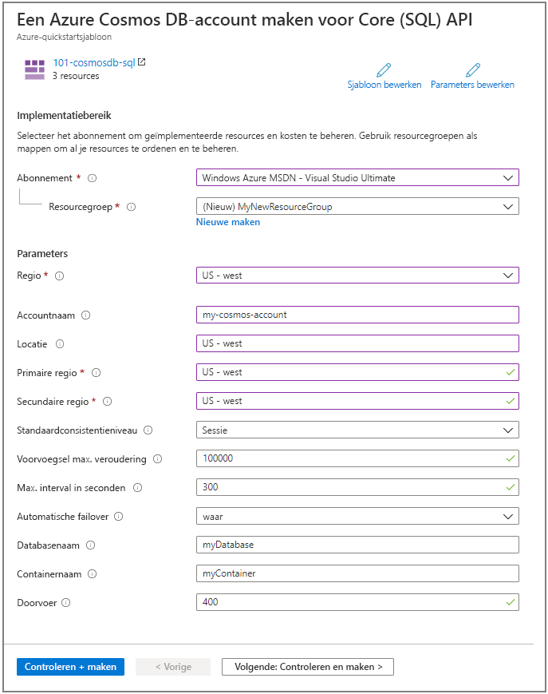

# <a name="quickstart-create-an-azure-cosmos-db-and-a-container-by-using-azure-resource-manager-template"></a>Snelstart: een Azure Cosmos DB en een container maken met azure resource manager-sjabloon

Azure Cosmos DB is de globaal gedistribueerde multimodel-databaseservice van Microsoft. U Azure Cosmos DB gebruiken om snel sleutel-/waardedatabases, documentdatabases en grafiekdatabases te maken en op te vragen. Deze quickstart richt zich op het proces van het implementeren van een Resource Manager-sjabloon om een Azure Cosmos-database en een container in die database te maken. U later gegevens opslaan in deze container.

[!INCLUDE [About Azure Resource Manager](../../includes/resource-manager-quickstart-introduction.md)]

Als u geen Azure-abonnement hebt, maakt u een [gratis account](https://azure.microsoft.com/free/?WT.mc_id=A261C142F) voordat u begint.

## <a name="prerequisites"></a>Vereisten

Een Azure-abonnement of een gratis Proefversie van Azure Cosmos DB

- [!INCLUDE [quickstarts-free-trial-note](../../includes/quickstarts-free-trial-note.md)]

- [!INCLUDE [cosmos-db-emulator-docdb-api](../../includes/cosmos-db-emulator-docdb-api.md)]

## <a name="create-an-azure-cosmos-account-database-container"></a>Een Azure Cosmos-account, database, container maken

### <a name="review-the-template"></a>De sjabloon bekijken

De sjabloon die in deze quickstart wordt gebruikt, is afkomstig van [Azure Quickstart-sjablonen.](https://azure.microsoft.com/resources/templates/101-cosmosdb-create/)

:::code language="json" source="~/quickstart-templates/101-cosmosdb-create/azuredeploy.json":::

Drie Azure-resources worden gedefinieerd in de sjabloon:

* [Microsoft.DocumentDB/databaseAccounts](/azure/templates/microsoft.documentdb/databaseaccounts): Maak een Azure Cosmos-account.

* [Microsoft.DocumentDB/databaseAccounts/sqlDatabases](/azure/templates/microsoft.documentdb/databaseaccounts/sqldatabases): Maak een Azure Cosmos-database.

* [Microsoft.DocumentDB/databaseAccounts/sqlDatabases/containers](/azure/templates/microsoft.documentdb/databaseaccounts/sqldatabases/containers): Maak een Azure Cosmos-container.

Meer Azure Cosmos DB-sjabloonvoorbeelden zijn te vinden in de [galerie met snelstartsjablonen](https://azure.microsoft.com/resources/templates/?resourceType=Microsoft.Documentdb).

### <a name="deploy-the-template"></a>De sjabloon implementeren

1. Selecteer de volgende afbeelding om u aan te melden bij Azure en een sjabloon te openen. De sjabloon maakt een Azure Cosmos-account, een database en een container.

   <a href="https://portal.azure.com/#create/Microsoft.Template/uri/https%3A%2F%2Fraw.githubusercontent.com%2FAzure%2Fazure-quickstart-templates%2Fmaster%2F101-cosmosdb-create%2Fazuredeploy.json"></a>

2. Typ of selecteer de volgende waarden.

   

    Als dit is opgegeven, gebruikt u de standaardwaarden om de Azure Cosmos-resources te maken.

    * **Abonnement**: selecteer een Azure-abonnement.
    * **Resourcegroep**: selecteer **Nieuw maken,** voer een unieke naam in voor de resourcegroep en klik op **OK**.
    * **Locatie**: selecteer een locatie.  Bijvoorbeeld **VS - centraal**.
    * **Accountnaam:** voer een naam in voor het Azure Cosmos-account. Het moet wereldwijd uniek zijn.
    * **Locatie:** voer een locatie in waar u uw Azure Cosmos-account wilt maken. Het Azure Cosmos-account kan zich op dezelfde locatie bevinden als de resourcegroep.
    * **Primaire regio:** het primaire replicagebied voor het Azure Cosmos-account.
    * **Secundair e-regio**: het secundaire replicagebied voor het Azure Cosmos-account.
    * **Databasenaam:** de naam van de Azure Cosmos-database.
    * **Containernaam:** de naam van de azure cosmos-container.
    * **Doorvoer**: De doorvoer voor de container, minimale doorvoerwaarde is 400 RU/s.
    * **Ik ga akkoord met de bovenstaande voorwaarden**: selecteer dit.

3. Selecteer **Aankoop**. Nadat het Azure Cosmos-account is geïmplementeerd, ontvangt u een melding:

   

De Azure-portal wordt gebruikt om de sjabloon te implementeren. Naast de Azure-portal u ook de Azure PowerShell-, Azure CLI- en REST-API gebruiken. Zie [Sjablonen implementeren](../azure-resource-manager/templates/deploy-powershell.md)voor meer informatie over andere implementatiemethoden.

## <a name="validate-the-deployment"></a>De implementatie valideren

U de Azure-portal gebruiken om het Azure Cosmos-account, de database en de container te controleren of het volgende Azure CLI- of Azure PowerShell-script gebruiken om het gemaakte geheim weer te geven.

# <a name="cli"></a>[CLI](#tab/CLI)

```azurecli-interactive
echo "Enter your Azure Cosmos account name:" &&
read cosmosAccountName &&
echo "Enter the resource group where the Azure Cosmos account exists:" &&
read resourcegroupName &&
az cosmosdb show -g $resourcegroupName -n $cosmosAccountName
```

# <a name="powershell"></a>[Powershell](#tab/PowerShell)

```azurepowershell-interactive
$resourceGroupName = Read-Host -Prompt "Enter the resource group name where your Azure Cosmos account exists"
(Get-AzResource -ResourceType "Microsoft.DocumentDB/databaseAccounts" -ResourceGroupName $resourceGroupName).Name
 Write-Host "Press [ENTER] to continue..."
```

---

## <a name="clean-up-resources"></a>Resources opschonen

Als u van plan bent om verder te werken met de volgende en tutorials, u deze middelen op zijn plaats te laten.
Wanneer u niet langer nodig bent, verwijdert u de brongroep, die het Azure Cosmos-account en de bijbehorende bronnen verwijdert. Ga als lid van de brongroep met Azure CLI of Azure Powershell:

# <a name="cli"></a>[CLI](#tab/CLI)

```azurecli-interactive
echo "Enter the Resource Group name:" &&
read resourceGroupName &&
az group delete --name $resourceGroupName &&
echo "Press [ENTER] to continue ..."
```

# <a name="powershell"></a>[Powershell](#tab/PowerShell)

```azurepowershell-interactive
$resourceGroupName = Read-Host -Prompt "Enter the Resource Group name"
Remove-AzResourceGroup -Name $resourceGroupName
Write-Host "Press [ENTER] to continue..."
```

---

## <a name="next-steps"></a>Volgende stappen

In deze quickstart hebt u een Azure Cosmos-account, een database en een container gemaakt met behulp van een Azure Resource Manager-sjabloon en de implementatie gevalideerd. Ga verder naar de onderstaande artikelen voor meer informatie over Azure Cosmos DB en Azure Resource Manager.

- Lees een [overzicht van Azure Cosmos DB](introduction.md)
- Meer informatie over [Azure Resource Manager](../azure-resource-manager/management/overview.md)
- Andere [Azure Cosmos DB Resource Manager-sjablonen downloaden](resource-manager-samples.md)