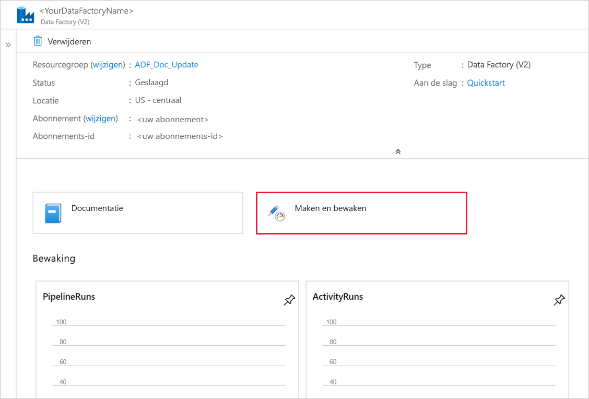
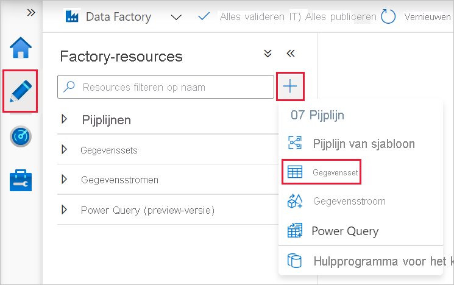

# Quickstart: Een gegevensfactory maken met de Azure Data Factory-UI

> [!div class="op_single_selector" title1="Selecteer de versie van Data Factory service die u gebruikt:"]
> * [Versie 1:](v1/data-factory-copy-data-from-azure-blob-storage-to-sql-database.md)
> * [Huidige versie](quickstart-create-data-factory-portal.md)

In deze quickstart wordt beschreven hoe u de Azure Data Factory-UI kunt gebruiken om een Azure-gegevensfactory te maken en te controleren. Met de pijplijn die u in deze data factory maakt, worden gegevens *gekopieerd* van één map naar een andere map in een Azure Blob-opslag. Meer informatie over het *transformeren* van gegevens met behulp van Azure Data Factory vindt u in [Zelfstudie: Gegevens transformeren met Apache Spark](tutorial-transform-data-spark-portal.md).

> [!NOTE]
> Als u niet bekend bent met Azure Data Factory, raadpleegt u eerst de [Inleiding voor Azure Data Factory](data-factory-introduction.md) voordat u deze quickstart uitvoert. 

[!INCLUDE [data-factory-quickstart-prerequisites](../../includes/data-factory-quickstart-prerequisites.md)] 

### Video 
Bekijk deze video voor een beter begrip van de Data Factory-UI: 
>[!VIDEO https://channel9.msdn.com/Shows/Azure-Friday/Visually-build-pipelines-for-Azure-Data-Factory-v2/Player]

## Data factory maken

1. Start de webbrowser **Microsoft Edge** of **Google Chrome**. Op dit moment wordt de Data Factory-gebruikersinterface alleen ondersteund in de webbrowsers Microsoft Edge en Google Chrome.
1. Ga naar de [Azure Portal](https://portal.azure.com). 
1. Selecteer **Een resource maken** in het menu links, selecteer **Analyse** en selecteer vervolgens **Data Factory**. 
   
   
1. Voer op de pagina **Nieuwe data factory** **ADFTutorialDataFactory** in als **naam**. 
 
   De naam van de Azure-gegevensfactory moet *wereldwijd uniek* zijn. Als u het volgende foutbericht ziet, wijzigt u de naam van de data factory (bijvoorbeeld **&lt;uwnaam&gt;ADFTutorialDataFactory**) en probeert u het opnieuw. Zie het artikel [Data factory - Naamgevingsregels](naming-rules.md) voor naamgevingsregels voor Data Factory-artefacten.
  
   
1. Selecteer voor **Abonnement** het Azure-abonnement waarin u de gegevensfactory wilt maken. 
1. Voer een van de volgende stappen uit voor **Resourcegroep**:
     
   - Selecteer **Bestaande gebruiken** en selecteer een bestaande resourcegroep in de lijst. 
   - Selecteer **Nieuwe maken** en voer de naam van een resourcegroep in.   
         
   Zie [Resourcegroepen gebruiken om Azure-resources te beheren](../azure-resource-manager/resource-group-overview.md) voor meer informatie.  
1. Selecteer **V2** als **Versie**.
1. Selecteer voor **Locatie** een locatie voor de data factory.

   De lijst bevat alleen locaties die worden ondersteund door Data Factory en waar uw Azure Data Factory-metagegevens worden opgeslagen. De bijbehorende gegevens archieven (zoals Azure Storage en Azure SQL Database) en berekeningen (zoals Azure HDInsight) die Data Factory gebruikt, kunnen in andere regio's worden uitgevoerd.

1. Selecteer **Maken**.

1. Wanneer het maken is voltooid, ziet u de pagina **Data Factory**. Selecteer de tegel **Maken en controleren** om de gebruikersinterface (UI) van Azure Data Factory te openen op een afzonderlijk tabblad.
   
   
1. Schakel op de pagina **Aan de slag** over naar het tabblad **Auteur** in het linkerpaneel. 

    

## Een gekoppelde service maken
In deze procedure maakt u een gekoppelde service om uw Azure Storage-account te koppelen aan de data factory. De gekoppelde service beschikt over de verbindingsgegevens die de Data Factory-service tijdens runtime gebruikt om er een verbinding mee tot stand te brengen.

1. Selecteer **Verbindingen** en selecteer vervolgens in de werkbalk de knop **Nieuw**. 

1. Selecteer op de pagina **Nieuwe gekoppelde service** de optie **Azure Blob-opslag** en selecteer vervolgens**Doorgaan**. 

   
1. Voer de volgende stappen uit op de pagina nieuwe gekoppelde service (Azure Blob Storage): 

   a. Voer bij **Naam** **AzureStorageLinkedService** in.

   b. Selecteer bij **Naam van opslagaccount** uw Azure-opslagaccount.

   c. Selecteer **Verbinding testen** om te bevestigen dat de Data Factory-service verbinding mag maken met het opslagaccount. 

   d. Selecteer **Voltooien** om de gekoppelde service op te slaan. 

## Gegevenssets maken
In deze procedure maakt u twee gegevenssets: **InputDataset** en **OutputDataset**. Deze gegevenssets zijn van het type **AzureBlob**. Ze verwijzen naar de gekoppelde Azure Storage-service die u in de vorige sectie hebt gemaakt. 

De invoergegevensset vertegenwoordigt de brongegevens in de invoermap. In de definitie van de invoergegevensset geeft u de blob-container (**adftutorial**) en de map (**invoer**) op, en het bestand (**emp.txt**) dat de brongegevens bevat. 

De uitvoergegevensset vertegenwoordigt de gegevens die worden gekopieerd naar de bestemming. In de definitie van de uitvoergegevensset geeft u de blob-container (**adftutorial**) en de map (**uitvoer**) op, en het bestand waarin de brongegevens zijn gekopieerd. Elke uitvoering van een pijplijn heeft een unieke id die eraan is gekoppeld. U hebt toegang tot deze id via de systeemvariabele **RunId**. De naam van het uitvoerbestand wordt dynamisch geëvalueerd op basis van de run-id van de pijplijn.   

In de instellingen voor de gekoppelde service hebt u het Azure Storage-account opgegeven dat de brongegevens bevat. In de instellingen voor de brongegevensset geeft u de precieze locatie van de brongegevens op (blob-container, map en bestand). In de instellingen voor de sink-gegevensset geeft u de locatie op waarnaar de gegevens worden gekopieerd (blob-container, map en bestand). 
 
1. Selecteer de knop **+** (plus) en vervolgens **Gegevensset**.

   
1. Selecteer op de pagina **nieuwe gegevensset** de optie **Azure Blob Storage**en selecteer vervolgens **door gaan**. 

   
1. Kies op de pagina **indeling selecteren** het notatie type van uw gegevens en selecteer vervolgens **door gaan**. In dit geval selecteert u **binair** bij kopiëren van bestanden zonder de inhoud te parseren.

    

1. Voer de volgende stappen uit op de pagina **Eigenschappen instellen** :

    a. Voer onder **naam** **input dataset**in. 

    b. Selecteer **AzureStorageLinkedService** bij **Linked service**.

    c. Selecteer de knop **Bladeren** bij **Bestandspad**.

    d. Ga in het venster **Een bestand of map kiezen** naar de map **invoer** in de container **adftutorial**, selecteer het bestand **emp.txt** en selecteer vervolgens **Voltooien**.
    
    e. Selecteer **Doorgaan**.   

    
1. Herhaal de stappen om de uitvoergegevensset te maken:  

    a. Selecteer de knop **+** (plus) en vervolgens **Gegevensset**.

    b. Selecteer op de pagina **nieuwe gegevensset** de optie **Azure Blob Storage**en selecteer vervolgens **door gaan**.

    c. Kies op de pagina **indeling selecteren** het notatie type van uw gegevens en selecteer vervolgens **door gaan**.

    d. Geef op de pagina **Eigenschappen instellen** **output dataset** op voor de naam. Selecteer **AzureStorageLinkedService** als gekoppelde service.

    e. Voeronder bestandspad **adftutorial/output**in. Als de **uitvoermap** niet bestaat, maakt de Kopieer activiteit tijdens runtime.

    f. Selecteer **Doorgaan**.   

## Een pijplijn maken 
In deze procedure maakt en valideert u een pijplijn via een kopieeractiviteit die gebruikmaakt van de invoer- en uitvoergegevenssets. Met de kopieeractiviteit worden gegevens uit het bestand dat is opgegeven bij de instellingen voor de invoergegevensset gekopieerd naar het bestand dat is opgegeven in de instellingen voor de uitvoergegevensset. Als in de invoergegevensset alleen een map is opgegeven (en geen bestandsnaam), worden met de kopieeractiviteit alle bestanden in de bronmap gekopieerd naar de bestemming. 

1. Selecteer de knop **+** (plus) en selecteer vervolgens **Pijplijn**. 

1. Geef op het tabblad **Algemeen** **CopyPipeline** op als **Naam**. 

1. Open de werkset **Activiteiten** en vouw **Verplaatsen en transformeren** uit. Sleep de **gegevens kopiëren** activiteit vanuit de werkset **activiteiten** naar het ontwerp oppervlak voor pijp lijnen. U kunt ook zoeken naar activiteiten in de werkset **Activiteiten**. Geef **CopyFromBlobToBlob** op bij **Naam**.

1. Ga naar het tabblad **Bron** in de instellingen voor de kopieeractiviteit en selecteer **InputDataset** als de **brongegevensset**.

1. Ga naar het tabblad **Sink** in de instellingen voor de kopieeractiviteit en selecteer **OutputDataset** bij **Sink-gegevensset**.

1. Klik in de pijplijnwerkbalk boven het canvas op **Valideren** om de instellingen voor de pijplijn te valideren. Controleer of de pijplijn is gevalideerd. Klik op de **>>** (pijl-rechts) om de uitvoergegevens van de validatie te sluiten. 

## Fouten opsporen in de pijplijn
In deze stap spoort u fouten op in de pijplijn voordat u deze implementeert in Data Factory. 

1. Klik in de pijplijnwerkbalk boven het canvas op **Fouten opsporen** om een testuitvoering te activeren. 
    
1. Controleer of de status van de pijplijnuitvoering onder aan het tabblad **Uitvoer** van de pijplijninstellingen wordt weergegeven. 

1. Controleer of een uitvoerbestand wordt weergegeven in de **uitvoermap** van de container **adftutorial**. Als de uitvoermap niet bestaat, wordt deze automatisch door de Data Factory-service gemaakt. 

## De pijplijn handmatig activeren
In deze procedure implementeert u entiteiten (gekoppelde services, gegevenssets, pijplijnen) in Azure Data Factory. Vervolgens activeert u handmatig een pijplijnuitvoering. 

1. Voordat u een pijplijn activeert, moet u eerst entiteiten publiceren in Data Factory. Selecteer hiervoor bovenaan de optie **Alles publiceren**. 

   
1. Als u de pijp lijn hand matig wilt activeren, selecteert u **trigger toevoegen** op de werk balk van de pijp lijn en selecteert u vervolgens **nu activeren**. Klik op de pagina **Pijplijnuitvoering** op **Voltooien**.

## De pijplijn bewaken

1. Ga naar het tabblad **Controleren** aan de linkerkant. Gebruik de knop **Vernieuwen** om de lijst te vernieuwen.

   
1. Selecteer onder **Acties** de koppeling **Uitvoeringen van activiteit weergeven**. Op deze pagina ziet u de status van de uitvoering van de kopieeractiviteit. 

1. Selecteer de koppeling **Details** (afbeelding van een bril) in de kolom **Acties** om details over de kopieerbewerking weer te geven. Zie [Overzicht van kopieeractiviteit](copy-activity-overview.md) voor meer informatie over de eigenschappen. 

   
1. Controleer of een nieuw bestand wordt weergegeven in de **uitvoermap**. 
1. U kunt terugschakelen naar de weer gave **pijplijn uitvoeringen** in de weer gave uitvoeringen van **activiteit** door de koppeling **pijplijn uitvoeringen** te selecteren. 

## De pijplijn activeren volgens een schema
Deze procedure is optioneel in deze zelfstudie. U kunt een *Scheduler-trigger* maken om in te plannen dat de pijplijn periodiek wordt uitgevoerd (elk uur, dagelijks, enzovoort). In deze procedure maakt u een trigger die elke minuut wordt uitgevoerd en stopt op een door u bepaald tijdstip. 

1. Schakel over naar het tabblad **Auteur**. 

1. Ga naar uw pijp lijn, selecteer **trigger toevoegen** op de werk balk van de pijp lijn en selecteer vervolgens **Nieuw/bewerken**. 

1. Selecteer op de pagina **Triggers toevoegen** de optie **Trigger kiezen** en selecteer vervolgens **Nieuw**. 

1. Selecteer op de pagina **Nieuwe trigger**, onder **Beëindigen**, de optie **Op datum** en geef een eindtijd op die enkele minuten later is dan de huidige tijd. Selecteer ten slotte **Toepassen**. 

   Aan elke pijplijnuitvoering zijn kosten verbonden. Geef daarom een eindtijd op die slechts enkele minuten later is dan de begintijd. Zorg ervoor dat de eindtijd op dezelfde dag is. Zorg echter dat er voldoende tijd is om de pijp lijn uit te voeren tussen de publicatie tijd en de eind tijd. De trigger gaat pas van kracht nadat u de oplossing hebt gepubliceerd in Data Factory, niet wanneer u de trigger opslaat in de UI. 

1. Schakel op de pagina **nieuwe trigger** het selectie vakje **geactiveerd** in en selecteer vervolgens **Opslaan**. 

   
1. Lees het waarschuwingsbericht en selecteer **Voltooien**.

1. Selecteer **Alles publiceren** om wijzigingen te publiceren naar Data Factory. 

1. Ga naar het tabblad **Controleren** aan de linkerkant. Selecteer **Vernieuwen** om de lijst te vernieuwen. U ziet dat de pijplijn één keer per minuut wordt uitgevoerd vanaf het moment van publiceren tot de eindtijd. 

   Bekijk de waarden in de kolom **Geactiveerd door**. De handmatige triggeruitvoering is afkomstig uit de stap (**Nu activeren**) die u eerder hebt uitgevoerd. 

1. Schakel naar de weergave **Triggeruitvoeringen**. 

1. Controleer of er tot de opgegeven datum en tijd voor elke pijplijnuitvoering een uitvoerbestand is gemaakt in de **uitvoermap**. 

## Volgende stappen
Met de pijplijn in dit voorbeeld worden gegevens gekopieerd van de ene locatie naar een andere locatie in Azure Blob Storage. Doorloop de [zelfstudies](tutorial-copy-data-portal.md) voor meer informatie over het gebruiken van Data Factory in andere scenario's. 