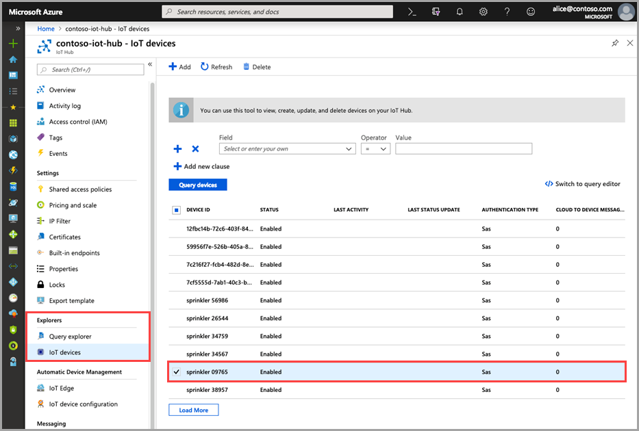
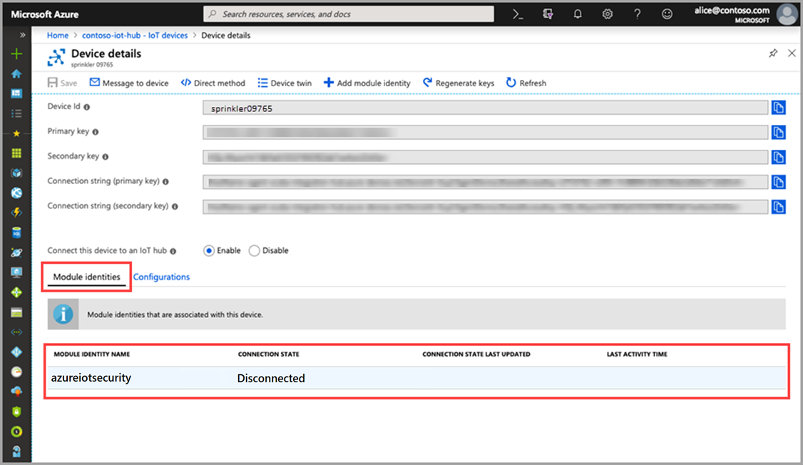

# Quickstart: Een azureiotsecurity-moduledubbel maken

In deze quickstart wordt uitgelegd hoe u afzonderlijke _azureiotsecurity_-moduledubbels maakt voor nieuwe apparaten of massaal moduledubbels maakt voor alle apparaten in een IoT Hub.

## Informatie over azureiotsecurity-moduledubbels

Apparaatdubbels spelen een belangrijke rol voor zowel apparaatbeheer als procesautomatisering voor IoT-oplossingen die in Azure zijn ingebouwd.

Defender for IoT biedt volledige integratie met uw bestaande IoT-beheerplatform, zodat u de beveiligingsstatus van uw apparaten kunt beheren en ook de bestaande apparaten kunt gebruiken.
Defender for IoT-integratie wordt bereikt door gebruik te maken van het IoT Hub-dubbelmechanisme.

Zie [IoT Hub-moduledubbels](https://docs.microsoft.com/azure/iot-hub/iot-hub-devguide-module-twins) voor meer informatie over het algemene concept van moduledubbels in Azure IoT Hub.

Defender for IoT maakt gebruik van het moduledubbelmechanisme en onderhoudt een beveiligingsmodule met de naam _azureiotsecurity_ voor al uw apparaten.

De beveiligingsmoduledubbel bevat alle informatie die relevant is voor de beveiliging van elk apparaat.

Om optimaal gebruik te maken van Defender for IoT-functies, moet u deze beveiligingsmoduledubbels maken, configureren en gebruiken voor elk apparaat in de service.

## Azureiotsecurity-moduledubbel maken

_azureiotsecurity_-moduledubbels kunnen op twee manieren worden gemaakt:

1. [Module-batchscript](https://aka.ms/iot-security-github-create-module) : maakt automatisch een moduledubbel voor nieuwe apparaten of apparaten zonder een moduledubbel die de standaardconfiguratie gebruiken.
1. Handmatige bewerking van elk moduledubbel met specifieke configuraties voor elk apparaat.

>[!NOTE]
> Als u de batch-methode gebruikt, worden de bestaande azureiotsecurity-moduledubbels niet overschreven. Met de batch-methode maakt u ALLEEN nieuwe moduledubbels voor apparaten die nog geen beveiligingsmoduledubbel hebben.

Zie [Agentconfiguratie](how-to-agent-configuration.md) voor meer informatie over het wijzigen of aanpassen van de configuratie van een bestaande moduledubbel.

Gebruik de volgende instructies om handmatig een nieuwe _azureiotsecurity_-moduledubbel te maken voor een apparaat:

1. Zoek en selecteer in uw IoT Hub het apparaat waarvoor u een beveiligingsmoduledubbel wilt maken.
1. Klik op uw apparaat en klik vervolgens op **Module-id toevoegen**.
1. Voer in het veld **Naam module-id** **azureiotsecurity** in.

1. Klik op **Opslaan**.

## Het maken van een moduledubbel controleren

Ga als volgt te werk om te controleren of er een moduledubbel bestaat voor een specifiek apparaat:

1. Selecteer in uw Azure IoT Hub **IoT-apparaten** in het menu **Explorers**.
1. Voer de apparaat-id in of selecteer een optie in het veld **Query uitvoeren op apparaat** en klik op **Query uitvoeren op apparaten**.
    
1. Selecteer het apparaat of dubbelklik erop om de pagina met details van het apparaat te openen.
1. Selecteer het menu **Module-identiteiten** en bevestig dat de **azureiotsecurity**-module aanwezig is in de lijst met module-identiteiten die zijn gekoppeld aan het apparaat.
    

Raadpleeg [Agentconfiguratie](how-to-agent-configuration.md) voor meer informatie over het aanpassen van eigenschappen van Defender for IoT-moduledubbels.

## Volgende stappen

Ga naar het volgende artikel voor meer informatie over het onderzoeken van beveiligingsaanbevelingen...

> [!div class="nextstepaction"]
> [Beveiligingsaanbevelingen onderzoeken](quickstart-investigate-security-recommendations.md)
