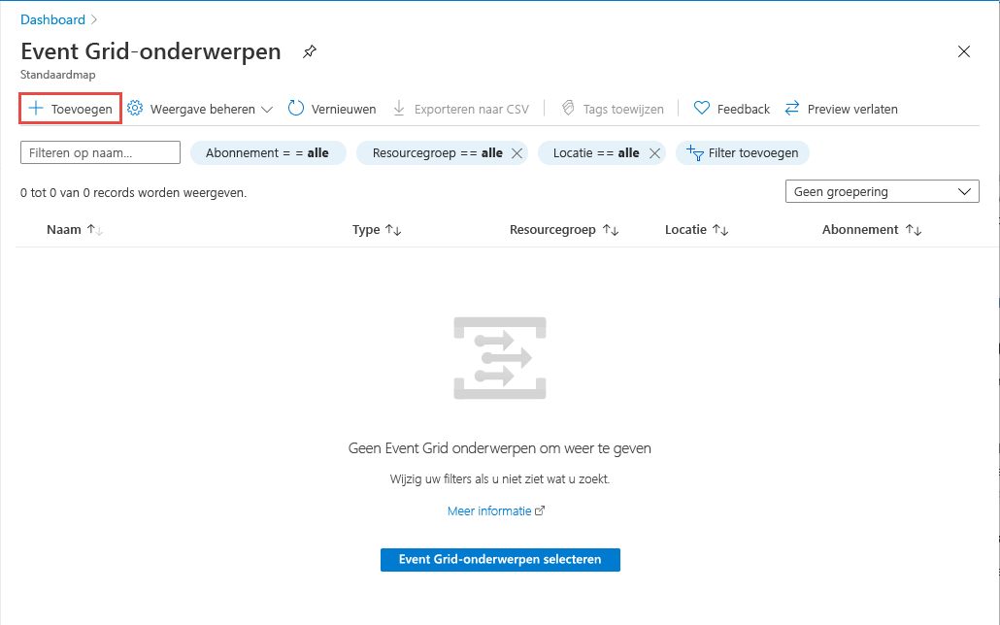
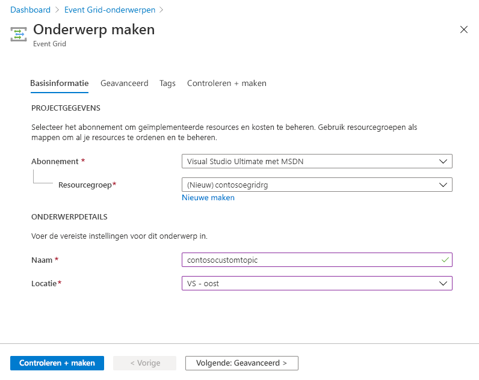
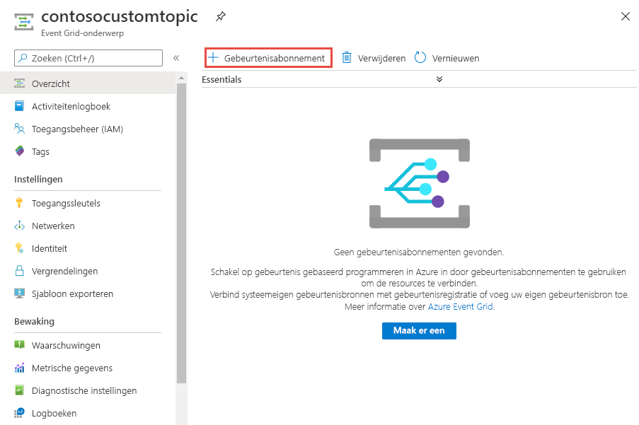
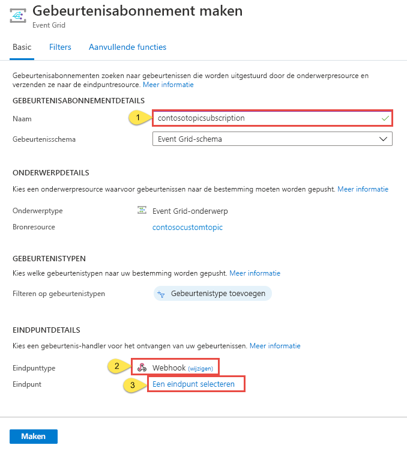

# <a name="quickstart-route-custom-events-to-web-endpoint-with-the-azure-portal-and-event-grid"></a>Snelstart: aangepaste gebeurtenissen routeren naar webeindpunt met de Azure-portal en gebeurtenisraster

Azure Event Grid is een gebeurtenisservice voor de cloud. In dit artikel gebruikt u Azure Portal om een aangepast onderwerp te maken, u op het aangepaste onderwerp te abonneren, en de gebeurtenis te activeren om het resultaat weer te geven. Normaal gesproken verzendt u gebeurtenissen naar een eindpunt dat de gebeurtenisgegevens verwerkt en vervolgens in actie komt. Ter vereenvoudiging van dit artikel stuurt u hier de gebeurtenissen echter naar een web-app die de berichten verzamelt en weergeeft.

Wanneer u klaar bent, ziet u dat de gebeurtenisgegevens naar de web-app zijn verzonden.


[!INCLUDE [updated-for-az](../../includes/updated-for-az.md)]

[!INCLUDE [quickstarts-free-trial-note.md](../../includes/quickstarts-free-trial-note.md)]

[!INCLUDE [event-grid-register-provider-portal.md](../../includes/event-grid-register-provider-portal.md)]

## <a name="create-a-custom-topic"></a>Een aangepast onderwerp maken

Een Event Grid-onderwerp biedt een door de gebruiker gedefinieerd eindpunt waarop u de gebeurtenissen kunt posten. 

1. Meld u aan bij de [Azure-portal](https://portal.azure.com/).
2. Selecteer **Alle services** in het linkernavigatiemenu, zoek naar **gebeurtenisraster**en selecteer **Gebeurtenisrasteronderwerpen**. 

    
3. Selecteer op de pagina **Onderwerpen van gebeurtenisrasters** de optie **+ Toevoegen** op de werkbalk. 

    
4. Voer op de pagina **Onderwerp maken** de volgende stappen uit:
    1. Geef een unieke **naam** op voor het aangepaste onderwerp. De onderwerpnaam moet uniek zijn omdat deze wordt vertegenwoordigd door een DNS-vermelding. Gebruik niet de naam die in de afbeelding wordt weergegeven. Maak in plaats daarvan uw eigen naam - deze moet tussen 3 en 50 tekens lang zijn en mag alleen de waarden a-z, A-Z, 0-9 en '-' bevatten.
    2. Selecteer uw **Azure-abonnement**.
    3. Selecteer een bestaande resourcegroep of selecteer **Nieuw maken**en voer een **naam** in voor de **resourcegroep**.
    4. Selecteer een **locatie** voor het gebeurtenisrasteronderwerp.
    5. Houd het standaardrasterschema voor **gebeurtenisgebeurtenissen voor** het veld **Gebeurtenisschema.** 

       
    6. Selecteer **Maken**. 
5. Nadat het aangepaste onderwerp is gemaakt, ziet u een melding dat de implementatie gelukt is. Selecteer **Ga naar resourcegroep**. 

   
6. Selecteer op de pagina **Resourcegroep** het onderwerp van het gebeurtenisraster. 

   
7. U ziet de pagina **Onderwerp van het gebeurtenisraster** voor uw gebeurtenisraster. Houd deze pagina open. Je gebruikt het later in de quickstart. 

    

## <a name="create-a-message-endpoint"></a>Het eindpunt van een bericht maken
Voordat u een abonnement maakt voor het aangepaste onderwerp, maakt u een eindpunt voor het gebeurtenisbericht. Het eindpunt onderneemt normaal gesproken actie op basis van de gebeurtenisgegevens. Ter vereenvoudiging van deze snelstart gaat u een [vooraf gebouwde web-app](https://github.com/Azure-Samples/azure-event-grid-viewer) implementeren waarmee de gebeurtenisberichten worden weergegeven. De geïmplementeerde oplossing omvat een App Service-plan, een App Service-web-app en broncode van GitHub.

1. Selecteer op de artikelpagina **Implementeren naar Azure** om de oplossing te implementeren voor uw abonnement. Geef in Azure Portal waarden op voor de parameters.

   <a href="https://portal.azure.com/#create/Microsoft.Template/uri/https%3A%2F%2Fraw.githubusercontent.com%2FAzure-Samples%2Fazure-event-grid-viewer%2Fmaster%2Fazuredeploy.json" target="_blank"></a>
1. De implementatie kan enkele minuten duren. Controleer of uw web-app wordt uitgevoerd nadat de implementatie is voltooid. Navigeer in een webbrowser naar: `https://<your-site-name>.azurewebsites.net`
1. De site wordt weergegeven, maar er zijn nog geen gebeurtenissen op gepubliceerd.

   

## <a name="subscribe-to-custom-topic"></a>Abonneren op aangepast onderwerp

U abonneert u op een Event Grid-onderwerp om Event Grid te laten weten welke gebeurtenissen u wilt traceren en waar de gebeurtenissen naartoe moeten worden gestuurd.

1. Selecteer nu op de pagina **Onderwerp van het gebeurtenisraster** voor uw aangepaste onderwerp **+ Gebeurtenisabonnement** op de werkbalk.

   
2. Voer op de pagina **Evenementabonnement maken** de volgende stappen uit:
    1. Voer een **naam** in voor het evenementabonnement.
    3. Selecteer **Webhaak** voor het **type Eindpunt**. 
    4. Kies **Een eindpunt selecteren**. 

       
    5. Voor het webhookeindpunt geeft u de URL van uw web-app op en voegt u `api/updates` toe aan de URL van de startpagina. Selecteer **Confirm Selection** (Selectie bevestigen).

       
    6. Selecteer Weer op de pagina **Gebeurtenisabonnement maken** de optie **Maken**.

3. Bekijk opnieuw uw web-app en u zult zien dat er een validatiegebeurtenis voor een abonnement naartoe is verzonden. Selecteer het oogpictogram om de gebeurtenisgegevens uit te breiden. Via Event Grid wordt de validatiegebeurtenis verzonden zodat het eindpunt kan controleren of de gebeurtenisgegevens in aanmerking komen om ontvangen te worden. De web-app bevat code waarmee het abonnement kan worden gevalideerd.

    

## <a name="send-an-event-to-your-topic"></a>Een gebeurtenis verzenden naar het onderwerp

Nu gaan we een gebeurtenis activeren om te zien hoe het bericht via Event Grid naar het eindpunt wordt gedistribueerd. Gebruik Azure CLI of PowerShell om een testgebeurtenis te verzenden naar uw aangepaste onderwerp. Meestal worden de gebeurtenisgegevens verzonden via een toepassing of Azure-service.

Het eerste voorbeeld maakt gebruik van Azure CLI. In dit voorbeeld worden de URL en de sleutel voor het aangepaste onderwerp, plus de voorbeeldgegevens van de gebeurtenis opgehaald. Gebruik de naam van het aangepaste onderwerp voor `<topic name>`. Hiermee worden voorbeeldgebeurtenisgegevens gemaakt. Het element `data` van de JSON is de nettolading van de gebeurtenis. Elke juist opgemaakte JSON kan in dit veld worden ingevoerd. U kunt het onderwerpveld ook gebruiken voor geavanceerd routeren en filteren. CURL is een hulpprogramma waarmee HTTP-aanvragen worden verzonden.


### <a name="azure-cli"></a>Azure-CLI
1. Selecteer **Cloud Shell**in de Azure-portal . Selecteer **Bash** in de linkerbovenhoek van het Venster Cloud Shell. 

    
1. Voer de volgende opdracht uit om het **eindpunt** voor het onderwerp op te halen: nadat u de opdracht hebt gekopieerd en geplakt, werkt u de naam van het **onderwerp** en de naam van de **brongroep** bij voordat u de opdracht uitvoert. 

    ```azurecli
    endpoint=$(az eventgrid topic show --name <topic name> -g <resource group name> --query "endpoint" --output tsv)
    ```
2. Voer de volgende opdracht uit om de **sleutel** voor het aangepaste onderwerp op te halen: nadat u de opdracht hebt gekopieerd en geplakt, werkt u de naam van het **onderwerp** en de naam van de **brongroep** bij voordat u de opdracht uitvoert. 

    ```azurecli
    key=$(az eventgrid topic key list --name <topic name> -g <resource group name> --query "key1" --output tsv)
    ```
3. Kopieer de volgende instructie met de gebeurtenisdefinitie en druk op **ENTER**. 

    ```json
    event='[ {"id": "'"$RANDOM"'", "eventType": "recordInserted", "subject": "myapp/vehicles/motorcycles", "eventTime": "'`date +%Y-%m-%dT%H:%M:%S%z`'", "data":{ "make": "Ducati", "model": "Monster"},"dataVersion": "1.0"} ]'
    ```
4. Voer de volgende opdracht **Curl** uit om de gebeurtenis te plaatsen:

    ```
    curl -X POST -H "aeg-sas-key: $key" -d "$event" $endpoint
    ```

### <a name="azure-powershell"></a>Azure PowerShell
In het tweede voorbeeld wordt PowerShell gebruikt om gelijksoortige stappen uit te voeren.

1. Selecteer **cloudshell** in de Azure-portal `https://shell.azure.com/`(ga ook naar ). Selecteer **PowerShell** in de linkerbovenhoek van het Venster Cloud Shell. Zie het voorbeeld van de vensterafbeelding **van Cloud Shell** in de sectie Azure CLI.
2. Stel de volgende variabelen in. Nadat u elke opdracht hebt gekopieerd en geplakt, werkt u de naam van het **onderwerp** en de naam van de **brongroep** bij voordat u de opdracht uitvoert:

    ```powershell
    $resourceGroupName = <resource group name>
    $topicName = <topic name>
    ```
3. Voer de volgende opdrachten uit om het **eindpunt** en de **toetsen** voor het onderwerp op te halen:

    ```powershell
    $endpoint = (Get-AzEventGridTopic -ResourceGroupName $resourceGroupName -Name $topicName).Endpoint
    $keys = Get-AzEventGridTopicKey -ResourceGroupName $resourceGroupName -Name $topicName
    ```
4. Bereid het evenement voor. Kopieer en voer de instructies uit in het venster Cloud Shell. 

    ```powershell
    $eventID = Get-Random 99999

    #Date format should be SortableDateTimePattern (ISO 8601)
    $eventDate = Get-Date -Format s

    #Construct body using Hashtable
    $htbody = @{
        id= $eventID
        eventType="recordInserted"
        subject="myapp/vehicles/motorcycles"
        eventTime= $eventDate   
        data= @{
            make="Ducati"
            model="Monster"
        }
        dataVersion="1.0"
    }
    
    #Use ConvertTo-Json to convert event body from Hashtable to JSON Object
    #Append square brackets to the converted JSON payload since they are expected in the event's JSON payload syntax
    $body = "["+(ConvertTo-Json $htbody)+"]"
    ```
5. Gebruik de cmdlet **Invoke-WebRequest** om de gebeurtenis te verzenden. 

    ```powershell
    Invoke-WebRequest -Uri $endpoint -Method POST -Body $body -Headers @{"aeg-sas-key" = $keys.Key1}
    ```

### <a name="verify-in-the-event-grid-viewer"></a>Controleren in de logboeken logboeken
U hebt de gebeurtenis geactiveerd en Event Grid heeft het bericht verzonden naar het eindpunt dat u hebt geconfigureerd toen u zich abonneerde. Bekijk uw web-app om de gebeurtenis te zien die u zojuist hebt verzonden.

```json
{
  "id": "974",
  "eventType": "recordInserted",
  "subject": "myapp/vehicles/motorcycles",
  "eventTime": "2019-03-28T01:11:59+00:00",
  "data": {
    "make": "Ducati",
    "model": "Monster"
  },
  "dataVersion": "1.0",
  "metadataVersion": "1",
  "topic": "/subscriptions/11111111-1111-1111-1111-111111111111/resourceGroups/myegridrg/providers/Microsoft.EventGrid/topics/myegridtopic"
}
```

## <a name="clean-up-resources"></a>Resources opschonen
Als u verder wilt werken met deze gebeurtenis, schoon dan de resources die u in dit artikel hebt gemaakt, niet op. Verwijder anders de resources die u in dit artikel hebt gemaakt.

1. Selecteer **Resourcegroepen** in het linkermenu. Als u het niet ziet in het linkermenu, selecteert u **Alle services** in het linkermenu en selecteert u **Resourcegroepen**. 
2. Selecteer de resourcegroep om de pagina **Resourcegroep** te starten. 
3. Selecteer **Brongroep verwijderen** op de werkbalk. 
4. Verwijder de verwijdering door de naam van de resourcegroep in te voeren en selecteer **Verwijderen**. 

    

    De andere resourcegroep die u in de afbeelding ziet, is gemaakt en gebruikt door het venster Cloud Shell. Verwijder het als u niet van plan bent om het venster Cloud Shell later te gebruiken. 

## <a name="next-steps"></a>Volgende stappen

U weet nu hoe u aangepaste onderwerpen maakt en hoe u zich abonneert op een gebeurtenis. Kijk waar Event Grid u nog meer bij kan helpen:

- [Over Event Grid](overview.md)
- [Blob Storage-gebeurtenissen naar een aangepast eindpunt op het web routeren](../storage/blobs/storage-blob-event-quickstart.md?toc=%2fazure%2fevent-grid%2ftoc.json)
- [Monitor virtual machine changes with Azure Event Grid and Logic Apps](monitor-virtual-machine-changes-event-grid-logic-app.md) (Wijzigingen in virtuele machines bewaken met Azure Event Grid en Logic Apps)
- [Big data streamen naar een datawarehouse](event-grid-event-hubs-integration.md)
