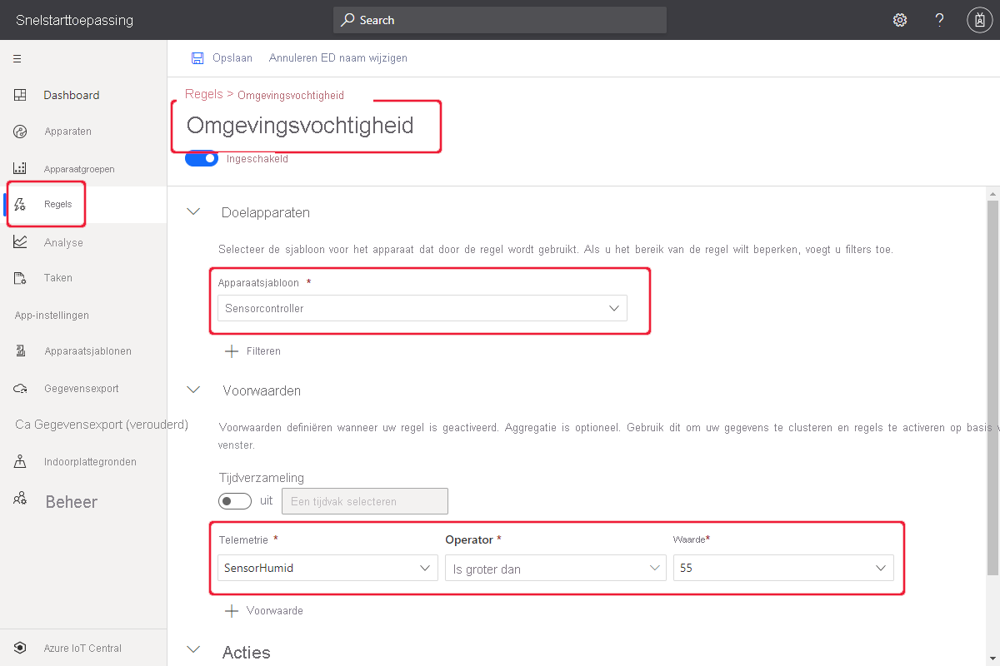
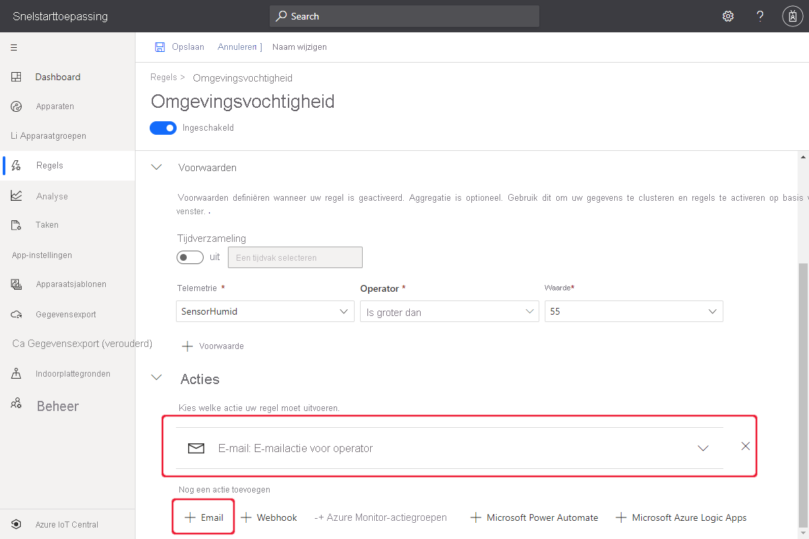

# Snelstart: regels en acties voor uw apparaat configureren in Azure IoT Central

*Dit artikel is van toepassing op operators, opbouwfuncties en beheerders.*

In deze snelstart maakt u een regel die een e-mail verzendt&deg; wanneer de door een apparaatsensor gerapporteerde temperatuur hoger is dan 90 F.

## Vereisten

Voordat u begint, moet u de twee vorige quickstarts voltooien [Maak een Azure IoT Central-toepassing](./quick-deploy-iot-central.md) en [voeg een gesimuleerd apparaat toe aan uw IoT Central-toepassing](./quick-create-pnp-device.md) om de **MXChip IoT DevKit-apparaatsjabloon** te maken om mee te werken.

## Een regel op basis van telemetrie maken

1. Als u een nieuwe regel op basis van telemetrie aan uw toepassing wilt toevoegen, selecteert u in het linkerdeelvenster **Regels**.

1. Als u een nieuwe **+** regel wilt maken, selecteert u .

1. Voer **omgevingstemperatuur** in als regelnaam.

1. Selecteer **mxchip IoT DevKit** als apparaatsjabloon in de sectie **Doelapparaten.** Met deze optie worden de apparaten waarde regel op apparaatsjabloontype van toepassing is, gefilterd. U meer filtercriteria toevoegen door **+ Filter te**selecteren.

1. In de sectie **Voorwaarden** bepaalt u wat uw regel activeert. Gebruik de volgende informatie om een voorwaarde te definiëren op basis van temperatuurtelemetrie:

    | Veld        | Waarde            |
    | ------------ | ---------------- |
    | Meting  | Temperatuur      |
    | Operator     | is groter dan  |
    | Waarde        | 90               |

    Als u meer voorwaarden wilt toevoegen, selecteert u **+ Voorwaarde**.

    

1. Als u een e-mailactie wilt toevoegen die moet worden uitgevoerd wanneer de regel wordt geactiveerd, selecteert u **+ E-mail**.

1. Gebruik de informatie in de volgende tabel om uw actie te definiëren en selecteer **Gereed:**

    | Instelling   | Waarde                                             |
    | --------- | ------------------------------------------------- |
    | Weergavenaam | E-mailactie voor operatoren                          |
    | Handeling        | Uw e-mailadres                                |
    | Opmerkingen     | De omgevingstemperatuur overschreed de drempel. |

    > [!NOTE]
    > Om een e-mailmelding te ontvangen, moet het e-mailadres een [gebruikers-ID in de toepassing](howto-administer.md) zijn, en moet die gebruiker zich minimaal één keer hebben aangemeld bij de toepassing.

    

1. Selecteer **Opslaan**. Uw regel wordt vermeld op de pagina **Regels.**

## De regel testen

Kort nadat u de regel hebt opgeslagen, wordt deze actief. Wanneer aan de voorwaarden in de regel wordt voldaan, verzendt uw toepassing een bericht naar het e-mailadres dat u in de actie hebt opgegeven.

> [!NOTE]
> Als u klaar bent met testen, schakelt u de regel uit om geen waarschuwingen meer te ontvangen in uw postvak.

## Volgende stappen

In deze snelstartgids hebt u de volgende zaken geleerd:

* Een regel op basis van telemetrie maken
* Een actie toevoegen

Ga voor meer informatie over bewakingsapparaten die zijn aangesloten op uw toepassing door naar de werkbalk Snel aan:

> [!div class="nextstepaction"]
> [Gebruik Azure IoT Central om uw apparaten te controleren.](quick-monitor-devices.md)
