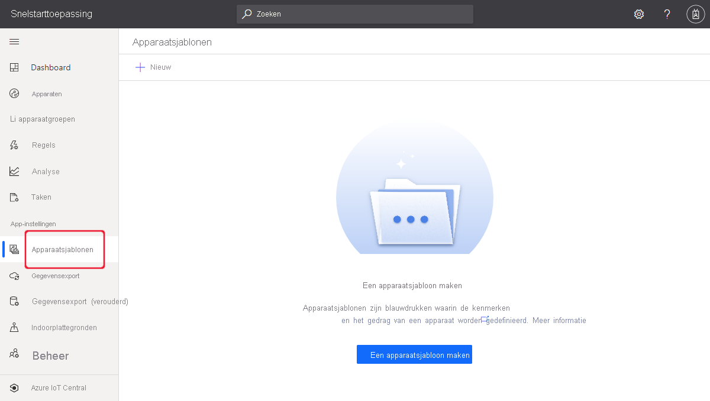
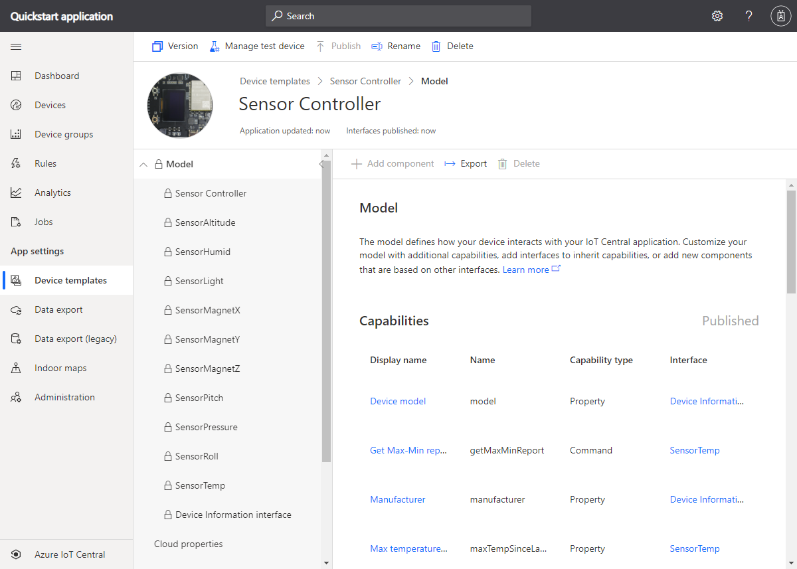
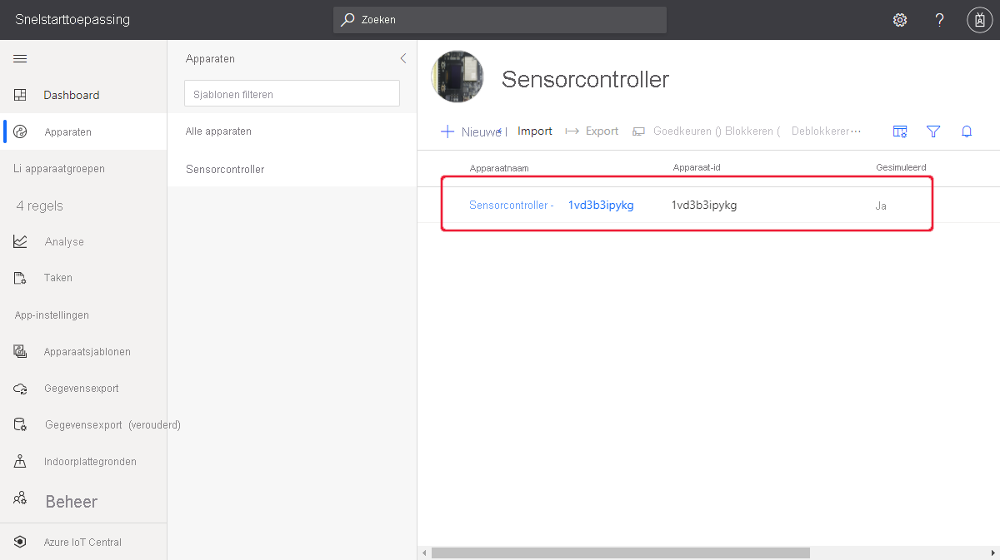
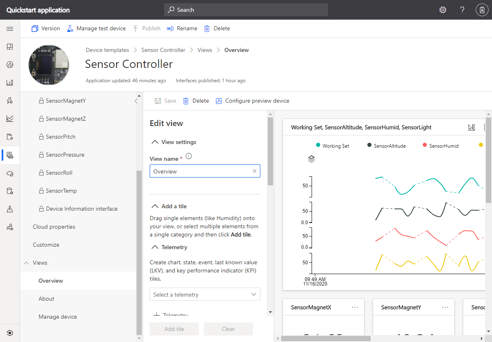

# Quickstart: Een gesimuleerd apparaat toevoegen aan uw IoT Central-toepassing

*Dit artikel is van toepassing op operators, opbouwfuncties en beheerders.*

Een apparaatsjabloon definieert de mogelijkheden van een apparaat dat verbinding maakt met uw IoT Central-toepassing. Mogelijkheden zijn de telemetrie die het apparaat verzendt, eigenschappen van het apparaat en de opdrachten waarop het apparaat reageert. Vanuit een apparaatprofiel kan een bouwer of operator zowel echte als gesimuleerde apparaten toevoegen aan een toepassing. Gesimuleerde apparaten zijn nuttig om het gedrag van uw IoT Central-toepassing te testen voordat u echte apparaten aansluit.

In deze quickstart voegt u een apparaatsjabloon toe voor een *MXChip IoT DevKit* (DevKit) bord en maakt u een gesimuleerd apparaat. U hebt geen echt apparaat nodig om deze quickstart te voltooien, u werkt met een simulatie van het apparaat. Een DevKit-apparaat:

* Verzendt telemetrie zoals temperatuur.
* Rapporteert apparaatspecifieke eigenschappen zoals het helderheidsniveau.
* Reageert op opdrachten zoals inschakelen en uitschakelen.
* Rapporteert apparaateigenschappen zoals de firmwareversie en het serienummer.

## Vereisten

Voltooi de quickstart [Een Azure IoT Central-toepassing maken](./quick-deploy-iot-central.md) om een IoT Central-toepassing te maken met behulp van de toepassing **Aangepaste app > Aangepaste sjabloon** .

## Een sjabloon maken

Als bouwer kunt u apparaatsjablonen in uw IoT Central-toepassing maken en bewerken. Nadat u een apparaatsjabloon hebt gepubliceerd, kunt u gesimuleerde apparaten genereren of echte apparaten aansluiten met behulp van de sjabloon. Met gesimuleerde apparaten kunt u het gedrag van uw toepassing testen voordat u een echt apparaat aansluit.

Selecteer het tabblad **Apparaatsjablonen** in het linkerdeelvenster om een nieuwe apparaatsjabloon aan uw toepassing toe te voegen.

Een apparaatsjabloon bevat een apparaatondersteuningsprofiel waarin de telemetrie wordt gedefinieerd die het apparaat verzendt, de apparaateigenschappen en de opdrachten waarop het apparaat reageert.

### Een apparaatondersteuningsprofiel toevoegen

Er zijn verschillende opties voor het toevoegen van een apparaatondersteuningsprofiel aan uw IoT Central-toepassing. U kunt een geheel nieuw model maken, een model importeren uit een bestand of een apparaat selecteren uit de apparaatcatalogus. IoT Central biedt ook ondersteuning voor een *apparaat-eerst* -aanpak, waarbij automatisch een model wordt geïmporteerd uit een opslagplaats wanneer een apparaat voor het eerst verbinding maakt. In deze quickstart kiest u een apparaat uit de apparaatcatalogus om het apparaatondersteuningsprofiel ervan te importeren.

De volgende stappen laten zien hoe u de apparaatcatalogus kunt gebruiken om het ondersteuningsprofiel voor een **MXChip IoT DevKit** -apparaat te importeren. Deze apparaten verzenden telemetrie, zoals temperatuur, naar uw toepassing:

1. Selecteer **+** op de pagina **Apparaatsjablonen** om een nieuwe apparaatsjabloon toe te voegen.

1. Schuif op de pagina **Sjabloontype selecteren** omlaag totdat u de tegel **MXChip IoT DevKit** hebt gevonden.

1. Selecteer de tegel **MXChip IoT DevKit** en selecteer vervolgens **Volgende: Aanpassen** .

1. Selecteer op de pagina **Beoordelen** de optie **Maken** .

1. Na een paar seconden ziet u de nieuwe apparaatsjabloon:

    

    Het MXChip IoT DevKit-ondersteuningsprofiel bevat interfaces zoals **mxchip_sensor** , **mxchip_settings** en **Apparaatgegevens** . Interfaces definiëren de mogelijkheden van een MXChip IoT DevKit-apparaat. Mogelijkheden zijn de telemetrie die een apparaat verzendt, de eigenschappen die een apparaat rapporteert en de opdrachten waarop een apparaat reageert.

### Cloudeigenschappen toevoegen

Een apparaatsjabloon kan cloudeigenschappen bevatten. Cloudeigenschappen bestaan alleen in de IoT Central-toepassing en worden nooit verzonden naar of ontvangen van een apparaat. Een cloudeigenschap toevoegen:

1. Selecteer **Cloudeigenschappen** en klik vervolgens op **+ Cloudeigenschap toevoegen** . Gebruik de informatie in de volgende tabel om twee cloudeigenschappen toe te voegen aan uw apparaatsjabloon:

    | Weergavenaam      | Semantisch type | Schema |
    | ----------------- | ------------- | ------ |
    | Laatste servicedatum | Geen          | Date   |
    | Naam van klant     | Geen          | Tekenreeks |

1. Selecteer **Opslaan** om uw wijzigingen op te slaan:

    

## Weergaven

Als bouwer kunt u de toepassing aanpassen om relevante informatie over het apparaat weer te geven aan een operator. Dankzij uw aanpassingen kan de operator de apparaten beheren die met de toepassing verbonden zijn. U kunt twee soorten weergaven maken die een operator kan gebruiken om met apparaten te werken:

* Formulieren voor het weergeven en bewerken van apparaat- en cloudeigenschappen.
* Dashboards om apparaten en de telemetrie die ze verzenden te visualiseren.

### Standaardweergaven

Standaardweergaven zijn een snelle manier om aan de slag te gaan met het visualiseren van uw belangrijke apparaatgegevens. U kunt drie standaardweergaven genereren voor uw apparaatsjabloon:

* Met de weergave **Opdrachten** kan de operator opdrachten verzenden naar uw apparaat.
* In de weergave **Overzicht** worden grafieken en metrische gegevens gebruikt om apparaattelemetrie weer te geven.
* In de weergave **Info** worden apparaateigenschappen weergegeven.

Selecteer het knooppunt **Weergaven** in de apparaatsjabloon. U ziet dat IoT Central een **Overzicht** - en **Info** -weergave heeft gemaakt toen u de sjabloon hebt toegevoegd.

Voeg als volgt een nieuw **Apparaat beheren** -formulier toe dat een operator kan gebruiken om het apparaat te beheren:

1. Selecteer het knooppunt **Weergaven** en vervolgens de tegel **Apparaat- en cloudgegevens bewerken** om een nieuwe weergave toe te voegen.

1. Wijzig de naam van het formulier in **Apparaat beheren** .

1. Selecteer de cloudeigenschappen **Klantnaam** en **Laatste servicedatum** en de eigenschap **Snelheid van ventilator** . Selecteer vervolgens **Sectie toevoegen** :

    

1. Selecteer **Opslaan** om uw nieuwe formulier op te slaan.

## Apparaatsjabloon publiceren

Voordat u een gesimuleerd apparaat kunt maken of een echt apparaat aansluiten, moet u de sjabloon voor het apparaat publiceren. Hoewel IoT Central de sjabloon heeft gepubliceerd toen u deze hebt gemaakt, moet u de bijgewerkte versie publiceren.

Een apparaatsjabloon publiceren:

1. Ga naar uw apparaatsjabloon op de pagina **Apparaatsjablonen** .

1. Selecteer **Publiceren** :

    

1. Selecteer **Publiceren** in het dialoogvenster **Deze apparaatsjabloon publiceren naar de toepassing** . 

Nadat u een apparaatsjabloon hebt gepubliceerd, wordt deze weergegeven op de pagina **Apparaten** . U kunt in een gepubliceerde apparaatsjabloon geen apparaatondersteuningsprofiel bewerken zonder een nieuwe versie te maken. Maar u kunt de cloudeigenschappen, aanpassingen en weergaven in een gepubliceerde apparaatsjabloon wel bijwerken zonder een nieuwe versie te maken. Nadat u wijzigingen hebt aangebracht, selecteert u **Publiceren** om de wijzigingen naar uw operator te pushen.

## Een gesimuleerd apparaat toevoegen

Als u een gesimuleerd apparaat wilt toevoegen aan uw toepassing, gebruikt u de **MXChip IoT DevKit** -apparaatsjabloon die u hebt gemaakt.

1. Als u als operator een nieuw apparaat wilt toevoegen, kiest u **Apparaten** in het linkerdeelvenster. Op het tabblad **Apparaten** wordt **Alle apparaten** en de apparaatsjabloon **MXChip IoT DevKit** device weergegeven. Selecteer **MXChip IoT DevKit** .

1. Selecteer **+** om een gesimuleerd DevKit-apparaat toe te voegen. Gebruik de voorgestelde **Apparaat-id** of voer uw eigen apparaat-id in. Een apparaat-id mag alleen letters, cijfers en het teken `-` bevatten. U kunt ook een naam voor uw nieuwe apparaat invoeren. Zorg ervoor dat de wisselknop **Gesimuleerd** op **Aan** staat, en selecteer **Maken** .

    

U kunt nu met de weergaven die de bouwer voor de apparaatsjabloon heeft gemaakt werken met behulp van gesimuleerde gegevens:

1. Selecteer uw gesimuleerde apparaat op de pagina **Apparaten**

    * In de weergave **Overzicht** ziet u een grafiek van de gesimuleerde telemetrie:

        

    * In de weergave **Info** ziet u eigenschapswaarden, waaronder de cloudeigenschappen die u aan de weergave hebt toegevoegd.

    * In de weergave **Opdrachten** kunt u opdrachten uitvoeren op het apparaat, zoals **knipperen** .

    * De weergave **Apparaten beheren** is het formulier dat u voor de operator hebt gemaakt om het apparaat te beheren.

    * In de weergave **Onbewerkte gegevens** kunt u de onbewerkte telemetrie en eigenschapswaarden bekijken die door het apparaat worden verzonden. Deze weergave is handig voor het opsporen van problemen met apparaten.

## Een gesimuleerd apparaat gebruiken om weergaven te verbeteren

Nadat u een nieuw gesimuleerd apparaat hebt gemaakt, kan de bouwer dit apparaat gebruiken om de weergaven voor de apparaatsjabloon te verbeteren en verder te ontwikkelen.

1. Kies **Apparaatprofielen** in het linkerdeelvenster en selecteer de sjabloon **MXChip IoT DevKit** .

1. Selecteer een van de weergaven die u wilt bewerken of maak een nieuwe weergave. Selecteer **Voorbeeldapparaat configureren** en selecteer **Selecteren vanaf een actief apparaat** . Hier kunt u kiezen of u geen preview-apparaat wilt, een echt apparaat dat is geconfigureerd voor testen of een bestaand apparaat dat u hebt toegevoegd aan IoT Central.

1. Kies uw gesimuleerde apparaat in de lijst. Selecteer vervolgens **Toepassen** . U ziet nu hetzelfde gesimuleerde apparaat in de interface voor het bouwen van apparaatsjabloonweergaven. Deze weergave is handig voor grafieken en andere visualisaties.

    

## Volgende stappen

In deze quickstart hebt u geleerd hoe u een **MXChip IoT DevKit** -apparaatsjabloon kunt maken en een gesimuleerd apparaat toevoegen aan uw toepassing.

Ga voor meer informatie over het bewaken van met uw toepassing verbonden apparaten verder met de quickstart:

> [!div class="nextstepaction"]
> [Regels en acties configureren](./quick-configure-rules.md)
