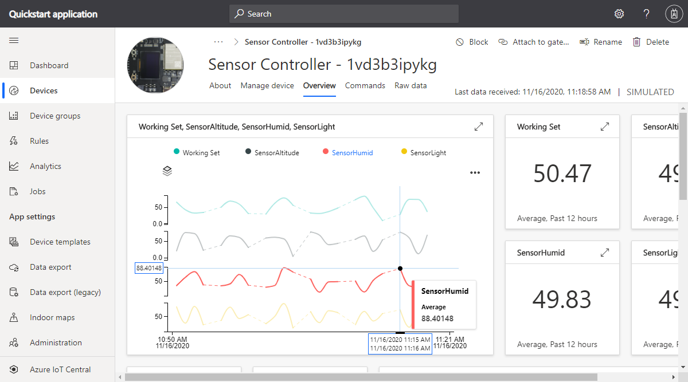
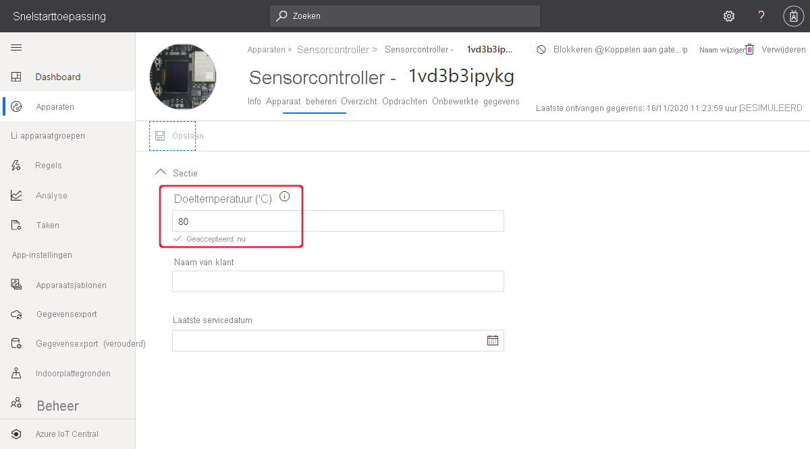

# Quickstart: Azure IoT Central gebruiken om uw apparaten te bewaken

*Dit artikel is van toepassing op operators, opbouwfuncties en beheerders.*

In deze quickstart leert u hoe u als operator uw Microsoft Azure IoT Central toepassing kunt gebruiken om uw apparaten te bewaken en instellingen te wijzigen.

## Vereisten

Voordat u begint, voltooit u de drie voorgaande quickstarts [Een Azure IoT Central-toepassing maken](./quick-deploy-iot-central.md) en [Een gesimuleerd apparaat toevoegen aan uw IoT Central-toepassing](./quick-create-simulated-device.md) en [Regels en acties voor uw apparaat configureren](quick-configure-rules.md).

## Een melding ontvangen

Azure IoT Central verzendt meldingen over apparaten als e-mailberichten. De bouwer heeft een regel toegevoegd om een ​​melding te verzenden wanneer de temperatuur in een aangesloten apparaatsensor een drempel overschrijdt. Controleer de e-mails die zijn verzonden naar het account dat de bouwer heeft gekozen voor het ontvangen van meldingen.

Open het e-mailbericht dat u aan het einde van de quickstart [Regels en acties voor uw apparaat configureren](quick-configure-rules.md) hebt ontvangen. Selecteer de koppeling naar het apparaat in het e-mailbericht:

De weergave **Overzicht** voor het gesimuleerde apparaat dat u in de vorige quickstarts hebt gemaakt, wordt geopend in uw browser:

## Een probleem onderzoeken

Als operator kunt u informatie weergeven over het apparaat in de weergaven **Overzicht**, **Over** en **Opdrachten**. De bouwer heeft een weergave met de naam **Apparaat beheren** gemaakt waarin u apparaatgegevens kunt bewerken en apparaateigenschappen kunt instellen.

De grafiek op het dashboard toont een grafische voorstelling van de temperatuur van het apparaat. U besluit dat de temperatuur van het apparaat te hoog is.

## Een probleem oplossen

Als u een wijziging wilt aanbrengen op het apparaat, gebruikt u de pagina **Apparaat beheren**.

Wijzig de **ventilatorsnelheid** in 500 om het apparaat te koelen. Kies **Opslaan** om het apparaat bij te werken. Wanneer het apparaat de instellingswijziging bevestigt, verandert de status van de eigenschap in **Gesynchroniseerd**:

## Volgende stappen

In deze snelstart hebt u de volgende zaken geleerd:

* Een melding ontvangen
* Een probleem onderzoeken
* Een probleem oplossen

Nu u weet hoe u uw apparaat controleert, is de voorgestelde volgende stap:

> [!div class="nextstepaction"]
> [Een apparaatsjabloon bouwen en beheren](howto-set-up-template.md).
