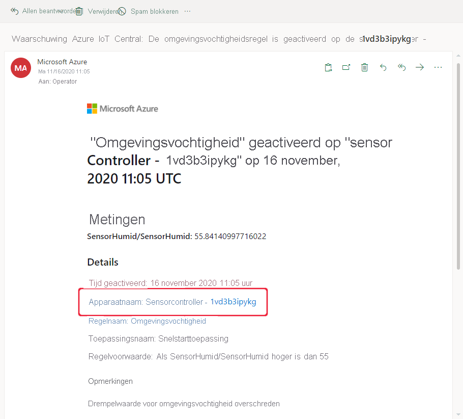

# Snelstartgids: Azure IoT Central gebruiken om uw apparaten te bewaken

*Dit artikel is van toepassing op operators, opbouwfuncties en beheerders.*

In deze Quick start ziet u, als operator, hoe u uw Microsoft Azure IoT Central toepassing kunt gebruiken om uw apparaten te bewaken en instellingen te wijzigen.

## Vereisten

Voordat u begint, moet u de drie vorige Quick starts volt ooien [een Azure IOT Central-toepassing maken](./quick-deploy-iot-central.md), [een gesimuleerd apparaat toevoegen aan uw IOT Central toepassing](./quick-create-pnp-device.md) en [regels en acties voor uw apparaat configureren](quick-configure-rules.md).

## Een melding ontvangen

Azure IoT Central verzendt meldingen over apparaten als e-mailberichten. De opbouw functie heeft een regel toegevoegd voor het verzenden van een melding wanneer de Tempe ratuur van een aangesloten apparaat een drempel waarde overschrijdt. Controleer de e-mails die zijn verzonden naar het account dat de bouwer heeft gekozen voor het ontvangen van meldingen.

Open het e-mail bericht dat u hebt ontvangen aan het einde van de [regels en acties voor de Snelstartgids van uw apparaat](quick-configure-rules.md) . Selecteer in het e-mail bericht de koppeling naar het apparaat:

De **overzichts** weergave voor het gesimuleerde apparaat dat u in de vorige Quick starts hebt gemaakt, wordt geopend in uw browser:

## Een probleem onderzoeken

Als operator kunt u informatie over het apparaat weer geven in de weer gaven **overzicht**, **about**en **Commands** . De opbouw functie heeft een weer gave voor het **beheren** van apparaten gemaakt waarmee u apparaatgegevens kunt bewerken en eigenschappen van het apparaat instelt.

De grafiek op het dashboard toont een grafische voorstelling van de temperatuur van het apparaat. U besluit dat de Tempe ratuur van het apparaat te hoog is.

## Een probleem oplossen

Als u een wijziging wilt aanbrengen op het apparaat, gebruikt u de pagina **apparaat beheren** .

Stel de **ventilator snelheid** in op 500 om het apparaat op te koelen. Kies **Opslaan** om het apparaat bij te werken. Wanneer het apparaat de gewijzigde instellingen bevestigt, wordt de status van de eigenschap gewijzigd in **gesynchroniseerd**:

## Volgende stappen

In deze snelstart hebt u de volgende zaken geleerd:

* Een melding ontvangen
* Een probleem onderzoeken
* Een probleem oplossen

Nu u weet dat u het apparaat nu kunt controleren, is de voorgestelde volgende stap:

> [!div class="nextstepaction"]
> [Een sjabloon voor een apparaat maken en beheren](howto-set-up-template.md).
