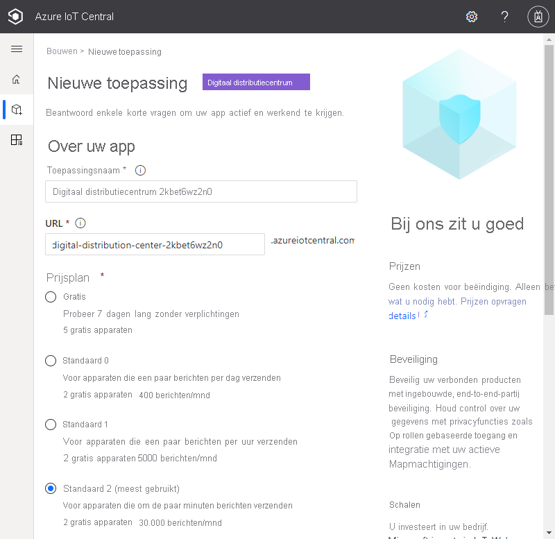

# Zelf studie: een Digital Distribution Center-toepassings sjabloon implementeren en door lopen

[!INCLUDE [iot-central-pnp-original](../../../includes/iot-central-pnp-original-note.md)]

In deze zelf studie wordt uitgelegd hoe u aan de slag gaat door een IoT Central **Digital Distribution Center** -toepassings sjabloon te implementeren. U leert hoe u de sjabloon implementeert, wat is opgenomen in het vak en wat u mogelijk op de volgende manier wilt doen.

In deze zelf studie leert u hoe u 
* Digital Distribution Center-toepassing maken 
* Door loop de toepassing 

## Vereisten
* Er zijn geen specifieke vereisten vereist voor het implementeren van deze app
* We raden u aan om Azure-abonnement te hebben, maar u kunt zelfs zonder dit te proberen

## Een Digital Distribution Center-toepassings sjabloon maken

U kunt een toepassing maken met behulp van de volgende stappen

1. Ga naar de website van Azure IoT Central Application Manager. Selecteer **samen stellen** in de navigatie balk aan de linkerkant en klik vervolgens op het tabblad **detail handel** .

> [!div class="mx-imgBorder"]
> 

2. Selecteer het tabblad **detail handel** en selecteer **app maken** onder * * Digital Distribution Center-toepassing * *

3. Bij het maken van de **app** wordt een nieuw toepassings formulier geopend en worden de aangevraagde gegevens ingevuld zoals hieronder wordt weer gegeven.
   **Toepassings naam**: u kunt de voorgestelde standaard naam gebruiken of een beschrijvende toepassings naam invoeren.
   **URL**: u kunt de voorgestelde standaard-URL gebruiken of uw beschrijvende, unieke, onthouden-URL invoeren. Vervolgens wordt de standaard instelling aanbevolen als u al een Azure-abonnement hebt. U kunt ook beginnen met een gratis proef versie van zeven dagen en ervoor kiezen om op elk gewenst moment betalen per gebruik te converteren voordat de gratis Trail-periode verloopt.
   **Facturerings gegevens**: de adres lijst, het Azure-abonnement en de regio gegevens zijn vereist om de resources in te richten.
   **Maken**: Selecteer maken onder aan de pagina om uw toepassing te implementeren.

> [!div class="mx-imgBorder"]
> 

## Het toepassings dashboard door lopen 

Nadat u de app-sjabloon hebt geïmplementeerd, is het standaard dashboard een portal voor de distributie centrum-operator met focus. North Wind handelaar is een fictieve oplossings provider voor distributie centra die transport systemen beheert. 

In dit dash board ziet u één gateway en één camera die fungeert als een IoT-apparaat. De Gateway levert telemetrie over pakketten zoals geldig, ongeldig, niet geïdentificeerd en grootte samen met gekoppelde apparaatspecifieke eigenschappen van het apparaat. Alle downstream-opdrachten worden uitgevoerd op IoT-apparaten, zoals een camera. Dit dash board is vooraf geconfigureerd om de activiteiten van het kritieke distributie centrum te demonstreren.

Het dash board is logisch ingedeeld om de mogelijkheden voor Apparaatbeheer van de Azure IoT-gateway en IoT-apparaat weer te geven.  
   * U kunt de opdracht gateway uitvoeren & besturings taken
   * Alle camera's beheren die deel uitmaken van de oplossing. 

> [!div class="mx-imgBorder"]
> 

## Apparaatprofiel

Klik op het tabblad Apparaatinstellingen en u ziet het gateway-functionaliteits model. Een mogelijkheidsprofiel is gestructureerd rond twee verschillende interfaces, **camera** en **digitale distributie gateway**

> [!div class="mx-imgBorder"]
> 

**Camera** : met deze interface worden alle camera-specifieke opdracht mogelijkheden geordend 

> [!div class="mx-imgBorder"]
> 

**Digital Distribution gateway** : deze interface vertegenwoordigt alle telemetrie van de camera, de door de Cloud gedefinieerde dubbele eigenschappen en gateway gegevens.

> [!div class="mx-imgBorder"]
> 

## Gateway opdrachten
Deze interface organiseert de gateway opdracht mogelijkheden

> [!div class="mx-imgBorder"]
> 

## Regels
Selecteer het tabblad regels om twee verschillende regels te zien die voor komen in deze toepassings sjabloon. Deze regels worden geconfigureerd voor het e-mailen van meldingen aan de Opera tors voor verdere onderzoek.

 **Waarschuwing voor te veel ongeldige pakketten** : deze regel wordt geactiveerd wanneer de camera een groot aantal ongeldige pakketten detecteert die via het transport systeem lopen.
 
**Groot pakket** : deze regel wordt geactiveerd als de camera een enorm pakket detecteert dat niet voor de kwaliteit kan worden geïnspecteerd. 

> [!div class="mx-imgBorder"]
> 

## Taken
Selecteer het tabblad taken om vijf verschillende taken weer te geven die als onderdeel van deze toepassings sjabloon bestaan: u kunt gebruikmaken van de functie voor het uitvoeren van bewerkingen voor de hele oplossing. Hier worden de & opdrachten voor het digitale distributie centrum gebruikt voor het uitvoeren van taken zoals,
   * de camera kalibreren voordat de detectie van het pakket wordt gestart 
   * camera firmware regel matig bijwerken
   * het telemetrie-interval wijzigen om het uploaden van gegevens te beheren

> [!div class="mx-imgBorder"]
> 

## Resources opschonen
Als u deze toepassing niet meer wilt gebruiken, verwijdert u de toepassings sjabloon door naar **beheer** > **Toepassings instellingen** te gaan en op **verwijderen**te klikken.

> [!div class="mx-imgBorder"]
> 

## Volgende stappen
* Meer informatie over het Digital Distribution Center- [concept](./architecture-digital-distribution-center-pnp.md) van Digital Distribution Center (oplossings architectuur)
* Meer informatie over andere [IOT Central Retail-sjablonen](./overview-iot-central-retail-pnp.md)
* Raadpleeg [IOT Central Overview](../preview/overview-iot-central.md) voor meer informatie over IOT Central
