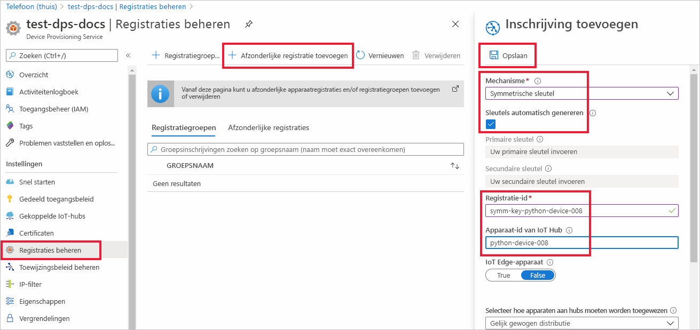
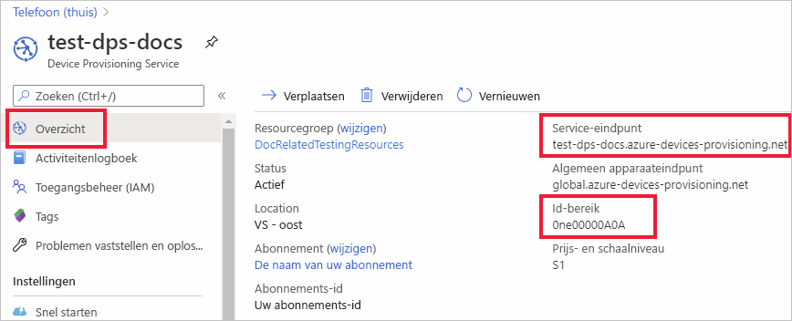
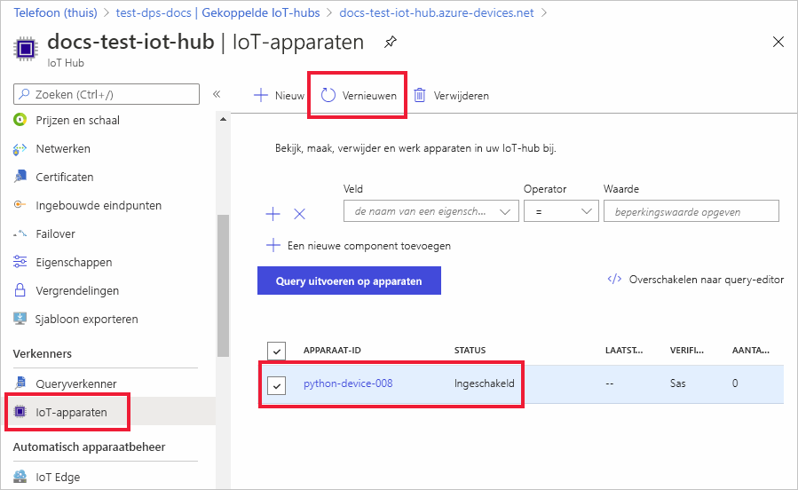

# <a name="quickstart-provision-a-python-device-with-symmetric-keys"></a>Een Python-apparaat inrichten met symmetrische sleutels

In deze quickstart leert u hoe u een Windows-ontwikkelcomputer kunt inrichten als een apparaat op een IoT-hub met Python. Dit apparaat maakt gebruik van een symmetrische sleutel en een afzonderlijke inschrijving voor verificatie met een Device Provisioning Service-exemplaar om te kunnen worden toegewezen aan een IoT-hub. Voorbeeldcode van de [Azure IoT Python SDK](https://github.com/Azure/azure-iot-sdk-python) wordt gebruikt om het apparaat in te richten. 

Hoewel dit artikel laat zien hoe u een inrichting maakt met een afzonderlijke inschrijving, kunt u dezelfde procedures ook gebruiken voor inschrijvingsgroepen. Er zijn enkele verschillen bij het gebruik van inschrijvingsgroepen. U moet bijvoorbeeld een afgeleide apparaatsleutel gebruiken met een unieke registratie-ID voor het apparaat. Hoewel inschrijvingsgroepen met symmetrische sleutel niet tot oudere apparaten beperkt zijn, biedt [Oudere apparaten inrichten door middel van attestation met een symmetrische sleutel](how-to-legacy-device-symm-key.md) een voorbeeld van een inschrijvingsgroep. Zie [Groepsinschrijvingen voor attestation met behulp van een symmetrische sleutel](concepts-symmetric-key-attestation.md#group-enrollments) voor meer informatie.

Raadpleeg het overzicht [Inrichten](about-iot-dps.md#provisioning-process) als u niet bekend bent met het proces van automatisch inrichten. 

Controleer ook of u de stappen in [IoT Hub Device Provisioning Service instellen met Azure Portal](./quick-setup-auto-provision.md) hebt voltooid voordat u verdergaat met deze snelstart. Voor deze snelstartgids wordt aangenomen dat u al een Device Provisioning Service-exemplaar hebt gemaakt.

Dit artikel is gericht op een Windows-gebaseerd werkstation. U kunt de procedures echter ook uitvoeren op Linux. Zie [Inrichten voor multitenancy](how-to-provision-multitenant.md) voor een Linux-voorbeeld.


[!INCLUDE [quickstarts-free-trial-note](../../includes/quickstarts-free-trial-note.md)]


## <a name="prerequisites"></a>Vereisten

* Zorg ervoor dat u [Python 3.7](https://www.python.org/downloads/) of hoger hebt geïnstalleerd op uw Windows-computer. U kunt uw versie van Python controleren door `python --version` uit te voeren.

* Meest recente versie van [Git](https://git-scm.com/download/) geïnstalleerd.

<a id="setupdevbox"></a>

## <a name="prepare-the-python-sdk-environment"></a>De python-SDK-omgeving voorbereiden 

1. Zorg ervoor dat Git op de computer is geïnstalleerd en is toegevoegd aan de omgevingsvariabelen die voor het opdrachtvenster toegankelijk zijn. Zie [Software Freedom Conservancy's Git client tools](https://git-scm.com/download/) (Git-clienthulpprogramma's van Software Freedom Conservancy) om de nieuwste versie van `git`-hulpprogramma's te installeren, waaronder **Git Bash** , de opdrachtregel-app die u kunt gebruiken voor interactie met de lokale Git-opslagplaats. 

2. Open een opdrachtprompt. Kloon de GitHub-opslagplaats voor de Azure IoT python SDK:
    
    ```console
    git clone https://github.com/Azure/azure-iot-sdk-python.git --recursive
    ```
3. Ga naar de `azure-iot-sdk-python\azure-iot-device\samples\async-hub-scenarios`-directory waarin het voorbeeldbestand, _provision_symmetric_key. py_ , zich bevindt.
   
   ```console
   cd azure-iot-sdk-python\azure-iot-device\samples\async-hub-scenarios
   ```
4. Installeer de _azure-iot-device_ -bibliotheek door de volgende opdracht uit te voeren.

    ```console
    pip install azure-iot-device
    ```


## <a name="create-a-device-enrollment"></a>Een apparaatinschrijving maken

1. Meld u aan bij de [Azure-portal](https://portal.azure.com), selecteer in het linkermenu de knop **Alle resources** en open uw exemplaar van Device Provisioning Service.

2. Selecteer het tabblad **Inschrijvingen beheren** en klik vervolgens op de knop **Afzonderlijke inschrijvingen toevoegen** bovenaan. 

3. Voer in het deelvenster **Inschrijving toevoegen** de volgende informatie in en druk op de knop **Opslaan**.

   - **Mechanisme:** selecteer **Symmetrische sleutel** als *mechanisme* voor identiteitscontrole.

   - **Automatisch sleutels genereren** : schakel dit selectievakje in.

   - **Registratie-ID** : voer een registratie-ID voor het identificeren van de inschrijving. Gebruik alleen kleine alfanumerieke tekens en streepjes ('-'). Bijvoorbeeld **symm-key-python-device-008**.

   - **IoT Hub apparaat-ID:** voer een apparaat-ID in. Bijvoorbeeld **python-device-008**.

     

4. Zodra u uw inschrijving heeft opgeslagen, worden de **primaire sleutel** en **secundaire sleutel** gegenereerd en aan de inschrijvingsvermelding toegevoegd. De inschrijving met symmetrische sleutel van uw apparaat wordt weergegeven als **symm-key-python-device-008** in de kolom *Registratie-ID* op het tabblad *Afzonderlijke registraties*. 

5. Open de inschrijving en kopieer de waarde van uw gegenereerde **primaire sleutel**. U gebruikt deze sleutelwaarde en de **registratie-ID** later wanneer u omgevingsvariabelen toevoegt voor gebruik met de voorbeeldcode voor het inrichten van apparaten.


<a id="firstbootsequence"></a>

## <a name="prepare-the-device-provisioning-code"></a>De apparaatinrichtingscode voorbereiden

In deze sectie voegt u de volgende vier omgevingsvariabelen toe die worden gebruikt als parameters voor de voorbeeldcode voor het inrichten van apparaten voor uw symmetrische sleutelapparaat. 

* `PROVISIONING_HOST`
* `PROVISIONING_IDSCOPE`
* `PROVISIONING_REGISTRATION_ID`
* `PROVISIONING_SYMMETRIC_KEY`

De inrichtingscode neemt op basis van deze variabelen contact op met het DPS-exemplaar om uw apparaat te verifiëren. Het apparaat wordt vervolgens toegewezen aan een IoT-hub die al is gekoppeld aan het DPS-exemplaar op basis van de afzonderlijke inschrijvingsconfiguratie. Zodra de voorbeeldcode is ingericht, worden er testtelemetriegegevens naar de IoT-hub verzonden.

1. Selecteer in de [Azure-portal](https://portal.azure.com), in het menu Device Provisioning Service, **Overzicht** en kopieer uw _Service-eindpunt_ en _ID-bereik_. U gebruikt deze waarden voor de omgevingsvariabelen `PROVISIONING_HOST` en `PROVISIONING_IDSCOPE`.

    

2. Voeg in uw Python-opdrachtprompt de omgevingsvariabelen toe met behulp van de waarden die u hebt gekopieerd. 

    De volgende opdrachten zijn voorbeelden van het weergeven van de opdrachtsyntaxis. Zorg ervoor dat u de juiste waarden gebruikt.

    ```console
    set PROVISIONING_HOST=test-dps-docs.azure-devices-provisioning.net
    ```

    ```console
    set PROVISIONING_IDSCOPE=0ne00000A0A
    ```

3. Voeg in uw Python-opdrachtprompt de omgevingsvariabelen toe voor de registratie-ID en de symmetrische sleutel die u hebt gekopieerd uit de afzonderlijke inschrijving in de vorige sectie. 

    De volgende opdrachten zijn voorbeelden van het weergeven van de opdrachtsyntaxis. Zorg ervoor dat u de juiste waarden gebruikt.

    ```console
    set PROVISIONING_REGISTRATION_ID=symm-key-python-device-008
    ```

    ```console
    set PROVISIONING_SYMMETRIC_KEY=sbDDeEzRuEuGKag+kQKV+T1QGakRtHpsERLP0yPjwR93TrpEgEh/Y07CXstfha6dhIPWvdD1nRxK5T0KGKA+nQ==
    ```

4. Voer de Python-voorbeeldcode uit in _provision_symmetric_key.py_.

    ```console
    D:\azure-iot-sdk-python\azure-iot-device\samples\async-hub-scenarios>python provision_symmetric_key.py
    ```

5. De verwachte uitvoer moet er ongeveer als volgt uitzien, dat de gekoppelde IoT-hub weergeeft waaraan het apparaat is toegewezen op basis van de afzonderlijke inschrijvingsinstellingen. Een voorbeeld van telemetrieberichten over windsnelheid wordt ook als test naar de hub verzonden:

    ```output
    D:\azure-iot-sdk-python\azure-iot-device\samples\async-hub-scenarios>python provision_symmetric_key.py
    RegistrationStage(RequestAndResponseOperation): Op will transition into polling after interval 2.  Setting timer.
    The complete registration result is
    python-device-008
    docs-test-iot-hub.azure-devices.net
    initialAssignment
    null
    Will send telemetry from the provisioned device
    sending message #8
    sending message #9
    sending message #3
    sending message #10
    sending message #4
    sending message #2
    sending message #6
    sending message #7
    sending message #1
    sending message #5
    done sending message #8
    done sending message #9
    done sending message #3
    done sending message #10
    done sending message #4
    done sending message #2
    done sending message #6
    done sending message #7
    done sending message #1
    done sending message #5
    ```
    
6. Navigeer in de Azure-portal naar de IoT-hub die is gekoppeld aan uw inrichtingsservice en open de blade **IoT-apparaten**. Nadat het symmetrische sleutelapparaat is ingericht op de hub, wordt de apparaat-ID weergegeven met *STATUS* als **ingeschakeld**. U moet mogelijk op de knop **Vernieuwen** bovenaan drukken als u de blade vóór het uitvoeren van de voorbeeldapparaatcode al hebt geopend. 

     

> [!NOTE]
> Als u de standaardwaarde van de *initiële status van de apparaatdubbel* hebt gewijzigd in de inschrijvingsvermelding voor uw apparaat, kan de gewenste status van de dubbel uit de hub worden gehaald en er dienovereenkomstig naar worden gehandeld. Zie [Apparaatdubbels begrijpen en gebruiken in IoT Hub](../iot-hub/iot-hub-devguide-device-twins.md) voor meer informatie.
>


## <a name="clean-up-resources"></a>Resources opschonen

Als u wilt blijven doorwerken met het voorbeeld van de apparaatclient en deze beter wilt leren kennen, wis de resources die in deze quickstart zijn gemaakt dan niet. Als u niet wilt doorgaan, gebruikt u de volgende stappen om alle resources te verwijderen die via deze quickstart zijn gemaakt.

1. Selecteer in het linkermenu in Azure Portal **Alle resources** en selecteer uw Device Provisioning Service. Open het tabblad **Inschrijvingen beheren** voor uw service en klik vervolgens op het tabblad **Afzonderlijke inschrijvingen**. Schakel het selectievakje naast de *Registratie-id* in van het apparaat dat u hebt ingeschreven in deze quickstart. Druk vervolgens op de knop **Verwijderen** bovenaan het deelvenster. 
1. Selecteer in het linkermenu in Azure Portal **Alle resources** en selecteer vervolgens uw IoT-hub. Open **IoT-apparaten** voor uw hub, schakel het selectievakje *DEVICE ID* in van het apparaat dat u hebt geregistreerd in deze quickstart en druk vervolgens bovenaan op de knop **Verwijderen**.

## <a name="next-steps"></a>Volgende stappen

In deze quickstart hebt u een op Windows gebaseerd symmetrisch sleutelapparaat ingericht op uw IoT-hub met behulp van de IoT Hub Device Provisioning Service. Voor meer informatie over het inrichten van X.509-certificaatapparaten met behulp van Python, gaat u verder met de onderstaande quickstart voor X.509-apparaten. 

> [!div class="nextstepaction"]
> [Azure quickstart - Inrichting van X.509-apparaten met DPS en python](quick-create-simulated-device-x509-python.md)
