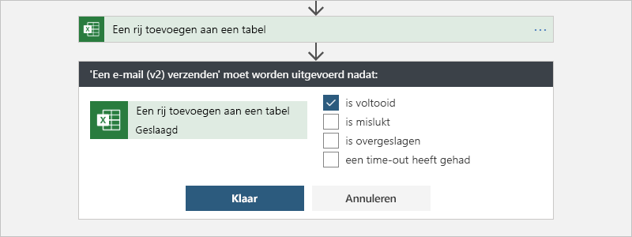
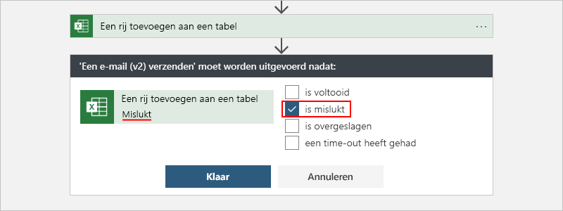
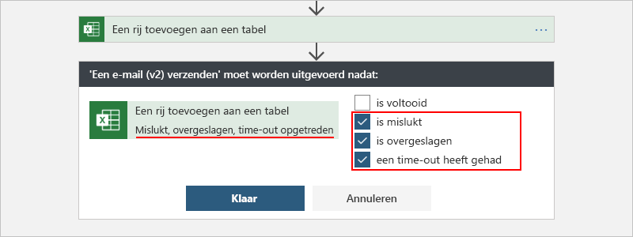

# <a name="handle-errors-and-exceptions-in-azure-logic-apps"></a>Fouten en uitzonderingen verwerken in Azure Logic Apps

De manier waarop elke integratiearchitectuur op de juiste manier omgaat met downtime of problemen veroorzaakt door afhankelijke systemen kan een uitdaging vormen. Om u te helpen robuuste en veerkrachtige integraties te maken die problemen en fouten op een elegante manier afhandelen, biedt Logic Apps een eersteklas ervaring voor het verwerken van fouten en uitzonderingen.

<a name="retry-policies"></a>

## <a name="retry-policies"></a>Beleid opnieuw proberen

Voor de meest elementaire uitzonderings- en foutafhandeling u een *beleid voor opnieuw proberen* gebruiken in elke actie of trigger waar deze wordt ondersteund, bijvoorbeeld zie [HTTP-actie](../logic-apps/logic-apps-workflow-actions-triggers.md#http-trigger). Een beleid voor opnieuw proberen geeft aan of en hoe de actie of trigger een aanvraag opnieuw indient wanneer de oorspronkelijke aanvraag een keer is uitgekeerd of mislukt, wat een verzoek is dat resulteert in een antwoord van 408, 429 of 5xx. Als er geen ander beleid voor nieuwe poging wordt gebruikt, wordt het standaardbeleid gebruikt.

Hier volgen de typen beleid opnieuw proberen:

| Type | Beschrijving |
|------|-------------|
| **Standaard** | Dit beleid stuurt maximaal vier nieuwe pogingen met *exponentieel toenemende* intervallen, die met 7,5 seconden worden geschaald, maar worden afgetopt tussen 5 en 45 seconden. |
| **Exponentieel interval**  | Dit beleid wacht een willekeurig interval dat is geselecteerd uit een exponentieel groeiend bereik voordat u de volgende aanvraag verzendt. |
| **Vast interval**  | Dit beleid wacht het opgegeven interval voordat u het volgende verzoek verzendt. |
| **Geen**  | Stuur het verzoek niet opnieuw. |
|||

Zie [Limieten en configuratie](../logic-apps/logic-apps-limits-and-config.md#request-limits)van Logic Apps voor informatie over beleidslimieten opnieuw proberen.

### <a name="change-retry-policy"></a>Beleid voor nieuwe wijzigingen wijzigen

Voer de volgende stappen uit om een ander beleid voor nieuwe instanties te selecteren:

1. Open uw logische app in Logic App Designer.

1. Open de **instellingen** voor een actie of trigger.

1. Als de actie of trigger beleid voor het opnieuw proberen ondersteunt, selecteert u onder **Beleid voor opnieuw proberen**het gewenste type.

U ook handmatig het beleid voor `inputs` opnieuw proberen opgeven in de sectie voor een actie of trigger die het beleid voor het opnieuw proberen ondersteunt. Als u geen beleid voor opnieuw proberen opgeeft, wordt met de actie het standaardbeleid gebruikt.

```json
"<action-name>": {
   "type": "<action-type>",
   "inputs": {
      "<action-specific-inputs>",
      "retryPolicy": {
         "type": "<retry-policy-type>",
         "interval": "<retry-interval>",
         "count": <retry-attempts>,
         "minimumInterval": "<minimum-interval>",
         "maximumInterval": "<maximum-interval>"
      },
      "<other-action-specific-inputs>"
   },
   "runAfter": {}
}
```

*Vereist*

| Waarde | Type | Beschrijving |
|-------|------|-------------|
| <*retry-policy-type*> | Tekenreeks | Het type beleid opnieuw proberen `default`dat `none` `fixed`u wilt gebruiken: , , of`exponential` |
| <*opnieuw proberen-interval*> | Tekenreeks | Het interval voor opnieuw proberen waarbij de waarde [de ISO 8601-notatie](https://en.wikipedia.org/wiki/ISO_8601#Combined_date_and_time_representations)moet gebruiken . Het standaard minimuminterval is `PT5S` en `PT1D`het maximale interval is . Wanneer u het exponentiële intervalbeleid gebruikt, u verschillende minimum- en maximumwaarden opgeven. |
| <*pogingen opnieuw proberen*> | Geheel getal | Het aantal pogingen om opnieuw te proberen, dat tussen 1 en 90 moet liggen |
||||

*Optionele*

| Waarde | Type | Beschrijving |
|-------|------|-------------|
| <*minimum-interval*> | Tekenreeks | Voor het exponentiële intervalbeleid wordt het kleinste interval voor het willekeurig geselecteerde interval in [ISO 8601-indeling](https://en.wikipedia.org/wiki/ISO_8601#Combined_date_and_time_representations) |
| <*maximale interval*> | Tekenreeks | Voor het exponentiële intervalbeleid wordt het grootste interval voor het willekeurig geselecteerde interval in [iso 8601-indeling](https://en.wikipedia.org/wiki/ISO_8601#Combined_date_and_time_representations) |
||||

Hier vindt u meer informatie over de verschillende beleidstypen.

<a name="default-retry"></a>

### <a name="default"></a>Standaard

Als u geen beleid voor opnieuw proberen opgeeft, wordt met de actie het standaardbeleid gebruikt, dat eigenlijk een [exponentieel intervalbeleid](#exponential-interval) is dat maximaal vier nieuwe pogingen verzendt met exponentieel toenemende intervallen die met 7,5 seconden worden geschaald. Het interval is beperkt tussen 5 en 45 seconden.

Hoewel niet expliciet gedefinieerd in uw actie of trigger, is hier hoe het standaardbeleid zich gedraagt in een voorbeeld HTTP-actie:

```json
"HTTP": {
   "type": "Http",
   "inputs": {
      "method": "GET",
      "uri": "http://myAPIendpoint/api/action",
      "retryPolicy" : {
         "type": "exponential",
         "interval": "PT7S",
         "count": 4,
         "minimumInterval": "PT5S",
         "maximumInterval": "PT1H"
      }
   },
   "runAfter": {}
}
```

### <a name="none"></a>Geen

Als u wilt opgeven dat de actie of trigger mislukte aanvragen niet opnieuw `none`probeert, stelt u het <het type> van *het* <opnieuw proberen> in .

### <a name="fixed-interval"></a>Vast interval

Als u wilt opgeven dat de actie of trigger het opgegeven interval wacht voordat u `fixed`het volgende verzoek verzendt, stelt u het <het type <opnieuw *proberen-beleid* in> in .

*Voorbeeld*

Met dit beleid probeert u het laatste nieuws nog twee keer te ontvangen nadat de eerste mislukte aanvraag is mislukt met een vertraging van 30 seconden tussen elke poging:

```json
"Get_latest_news": {
   "type": "Http",
   "inputs": {
      "method": "GET",
      "uri": "https://mynews.example.com/latest",
      "retryPolicy": {
         "type": "fixed",
         "interval": "PT30S",
         "count": 2
      }
   }
}
```

<a name="exponential-interval"></a>

### <a name="exponential-interval"></a>Exponentieel interval

Als u wilt opgeven dat de actie of trigger een willekeurig interval wacht voordat u `exponential`het volgende verzoek verzendt, stelt u het <het> van het opnieuw *proberen-beleid* in . Het willekeurige interval wordt geselecteerd uit een exponentieel groeiend bereik. Optioneel u ook de standaard minimale en maximale intervallen overschrijven door uw eigen minimum- en maximale intervallen op te geven.

**Willekeurige variabele bereiken**

In deze tabel ziet u hoe Logic Apps een uniforme willekeurige variabele genereert in het opgegeven bereik voor elke nieuwe poging tot en met het aantal nieuwe pogingen:

| Getal opnieuw proberen | Minimuminterval | Maximaal interval |
|--------------|------------------|------------------|
| 1 | max(0, <*> met een minimuminterval)* | min(interval, <*maximale>)* |
| 2 | max(interval, <*> met een minimuminterval)* | min(2 * interval, <*maximale>)* |
| 3 | max(2 * interval, <*> met een minimuminterval)* | min(4 * interval, <*maximale interval*>) |
| 4 | max(4 * interval, <*> met een minimuminterval)* | min(8 * interval, <*> met maximale interval)* |
| .... | .... | .... |
||||

<a name="control-run-after-behavior"></a>

## <a name="catch-and-handle-failures-by-changing-run-after-behavior"></a>Fouten vangen en afhandelen door het gedrag 'run after' te wijzigen

Wanneer u acties toevoegt in de Logic App Designer, geeft u impliciet aan welke volgorde u moet gebruiken voor het uitvoeren van deze acties. Nadat een actie is uitgevoerd, wordt die actie `Succeeded` `Failed`gemarkeerd `Skipped`met `TimedOut`een status zoals , , of . In elke actiedefinitie `runAfter` geeft de eigenschap de voorafgaande actie aan die eerst moet worden voltooid en de statussen die voor die voorganger zijn toegestaan voordat de volgende actie kan worden uitgevoerd. Standaard wordt een actie die u in de ontwerper toevoegt, alleen uitgevoerd nadat de voorganger de `Succeeded` status heeft voltooid.

Wanneer een actie een onverwerkte fout of `Failed`uitzondering genereert, wordt `Skipped`de actie gemarkeerd en wordt elke actie voor een opvolger gemarkeerd . Als dit gedrag optreedt voor een actie met parallelle branches, volgt de Logic Apps-engine de andere branches om de voltooiingsstatus te bepalen. Als een vertakking bijvoorbeeld `Skipped` eindigt met een actie, is de voltooiingsstatus van die vertakking gebaseerd op de voorloperstatus van die overgeslagen actie. Nadat de logische app is voltooid, bepaalt de engine de status van de hele uitvoering door alle branchstatussen te evalueren. Als een vertakking eindigt in een `Failed`fout, wordt de hele logische app-run gemarkeerd .


Als u ervoor wilt zorgen dat een actie ondanks de status van zijn voorganger nog steeds kan worden uitgevoerd, [past u het gedrag 'run after' van een actie aan](#customize-run-after) om de mislukte status van de voorganger te verwerken.

<a name="customize-run-after"></a>

### <a name="customize-run-after-behavior"></a>Gedrag 'uitvoeren na' aanpassen

U het gedrag 'run after' van een actie aanpassen, zodat `Succeeded`de `Failed` `Skipped`actie `TimedOut`wordt uitgevoerd wanneer de status van de voorganger,,, of een van deze statussen is. Als u bijvoorbeeld een e-mail `Add_a_row_into_a_table` wilt verzenden `Failed`nadat `Succeeded`de vorige actie van Excel Online is gemarkeerd, in plaats van het gedrag 'uitvoeren na' te wijzigen door een van beide stappen te volgen:

* Selecteer in de ontwerpweergave de knop ellips (**... )** en selecteer Uitvoeren **configureren na**.

  

  De actievorm toont de standaardstatus die vereist is voor de voorafgaande actie, namelijk **Een rij toevoegen aan een tabel** in dit voorbeeld:

  

  Wijzig het gedrag 'uitvoeren na' in de gewenste status, wat in dit voorbeeld **is mislukt:**

  

  Als u wilt opgeven of de actie `Failed` `Skipped` wordt `TimedOut`uitgevoerd of de vorige actie is gemarkeerd als , of , selecteert u de andere statussen:

  

* Bewerk in de codeweergave in de JSON-definitie van de actie de `runAfter` eigenschap, die deze syntaxis volgt:

  ```json
  "<action-name>": {
     "inputs": {
        "<action-specific-inputs>"
     },
     "runAfter": {
        "<preceding-action>": [
           "Succeeded"
        ]
     },
     "type": "<action-type>"
  }
  ```

  Wijzig in dit `runAfter` voorbeeld `Succeeded` de `Failed`eigenschap van :

  ```json
  "Send_an_email_(V2)": {
     "inputs": {
        "body": {
           "Body": "<p>Failed to&nbsp;add row to &nbsp;@{body('Add_a_row_into_a_table')?['Terms']}</p>",,
           "Subject": "Add row to table failed: @{body('Add_a_row_into_a_table')?['Terms']}",
           "To": "Sophia.Owen@fabrikam.com"
        },
        "host": {
           "connection": {
              "name": "@parameters('$connections')['office365']['connectionId']"
           }
        },
        "method": "post",
        "path": "/v2/Mail"
     },
     "runAfter": {
        "Add_a_row_into_a_table": [
           "Failed"
        ]
     },
     "type": "ApiConnection"
  }
  ```

  Ga als volgt te werk om op `Failed` `Skipped` te `TimedOut`geven of de actie wordt uitgevoerd of de vorige actie is gemarkeerd als , of , voeg de andere statussen toe:

  ```json
  "runAfter": {
     "Add_a_row_into_a_table": [
        "Failed", "Skipped", "TimedOut"
     ]
  },
  ```

<a name="scopes"></a>

## <a name="evaluate-actions-with-scopes-and-their-results"></a>Acties evalueren met scopes en hun resultaten

Net als bij het uitvoeren `runAfter` van stappen na afzonderlijke acties met de eigenschap, u acties groeperen binnen een [bereik.](../logic-apps/logic-apps-control-flow-run-steps-group-scopes.md) U scopes gebruiken wanneer u acties logisch wilt groeperen, de geaggregeerde status van het bereik wilt beoordelen en acties wilt uitvoeren op basis van die status. Nadat alle acties in een scope zijn voltooid, krijgt het bereik zelf zijn eigen status.

Als u de status van een bereik wilt controleren, u dezelfde criteria gebruiken `Succeeded`die `Failed`u gebruikt om de runstatus van een logische app te controleren, zoals, enzovoort.

Wanneer alle acties van het bereik slagen, wordt de `Succeeded`status van het bereik standaard gemarkeerd . Als de uiteindelijke actie `Failed` in `Aborted`een bereik als of `Failed`, de status van het bereik wordt gemarkeerd .

Als u uitzonderingen `Failed` wilt maken in een bereik en `runAfter` acties wilt `Failed` uitvoeren die deze fouten verwerken, u de eigenschap voor dat bereik gebruiken. Op die *any* manier u één actie maken `runAfter` om fouten op te vangen als er acties in het bereik mislukken en u de eigenschap voor dat bereik gebruikt.

Zie [Limieten en config](../logic-apps/logic-apps-limits-and-config.md)voor beperkingen op scopes.

<a name="get-results-from-failures"></a>

### <a name="get-context-and-results-for-failures"></a>Krijg context en resultaten voor fouten

Hoewel het nuttig is om fouten uit een bereik op te vangen, wilt u mogelijk ook context om u te helpen precies te begrijpen welke acties zijn mislukt plus eventuele fouten of statuscodes die zijn geretourneerd.

De [`result()`](../logic-apps/workflow-definition-language-functions-reference.md#result) functie biedt context over de resultaten van alle acties in een bereik. De `result()` functie accepteert één parameter, de naam van het bereik, en retourneert een array die alle actieresultaten van binnen dat bereik bevat. Deze actieobjecten bevatten dezelfde kenmerken `actions()` als het object, zoals de begintijd, eindtijd, status, ingangen, correlatie-id's en uitvoer. Als u context wilt verzenden voor acties die binnen `@result()` een `runAfter` bereik zijn mislukt, u eenvoudig een expressie koppelen aan de eigenschap.

Als u een actie wilt uitvoeren voor `Failed` elke actie in een bereik dat een resultaat heeft, `@result()` en de reeks resultaten wilt filteren op de mislukte acties, u een expressie koppelen aan een actie [**Filterarray**](logic-apps-perform-data-operations.md#filter-array-action) en een [**voor elke**](../logic-apps/logic-apps-control-flow-loops.md) lus. U de gefilterde resultaatarray uitvoeren en `For_each` een actie uitvoeren voor elke fout met behulp van de lus.

Hier volgt een voorbeeld, gevolgd door een gedetailleerde uitleg, dat een HTTP POST-verzoek verzendt met de antwoordinstantie voor acties die zijn mislukt binnen het bereik "My_Scope":

```json
"Filter_array": {
   "type": "Query",
   "inputs": {
      "from": "@result('My_Scope')",
      "where": "@equals(item()['status'], 'Failed')"
   },
   "runAfter": {
      "My_Scope": [
         "Failed"
      ]
    }
},
"For_each": {
   "type": "foreach",
   "actions": {
      "Log_exception": {
         "type": "Http",
         "inputs": {
            "method": "POST",
            "body": "@item()['outputs']['body']",
            "headers": {
               "x-failed-action-name": "@item()['name']",
               "x-failed-tracking-id": "@item()['clientTrackingId']"
            },
            "uri": "http://requestb.in/"
         },
         "runAfter": {}
      }
   },
   "foreach": "@body('Filter_array')",
   "runAfter": {
      "Filter_array": [
         "Succeeded"
      ]
   }
}
```

Hier volgt een gedetailleerde walkthrough die beschrijft wat er in dit voorbeeld gebeurt:

1. Als u het resultaat wilt krijgen van alle acties in My_Scope, gebruikt de actie **Filterarray** de als volgt:`@result('My_Scope')`

1. De voorwaarde voor **Filterarray** is een `@result()` item `Failed`met een status die gelijk is aan . Met deze voorwaarde filtert u de array met alle actieresultaten van 'My_Scope' tot een array met alleen de mislukte actieresultaten.

1. Voer `For_each` een lusactie uit op de *gefilterde arrayuitvoer.* Met deze stap wordt een actie uitgevoerd voor elk mislukt actieresultaat dat eerder is gefilterd.

   Als één actie in het bereik mislukt, worden de acties in de `For_each` lus slechts één keer uitgevoerd. Meerdere mislukte acties veroorzaken één actie per fout.

1. Stuur een HTTP-BERICHT op de `For_each` objectresponstekst, de `@item()['outputs']['body']` expressie.

   De `@result()` itemvorm is hetzelfde als de `@actions()` vorm en kan op dezelfde manier worden ontleed.

1. Voeg twee aangepaste kopteksten toe`@item()['name']`met de mislukte actienaam`@item()['clientTrackingId']`( ) en de mislukte run client tracking ID ( ).

Voor referentie, hier is een `@result()` voorbeeld van `name`een `body`enkel `clientTrackingId` item, met de , en eigenschappen die zijn ontleed in het vorige voorbeeld. Als `For_each` `@result()` u buiten een actie een array van deze objecten retourneert.

```json
{
   "name": "Example_Action_That_Failed",
   "inputs": {
      "uri": "https://myfailedaction.azurewebsites.net",
      "method": "POST"
   },
   "outputs": {
      "statusCode": 404,
      "headers": {
         "Date": "Thu, 11 Aug 2016 03:18:18 GMT",
         "Server": "Microsoft-IIS/8.0",
         "X-Powered-By": "ASP.NET",
         "Content-Length": "68",
         "Content-Type": "application/json"
      },
      "body": {
         "code": "ResourceNotFound",
         "message": "/docs/folder-name/resource-name does not exist"
      }
   },
   "startTime": "2016-08-11T03:18:19.7755341Z",
   "endTime": "2016-08-11T03:18:20.2598835Z",
   "trackingId": "bdd82e28-ba2c-4160-a700-e3a8f1a38e22",
   "clientTrackingId": "08587307213861835591296330354",
   "code": "NotFound",
   "status": "Failed"
}
```

Als u verschillende patronen voor het afhandelen van uitzonderingen wilt uitvoeren, u de eerder beschreven expressies in dit artikel gebruiken. U ervoor kiezen om één uitzonderingsverwerkingsactie uit te voeren buiten het `For_each` bereik dat de volledige gefilterde array met fouten accepteert en de actie te verwijderen. U ook andere nuttige `\@result()` eigenschappen van het antwoord opnemen zoals eerder beschreven.

## <a name="set-up-azure-monitor-logs"></a>Azure Monitor-logboeken instellen

De vorige patronen zijn een geweldige manier om fouten en uitzonderingen binnen een run te verwerken, maar u ook fouten identificeren en erop reageren die onafhankelijk zijn van de run zelf. [Azure Monitor](../azure-monitor/overview.md) biedt een eenvoudige manier om alle werkstroomgebeurtenissen, inclusief alle run- en actiestatussen, naar een [Log Analytics-werkruimte,](../azure-monitor/platform/data-platform-logs.md) [Azure-opslagaccount](../storage/blobs/storage-blobs-overview.md)of [Azure Event Hubs](../event-hubs/event-hubs-about.md)te verzenden.

Als u runstatussen wilt evalueren, u de logboeken en statistieken controleren of publiceren in een bewakingstool die u verkiest. Een mogelijke optie is om alle gebeurtenissen via Gebeurtenishubs te streamen naar [Azure Stream Analytics.](https://azure.microsoft.com/services/stream-analytics/) In Stream Analytics u live query's schrijven op basis van afwijkingen, gemiddelden of fouten uit de diagnostische logboeken. U Stream Analytics gebruiken om informatie naar andere gegevensbronnen te verzenden, zoals wachtrijen, onderwerpen, SQL, Azure Cosmos DB of Power BI.

## <a name="next-steps"></a>Volgende stappen

* [Bekijk hoe een klant foutafhandeling bouwt met Azure Logic Apps](../logic-apps/logic-apps-scenario-error-and-exception-handling.md)
* [Voorbeelden en scenario's voor Logic Apps zoeken](../logic-apps/logic-apps-examples-and-scenarios.md)
