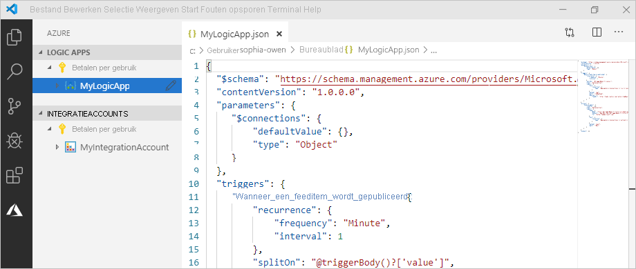
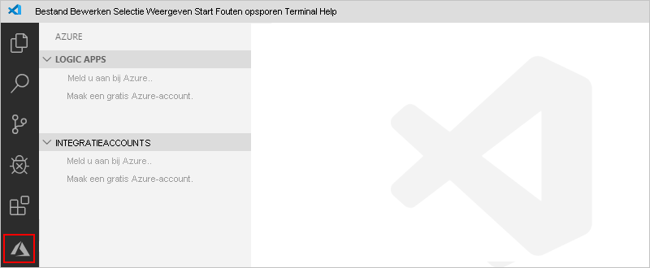
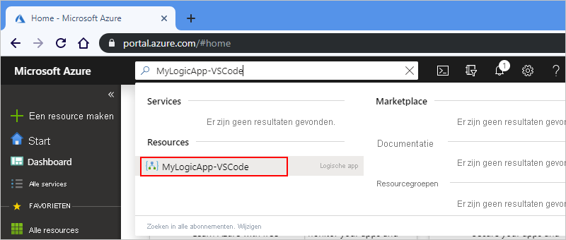
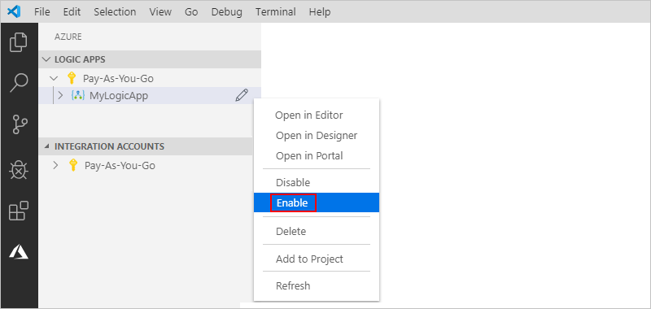
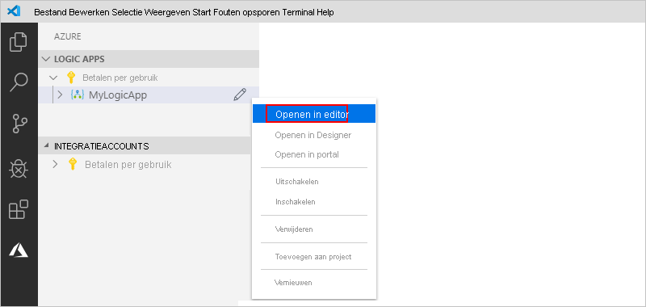

# <a name="quickstart-create-and-manage-logic-app-workflow-definitions-by-using-visual-studio-code"></a>Snelstart: definities van logische app-werkstroom maken en beheren met Behulp van Visual Studio Code

Met [Azure Logic Apps](../logic-apps/logic-apps-overview.md) en Visual Studio Code u logische apps maken en beheren waarmee u taken, werkstromen en processen automatiseren voor het integreren van apps, gegevens, systemen en services in organisaties en bedrijven. Deze quickstart laat zien hoe u de onderliggende werkstroomdefinities, die JavaScript Object Notatie (JSON) gebruiken, maken en bewerken voor logische apps via een op code gebaseerde ervaring. U ook werken aan bestaande logische apps die al zijn geïmplementeerd in Azure.

Hoewel u dezelfde taken uitvoeren in de [Azure-portal](https://portal.azure.com) en in Visual Studio, u sneller aan de slag in Visual Studio Code wanneer u al bekend bent met definities van logische apps en rechtstreeks in code wilt werken. U bijvoorbeeld reeds gemaakte logische apps uitschakelen, inschakelen, verwijderen en vernieuwen. U ook werken aan logische apps en integratieaccounts van elk ontwikkelingsplatform waar Visual Studio Code wordt uitgevoerd, zoals Linux, Windows en Mac.

Voor dit artikel u dezelfde logische app maken vanuit deze [quickstart,](../logic-apps/quickstart-create-first-logic-app-workflow.md)die zich meer richt op de basisconcepten. In Visual Studio Code ziet de logische app er als volgt uit:



Zorg ervoor dat u deze items hebt voordat u begint:

* Als u geen Azure-account en -abonnement hebt, [meldt u zich aan voor een gratis Azure-account.](https://azure.microsoft.com/free/)

* Basiskennis over [de workflowdefinities](../logic-apps/logic-apps-workflow-definition-language.md) van logische apps en de structuur ervan zoals beschreven met JSON

  Als u nieuw bent in Logic Apps, probeert u deze [quickstart,](../logic-apps/quickstart-create-first-logic-app-workflow.md)die uw eerste logische apps in de Azure-portal maakt en zich meer richt op de basisconcepten.

* Toegang tot het web voor aanmelden bij Azure en uw Azure-abonnement

* Download en installeer deze hulpprogramma's als u ze nog niet hebt:

  * [Visual Studio Code versie 1.25.1 of hoger](https://code.visualstudio.com/), die gratis is

  * Visual Studio Code-extensie voor Azure Logic Apps

    U deze extensie downloaden en installeren via de [Visual Studio Marketplace](https://marketplace.visualstudio.com/items?itemName=ms-azuretools.vscode-logicapps) of rechtstreeks vanuit Visual Studio Code. Zorg ervoor dat u Visual Studio Code opnieuw laadt na installatie.

    

    Als u wilt controleren of de extensie correct is geïnstalleerd, selecteert u het Azure-pictogram dat wordt weergegeven op de werkbalk Visual Studio Code.

    

    Zie [Extensiemarktplaats](https://code.visualstudio.com/docs/editor/extension-gallery)voor meer informatie. Ga naar de [Azure Logic Apps-extensie voor Visual Studio Code op GitHub](https://github.com/Microsoft/vscode-azurelogicapps)om bij te dragen aan de open source-versie van deze extensie.

<a name="sign-in-azure"></a>

## <a name="sign-in-to-azure"></a>Aanmelden bij Azure

1. Open Visual Studio Code. Selecteer op de werkbalk Visual Studio Code het Azure-pictogram.

   

1. Selecteer In het Azure-venster onder **Logische apps**de optie Aanmelden **bij Azure**. Wanneer u op de aanmeldingspagina van Microsoft wordt gevraagd, meldt u zich aan met uw Azure-account.

   

   1. Als aanmelden langer duurt dan normaal, vraagt Visual Studio Code u om u aan te melden via een Microsoft-verificatiewebsite door u een apparaatcode op te geven. Als u zich in plaats daarvan wilt aanmelden met de code, selecteert u **Apparaatcode gebruiken**.

      

   1. Als u de code wilt kopiëren, selecteert u **& openen .**

      

   1. Als u een nieuw browservenster wilt openen en door wilt gaan naar de verificatiewebsite, selecteert u **Koppeling openen**.

      

   1. Voer **op** de pagina Aanmelden bij uw account uw verificatiecode in en selecteer **Volgende**.

      

1. Selecteer uw Azure-account. Nadat u zich hebt aangemeld, u uw browser sluiten en terugkeren naar Visual Studio Code.

   In het Azure-deelvenster worden in de secties **Logic Apps** en **Integratie-accounts** nu de Azure-abonnementen weergegeven die aan uw account zijn gekoppeld. Als u echter de abonnementen niet ziet die u verwacht, of als de secties te veel abonnementen weergeven, voert u de volgende stappen uit:

   1. Verplaats de aanwijzer op het label **Logic Apps.** Wanneer de werkbalk wordt weergegeven, selecteert u **Abonnementen selecteren** (filterpictogram).

      

   1. Selecteer in de lijst die wordt weergegeven de abonnementen die u wilt weergeven.

1. Selecteer **onder Logische apps**het gewenste abonnement. Het abonnementsknooppunt wordt uitgebreid en toont alle logische apps die in dat abonnement bestaan.

   

   > [!TIP]
   > Onder **Integratieaccounts**geeft het selecteren van uw abonnement alle integratieaccounts weer die in dat abonnement bestaan.

<a name="create-logic-app"></a>

## <a name="create-new-logic-app"></a>Nieuwe logische app maken

1. Als u zich nog niet hebt aangemeld bij uw Azure-account en abonnement vanuit Visual Studio Code, volgt u de [eerdere stappen om u nu aan te melden.](#sign-in-azure)

1. Open in Visual Studio-code onder **Logische apps**het snelmenu van uw abonnement en selecteer Logische **App maken**.

   

   Er wordt een lijst weergegeven en worden eventuele Azure-brongroepen in uw abonnement weergegeven.

1. Selecteer in de lijst met resourcegroepen **een nieuwe resourcegroep** maken of een bestaande resourcegroep. Maak in dit voorbeeld een nieuwe resourcegroep.

   

1. Geef een naam op voor uw Azure-brongroep en druk op ENTER.

   

1. Selecteer het Azure-gebied waar u de metagegevens van uw logica-app wilt opslaan.

   

1. Geef een naam op voor uw logische app en druk op Enter.

   

   In het Azure-venster wordt onder uw Azure-abonnement uw nieuwe en lege logische app weergegeven. Visual Studio Code opent ook een JSON-bestand (.logicapp.json), dat een skeletworkflowdefinitie voor uw logische app bevat. Nu u handmatig beginnen met het handmatig maken van de werkstroomdefinitie van uw logische app in dit JSON-bestand. Zie het [schema Werkstroomdefinitietaal voor Azure Logic Apps voor](../logic-apps/logic-apps-workflow-definition-language.md)technische informatie over de structuur en syntaxis voor een werkstroomdefinitie .

   

   Hier vindt u bijvoorbeeld een voorbeelddefinitie van een voorbeeldlogica-app-werkstroom, die begint met een RSS-trigger en een Office 365 Outlook-actie. Meestal worden JSON-elementen alfabetisch weergegeven in elke sectie. In dit voorbeeld worden deze elementen echter ruwweg weergegeven in de volgorde waarin de stappen van de logische app in de ontwerper worden weergegeven.

   > [!IMPORTANT]
   > Als u deze definitie van deze voorbeeldlogica-app opnieuw wilt gebruiken, @fabrikam.comhebt u bijvoorbeeld een Office 365-organisatieaccount nodig. Zorg ervoor dat u het fictieve e-mailadres vervangt door uw eigen e-mailadres. Als u een andere e-mailconnector wilt `Send_an_email_action` gebruiken, zoals Outlook.com of Gmail, vervangt u de actie door een vergelijkbare actie die beschikbaar is via een [e-mailconnector die wordt ondersteund door Azure Logic Apps.](../connectors/apis-list.md)

   ```json
   {
      "$schema": "https://schema.management.azure.com/providers/Microsoft.Logic/schemas/2016-06-01/workflowdefinition.json#",
      "contentVersion": "1.0.0.0",
      "parameters": {
         "$connections": {
            "defaultValue": {},
            "type": "Object"
         }
      },
      "triggers": {
         "When_a_feed_item_is_published": {
            "recurrence": {
               "frequency": "Minute",
               "interval": 1
            },
            "splitOn": "@triggerBody()?['value']",
            "type": "ApiConnection",
            "inputs": {
               "host": {
                  "connection": {
                     "name": "@parameters('$connections')['rss']['connectionId']"
                  }
               },
               "method": "get",
               "path": "/OnNewFeed",
               "queries": {
                  "feedUrl": "http://feeds.reuters.com/reuters/topNews"
               }
            }
         }
      },
      "actions": {
         "Send_an_email_(V2)": {
            "runAfter": {},
            "type": "ApiConnection",
            "inputs": {
               "body": {
                  "Body": "<p>Title: @{triggerBody()?['title']}<br>\n<br>\nDate published: @{triggerBody()?['updatedOn']}<br>\n<br>\nLink: @{triggerBody()?['primaryLink']}</p>",
                  "Subject": "RSS item: @{triggerBody()?['title']}",
                  "To": "sophia-owen@fabrikam.com"
               },
               "host": {
                  "connection": {
                     "name": "@parameters('$connections')['office365']['connectionId']"
                  }
               },
               "method": "post",
               "path": "/v2/Mail"
            }
         }
      },
      "outputs": {}
   }
   ```

1. Wanneer u klaar bent, slaat u de werkstroomdefinitie van uw logische app op. (Menu Bestand > Opslaan of op Ctrl+S drukken)

1. Wanneer u wordt gevraagd uw logische app te uploaden naar uw Azure-abonnement, selecteert u **Uploaden**.

   Met deze stap publiceert u uw logische app naar de [Azure-portal,](https://portal.azure.com)die uw logica live en uitgevoerd maakt in Azure.

   

## <a name="view-logic-app-in-designer"></a>Logische app weergeven in ontwerper

In Visual Studio Code u uw logische app openen in de alleen-lezen ontwerpweergave. Hoewel u uw logische app niet bewerken in de ontwerper, u de werkstroom van uw logische app visueel controleren met behulp van de ontwerpweergave.

Open in het Azure-venster onder **Logische apps**het snelmenu van uw logische app en selecteer Openen **in Designer**.

De alleen-lezen ontwerper wordt in een apart venster geopend en toont bijvoorbeeld de workflow van uw logische app:


## <a name="view-in-azure-portal"></a>Weergave in Azure-portal

Voer de volgende stappen uit om uw logische app in Azure-portal te bekijken:

1. Meld u aan bij de [Azure-portal](https://portal.azure.com) met hetzelfde Azure-account en -abonnement dat is gekoppeld aan uw logische app.

1. Voer in het zoekvak van de Azure-portal de naam van uw logische apps in. Selecteer in de lijst met resultaten uw logische app.

   

<a name="disable-enable-logic-app"></a>

## <a name="disable-or-enable-logic-app"></a>Logische app in- of uitschakelen

Als u in Visual Studio Code een gepubliceerde logische app bewerkt en uw wijzigingen opslaat, *overschrijft* u uw reeds geïmplementeerde app. Deactiveer uw logische app eerst om te voorkomen dat uw logische app in productie wordt gebroken en onderbrekingen te minimaliseren. U vervolgens uw logica-app reactief maken nadat u hebt bevestigd dat uw logische app nog steeds werkt.

1. Als u zich nog niet hebt aangemeld bij uw Azure-account en abonnement vanuit Visual Studio Code, volgt u de [eerdere stappen om u nu aan te melden.](#sign-in-azure)

1. Vouw in het Azure-venster onder **Logic Apps**uw Azure-abonnement uit, zodat u alle logische apps in dat abonnement weergeven.

   1. Als u de gewenste logische app wilt uitschakelen, opent u het menu van de logische app en selecteert **u Uitschakelen**.

      

   1. Wanneer u klaar bent om uw logische app opnieuw te activeren, opent u het menu van de logische app en selecteert u **Inschakelen**.

      

<a name="edit-logic-app"></a>

## <a name="edit-deployed-logic-app"></a>Geïmplementeerde logica-app bewerken

In Visual Studio Code u de werkstroomdefinitie voor een reeds geïmplementeerde logische app in Azure openen en bewerken.

> [!IMPORTANT] 
> Voordat u een actief actieve logische app in productie bewerkt, vermijdt u het risico dat deze logische app wordt gebroken en minimaliseert u verstoring door [eerst uw logische app uit te schakelen.](#disable-enable-logic-app)

1. Als u zich nog niet hebt aangemeld bij uw Azure-account en abonnement vanuit Visual Studio Code, volgt u de [eerdere stappen om u nu aan te melden.](#sign-in-azure)

1. Vouw in het Azure-venster onder **Logische apps**uw Azure-abonnement uit en selecteer de gewenste logische app.

1. Open het menu van uw logische app en selecteer **Openen in editor**. Of selecteer naast de naam van uw logica-app het pictogram bewerken.

   

   Visual Studio Code opent het bestand .logicapp.json in uw lokale tijdelijke map, zodat u de werkstroomdefinitie van uw logische app bekijken.

   

1. Breng uw wijzigingen aan in de werkstroomdefinitie van de logische app.

1. Sla de wijzigingen op als u klaar bent. (Menu Bestand > Opslaan of op Ctrl+S drukken)

1. Wanneer u wordt gevraagd uw wijzigingen te uploaden en uw bestaande logica-app in de Azure-portal te *overschrijven,* selecteert u **Uploaden**.

   Met deze stap worden uw updates voor uw logische app gepubliceerd in de [Azure-portal.](https://portal.azure.com)

   

## <a name="view-or-promote-other-versions"></a>Andere versies weergeven of promoten

In Visual Studio Code u de eerdere versies voor uw logische app openen en controleren. U ook een eerdere versie promoten naar de huidige versie.

> [!IMPORTANT] 
> Voordat u een actief draaiende logica-app in productie wijzigt, vermijdt u het risico dat deze logische app wordt gebroken en minimaliseert u verstoring door [eerst uw logische app uit te schakelen.](#disable-enable-logic-app)

1. Vouw in het Azure-venster onder **Logic Apps**uw Azure-abonnement uit, zodat u alle logische apps in dat abonnement weergeven.

1. Vouw onder uw abonnement uw logica-app uit en vouw **versies**uit.

   In de lijst **Versies** worden de eerdere versies van uw logische app weergegeven, indien aanwezig.

   

1. Als u een eerdere versie wilt weergeven, selecteert u een van de stappen:

   * Als u de JSON-definitie wilt weergeven, selecteert u onder **Versies**het versienummer voor die definitie. Of open het snelmenu van die versie en selecteer **Openen in editor**.

     Er wordt een nieuw bestand geopend op uw lokale computer en toont de JSON-definitie van die versie.

   * Als u de versie in de alleen-lezen-ontwerpweergave wilt weergeven, opent u het snelmenu van die versie en selecteert **u Openen in Designer**.

1. Voer de volgende stappen uit om een eerdere versie naar de huidige versie te promoten:

   1. Open **onder Versies**het snelmenu van de eerdere versie en selecteer **Promoten**.

      

   1. Als u wilt doorgaan nadat Visual Studio Code u om bevestiging vraagt, selecteert u **Ja**.

      

      Visual Studio Code promoot de geselecteerde versie naar de huidige versie en wijst een nieuw nummer toe aan de gepromote versie. De eerder huidige versie wordt nu weergegeven onder de gepromote versie.

## <a name="next-steps"></a>Volgende stappen

> [!div class="nextstepaction"]
> [Logische apps maken met Visual Studio](../logic-apps/quickstart-create-logic-apps-with-visual-studio.md)