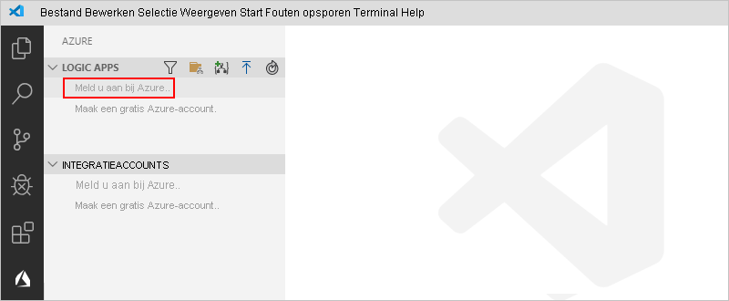
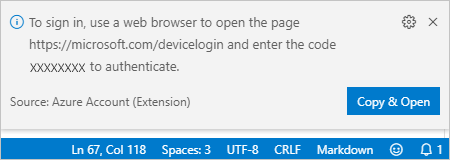
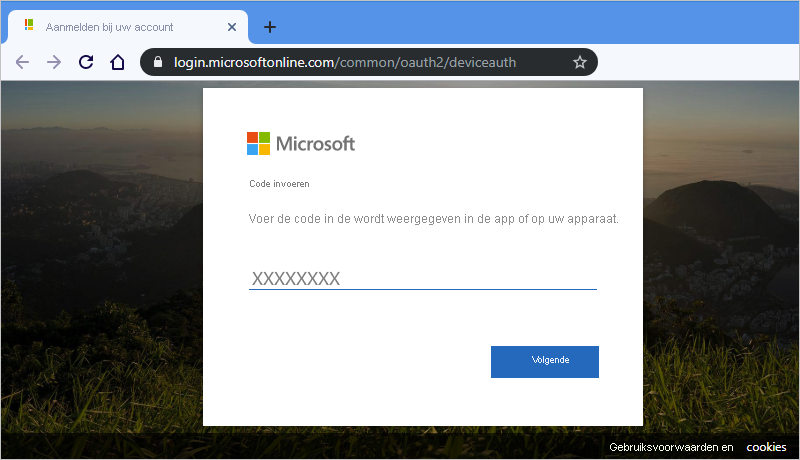
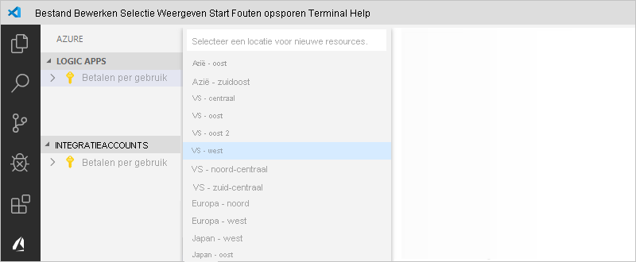
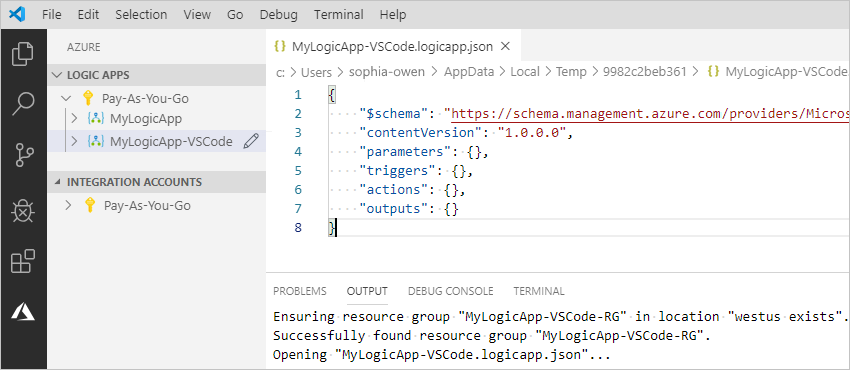
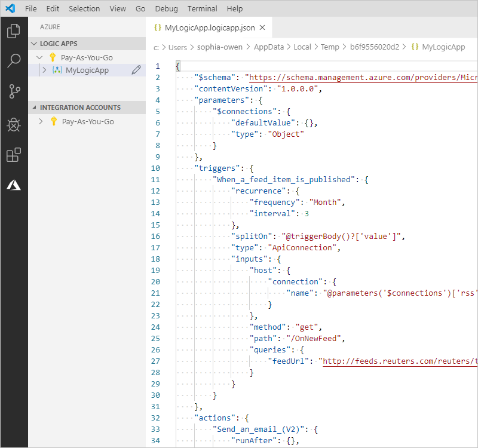

# <a name="quickstart-create-and-manage-logic-app-workflow-definitions-by-using-visual-studio-code"></a>Quickstart: Werkstroomdefinities voor logische apps maken en beheren met Visual Studio Code

Met [Azure Logic Apps](../logic-apps/logic-apps-overview.md) en Visual Studio Code kunt u logische apps maken en beheren waarmee u taken, werkstromen en processen kunt automatiseren voor het integreren van apps, gegevens, systemen en services in organisaties en ondernemingen. In deze quickstart ziet u hoe u de onderliggende werkstroomdefinities kunt maken en bewerken. Deze maken gebruik van JavaScript Object Notation (JSON) voor logische apps via een op code gebaseerde ervaring. U kunt ook met bestaande logische apps werken die al zijn geïmplementeerd in Azure.

Hoewel u dezelfde taken in [Azure Portal](https://portal.azure.com) en in Visual Studio kunt uitvoeren, kunt u sneller aan de slag in Visual Studio Code wanneer u al bekend met logische-app-definities en rechtstreeks in code wilt werken. U kunt bijvoorbeeld reeds gemaakte logische apps uitschakelen, inschakelen, verwijderen en vernieuwen. Ook kunt u werken met logische apps en integratieaccounts vanaf elk ontwikkelingsplatform waarop Visual Studio Code wordt uitgevoerd, zoals Linux, Windows en Mac.

Voor dit artikel kunt u dezelfde logische app maken vanuit deze [quickstart](../logic-apps/quickstart-create-first-logic-app-workflow.md), waarin meer aandacht is voor basisconcepten. U kunt ook [leren hoe u de voorbeeld-app maakt in Visual Studio](quickstart-create-logic-apps-with-visual-studio.md), en [leren hoe u apps maakt en beheert via Azure CLI (opdrachtregelinterface)](quickstart-logic-apps-azure-cli.md). In Visual Studio Code ziet de logische app er als volgt uit:


Zorg ervoor dat u deze items hebt voordat u begint:

* Als u nog geen Azure-account en -abonnement hebt, [registreer u dan nu voor een gratis Azure-account](https://azure.microsoft.com/free/).

* Basiskennis over [werkstroomdefinities voor logische apps](../logic-apps/logic-apps-workflow-definition-language.md) en hun structuur, zoals beschreven met JSON

  Als u Logic Apps voor het eerst gebruikt, probeer dan deze [quickstart](../logic-apps/quickstart-create-first-logic-app-workflow.md). Hierin maakt u uw eerste logische apps in Azure Portal en wordt meer gekeken naar de basisconcepten.

* Toegang tot internet voor aanmelden bij Azure en uw Azure-abonnement

* Download en installeer deze hulpprogramma's als u ze nog niet hebt:

  * [Visual Studio Code-versie 1.25.1 of hoger](https://code.visualstudio.com/) (deze versie is gratis)

  * Visual Studio Code-extensie voor Azure Logic Apps

    U kunt deze extensie downloaden en installeren via de [Visual Studio Marketplace](https://marketplace.visualstudio.com/items?itemName=ms-azuretools.vscode-logicapps) of rechtstreeks vanuit Visual Studio Code. Vergeet niet Visual Studio Code opnieuw te laden na de installatie.

    

    Controleer of de extensie goed is geïnstalleerd door het Azure-pictogram te selecteren dat wordt weergegeven in de Visual Studio Code-werkbalk.

    

    Zie [Extension Marketplace](https://code.visualstudio.com/docs/editor/extension-gallery) voor meer informatie. Ga naar [Azure Logic Apps-extensie voor Visual Studio Code in GitHub](https://github.com/Microsoft/vscode-azurelogicapps) als u een bijdrage wilt leveren aan de opensource-versie van deze extensie.

<a name="access-azure"></a>

## <a name="access-azure-from-visual-studio"></a>Toegang tot Azure vanuit Visual Studio

1. Open Visual Studio Code. Selecteer het Azure-pictogram op de werkbalk van Visual Studio Code.

   

1. Selecteer in het Azure-venster onder **Logic Apps** de optie **Aanmelden bij Azure**. Wanneer hierom wordt gevraagd op de Microsoft-aanmeldpagina, meldt u zich aan met uw Azure-account.

   

   1. Als het aanmelden langer duurt dan normaal, wordt u gevraagd zich aan te melden via een Microsoft-verificatiewebsite met behulp van de opgegeven apparaatcode. Selecteer **Apparaatcode gebruiken** als u zich in plaats daarvan met de code wilt aanmelden.

      

   1. Selecteer **Kopiëren en openen** om de code te kopiëren.

      

   1. Als u een nieuw browservenster wilt openen en door wilt gaan naar de verificatiewebsite, selecteert u **Koppeling openen**.

      

   1. Voer op de pagina **Aanmelden bij uw account** uw verificatiecode in en selecteer **Volgende**.

      

1. Selecteer uw Azure-account. Nadat u zich hebt aangemeld, kunt u uw browser sluiten en terugkeren naar Visual Studio Code.

   In het Azure-deelvenster worden nu in de secties **Logic Apps** en **Integratieaccounts** de Azure-abonnementen weergegeven die aan uw account zijn gekoppeld. Als u echter niet de verwachte abonnementen ziet, of als er te veel abonnementen in de secties worden weergegeven, volgt u deze stappen:

   1. Beweeg de cursor boven het **Logic Apps**-label. Wanneer de werkbalk wordt weergegeven, selecteert u **Abonnementen selecteren** (filterpictogram).

      

   1. Selecteer in de lijst die wordt weergegeven de abonnementen die u wilt weergeven.

1. Selecteer onder **Logic Apps** het gewenste abonnement. Het abonnementsknooppunt wordt uitgevouwen en alle logische apps die in dat abonnement bestaan, worden weergegeven.

   

   > [!TIP]
   > Wanneer u onder **Integratieaccounts** uw abonnement selecteert, worden alle integratieaccounts weergegeven die in dat abonnement bestaan.

<a name="create-logic-app"></a>

## <a name="create-new-logic-app"></a>Een nieuwe logische app maken

1. Als u zich nog niet bij uw Azure-account en -abonnement hebt aangemeld vanuit Visual Studio Code, volgt u de [vorige stappen om zich nu aan te melden](#access-azure).

1. Open onder **Logic Apps** in Visual Studio Code het contextmenu van uw abonnement en selecteer **Logische app maken**.

   

   Er wordt een lijst weergegeven met daarin alle Azure-resourcegroepen in uw abonnement.

1. Selecteer vanuit de lijst met resourcegroepen de optie **Een nieuwe resourcegroep maken** of selecteer een bestaande resourcegroep. Maak voor dit voorbeeld een nieuwe resourcegroep.

   

1. Geef een naam op voor uw Azure-resourcegroep en druk op Enter.

   

1. Selecteer de Azure-regio waarin u de metagegevens van uw logische app wilt opslaan.

   

1. Geef een naam op voor uw logische app en druk op Enter.

   

   Uw nieuwe en lege logische app wordt weergegeven in het Azure-venster, onder uw Azure-abonnement. In Visual Studio Code wordt ook een JSON-bestand (.logicapp.json) geopend, met daarin de basis van een werkstroomdefinitie voor uw logische app. Nu kunt u handmatig beginnen met het schrijven van de werkstroomdefinitie van uw logische app in dit JSON-bestand. Zie het [taalschema voor werkstroomdefinities voor Azure Logic Apps](../logic-apps/logic-apps-workflow-definition-language.md) voor technisch referentiemateriaal over de structuur en syntaxis voor een werkstroomdefinitie.

   

   Hier ziet u bijvoorbeeld een voorbeeld van een werkstroomdefinitie van een logische app. Deze begint met een RSS-trigger en een Office 365 Outlook-actie. Doorgaans worden JSON-elementen alfabetisch weergegeven in elke sectie. In dit voorbeeld ziet u echter dat deze elementen grofweg in de volgorde staan van de stappen van de logische app in het ontwerpprogramma.

   > [!IMPORTANT]
   > Als u de logische app-definitie uit dit voorbeeld wilt hergebruiken, hebt u een organisatieaccount nodig, zoals @fabrikam.com. Vergeet niet het fictieve e-mailadres te vervangen door uw eigen e-mailadres. Als u een ander e-mailprogramma wilt gebruiken, zoals Outlook.com of Gmail, vervangt u de `Send_an_email_action`-actie door een vergelijkbare actie uit een [e-mailprogramma dat wordt ondersteund door Azure Logic Apps](../connectors/apis-list.md).
   >
   > Als u de Gmail-connector wilt gebruiken, kunnen alleen bedrijfsaccounts van G Suite deze connector zonder beperking in logische apps gebruiken. 
   > Als u een Gmail-consumentenaccount hebt, kunt u deze connector alleen gebruiken met specifieke door Google goedgekeurde services, of u kunt [een Google-client-app maken voor verificatie bij uw Gmail-connector](/connectors/gmail/#authentication-and-bring-your-own-application). 
   > Zie [Beleid voor gegevensbeveiliging en privacybeleid voor Google-connectors in Azure Logic Apps](../connectors/connectors-google-data-security-privacy-policy.md) voor meer informatie.

   ```json
   {
      "$schema": "https://schema.management.azure.com/providers/Microsoft.Logic/schemas/2016-06-01/workflowdefinition.json#",
      "contentVersion": "1.0.0.0",
      "parameters": {
         "$connections": {
            "defaultValue": {},
            "type": "Object"
         }
      },
      "triggers": {
         "When_a_feed_item_is_published": {
            "recurrence": {
               "frequency": "Minute",
               "interval": 1
            },
            "splitOn": "@triggerBody()?['value']",
            "type": "ApiConnection",
            "inputs": {
               "host": {
                  "connection": {
                     "name": "@parameters('$connections')['rss']['connectionId']"
                  }
               },
               "method": "get",
               "path": "/OnNewFeed",
               "queries": {
                  "feedUrl": "http://feeds.reuters.com/reuters/topNews"
               }
            }
         }
      },
      "actions": {
         "Send_an_email_(V2)": {
            "runAfter": {},
            "type": "ApiConnection",
            "inputs": {
               "body": {
                  "Body": "<p>Title: @{triggerBody()?['title']}<br>\n<br>\nDate published: @{triggerBody()?['updatedOn']}<br>\n<br>\nLink: @{triggerBody()?['primaryLink']}</p>",
                  "Subject": "RSS item: @{triggerBody()?['title']}",
                  "To": "sophia-owen@fabrikam.com"
               },
               "host": {
                  "connection": {
                     "name": "@parameters('$connections')['office365']['connectionId']"
                  }
               },
               "method": "post",
               "path": "/v2/Mail"
            }
         }
      },
      "outputs": {}
   }
   ```

1. Wanneer u klaar bent, slaat u de werkstroomdefinitie van uw logische app op. (via het menu Bestand > Opslaan, of druk op Ctrl+S)

1. Wanneer u wordt gevraagd om uw logische app naar uw Azure-abonnement te uploaden, selecteert u **Uploaden**.

   Met deze stap publiceert u uw logische app naar [Azure Portal](https://portal.azure.com) waardoor uw logische app wordt geactiveerd in Azure.

   

## <a name="view-logic-app-in-designer"></a>De logische app weergeven in ontwerper

In Visual Studio Code kunt u uw logische app in de alleen-lezen ontwerpweergave openen. Hoewel u uw logische app niet in de ontwerper kunt bewerken, kunt u de werkstroom van uw logische app wel visueel inspecteren met behulp van de ontwerperweergave.

Openen in het Azure-venster, onder **Logic Apps**, het contextmenu van uw logische app en selecteer **Openen in Designer**.

De alleen-lezen ontwerper wordt in een apart venster geopend en toont u de werkstroom van uw logische app, bijvoorbeeld:


## <a name="view-in-azure-portal"></a>Openen in de Azure-portal

Volg deze stappen op uw logische app in Azure Portal te controleren:

1. Meld u aan bij [Azure Portal](https://portal.azure.com) met hetzelfde Azure-account en abonnement dat aan uw logische app is gekoppeld.

1. Voer in het zoekvak van Azure Portal de naam van uw logische app in. Selecteer uw logische app in de lijst met resultaten.

   

<a name="disable-enable-logic-app"></a>

## <a name="disable-or-enable-logic-app"></a>Logische app in- of uitschakelen

Als u in Visual Studio Code een gepubliceerde logische app verwerkt en de wijzigingen opslaat, *overschrijft* u uw al geïmplementeerde app. Om te voorkomen dat uw logische app in productie breekt en om onderbrekingen zo veel mogelijk te voorkomen, moet u uw logische app eerst deactiveren. U kunt vervolgens uw logische app opnieuw activeren nadat u hebt bevestigd dat uw logische app nog steeds werkt.

1. Als u zich nog niet bij uw Azure-account en -abonnement hebt aangemeld vanuit Visual Studio Code, volgt u de [vorige stappen om zich nu aan te melden](#access-azure).

1. Vouw in het Azure-venster, onder **Logic Apps**, uw Azure-abonnement uit zodat u alle logische apps in dat abonnement kunt zien.

   1. Als u de gewenste logische app wilt uitschakelen, opent u het menu van de logische app en selecteert u **Uitschakelen**.

      

   1. Wanneer u klaar bent om uw logische app opnieuw te activeren, opent u het menu van de logische app en selecteert u **Inschakelen**.

      

<a name="edit-logic-app"></a>

## <a name="edit-deployed-logic-app"></a>Een geïmplementeerde logische app bewerken

In Visual Studio Code kunt u de werkstroomdefinitie voor een al geïmplementeerde logische app in Azure openen en bewerken.

> [!IMPORTANT] 
> Voordat u een actief uitgevoerde logische app in productie bewerkt, moet u het risico op het breken van die logische app voorkomen en onderbrekingen zoveel mogelijk beperken door [eerst uw logische app uit te schakelen](#disable-enable-logic-app).

1. Als u zich nog niet bij uw Azure-account en -abonnement hebt aangemeld vanuit Visual Studio Code, volgt u de [vorige stappen om zich nu aan te melden](#access-azure).

1. Vouw in het Azure-venster, onder **Logic Apps**, uw Azure-abonnement uit en selecteer de gewenste logische app.

1. Open het menu van uw logische app en selecteer **Openen in Editor**. Of selecteer het bewerkingspictogram naast de naam van uw logische app.

   

   In Visual Studio Code wordt het bestand .logicapp.json in uw lokale tijdelijke map geopend zodat u de werkstroomdefinitie van uw logische app kunt bekijken.

   

1. Breng uw wijzigingen aan in de werkstroomdefinitie van de logische app.

1. Sla de wijzigingen op als u klaar bent. (via het menu Bestand > Opslaan, of druk op Ctrl+S)

1. Wanneer u wordt gevraagd om uw wijzigingen te uploaden en uw bestaande logische app in Azure Portal te *overschrijven*, selecteert u **Uploaden**.

   Met deze stap publiceert u uw updates naar uw logische app in [Azure Portal](https://portal.azure.com).

   

## <a name="view-or-promote-other-versions"></a>Andere versies weergeven of promoveren

In Visual Studio Code kunt u de eerdere versies voor uw logische app openen en controleren. U kunt ook een eerdere versie naar de huidige versie promoveren.

> [!IMPORTANT] 
> Voordat u een actief uitgevoerde logische app in productie wijzigt, moet u het risico op het breken van die logische app voorkomen en onderbrekingen zoveel mogelijk beperken door [eerst uw logische app uit te schakelen](#disable-enable-logic-app).

1. Vouw in het Azure-venster, onder **Logic Apps**, uw Azure-abonnement uit zodat u alle logische apps in dat abonnement kunt zien.

1. Vouw onder uw abonnement uw logische app uit en vouw **Versies** uit.

   In de lijst **Versies** ziet u de eerdere versies van uw logische app, als deze bestaan.

   

1. Als u een eerdere versie wilt weergeven selecteert u een van deze stappen:

   * Als u de JSON-definitie wilt weergeven, selecteert u onder **Versies** het versienummer voor die definitie. Of open het contextmenu van die versie en selecteer **Openen in Editor**.

     Op uw lokale computer wordt een nieuw bestand geopend en u ziet de JSON-definitie van die versie.

   * Als u de versie in de alleen-lezen ontwerperweergave wilt weergeven, opent u het contextmenu van die versie en selecteert u **Openen in Designer**.

1. Als u een eerdere versie naar de huidige versie wilt promoveren, volgt u deze stappen:

   1. Onder **Versies** opent u het contextmenu van de eerdere versie en selecteert u **Promoveren**.

      

   1. Selecteer **Ja** nadat u om bevestiging bent gevraagd in Visual Studio Code.

      

      Visual Studio Code promoveert de geselecteerde versie naar de huidige versie en wijst een nieuw nummer toe aan de gepromoveerde versie. De vorige huidige versie wordt nu onder de gepromoveerde versie weergegeven.

## <a name="next-steps"></a>Volgende stappen

> [!div class="nextstepaction"]
> [Stateful en staatloze werkstromen maken in Visual Studio Code (preview)](../logic-apps/create-stateful-stateless-workflows-visual-studio-code.md)
