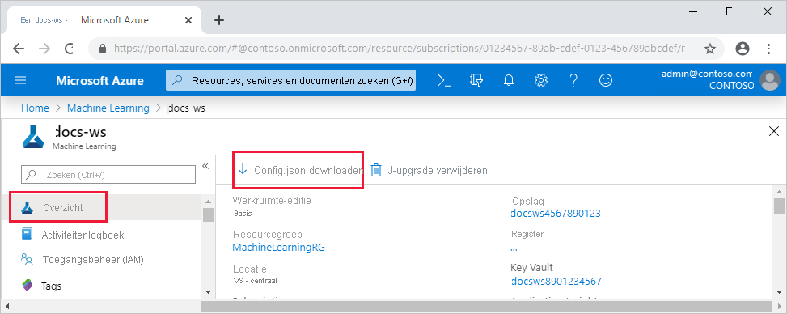
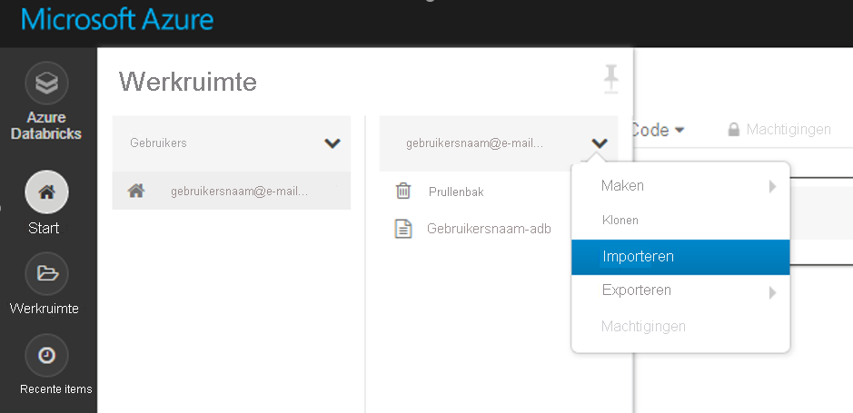
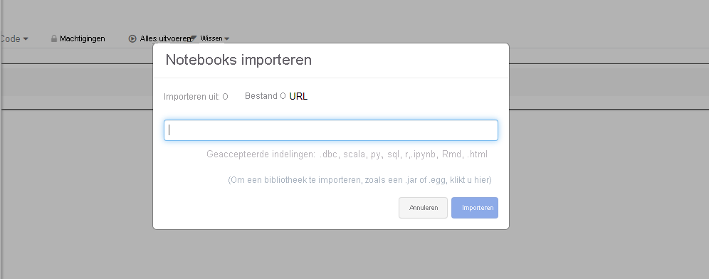

# <a name="set-up-a-development-environment-for-azure-machine-learning"></a>Een ontwikkel omgeving instellen voor Azure Machine Learning

Meer informatie over het configureren van een python-ontwikkel omgeving voor Azure Machine Learning.

In de volgende tabel ziet u elke ontwikkel omgeving die in dit artikel wordt behandeld, samen met de voor-en nadelen.

| Omgeving | Voordelen | Nadelen |
| --- | --- | --- |
| [Lokale omgeving](#local) | Volledig beheer van uw ontwikkel omgeving en afhankelijkheden. Voer uit met een hulp programma, omgeving of IDE van uw keuze. | Duurt langer om aan de slag te gaan. De benodigde SDK-pakketten moeten worden geïnstalleerd en er moet ook een omgeving worden geïnstalleerd als u er nog geen hebt. |
| [Azure Machine Learning-rekeninstantie](#compute-instance) | Eenvoudigste manier om aan de slag te gaan. De volledige SDK is al geïnstalleerd in uw werk ruimte-VM en de notitieblok zelfstudies zijn vooraf gekloond en klaar om te worden uitgevoerd. | Geen controle over uw ontwikkel omgeving en afhankelijkheden. Er zijn extra kosten verbonden aan de virtuele Linux-machine (VM kan worden gestopt wanneer deze niet wordt gebruikt om kosten te voor komen). Zie de [prijs informatie](https://azure.microsoft.com/pricing/details/virtual-machines/linux/). |
| [Azure Databricks](#aml-databricks) | Ideaal voor het uitvoeren van grootschalige intensieve machine learning werk stromen op het schaal bare Apache Spark platform. | Overbodig voor experimentele machine learning, of kleinschalige experimenten en werk stromen. Er zijn extra kosten gemaakt voor Azure Databricks. Zie de [prijs informatie](https://azure.microsoft.com/pricing/details/databricks/). |
| [De Data Science Virtual Machine (DSVM)](#dsvm) | Vergelijkbaar met het Cloud Compute-exemplaar (python en de SDK zijn vooraf geïnstalleerd), maar met extra populaire gegevens wetenschap en machine learning-hulpprogram ma's vooraf geïnstalleerd. Eenvoudig te schalen en combi neren met andere aangepaste hulp middelen en werk stromen. | Een langzamere aan de slag-ervaring in vergelijking met het Cloud Compute-exemplaar. |

Dit artikel bevat ook extra tips voor het gebruik van de volgende hulpprogram ma's:

* Jupyter-notebooks: als u al Jupyter-notebooks gebruikt, heeft de SDK een aantal extra's die u moet installeren.

* Visual Studio code: als u Visual Studio code gebruikt, bevat de [uitbrei ding](https://marketplace.visualstudio.com/items?itemName=ms-toolsai.vscode-ai) van de Azure machine learning uitgebreide taal ondersteuning voor python, evenals functies om met de Azure machine learning veel handiger en productief te werken.

## <a name="prerequisites"></a>Vereisten

* Azure Machine Learning werk ruimte. Als u er geen hebt, kunt u een Azure Machine Learning-werk ruimte maken met behulp van de [Azure Portal](how-to-manage-workspace.md)-, [Azure CLI](how-to-manage-workspace-cli.md#create-a-workspace)-en [Azure Resource Manager-sjablonen](how-to-create-workspace-template.md).

### <a name="local-and-dsvm-only-create-a-workspace-configuration-file"></a><a id="workspace"></a> (Alleen lokaal en alleen DSVM) Een configuratie bestand voor een werk ruimte maken

Het configuratie bestand van de werk ruimte is een JSON-bestand dat de SDK vertelt hoe er met uw Azure Machine Learning-werk ruimte moet worden gecommuniceerd. Het bestand heeft de naam *config.jsop*en heeft de volgende indeling:

```json
{
    "subscription_id": "<subscription-id>",
    "resource_group": "<resource-group>",
    "workspace_name": "<workspace-name>"
}
```

Dit JSON-bestand moet zich in de mapstructuur bevinden die uw python-scripts of Jupyter-notebooks bevat. Deze kan zich in dezelfde map bevindt, in een submap met de naam *. azureml*of in een bovenliggende map.

Als u dit bestand uit uw code wilt gebruiken, gebruikt u de- [`Workspace.from_config`](https://docs.microsoft.com/python/api/azureml-core/azureml.core.workspace.workspace?view=azure-ml-py#from-config-path-none--auth-none---logger-none---file-name-none-&preserve-view=true) methode. Met deze code worden de gegevens uit het bestand geladen en wordt verbinding gemaakt met uw werk ruimte.

Maak een werkruimte configuratie bestand op een van de volgende manieren:

* Azure Portal

    **Down load het bestand**: In de [Azure Portal](https://ms.portal.azure.com)selecteert u  **config.jsdownloaden** in het gedeelte **overzicht** van uw werk ruimte.

    

* Azure Machine Learning python-SDK

    Maak een script om verbinding te maken met uw Azure Machine Learning-werk ruimte en gebruik de [`write_config`](https://docs.microsoft.com/python/api/azureml-core/azureml.core.workspace.workspace?view=azure-ml-py#write-config-path-none--file-name-none-&preserve-view=true) methode om uw bestand te genereren en op te slaan als *. azureml/config.jsop*. Zorg ervoor dat u `subscription_id` , `resource_group` en `workspace_name` met uw eigen vervangen.

    ```python
    from azureml.core import Workspace

    subscription_id = '<subscription-id>'
    resource_group  = '<resource-group>'
    workspace_name  = '<workspace-name>'

    try:
        ws = Workspace(subscription_id = subscription_id, resource_group = resource_group, workspace_name = workspace_name)
        ws.write_config()
        print('Library configuration succeeded')
    except:
        print('Workspace not found')
    ```

## <a name="local-computer"></a><a id="local"></a>Lokale computer

Voor het configureren van een lokale ontwikkel omgeving (die mogelijk ook een externe virtuele machine is, zoals een Azure Machine Learning Reken instantie of DSVM):

1. Maak een virtuele python-omgeving (virtualenv, Conda).

    > [!NOTE]
    > Hoewel dit niet vereist is, is het raadzaam om [Anaconda](https://www.anaconda.com/download/) of [Miniconda](https://www.anaconda.com/download/) te gebruiken voor het beheren van python virtuele omgevingen en het installeren van pakketten.

    > [!IMPORTANT]
    > Als u gebruikmaakt van Linux of macOS en een andere shell dan bash gebruikt (bijvoorbeeld zsh), kunnen er fouten optreden wanneer u sommige opdrachten uitvoert. U kunt dit probleem omzeilen door de `bash` opdracht te gebruiken om een nieuwe bash-shell te starten en de opdrachten daar uit te voeren.

1. Activeer de zojuist gemaakte virtuele python-omgeving.
1. Installeer de [Azure machine learning PYTHON SDK](https://docs.microsoft.com/python/api/overview/azure/ml/install?view=azure-ml-py&preserve-view=true).
1. Als u uw lokale omgeving wilt configureren voor het gebruik van uw Azure Machine Learning-werk ruimte, [maakt u een configuratie bestand voor een werk ruimte](#workspace) of gebruikt u een bestaand.

Nu u uw lokale omgeving hebt ingesteld, kunt u aan de slag gaan met Azure Machine Learning. Raadpleeg de Azure Machine Learning aan de slag- [hand leiding voor python](tutorial-1st-experiment-sdk-setup-local.md) om aan de slag te gaan.

### <a name="jupyter-notebooks"></a><a id="jupyter"></a>Jupyter Notebooks

Wanneer u een lokale Jupyter Notebook server uitvoert, is het raadzaam om een IPython-kernel te maken voor uw python virtuele omgeving. Dit zorgt ervoor dat het import gedrag van de kernel en het pakket wordt gegarandeerd.

1. Omgevings specifieke IPython-kernels inschakelen

    ```bash
    conda install notebook ipykernel
    ```

1. Maak een kernel voor uw python virtuele omgeving. Zorg ervoor dat u vervangt door `<myenv>` de naam van uw python virtuele omgeving.

    ```bash
    ipython kernel install --user --name <myenv> --display-name "Python (myenv)"
    ```

1. De Jupyter Notebook-server starten

Raadpleeg de [opslag plaats Azure machine learning notitie blokken](https://github.com/Azure/MachineLearningNotebooks) om aan de slag te gaan met Azure machine learning-en Jupyter-notebooks.

### <a name="visual-studio-code"></a><a id="vscode"></a>Visual Studio code

Visual Studio code gebruiken voor ontwikkeling:

1. Installeer [Visual Studio Code](https://code.visualstudio.com/Download).
1. Installeer de [Azure machine learning Visual Studio code extension](tutorial-setup-vscode-extension.md) (preview).

Zodra de Visual Studio code-extensie is geïnstalleerd, kunt u uw [Azure machine learning-resources](how-to-manage-resources-vscode.md)beheren, [experimenten uitvoeren en fouten opsporen](how-to-debug-visual-studio-code.md)en [getrainde modellen implementeren](tutorial-train-deploy-image-classification-model-vscode.md).

## <a name="azure-machine-learning-compute-instance"></a><a id="compute-instance"></a>Reken instantie Azure Machine Learning

Het Azure Machine Learning [Compute-exemplaar](concept-compute-instance.md) is een veilig, op de cloud gebaseerd Azure-werk station dat gegevens wetenschappers biedt met een Jupyter notebook server, jjupyterlab en een volledig beheerde machine learning omgeving.

Er is niets om te installeren of te configureren voor een reken instantie.  

Maak een wille keurig moment in uw Azure Machine Learning-werk ruimte. Geef een naam op en geef een Azure VM-type op. Probeer het nu met deze [zelf studie: omgeving en werk ruimte voor installatie](tutorial-1st-experiment-sdk-setup.md).

Zie [Compute instances](concept-compute-instance.md)voor meer informatie over reken instanties, inclusief het installeren van pakketten.

> [!TIP]
> [Stop het reken](tutorial-1st-experiment-bring-data.md#clean-up-resources)proces om te voor komen dat er kosten in rekening worden gebracht voor een ongebruikte Compute-instantie.

Naast een Jupyter Notebook-server en-Jjupyterlab kunt u reken instanties gebruiken in de [functie voor geïntegreerde notebooks in azure machine learning Studio](how-to-run-jupyter-notebooks.md).

U kunt ook de Azure Machine Learning Visual Studio code-extensie gebruiken om [een Azure machine learning reken exemplaar te configureren als een externe Jupyter notebook server](how-to-set-up-vs-code-remote.md#configure-compute-instance-as-remote-notebook-server).

## <a name="data-science-virtual-machine"></a><a id="dsvm"></a>Data Science Virtual Machine

De DSVM is een aangepaste installatie kopie van een virtuele machine (VM). Het is ontworpen voor data wetenschappen werk dat vooraf geconfigureerde hulpprogram ma's en software zoals:

  - Pakketten zoals tensor flow, PyTorch, Scikit-learn, XGBoost en de Azure Machine Learning SDK
  - Populaire hulp middelen voor gegevens wetenschap, zoals zelfstandig en analyse van Spark
  - Azure-hulpprogram ma's zoals Azure CLI, AzCopy en Storage Explorer
  - Integrated Development Environments (Ide's) zoals Visual Studio code en PyCharm
  - Jupyter Notebook server

Zie de [hand leiding voor DSVM meegeleverde hulp middelen](data-science-virtual-machine/tools-included.md)voor een uitgebreidere lijst met hulpprogram ma's.

> [!IMPORTANT]
> Als u van plan bent om de DSVM te gebruiken als een [berekenings doel](concept-compute-target.md) voor uw training of voor het afleiden van taken, wordt alleen Ubuntu ondersteund.

De DSVM gebruiken als een ontwikkel omgeving

1. Maak een DSVM met behulp van een van de volgende methoden:

    * Gebruik de Azure Portal voor het maken van een [Ubuntu](data-science-virtual-machine/dsvm-ubuntu-intro.md) -of [Windows](data-science-virtual-machine/provision-vm.md) DSVM.
    * [Maak een DSVM met arm-sjablonen](data-science-virtual-machine/dsvm-tutorial-resource-manager.md).
    * Azure CLI gebruiken

        Als u een Ubuntu-DSVM wilt maken, gebruikt u de volgende opdracht:

        ```azurecli-interactive
        # create a Ubuntu DSVM in your resource group
        # note you need to be at least a contributor to the resource group in order to execute this command successfully
        # If you need to create a new resource group use: "az group create --name YOUR-RESOURCE-GROUP-NAME --location YOUR-REGION (For example: westus2)"
        az vm create --resource-group YOUR-RESOURCE-GROUP-NAME --name YOUR-VM-NAME --image microsoft-dsvm:linux-data-science-vm-ubuntu:linuxdsvmubuntu:latest --admin-username YOUR-USERNAME --admin-password YOUR-PASSWORD --generate-ssh-keys --authentication-type password
        ```

        Als u een Windows-DSVM wilt maken, gebruikt u de volgende opdracht:

        ```azurecli-interactive
        # create a Windows Server 2016 DSVM in your resource group
        # note you need to be at least a contributor to the resource group in order to execute this command successfully
        az vm create --resource-group YOUR-RESOURCE-GROUP-NAME --name YOUR-VM-NAME --image microsoft-dsvm:dsvm-windows:server-2016:latest --admin-username YOUR-USERNAME --admin-password YOUR-PASSWORD --authentication-type password
        ```

1. Activeer de Conda-omgeving met de Azure Machine Learning SDK.

    * Voor Ubuntu DSVM:

        ```bash
        conda activate py36
        ```

    * Voor Windows DSVM:

        ```bash
        conda activate AzureML
        ```

1. Als u de DSVM wilt configureren voor gebruik van uw Azure Machine Learning-werk ruimte, [maakt u een configuratie bestand voor een werk ruimte](#workspace) of gebruikt u een bestaande.

Net als bij lokale omgevingen kunt u Visual Studio code en de [Azure machine learning Visual Studio code-extensie](#vscode) gebruiken om te communiceren met Azure machine learning.

Zie [Data Science virtual machines](https://azure.microsoft.com/services/virtual-machines/data-science-virtual-machines/)voor meer informatie.

## <a name="azure-databricks"></a><a name="aml-databricks"></a> Azure Databricks

Azure Databricks is een op Apache Spark gebaseerde omgeving in de Azure-Cloud. Het biedt een samenwerkings omgeving op basis van een laptop met een CPU of een reken cluster op basis van GPU.

Hoe Azure Databricks met Azure Machine Learning werkt:

+ U kunt een model trainen met Spark MLlib en het model implementeren naar ACI/AKS in Azure Databricks.
+ U kunt ook gebruikmaken van [geautomatiseerde machine learning](concept-automated-ml.md) mogelijkheden in een speciale Azure ml SDK met Azure Databricks.
+ U kunt Azure Databricks als een reken doel van een [Azure machine learning pijp lijn](concept-ml-pipelines.md)gebruiken.

### <a name="set-up-your-databricks-cluster"></a>Uw Databricks-cluster instellen

Maak een [Databricks-cluster](https://docs.microsoft.com/azure/azure-databricks/quickstart-create-databricks-workspace-portal). Sommige instellingen zijn alleen van toepassing als u de SDK installeert voor automatische machine learning op Databricks.
**Het duurt enkele minuten om het cluster te maken.**

Gebruik deze instellingen:

| Instelling |Van toepassing op| Waarde |
|----|---|---|
| Clusternaam |altijd| yourclustername |
| Databricks Runtime |altijd|Niet-ML runtime 7,1 (scala 2,21, Spark 3.0.0) |
| Python-versie |altijd| 3 |
| IT |altijd| 2 of hoger |
| VM-typen worker-knoop punt <br>(bepaalt het maximum aantal gelijktijdige iteraties) |Geautomatiseerde machine learning<br>alleen| Voorkeurs-VM geoptimaliseerd voor geheugen |
| Automatisch schalen inschakelen |Geautomatiseerde machine learning<br>alleen| Uitschakelen |

Wacht totdat het cluster wordt uitgevoerd voordat u doorgaat.

### <a name="install-the-correct-sdk-into-a-databricks-library"></a>De juiste SDK installeren in een Databricks-bibliotheek

Zodra het cluster wordt uitgevoerd, [maakt u een bibliotheek](https://docs.databricks.com/user-guide/libraries.html#create-a-library) om het juiste Azure machine learning SDK-pakket aan uw cluster toe te voegen. Voor automatische MILLILITERs slaat u de [sectie SDK voor Databricks met automatische machine learning](#sdk-for-databricks-with-automated-machine-learning)over.

1. Klik met de rechter muisknop op de huidige werkruimte map waar u de bibliotheek wilt opslaan. Selecteer **Create**  >  **bibliotheek**maken.

1. Kies de volgende optie (er worden geen andere SDK-installaties ondersteund)

   |SDK- &nbsp; pakket &nbsp; extra's|Bron|PyPi- &nbsp; naam&nbsp;&nbsp;&nbsp;&nbsp;&nbsp;&nbsp;|
   |----|---|---|
   |Voor Databricks| Python-ei of PyPI uploaden | azureml-SDK [databricks]|

   > [!Warning]
   > Er kunnen geen andere SDK-extra's worden geïnstalleerd. Kies alleen de `databricks` optie [].

   * Selecteer niet **automatisch koppelen aan alle clusters**.
   * Selecteer  **koppelen** naast de naam van uw cluster.

1. Controleer op fouten totdat de status is gewijzigd in **bijgevoegd**. Dit kan enkele minuten duren.  Als deze stap mislukt:

   Probeer het cluster opnieuw te starten door:
   1. Selecteer **clusters**in het linkerdeel venster.
   1. Selecteer de naam van uw cluster in de tabel.
   1. Selecteer **opnieuw opstarten**op het tabblad **tape wisselaars** .

   Houd ook rekening met het volgende:
   + Bij het gebruik van Azure Databricks de volgende para meters toevoegen in AutoML config:
       1. ```max_concurrent_iterations``` is gebaseerd op het aantal worker-knoop punten in uw cluster.
        2. ```spark_context=sc``` is gebaseerd op de standaard Spark-context.
   + Als u een oude SDK-versie hebt, kunt u deze opheffen door de geïnstalleerde bibliotheken van het cluster te verwijderen en naar de Prullenbak te gaan. Installeer de nieuwe SDK-versie en start het cluster opnieuw op. Als er een probleem is nadat de computer opnieuw is opgestart, ontkoppelt u het cluster en koppelt u het opnieuw.

Als de installatie is voltooid, moet de geïmporteerde bibliotheek er ongeveer als volgt uitzien:

#### <a name="sdk-for-databricks"></a>SDK voor Databricks


#### <a name="sdk-for-databricks-with-automated-machine-learning"></a>SDK voor Databricks met geautomatiseerde machine learning
Als het cluster is gemaakt met Databricks niet-ML runtime 7,1 of hoger, voert u de volgende opdracht uit in de eerste cel van uw notitie blok om de AML-SDK te installeren.

```
%pip install -r https://aka.ms/automl_linux_requirements.txt
```
Voor Databricks niet-ML runtime 7,0 en lager installeert u de AML-SDK met het [init-script](https://github.com/Azure/MachineLearningNotebooks/blob/master/how-to-use-azureml/azure-databricks/automl/README.md).


### <a name="start-exploring"></a>Begin met verkennen

Uitproberen:
+ Er zijn veel voorbeeld notitieblokken beschikbaar, **maar alleen [deze voorbeeld notitieblokken](https://github.com/Azure/MachineLearningNotebooks/blob/master/how-to-use-azureml/azure-databricks) werken met Azure Databricks.**

+ Importeer deze voor beelden rechtstreeks vanuit uw werk ruimte. Zie hieronder: 
 

+ Meer informatie over het [maken van een pijp lijn met Databricks als de trainings Compute](how-to-create-your-first-pipeline.md).

## <a name="next-steps"></a>Volgende stappen

- [Een model](tutorial-train-models-with-aml.md) op Azure machine learning trainen met de MNIST-gegevensset
- Naslag informatie over de [Azure machine learning SDK voor python](https://docs.microsoft.com/python/api/overview/azure/ml/intro?view=azure-ml-py&preserve-view=true) weer geven
