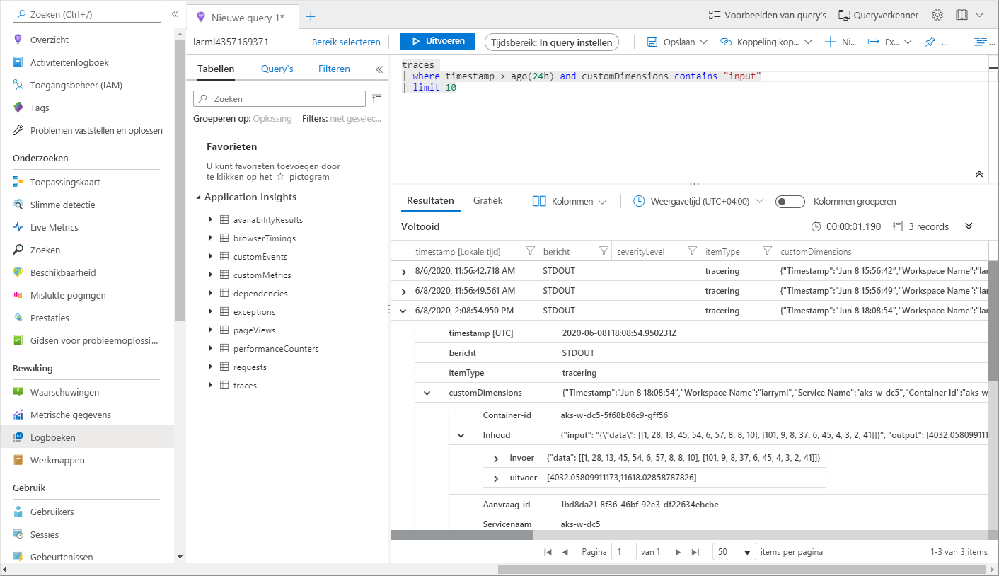

# <a name="monitor-and-collect-data-from-ml-web-service-endpoints"></a>Gegevens van ML-eindpunten van webservice controleren en verzamelen
[!INCLUDE [applies-to-skus](../../includes/aml-applies-to-basic-enterprise-sku.md)]

In dit artikel leert u hoe u gegevens verzamelt van en monitort op modellen die zijn geïmplementeerd voor eindpunten van webservice in Azure Kubernetes Service (AKS) of Azure Container Instances (ACI) door Azure Application Insights in te schakelen via 
* [Azure Machine Learning Python SDK](#python)
* [Azure Machine Learning studio](#studio) bijhttps://ml.azure.com

Naast het verzamelen van de uitvoergegevens en respons van een eindpunt, u het overzicht controleren:

* Verzoektarieven, responstijden en uitvalpercentages
* Afhankelijkheidspercentages, responstijden en uitvalpercentages
* Uitzonderingen

[Meer informatie over Azure Application Insights](../azure-monitor/app/app-insights-overview.md). 


## <a name="prerequisites"></a>Vereisten

* Als u geen Azure-abonnement hebt, maakt u een gratis account voordat u begint. Probeer vandaag nog de [gratis of betaalde versie van Azure Machine Learning](https://aka.ms/AMLFree)

* Een Azure Machine Learning-werkruimte, een lokale map met uw scripts en de Azure Machine Learning SDK voor Python geïnstalleerd. Zie [Een ontwikkelomgeving configureren](how-to-configure-environment.md) voor meer informatie over het instellen van deze vereisten.

* Een getraind machine learning-model dat moet worden geïmplementeerd in Azure Kubernetes Service (AKS) of Azure Container Instance (ACI). Als u er geen hebt, raadpleegt u de zelfstudie van het [classificatiemodel treinafbeelding](tutorial-train-models-with-aml.md)

## <a name="web-service-metadata-and-response-data"></a>Metagegevens en responsgegevens van webservices

>[!Important]
> Azure Application Insights registreert alleen payloads tot 64 kb. Als deze limiet wordt bereikt, worden alleen de meest recente uitvoer van het model geregistreerd. 

De metagegevens en reacties op de service - die overeenkomen met de metagegevens van `"model_data_collection"`de webservice en de voorspellingen van het model - worden geregistreerd op de Azure Application Insights-traces onder het bericht . U Azure Application Insights rechtstreeks opvragen om toegang te krijgen tot deze gegevens of een [continue export](https://docs.microsoft.com/azure/azure-monitor/app/export-telemetry) instellen naar een opslagaccount voor een langere retentie of verdere verwerking. Modelgegevens kunnen vervolgens worden gebruikt in de Azure Machine Learning voor het instellen van labeling, omscholing, uitlegbaarheid, gegevensanalyse of ander gebruik. 

<a name="python"></a>

## <a name="use-python-sdk-to-configure"></a>Python SDK gebruiken om te configureren 

### <a name="update-a-deployed-service"></a>Een geïmplementeerde service bijwerken

1. Identificeer de service in uw werkruimte. De waarde `ws` voor is de naam van uw werkruimte

    ```python
    from azureml.core.webservice import Webservice
    aks_service= Webservice(ws, "my-service-name")
    ```
2. Uw service bijwerken en Azure Application Insights inschakelen

    ```python
    aks_service.update(enable_app_insights=True)
    ```

### <a name="log-custom-traces-in-your-service"></a>Aangepaste traceringen in uw service registreren

Als u aangepaste traces wilt registreren, volgt u het standaardimplementatieproces voor AKS of ACI in het [implementeren en waar](how-to-deploy-and-where.md) document. Voer vervolgens de volgende stappen uit:

1. Het scorebestand bijwerken door afdrukinstructies toe te voegen
    
    ```python
    print ("model initialized" + time.strftime("%H:%M:%S"))
    ```

2. De serviceconfiguratie bijwerken
    
    ```python
    config = Webservice.deploy_configuration(enable_app_insights=True)
    ```

3. Bouw een afbeelding en implementeer deze op [AKS of ACI](how-to-deploy-and-where.md).

### <a name="disable-tracking-in-python"></a>Tracking uitschakelen in Python

Als u Azure Application Insights wilt uitschakelen, gebruikt u de volgende code:

```python 
## replace <service_name> with the name of the web service
<service_name>.update(enable_app_insights=False)
```

<a name="studio"></a>

## <a name="use-azure-machine-learning-studio-to-configure"></a>Azure Machine Learning-studio gebruiken om te configureren

U Azure Application Insights ook inschakelen vanuit Azure Machine Learning studio wanneer u klaar bent om uw model met deze stappen te implementeren.

1. Meld u aan bij uw werkruimte ophttps://ml.azure.com/
1. Ga naar **Modellen** en selecteer welk model u wilt implementeren
1. Selecteer **+Implementeren**
1. Het **modelformulier implementeren** invullen
1. Het **menu Geavanceerd** uitvouwen

    
1. Selecteer **Diagnostische gegevens en gegevensverzameling van Toepassingsinzichten inschakelen**

    
## <a name="evaluate-data"></a>Gegevens evalueren
De gegevens van uw service worden opgeslagen in uw Azure Application Insights-account, binnen dezelfde brongroep als Azure Machine Learning.
Om het te bekijken:

1. Ga naar uw Azure Machine Learning-werkruimte in de [Azure-portal](https://ms.portal.azure.com/) en klik op de koppeling Toepassingsinzichten

    [](././media/how-to-enable-app-insights/AppInsightsLoc.png#lightbox)

1. Selecteer het tabblad **Overzicht** om een basisset met statistieken voor uw service weer te geven

   [](././media/how-to-enable-app-insights/overview.png#lightbox)

1. Als u de metagegevens en het antwoord van uw webserviceaanvraag wilt bekijken, selecteert u de tabel **Aanvragen** in de sectie **Logboeken (Analytics)** en selecteert u **Uitvoeren** om aanvragen weer te geven

   [](././media/how-to-enable-app-insights/model-data-trace.png#lightbox)


3. Als u uw aangepaste traces wilt bekijken, selecteert u **Analytics**
4. Selecteer in de schemasectie **Traces**. Selecteer vervolgens **Uitvoeren** om uw query uit te voeren. Gegevens moeten worden weergegeven in een tabelindeling en moeten worden toegewezen aan uw aangepaste oproepen in uw scorebestand

   [](././media/how-to-enable-app-insights/logs.png#lightbox)

Zie [Wat is Toepassingsinzichten?](../azure-monitor/app/app-insights-overview.md)

## <a name="export-data-for-further-processing-and-longer-retention"></a>Gegevens exporteren voor verdere verwerking en langere retentie

>[!Important]
> Azure Application Insights ondersteunt alleen export naar blobopslag. Aanvullende limieten van deze exportmogelijkheid worden weergegeven in [Telemetrie exporteren uit App Insights.](https://docs.microsoft.com/azure/azure-monitor/app/export-telemetry#continuous-export-advanced-storage-configuration)

U de [continue export van](https://docs.microsoft.com/azure/azure-monitor/app/export-telemetry) Azure Application Insights gebruiken om berichten naar een ondersteund opslagaccount te verzenden, waar een langere retentie kan worden ingesteld. De `"model_data_collection"` berichten worden opgeslagen in JSON-formaat en kunnen eenvoudig worden ontleed om modelgegevens te extraheren. 

Azure Data Factory, Azure ML Pipelines of andere hulpprogramma's voor gegevensverwerking kunnen worden gebruikt om de gegevens naar behoefte te transformeren. Wanneer u de gegevens hebt getransformeerd, u deze vervolgens registreren met de Azure Machine Learning-werkruimte als gegevensset. Zie [Gegevenssets maken en registreren om dit te](how-to-create-register-datasets.md)doen.

   [](././media/how-to-enable-app-insights/continuous-export-setup.png)


## <a name="example-notebook"></a>Voorbeeldnotitieblok

De [enable-app-insights-in-production-service.ipynb](https://github.com/Azure/MachineLearningNotebooks/blob/master/how-to-use-azureml/deployment/enable-app-insights-in-production-service/enable-app-insights-in-production-service.ipynb) notebook demonstreert concepten in dit artikel. 
 
[!INCLUDE [aml-clone-in-azure-notebook](../../includes/aml-clone-for-examples.md)]

## <a name="next-steps"></a>Volgende stappen

* Bekijk [hoe u een model implementeert in een Azure Kubernetes Service-cluster](https://docs.microsoft.com/azure/machine-learning/how-to-deploy-azure-kubernetes-service) of hoe u een model [implementeert in Azure Container Instances](https://docs.microsoft.com/azure/machine-learning/how-to-deploy-azure-container-instance) om uw modellen te implementeren op eindpunten van webservice en Azure Application Insights in staat te stellen gebruik te maken van gegevensverzameling en endpoint-monitoring
* Zie [MLOps: beheer, implementeer en monitor modellen met Azure Machine Learning](https://docs.microsoft.com/azure/machine-learning/concept-model-management-and-deployment) voor meer informatie over het gebruik van gegevens die zijn verzameld uit productiemodellen. Dergelijke gegevens kunnen helpen om uw machine learning-proces voortdurend te verbeteren
