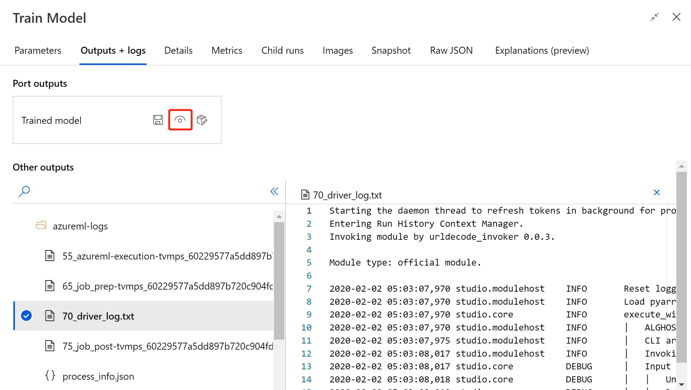

# Modellen opnieuw trainen met de Azure Machine Learning-ontwerpfunctie (preview)
[!INCLUDE [applies-to-skus](../../includes/aml-applies-to-enterprise-sku.md)]

In dit artikel leert u hoe u Azure Machine Learning-ontwerper gebruiken om een machine learning-model om te scholen. U gebruikt gepubliceerde pijplijnen om uw workflow te automatiseren en parameters in te stellen om uw model te trainen op nieuwe gegevens. 

In dit artikel leert u het volgende:

> [!div class="checklist"]
> * Train een machine learning model.
> * Maak een parameter voor pijplijnen.
> * Publiceer uw trainingspijplijn.
> * Train uw model om met nieuwe parameters.

## Vereisten

* Een Azure Machine Learning-werkruimte met de Enterprise SKU.
* Een gegevensset die toegankelijk is voor de ontwerper. Dit kan een van de volgende:
   * Een geregistreerde azure machine learning-gegevensset
    
     **-or-**
   * Een gegevensbestand dat is opgeslagen in een Azure Machine Learning-gegevensarchief.
   
Zie [Gegevens importeren in de ontwerper voor](how-to-designer-import-data.md)informatie over gegevenstoegang met behulp van de ontwerper.

Dit artikel gaat er ook van uit dat u basiskennis hebt van het bouwen van pijpleidingen in de ontwerper. Voor een begeleide inleiding, voltooi de [tutorial](tutorial-designer-automobile-price-train-score.md). 

### Voorbeeldpijplijn

De pijplijn die in dit artikel wordt gebruikt, is een gewijzigde versie van [Voorbeeld 3: Inkomensvoorspelling](samples-designer.md#classification-samples). De pijplijn gebruikt de module [Gegevens importeren](algorithm-module-reference/import-data.md) in plaats van de voorbeeldgegevensset om u te laten zien hoe u modellen trainen met uw eigen gegevens.

## Een parameter voor pijplijnmaken

Maak pijplijnparameters om variabelen dynamisch in te stellen bij uitvoering. In dit voorbeeld wijzigt u het trainingsgegevenspad van een vaste waarde naar een parameter, zodat u uw model omscholen op verschillende gegevens.

1. Selecteer de module **Gegevens importeren.**

    > [!NOTE]
    > In dit voorbeeld wordt de module Gegevens importeren gebruikt om toegang te krijgen tot gegevens in een geregistreerd gegevensarchief. U echter vergelijkbare stappen volgen als u alternatieve gegevenstoegangspatronen gebruikt.

1. Selecteer in het detailvenster van de module rechts van het canvas de gegevensbron.

1. Voer het pad naar uw gegevens in. U ook **Pad bladeren** selecteren om door de bestandsstructuur te bladeren. 

1. Muis over het veld **Pad** en selecteer de ellipsen boven het veld **Pad** die worden weergegeven.

    

1. Selecteer **Toevoegen aan pijplijnparameter**.

1. Geef een parameternaam en een standaardwaarde op.

   > [!NOTE]
   > U de pijplijnparameters inspecteren en bewerken door het tandwielpictogram **Instellingen** naast de titel van uw pijplijnconcept te selecteren. 

1. Selecteer **Opslaan**.

1. Verzend de pijplijnrun.

## Een getraind model zoeken

De ontwerper slaat alle pijplijnuitvoer, inclusief getrainde modellen, op in het standaardopslagaccount voor werkruimtes. U hebt ook rechtstreeks toegang tot getrainde modellen in de ontwerper:

1. Wacht tot de pijplijn is voltooid.
1. Selecteer de module **Train Model**.
1. Selecteer in het deelvenster moduledetails rechts van het canvas de optie **Uitvoer + logboeken**.
1. U uw model vinden in **Andere uitgangen,** samen met logboeken uitvoeren.
1. U ook het uitvoerpictogram **Weergeven** selecteren. Vanaf hier u de instructie in het dialoogvenster volgen om rechtstreeks naar uw gegevensarchief te navigeren. 

## Een trainingspijplijn publiceren

Publiceer een pijplijn naar een pijplijneindpunt om uw pijplijnen in de toekomst eenvoudig opnieuw te gebruiken. Met een eindpunt voor pijplijnwordt een REST-eindpunt om in de toekomst een pijplijn aan te roepen. In dit voorbeeld u met uw pijplijneindpunt uw pijplijn opnieuw gebruiken om een model om te scholen op verschillende gegevens.

1. Selecteer **Publiceren** boven het ontwerpcanvas.
1. Selecteer of maak een eindpunt van de pijplijn.

   > [!NOTE]
   > U meerdere pijplijnen publiceren naar één eindpunt. Elke pijplijn in een bepaald eindpunt krijgt een versienummer, dat u opgeven wanneer u het eindpunt van de pijplijn aanroept.

1. Selecteer **Publiceren**.

## Uw model omscholen

Nu u een gepubliceerde trainingspijplijn hebt, u deze gebruiken om uw model om te scholen op nieuwe gegevens. U runs indienen vanaf een pijplijneindpunt vanuit de werkruimte van de studio of programmatisch.

### Runs verzenden met behulp van de ontwerper

Voer de volgende stappen uit om een geparameteriseerd eindpunt van de pijplijn van de ontwerper in te dienen:

1. Ga naar de pagina **Eindpunten** in uw werkruimte in uw studio.
1. Selecteer het tabblad **Eindpunten van pijplijn.** Selecteer vervolgens het eindpunt van de pijplijn.
1. Selecteer het tabblad **Gepubliceerde pijplijnen.** Selecteer vervolgens de pijplijnversie die u wilt uitvoeren.
1. Selecteer **Indienen**.
1. In het dialoogvenster Instellen u de parameterswaarden voor de run opgeven. Werk in dit voorbeeld het gegevenspad bij om uw model te trainen met behulp van een niet-Amerikaanse gegevensset.

### Voert uitvoeringen verzenden met behulp van code

U vindt het REST-eindpunt van een gepubliceerde pijplijn in het overzichtspaneel. Door het eindpunt aan te roepen, u de gepubliceerde pijplijn opnieuw trainen.

Om een REST-gesprek te voeren, hebt u een OAuth 2.0-verificatiekop van het type OAuth 2.0 nodig. Zie [Een Azure Machine Learning-pijplijn maken voor batchscores voor](tutorial-pipeline-batch-scoring-classification.md#publish-and-run-from-a-rest-endpoint)informatie over het instellen van verificatie op uw werkruimte en het maken van een parameterpunt rest.

## Volgende stappen

In dit artikel hebt u geleerd hoe u een parameterpunt voor trainingspijplijn maakt met behulp van de ontwerper.

Voor een volledige walkthrough van hoe u een model implementeren om voorspellingen te doen, raadpleegt u de [ontwerp-zelfstudie](tutorial-designer-automobile-price-train-score.md) om een regressiemodel te trainen en te implementeren.
