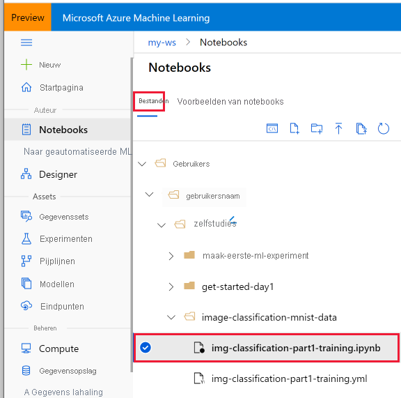

# Zelfstudie: Aan de slag met het maken van uw eerste ML-experiment met de Python SDK
[!INCLUDE [applies-to-skus](../../includes/aml-applies-to-basic-enterprise-sku.md)]

In deze zelfstudie voltooit u de end-to-end stappen om aan de slag te gaan met de Azure Machine Learning Python SDK die in Jupyter-notitieblokken wordt uitgevoerd. Deze zelfstudie is **onderdeel van een tweedelige zelfstudiereeks**en omvat de installatie en configuratie van python-omgevingen en het maken van een werkruimte om uw experimenten en machine learning-modellen te beheren. [**Deel twee**](tutorial-1st-experiment-sdk-train.md) bouwt hierop voort om meerdere machine learning-modellen te trainen en het modelbeheerproces te introduceren met behulp van zowel Azure Machine Learning studio als de SDK.

In deze zelfstudie hebt u:

> [!div class="checklist"]
> * Maak een [Azure Machine Learning Workspace](concept-workspace.md) die u gebruiken in de volgende zelfstudie.
> * Kloon het notitieblok van de zelfstudies naar uw map in de werkruimte.
> * Maak een op de cloud gebaseerde compute-instantie met Azure Machine Learning Python SDK geïnstalleerd en vooraf geconfigureerd.

Als u nog geen Azure-abonnement hebt, maakt u een gratis account voordat u begint. Probeer vandaag nog de [gratis of betaalde versie van Azure Machine Learning.](https://aka.ms/AMLFree)

## Een werkruimte maken

Een Azure Machine Learning-werkruimte is een basisbron in de cloud die u gebruikt om machine learning-modellen te experimenteren, te trainen en te implementeren. Het koppelt uw Azure-abonnement en resourcegroep aan een gemakkelijk verbruikt object in de service. 

U maakt een werkruimte via de Azure-portal, een webconsole voor het beheren van uw Azure-bronnen. 

[!INCLUDE [aml-create-portal](../../includes/aml-create-in-portal.md)]

>[!IMPORTANT] 
> Let op uw **werkruimte** en **abonnement.** U hebt deze nodig om ervoor te zorgen dat u uw experiment op de juiste plaats maakt. 

## Notitieblok uitvoeren in uw werkruimte

Deze zelfstudie maakt gebruik van de cloudnotebookserver in uw werkruimte voor een installatievrije en vooraf geconfigureerde ervaring. Gebruik [uw eigen omgeving](how-to-configure-environment.md#local) als u liever controle hebt over uw omgeving, pakketten en afhankelijkheden.

Volg deze video mee of gebruik de onderstaande gedetailleerde stappen om de zelfstudie vanuit uw werkruimte te klonen en uit te voeren. 

> [!VIDEO https://www.microsoft.com/en-us/videoplayer/embed/RE4mTUr]

### Een notitieblokmap klonen

U voltooit de volgende experimentset-up en voert stappen uit in Azure Machine Learning-studio, een geconsolideerde interface met machine learning-tools om data science-scenario's uit te voeren voor praktijkvoorbeelden van alle vaardigheidsniveaus.

1. Meld u aan bij [Azure Machine Learning studio](https://ml.azure.com/).

1. Selecteer uw abonnement en de werkruimte die u hebt gemaakt.

1. Selecteer **Notitieblokken** aan de linkerkant.

1. Open de map **Voorbeelden.**

1. Open de **map Python.**

1. Open de map met een versienummer erop.  Dit nummer vertegenwoordigt de huidige release voor de Python SDK.

1. Selecteer de **map "..."** rechts van de map **met zelfstudies** en selecteer **Vervolgens Kloon**.

    

1. In een lijst met mappen wordt elke gebruiker weergegeven die toegang heeft tot de werkruimte.  Selecteer uw map om de **map met zelfstudies** daar te klonen.

### <a name="open">Het gekloonde notitieblok openen

1. Open **onder Gebruikersbestanden** de map en open vervolgens de map met gekloonde **zelfstudies.**

    

    > [!IMPORTANT]
    > U notitieblokken in de **map met voorbeelden** bekijken, maar vanaf daar u geen notitieblok uitvoeren.  Als u een notitieblok wilt uitvoeren, moet u de gekloonde versie van het notitieblok openen in de sectie **Gebruikersbestanden.**
    
1. Selecteer het **bestand tutorial-1st-experiment-sdk-train.ipynb** in uw **map tutorials/create-first-ml-experiment.**

1. Selecteer op de bovenste balk een rekeninstantie die u wilt gebruiken om het notitieblok uit te voeren. Deze VM's zijn vooraf geconfigureerd met [alles wat u nodig hebt om Azure Machine Learning uit te voeren.](concept-compute-instance.md#contents) 

1. Als er geen VM's worden gevonden, selecteert u **+ Toevoegen** om de vm van de rekeninstantie te maken. 

    1. Wanneer u een vm maakt, geeft u een naam op.  De naam moet tussen de 2 en 16 tekens liggen. Geldige tekens zijn letters, cijfers en het - teken en moeten ook uniek zijn voor uw Azure-abonnement.

    1.  Selecteer de grootte van de virtuele machine in de beschikbare opties.

    1. Selecteer vervolgens **Maken**. Het kan ongeveer 5 minuten duren om uw VM in te stellen.

1. Zodra de VM beschikbaar is, wordt deze weergegeven op de bovenste werkbalk.  U het notitieblok nu uitvoeren met **Alles uitvoeren** op de werkbalk of met **Shift+Enter** gebruiken in de codecellen van het notitieblok.

Als u aangepaste widgets of liever met behulp van Jupyter / JupyterLab selecteer de **Jupyter** drop down aan de rechterkant, selecteer dan **Jupyter** of **JupyterLab**. Het nieuwe browservenster wordt geopend.

## Volgende stappen

In deze zelfstudie hebt u de volgende taken voltooid:

* Een Azure Machine Learning-werkruimte gemaakt.
* Een cloudnotitieblokserver in uw werkruimte maken en configureren.

In **deel twee** van de tutorial `tutorial-1st-experiment-sdk-train.ipynb` voer je de code in om een machine learning model te trainen. 

> [!div class="nextstepaction"]
> [Zelfstudie: Train je eerste model](tutorial-1st-experiment-sdk-train.md)

> [!IMPORTANT]
> Als u niet van plan bent deel 2 van deze zelfstudie of andere zelfstudies te volgen, moet u [de vm van de cloudnotebookserver stoppen](tutorial-1st-experiment-sdk-train.md#clean-up-resources) wanneer u deze niet gebruikt om de kosten te verlagen.

