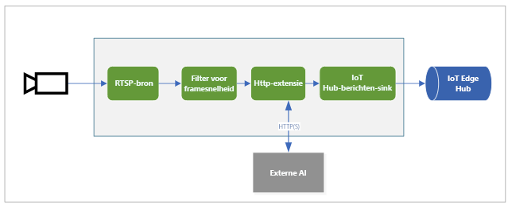

Dit diagram laat zien hoe de signalen in deze quickstart stromen. Een [Edge-module](https://github.com/Azure/live-video-analytics/tree/master/utilities/rtspsim-live555) simuleert een IP-camera die als host fungeert voor een RTSP-server (Real-Time Streaming Protocol). Een [RTSP-bron](../../../media-graph-concept.md#rtsp-source)-knooppunt haalt de videofeed van deze server, en verstuurt videoframes naar het [framefilterprocessor](../../../media-graph-concept.md#frame-rate-filter-processor)-knooppunt. Deze processor beperkt de framesnelheid van de videostream die het knooppunt [HTTP-extensieprocessor](../../../media-graph-concept.md#http-extension-processor) bereikt. 

Het knooppunt HTTP-extensie speelt de rol van een proxy. Het converteert videoframes naar het opgegeven afbeeldingstype. Vervolgens wordt de afbeelding via REST doorgestuurd naar een andere Edge-module die een AI-model achter een HTTP-eindpunt uitvoert. In dit voorbeeld wordt die Edge-module gebouwd met behulp van het [YOLOv3](https://github.com/Azure/live-video-analytics/tree/master/utilities/video-analysis/yolov3-onnx)-model, dat vele soorten objecten kan detecteren. Het HTTP-extensieprocessor-knooppunt verzamelt de detectieresultaten en publiceert de gebeurtenissen naar het [IoT Hub Sink](../../../media-graph-concept.md#iot-hub-message-sink)-knooppunt. Het knooppunt verzendt die gebeurtenissen vervolgens naar [IoT Edge-hub](../../../../../iot-edge/iot-edge-glossary.md#iot-edge-hub).

In deze quickstart gaat u het volgende doen:

1. De mediagrafiek maken en implementeren.
1. De resultaten interpreteren.
1. Resources opschonen.
