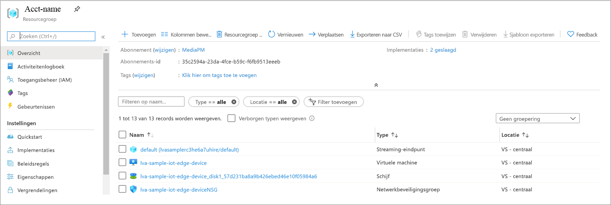
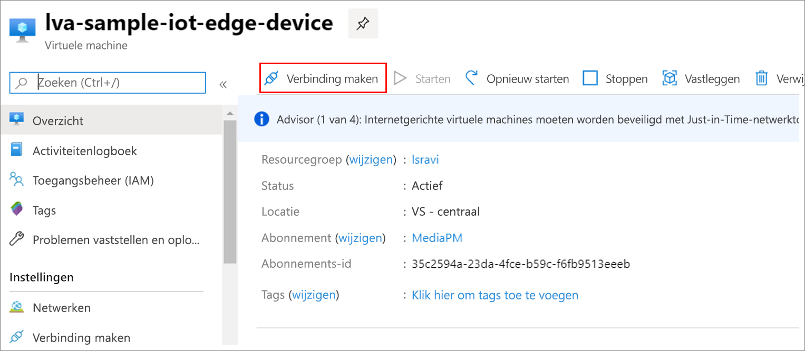

De MP4-bestanden worden naar een map op het edge-apparaat geschreven die u in het *.env*-bestand hebt geconfigureerd met behulp van deze sleutel: OUTPUT_VIDEO_FOLDER_ON_DEVICE. Als u de standaardwaarde hebt gebruikt, bevinden de resultaten zich in de map */var/media/* .

Om de MP4-clip af te spelen:

1. Ga naar uw resourcegroep, zoek de VM en maak vervolgens verbinding met behulp van Azure Bastion.

    
    
    
1. Meld u aan met de aanmeldingsgegevens die zijn gegenereerd bij het [instellen van uw Azure-resources](../../../detect-motion-emit-events-quickstart.md#set-up-azure-resources). 
1. Ga met de opdrachtprompt naar de betreffende map. De standaardlocatie is */var/media*. U vindt de MP4-bestanden in de map.

     

1. Gebruik [Secure Copy (SCP)](../../../../../virtual-machines/linux/copy-files-to-linux-vm-using-scp.md) om de bestanden naar uw lokale machine te kopiëren. 
1. Speel de bestanden af met [VLC media player](https://www.videolan.org/vlc/) of een andere MP4-speler.
