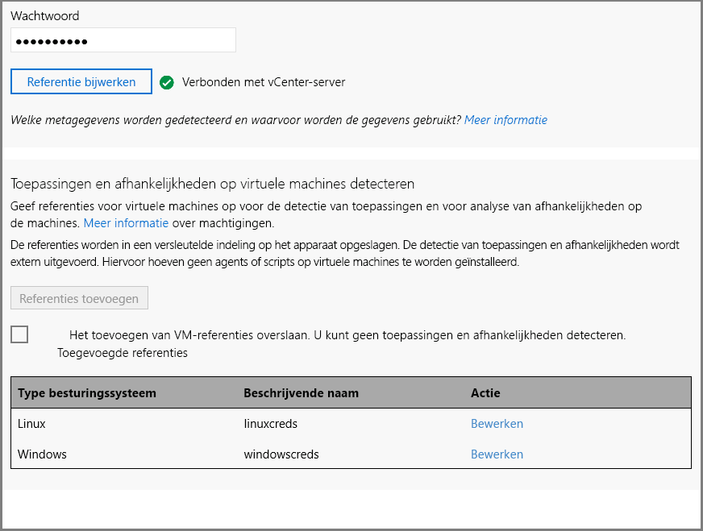
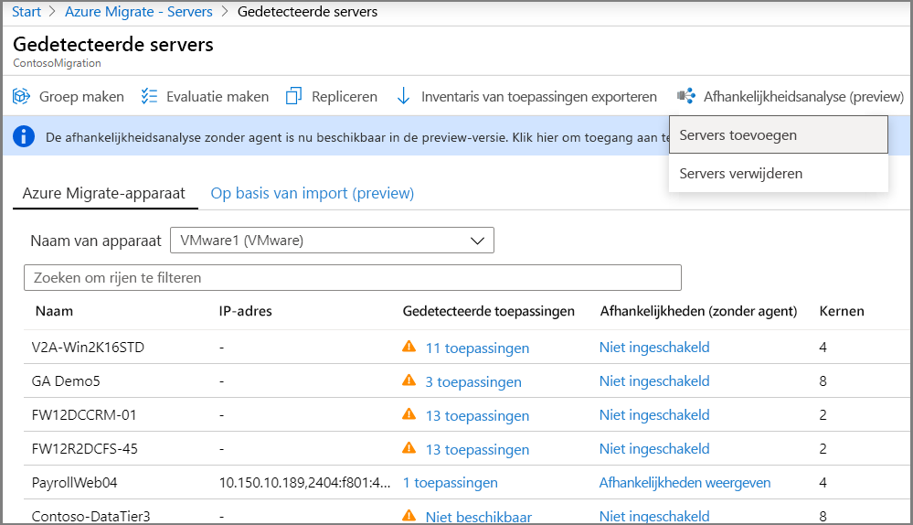
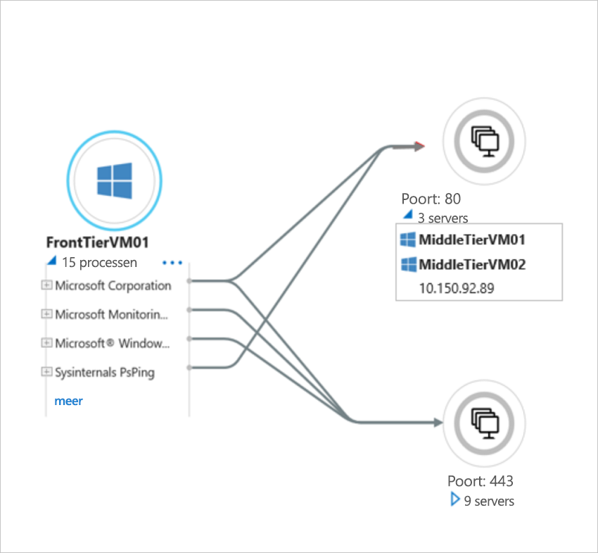

# Machine-afhankelijkheden analyseren (zonder agents)

In dit artikel wordt beschreven hoe u analyse van agentloze afhankelijkheden instelt in Azure Migrate: Server Assessment. [Afhankelijkheids analyse](concepts-dependency-visualization.md) helpt u bij het identificeren en begrijpen van afhankelijkheden tussen machines voor evaluatie en migratie naar Azure.

> [!IMPORTANT]
> Visualisatie van de afhankelijkheid van agents is momenteel beschikbaar als Preview voor VMware-Vm's die zijn gedetecteerd met het Azure Migrate: Server assessment tool.
> Functies zijn mogelijk beperkt of onvolledig.
> Deze preview wordt gedekt door de klant ondersteuning en kan worden gebruikt voor werk belastingen voor de productie.
> Zie [Supplemental Terms of Use for Microsoft Azure Previews (Aanvullende gebruiksvoorwaarden voor Microsoft Azure-previews)](https://azure.microsoft.com/support/legal/preview-supplemental-terms/) voor meer informatie.

## Huidige beperkingen

- In de weer gave afhankelijkheids analyse kunt u op dit moment geen server toevoegen aan of verwijderen uit een groep.
- Een afhankelijkheids toewijzing voor een groep servers is momenteel niet beschikbaar.
- De afhankelijkheids gegevens kunnen niet worden gedownload in de indeling tabellair.

## Voordat u begint

- [Bekijk](migrate-support-matrix-vmware.md#dependency-analysis-requirements-agentless) ondersteunde besturings systemen en de vereiste machtigingen.
- Zorg ervoor dat:
    - Een Azure Migrate project hebben. Als u dit niet doet, [maakt](how-to-add-tool-first-time.md) u er nu een.
    - Controleer of u het Azure Migrate: Server Assessment Tool hebt [toegevoegd](how-to-assess.md) aan het project.
    - Stel een [Azure migrate apparaat](migrate-appliance.md) in om on-premises machines te detecteren. [Stel een apparaat](how-to-set-up-appliance-vmware.md) in voor VMware-vm's. Het apparaat detecteert on-premises machines en verstuurt meta gegevens en prestatie gegevens naar Azure Migrate: Server evaluatie.
- Controleer of VMware-Hulpprogram Ma's (hoger dan 10,2) is geïnstalleerd op elke virtuele machine die u wilt analyseren.

## Een gebruikers account maken voor detectie

Stel een gebruikers account in zodat de server evaluatie toegang kan krijgen tot de virtuele machine om afhankelijkheden te detecteren. [Meer informatie](migrate-support-matrix-vmware.md#dependency-analysis-requirements-agentless) over de account vereisten voor virtuele Windows-en Linux-machines.

## Het gebruikers account toevoegen aan het apparaat

Voeg het gebruikers account toe aan het apparaat.

1. Open de app voor het beheren van apparaten. 
2. Navigeer naar het deel venster **vCenter-gegevens opgeven** .
3. Klik in **toepassing en afhankelijkheden van Vm's detecteren**op **referenties toevoegen**
3. Kies het **besturings systeem**, geef een beschrijvende naam op voor het account en het **User name** / **wacht woord** voor de gebruikers naam
6. Klik op **Opslaan**.
7. Klik op **opslaan en detectie starten**.

    

## Detectie van afhankelijkheid starten

Kies de computers waarop u detectie van afhankelijkheden wilt inschakelen.

1. Klik in **Azure migrate: Server evaluatie**op **gedetecteerde servers**.
2. Klik op het pictogram **afhankelijkheids analyse** .
3. Klik op **servers toevoegen**.
4. Kies op de pagina **servers toevoegen** het apparaat dat de relevante computers detecteert.
5. Selecteer de machines in de lijst met computers.
6. Klik op **servers toevoegen**.

    

U kunt afhankelijkheden ongeveer zes uur na het starten van de detectie van afhankelijkheden visualiseren.

## Afhankelijkheden visualiseren

1. Klik in **Azure migrate: Server evaluatie**op **gedetecteerde servers**.
2. Zoek naar de computer die u wilt weer geven.
3. Klik in de kolom **afhankelijkheden** op **afhankelijkheden weer geven**
4. Wijzig de tijds periode waarvoor u de kaart wilt weer geven met de vervolg keuzelijst **tijd duur** .
5. Vouw de **client** groep uit om de machines met een afhankelijkheid op de geselecteerde computer weer te geven.
6. Vouw de **poort** groep uit om de computers weer te geven die een afhankelijkheid hebben van de geselecteerde computer.
7. Als u wilt navigeren naar de kaart weergave van een van de afhankelijke machines, klikt u op de computer naam > **Server toewijzing laden**

    

    

8. Vouw de geselecteerde machine uit om details op proces niveau weer te geven voor elke afhankelijkheid.

    

> [!NOTE]
> Proces informatie voor een afhankelijkheid is niet altijd beschikbaar. Als deze niet beschikbaar is, wordt de afhankelijkheid weer gegeven met het proces dat is gemarkeerd als ' onbekend proces '.

## Afhankelijkheids gegevens exporteren

1. Klik in **Azure migrate: Server evaluatie**op **gedetecteerde servers**.
2. Klik op het pictogram **afhankelijkheids analyse** .
3. Klik op **toepassings afhankelijkheden exporteren**.
4. Kies op de pagina **toepassings afhankelijkheden exporteren** het apparaat dat de relevante computers detecteert.
5. Selecteer de begin tijd en eind tijd. Houd er rekening mee dat u de gegevens alleen voor de afgelopen 30 dagen kunt downloaden.
6. Klik op **afhankelijkheid exporteren**.

De afhankelijkheids gegevens worden geëxporteerd en gedownload in CSV-indeling. Het gedownloade bestand bevat de afhankelijkheids gegevens op alle machines die zijn ingeschakeld voor afhankelijkheids analyse. 

### Afhankelijkheids gegevens

Elke rij in het geëxporteerde CSV komt overeen met een afhankelijkheid in de opgegeven tijds periode. 

De volgende tabel bevat een overzicht van de velden in het geëxporteerde CSV-bestand. Houd er rekening mee dat Server naam-, toepassings-en proces velden alleen worden ingevuld voor servers waarop de afhankelijkheids analyse zonder agent is ingeschakeld.

**Veldnaam** | **Details**
--- | --- 
Timeslot | De timeslot waarin de afhankelijkheid is waargenomen.   Er worden momenteel afhankelijkheids gegevens vastgelegd in sleuven van zes uur.
Naam van bron server | Naam van de bron machine 
Bron toepassing | Naam van de toepassing op de bron machine 
Bron proces | De naam van het proces op de bron machine 
Naam van de doel server | Naam van de doel computer
Doel-IP | IP-adres van de doel computer
Doel toepassing | Naam van de toepassing op de doel computer
Doel proces | De naam van het proces op de doel computer 
Doelpoort | Poort nummer op de doel computer

## Detectie van afhankelijkheid stoppen

Kies de computers waarop u de detectie van afhankelijkheden wilt stoppen.

1. Klik in **Azure migrate: Server evaluatie**op **gedetecteerde servers**.
2. Klik op het pictogram **afhankelijkheids analyse** .
3. Klik op **servers verwijderen**.
3. Kies op de pagina **servers verwijderen** het **apparaat** dat de vm's detecteert waarop u de detectie van de afhankelijkheid wilt stoppen.
4. Selecteer de machines in de lijst met computers.
5. Klik op **servers verwijderen**.

## Volgende stappen

[Groep machines](how-to-create-a-group.md) voor evaluatie.
