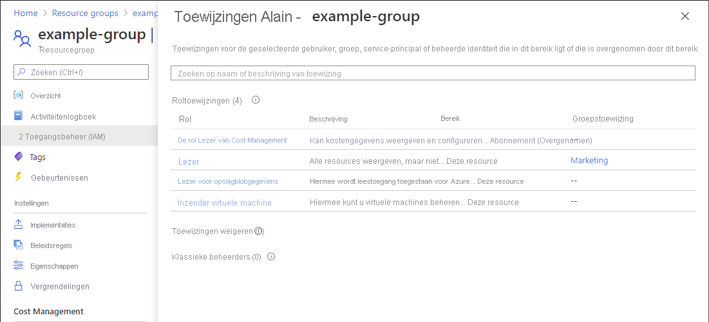

# Quickstart: Toegang voor een gebruiker tot Azure-resources controleren

Soms moet u controleren welke toegang een gebruiker heeft tot een set Azure-resources. U controleert deze toegang door de toewijzingen voor de gebruiker te vermelden. Een snelle manier om de toegang voor één gebruiker te controleren, is via de functie **Toegang controleren** op de pagina **IAM (Toegangsbeheer)** .

## Stap 1: De Azure-resources openen

Als u de toegang voor een gebruiker wilt controleren, moet u eerst de Azure-resources openen waarvoor u de toegang wilt controleren. Azure-resources zijn georganiseerd in niveaus, meestal een *bereik* genoemd. In Azure kunt u een bereik op vier niveaus opgeven, van ruim tot naar beperkt: beheergroep, abonnement, resourcegroep, en resource.

Volg deze stappen om de set Azure-resources te openen waarvoor u de toegang wilt controleren.

1. Open [Azure Portal](https://portal.azure.com).

1. Open de set met Azure-resources, bijvoorbeeld **Beheergroepen**, **Abonnementen**, **Resourcegroepen** of een bepaalde resource.

1. Klik op de specifieke resource in dit bereik.

    Hieronder ziet u een voorbeeld van een resourcegroep.

    

## Stap 2: Toegang voor een gebruiker controleren

Volg deze stappen om de toegang voor één gebruiker, groep, service-principal, of beheerde identiteit te controleren voor de eerder geselecteerde Azure-resources.

1. Klik op **Toegangsbeheer (IAM)**.

    Hieronder ziet u een voorbeeld van de pagina IAM (Toegangsbeheer) voor een resourcegroep.

    

1. Selecteer op het tabblad **Toegang controleren** de lijst **Zoeken**. Selecteer de gebruiker, groep, service-principal of beheerde identiteit waarvoor u de toegang wilt controleren.

1. Voer in het zoekvak een tekenreeks in om de map te doorzoeken op weergavenamen, e-mailadressen of object-id's.

    

1. Klik op de beveiligings-principal om het deelvenster **Toewijzingen** te openen.

    In dit deelvenster ziet u de toegang voor de geselecteerde beveiligingsprincipal op dit bereik en de toegang die is overgenomen in dit bereik. Toewijzingen op onderliggende bereiken worden niet vermeld. U ziet de volgende toewijzingen:

    - Roltoewijzingen die zijn toegevoegd met Azure RBAC.
    - Weigeringstoewijzingen die zijn toegevoegd met behulp van Azure Blueprints of beheerde Azure-apps.
    - Toewijzingen voor een Klassieke servicebeheerder of Co-beheerder voor klassieke implementaties. 

    

## Stap 3: Uw toegang controleren

Volg deze stappen om uw toegang tot de eerder geselecteerde Azure-resources te controleren.

1. Klik op **Toegangsbeheer (IAM)**.

1. Klik op het tabblad **Toegang controleren** op de knop **Mijn toegang weergeven**.

    Er verschijnt een deelvenster Toewijzingen met hierin uw toegang op dit bereik en de toegang die is overgenomen in dit bereik. Toewijzingen op onderliggende bereiken worden niet vermeld.

    

## Volgende stappen

> [!div class="nextstepaction"]
> [Azure-roltoewijzingen vermelden met behulp van Azure Portal](role-assignments-list-portal.md)
