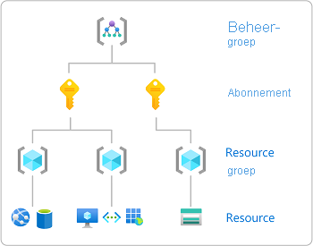

# Azure-roltoewijzingen toevoegen of verwijderen met behulp van de Azure-portal

[!INCLUDE [Azure RBAC definition grant access](../../includes/role-based-access-control/definition-grant.md)] In dit artikel wordt beschreven hoe u rollen toewijst met behulp van de Azure Portal.

Zie [beheerders rollen weer geven en toewijzen in azure Active Directory](../active-directory/roles/manage-roles-portal.md)als u beheerders rollen wilt toewijzen in azure Active Directory.

## Vereisten

[!INCLUDE [Azure role assignment prerequisites](../../includes/role-based-access-control/prerequisites-role-assignments.md)]

## Een roltoewijzing toevoegen

In azure RBAC kunt u een roltoewijzing toevoegen om toegang te verlenen aan een Azure-resource. Volg deze stappen om een rol toe te wijzen. Zie stappen voor het [toevoegen van een roltoewijzing](role-assignments-steps.md)voor een overzicht van de stappen.

### Stap 1: het benodigde bereik identificeren

[!INCLUDE [Scope for Azure RBAC introduction](../../includes/role-based-access-control/scope-intro.md)]

[!INCLUDE [Scope for Azure RBAC least privilege](../../includes/role-based-access-control/scope-least.md)] Zie [inzicht in bereik](scope-overview.md)voor meer informatie over het bereik.

1. Meld u aan bij de [Azure-portal](https://portal.azure.com).

1. Zoek in het zoekvak bovenaan het bereik dat u toegang wilt verlenen. Zoek bijvoorbeeld naar **beheer groepen**, **abonnementen**, **resource groepen** of een specifieke resource.

    

1. Klik op de specifieke resource voor dat bereik.

    Hieronder ziet u een voorbeeld van een resourcegroep.

    

### Stap 2: het deel venster toewijzing van rol toevoegen openen

**Toegangs beheer (IAM)** is de pagina die u doorgaans gebruikt om rollen toe te wijzen om toegang te verlenen tot Azure-resources. Het wordt ook wel ' identiteits-en toegangs beheer (IAM) genoemd en wordt weer gegeven op verschillende locaties in de Azure Portal.

1. Klik op **Toegangsbeheer (IAM)**.

    Hieronder ziet u een voorbeeld van de pagina IAM (Toegangsbeheer) voor een resourcegroep.

    

1. Klik op **het tabblad roltoewijzingen om de roltoewijzingen** in dit bereik weer te geven.

1. Klik **op**  >  **toewijzing van roltoewijzing** toevoegen.
   Als u niet bent gemachtigd voor het toewijzen van rollen, is de optie Roltoewijzing toevoegen uitgeschakeld.

   

    Het deelvenster Roltoewijzing toevoegen wordt geopend.

   

### Stap 3: de juiste rol selecteren

1. Zoek in de lijst met **rollen** de rol die u wilt toewijzen.

    Om u te helpen bij het bepalen van de juiste rol, kunt u de muis aanwijzer boven het info pictogram klikken om een beschrijving voor de rol weer te geven. Zie het artikel [ingebouwde rollen van Azure](built-in-roles.md) voor meer informatie.

   

1. Klik om de rol te selecteren.

### Stap 4: selecteren wie toegang moet hebben

1. Selecteer in de lijst **toegang toewijzen aan** het type beveiligings-principal waaraan u toegang wilt toewijzen.

    | Type | Beschrijving |
    | --- | --- |
    | **Gebruiker, groep of Service-Principal** | Als u de rol wilt toewijzen aan een gebruiker, groep of Service-Principal (toepassing), selecteert u dit type. |
    | **Door de gebruiker toegewezen beheerde identiteit** | Als u de rol wilt toewijzen aan een door de [gebruiker toegewezen beheerde identiteit](../active-directory/managed-identities-azure-resources/overview.md), selecteert u dit type. |
    | *Door het systeem toegewezen beheerde identiteit* | Als u de rol wilt toewijzen aan een door het [systeem toegewezen beheerde identiteit](../active-directory/managed-identities-azure-resources/overview.md), selecteert u het exemplaar van de Azure-service waar de beheerde identiteit zich bevindt. |

   

1. Als u een door de gebruiker toegewezen beheerde identiteit of een door het systeem toegewezen beheerde identiteit hebt geselecteerd, selecteert u het **abonnement** waarin de beheerde identiteit zich bevindt.

1. Zoek in de sectie **selecteren** naar de beveiligingsprincipal door een teken reeks in te voeren of door de lijst te bladeren.

   

1. Zodra u de beveiligingsprincipal hebt gevonden, klikt u erop om deze te selecteren.

### Stap 5: rol toewijzen

1. Klik op **Opslaan** om de rol toe te wijzen.

   Na enkele ogen blikken wordt de rol bij de geselecteerde scope toegewezen aan de beveiligingsprincipal.

1. Controleer op **het tabblad roltoewijzingen of de roltoewijzing** in de lijst wordt weer geven.

    

## Roltoewijzing verwijderen

In azure RBAC kunt u de toegang van een Azure-resource verwijderen door een roltoewijzing te verwijderen. Volg deze stappen om een roltoewijzing te verwijderen.

1. Open **toegangs beheer (IAM)** in een bereik, zoals de beheer groep, het abonnement, de resource groep of de resource, waar u de toegang wilt verwijderen.

1. Klik op **het tabblad roltoewijzingen om** alle roltoewijzingen in dit bereik weer te geven.

1. Schakel in de lijst met roltoewijzingen het selectievakje in naast de beveiligings-principal met de roltoewijzing die u wilt verwijderen.

   

1. Klik op **Verwijderen**.

   

1. Klik op **Ja** om te bevestigen dat u de roltoewijzing inderdaad wilt verwijderen.

    Als u een bericht ziet dat overgenomen roltoewijzingen niet kunnen worden verwijderd, probeert u een roltoewijzing te verwijderen uit een onderliggend bereik. Open toegangs beheer (IAM) bij het bereik waaraan de rol is toegewezen en probeer het opnieuw. Een snelle manier om toegangs beheer (IAM) in het juiste bereik te openen, is door de kolom **bereik** te bekijken en op de koppeling naast **(overgenomen)** te klikken.

   

## Volgende stappen

- [Een gebruiker toewijzen als beheerder van een Azure-abonnement](role-assignments-portal-subscription-admin.md)
- [Een roltoewijzing voor een beheerde identiteit toevoegen](role-assignments-portal-managed-identity.md)
- [Problemen met Azure RBAC oplossen](troubleshooting.md)
