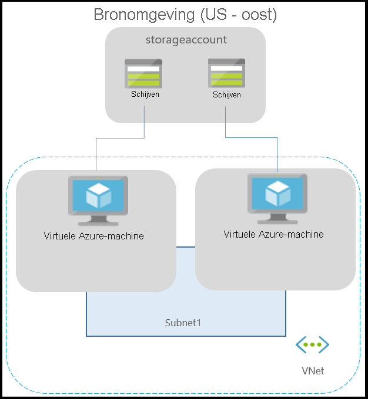
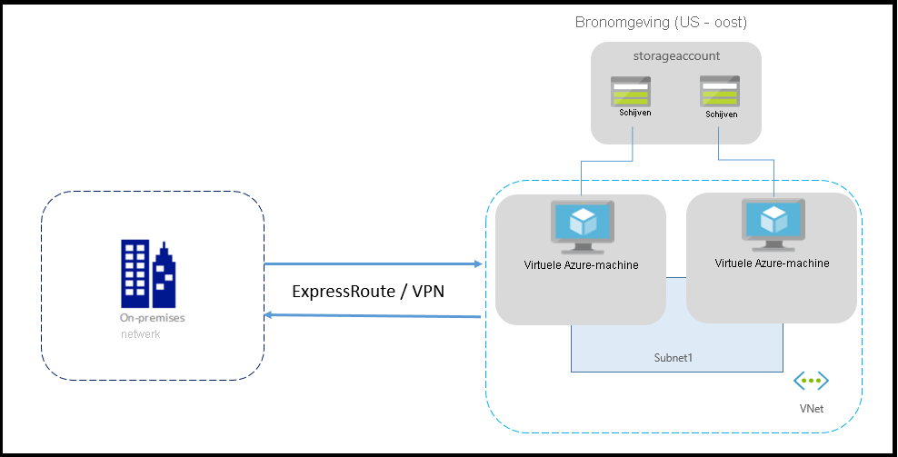
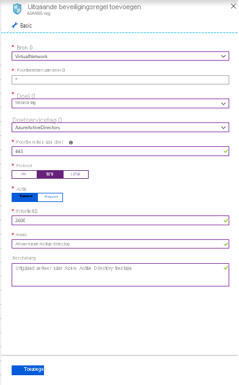

# Over netwerken in nood herstel voor Azure VM

In dit artikel worden netwerk richtlijnen beschreven wanneer u virtuele machines van Azure repliceert en herstelt vanuit de ene regio naar een andere, met behulp van [Azure site Recovery](site-recovery-overview.md).

## Voordat u begint

Meer informatie over hoe Site Recovery herstel na nood gevallen biedt voor [dit scenario](azure-to-azure-architecture.md).

## Typische netwerk infrastructuur

In het volgende diagram ziet u een typische Azure-omgeving, voor toepassingen die worden uitgevoerd op virtuele Azure-machines:

Als u Azure ExpressRoute of een VPN-verbinding van uw on-premises netwerk naar Azure gebruikt, is de omgeving als volgt:

Normaal gesp roken worden netwerken beveiligd met firewalls en netwerk beveiligings groepen (Nsg's). Firewalls gebruiken een URL of IP-gebaseerde white list om de netwerk verbinding te beheren. Nsg's bieden regels die gebruikmaken van IP-adresbereiken voor het beheren van de netwerk verbinding.

>[!IMPORTANT]
> Het gebruik van een geverifieerde proxy voor het beheren van de netwerk verbinding wordt niet ondersteund door Site Recovery en de replicatie kan niet worden ingeschakeld.

## Uitgaande connectiviteit voor URL's

Als u een firewall proxy op basis van een URL gebruikt voor het beheren van uitgaande connectiviteit, kunt u deze Site Recovery Url's toestaan:

**URL** | **Details**  
--- | ---
*.blob.core.windows.net | Vereist zodat gegevens kunnen worden geschreven naar het cache-opslag account in de bron regio van de virtuele machine. Als u alle cache opslag accounts voor uw Vm's weet, kunt u toegang tot de specifieke Url's van het opslag account (bijvoorbeeld: cache1.blob.core.windows.net en cache2.blob.core.windows.net) toestaan in plaats van *. blob.core.windows.net
login.microsoftonline.com | Vereist voor autorisatie en verificatie voor de Url's van de Site Recovery-service.
*.hypervrecoverymanager.windowsazure.com | Vereist zodat de Site Recovery service communicatie kan worden uitgevoerd vanaf de virtuele machine.
*.servicebus.windows.net | Vereist zodat de Site Recovery bewakings-en diagnostische gegevens van de virtuele machine kunnen worden geschreven.

## Uitgaande connectiviteit voor IP-adresbereiken

Als u een NSG gebruikt om de uitgaande connectiviteit te beheren, moeten deze service tags worden toegestaan.

- Alle IP-adresbereiken die overeenkomen met de opslag accounts in de bron regio
    - Maak een NSG-regel op basis van een [opslag service label](../virtual-network/security-overview.md#service-tags) voor de bron regio.
    - Sta deze adressen toe zodat gegevens kunnen worden geschreven naar het cache-opslag account van de VM.
- Een op NSG [(Aad)-service codes](../virtual-network/security-overview.md#service-tags) gebaseerde regel voor Azure Active Directory het maken van toegang tot alle IP-adressen die overeenkomen met Aad toestaan
- Maak een EventsHub op basis van een NSG-regel voor de doel regio, waarmee toegang tot Site Recovery bewaking kan worden uitgevoerd.
- Maak een AzureSiteRecovery op basis van een NSG-regel voor het toestaan van toegang tot Site Recovery service in een wille keurige regio.
- We raden u aan de vereiste NSG-regels te maken op een test-NSG en te controleren of er geen problemen zijn voordat u de regels op een productie NSG maakt.

## Voor beeld van NSG-configuratie

In dit voor beeld ziet u hoe u NSG-regels configureert voor replicatie van een virtuele machine.

- Als u NSG-regels gebruikt om de uitgaande connectiviteit te beheren, gebruikt u de regels HTTPS-uitgaand toestaan op poort: 443 voor alle vereiste IP-adresbereiken.
- In het voor beeld wordt ervan uitgegaan dat de bron locatie van de virtuele machine ' vs-Oost ' is en de doel locatie ' centraal VS ' is.

### NSG-regels-VS-Oost

1. Maak een uitgaande HTTPS (443)-beveiligings regel voor ' storage. oostelijke ' op de NSG, zoals wordt weer gegeven in de onderstaande scherm afbeelding.

      

2. Maak een uitgaande HTTPS (443) beveiligings regel voor ' AzureActiveDirectory ' op de NSG, zoals weer gegeven in de onderstaande scherm afbeelding.

      

3. Net als hierboven, maakt u een uitgaande HTTPS (443) beveiligings regel voor ' EventHub. Centralus ' op de NSG die overeenkomt met de doel locatie. Hiermee krijgt u toegang tot Site Recovery bewaking.

4. Maak een uitgaande HTTPS (443) beveiligings regel voor ' AzureSiteRecovery ' op de NSG. Hiermee krijgt u toegang tot Site Recovery-service in elke regio.

### NSG-regels-VS-Centraal

Deze regels zijn vereist zodat replicatie kan worden ingeschakeld vanuit de doel regio naar de bron regio na failover:

1. Maak een uitgaande HTTPS (443) beveiligings regel voor ' opslag. Centraalus ' op de NSG.

2. Maak een uitgaande HTTPS (443) beveiligings regel voor ' AzureActiveDirectory ' op de NSG.

3. Net als hierboven, maakt u een uitgaande HTTPS (443) beveiligings regel voor ' EventHub. Eastus ' op de NSG die overeenkomt met de bron locatie. Hiermee krijgt u toegang tot Site Recovery bewaking.

4. Maak een uitgaande HTTPS (443) beveiligings regel voor ' AzureSiteRecovery ' op de NSG. Hiermee krijgt u toegang tot Site Recovery-service in elke regio.

## Configuratie van virtueel netwerk apparaat

Als u virtuele netwerk apparaten (Nva's) gebruikt om het uitgaande netwerk verkeer van Vm's te beheren, kan het apparaat worden beperkt als alle replicatie verkeer via de NVA wordt door gegeven. U kunt het beste een netwerk service-eind punt in uw virtuele netwerk maken voor ' opslag ', zodat het replicatie verkeer niet naar de NVA gaat.

### Netwerk service-eind punt voor opslag maken
U kunt een netwerk service-eind punt in uw virtuele netwerk maken voor ' opslag ' zodat het replicatie verkeer de Azure-grens niet verlaat.

- Selecteer uw virtuele Azure-netwerk en klik op service-eind punten

    

- Klik op het tabblad toevoegen en service-eind punten toevoegen wordt geopend
- Selecteer ' micro soft. Storage ' onder ' service ' en de vereiste subnetten onder het veld subnets en klik op toevoegen.

>[!NOTE]
>Beperk geen toegang tot het virtuele netwerk tot uw opslag accounts die worden gebruikt voor ASR. U moet toegang toestaan vanaf alle netwerken

### Geforceerde tunneling

U kunt de standaard systeem route van Azure voor het adres voorvoegsel 0.0.0.0/0 vervangen door een aangepaste route en VM-verkeer [omleiden](../virtual-network/virtual-networks-udr-overview.md#custom-routes) naar een on-premises netwerk virtueel apparaat (NVA), maar deze configuratie wordt niet aanbevolen voor replicatie van site Recovery. Als u aangepaste routes gebruikt, moet u [een service-eind punt voor een virtueel netwerk maken](azure-to-azure-about-networking.md#create-network-service-endpoint-for-storage) in het virtuele netwerk voor "opslag" zodat het replicatie verkeer de Azure-grens niet verlaat.

## Volgende stappen
- Begin met het beveiligen van uw workloads door [Azure virtual machines te repliceren](site-recovery-azure-to-azure.md).
- Meer informatie over het [bewaren van IP-adressen](site-recovery-retain-ip-azure-vm-failover.md) voor failover van de virtuele machine van Azure.
- Meer informatie over herstel na nood gevallen van [virtuele Azure-machines met ExpressRoute](azure-vm-disaster-recovery-with-expressroute.md).
