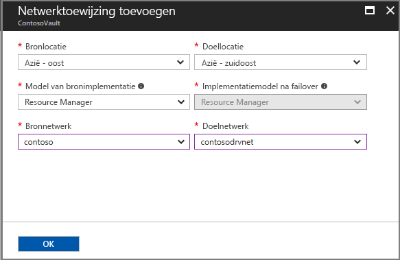

# Netwerktoewijzing en IP-adressering instellen voor VNets

In dit artikel wordt beschreven hoe u twee exemplaren van Virtuele Azure-netwerken (VNets) in verschillende Azure-regio's in kaart brengen en hoe u IP-adressering tussen netwerken instellen. Netwerktoewijzing biedt een standaardgedrag voor doelnetwerkselectie op basis van het bronnetwerk op het moment dat replicatie wordt ingeschakeld.

## Vereisten

Voordat u netwerken in kaart brengt, moet u [Azure VNets](../virtual-network/virtual-networks-overview.md) in de bron- en doelgebieden hebben. 

## Netwerktoewijzing handmatig instellen (optioneel)

Kaartnetwerken als volgt:

1. Klik in **Site Recovery Infrastructure**op **+Netwerktoewijzing**.

    

3. Selecteer **in Netwerktoewijzing toevoegen**de bron- en doellocaties. In ons voorbeeld wordt de bron-VM uitgevoerd in de regio Oost-Azië en wordt deze gerepliceerd naar de regio Zuidoost-Azië.

    
3. Maak nu een netwerktoewijzing in de tegenovergestelde richting. In ons voorbeeld, de bron zal nu Zuidoost-Azië, en het doel zal zijn Oost-Azië.

    

## Netwerk toewijzen wanneer u replicatie inschakelt

Als u netwerktoewijzing nog niet hebt voorbereid voordat u disaster recovery voor Azure VM's configureert, u een doelnetwerk opgeven wanneer u [replicatie instelt en inschakelen.](azure-to-azure-how-to-enable-replication.md) Wanneer u dit doet, gebeurt het volgende:

- Op basis van het doel dat u selecteert, maakt Site Recovery automatisch netwerktoewijzingen van de bron naar het doelgebied en van het doel- naar de bronregio.
- Siteherstel maakt standaard een netwerk in het doelgebied dat identiek is aan het bronnetwerk. Site recovery voegt **-asr** toe als achtervoegsel aan de naam van het bronnetwerk. U het doelnetwerk aanpassen.
- Als er al netwerktoewijzing is opgetreden voor een bronnetwerk, is het toegewezen doelnetwerk altijd de standaard op het moment dat replicaties voor meer VM's worden ingeschakeld. U ervoor kiezen om het virtuele doelnetwerk te wijzigen door andere beschikbare opties te kiezen in de vervolgkeuzelijst. 
- Als u het standaarddoelvirtuele netwerk voor nieuwe replicaties wilt wijzigen, moet u de bestaande netwerktoewijzing wijzigen.
- Als u een netwerktoewijzing van regio A naar regio B wilt wijzigen, moet u ervoor zorgen dat u eerst de netwerktoewijzing verwijdert van regio B naar regio A. Nadat u de toewijzing van het omgekeerde toewijzing hebt verwijderd, wijzigt u de netwerktoewijzing van regio A naar regio B en maakt u vervolgens de relevante omgekeerde toewijzing.

>[!NOTE]
>* Als u de netwerktoewijzing wijzigt, worden alleen de standaardwaarden voor nieuwe VM-replicaties gewijzigd. Het heeft geen invloed op de doelselecties voor virtuele netwerkselecties voor bestaande replicaties. 
>* Als u het doelnetwerk voor een bestaande replicatie wilt wijzigen, gaat u naar Gegevensbedingen en netwerkinstellingen van het gerepliceerde item.

## Een subnet opgeven

Het subnet van de doel-VM wordt geselecteerd op basis van de naam van het subnet van de bron-VM.

- Als er een subnet is met dezelfde naam als het subnet source VM beschikbaar in het doelnetwerk, is dat subnet ingesteld voor de doel-VM.
- Als een subnet met dezelfde naam niet bestaat in het doelnetwerk, wordt het eerste subnet in de alfabetische volgorde ingesteld als het doelsubnet.
- U het doelsubnet wijzigen in de **compute- en netwerkinstellingen** voor de VM.

    

## IP-adressering instellen voor doel-VM's

Het IP-adres voor elke NIC op een virtuele doelmachine is als volgt geconfigureerd:

- **DHCP**: Als de NIC van de bron-VM DHCP gebruikt, wordt de NIC van de doel-VM ook ingesteld op DHCP.
- **Statisch IP-adres:** Als de NIC van de bron VM statische IP-adressering gebruikt, gebruikt de doel-VM NIC ook een statisch IP-adres.

## Toewijzing van IP-adres tijdens failover

**Bron- en doelsubnetten** | **Details**
--- | ---
Dezelfde adresruimte | IP-adres van de bron-VM NIC is ingesteld als het DOEL-VM NIC IP-adres.   Als het adres niet beschikbaar is, wordt het volgende beschikbare IP-adres ingesteld als doel.
Verschillende adresruimte | Het volgende beschikbare IP-adres in het doelsubnet is ingesteld als het doel-VM NIC-adres.

## IP-adrestoewijzing tijdens testfailover

**Doelnetwerk** | **Details**
--- | ---
Doelnetwerk is failover VNet | - Doel-IP-adres is statisch met hetzelfde IP-adres.     - Als hetzelfde IP-adres al is toegewezen, is het IP-adres het volgende dat beschikbaar is aan het einde van het subnetbereik. Bijvoorbeeld: Als het bron-IP-adres 10.0.0.19 is en het failovernetwerk bereik 10.0.0.0/24 gebruikt, is het volgende IP-adres dat is toegewezen aan de doel-VM 10.0.0.254.
Doelnetwerk is niet de failover VNet | - Doel-IP-adres is statisch met hetzelfde IP-adres.    - Als hetzelfde IP-adres al is toegewezen, is het IP-adres het volgende dat beschikbaar is aan het einde van het subnetbereik.   Bijvoorbeeld: Als het statische IP-adres van de bron 10.0.0.19 is en failover zich bevindt op een netwerk dat niet het failovernetwerk is, met het bereik 10.0.0.0/24, dan is het statische doel-IP-adres 10.0.0.0.19 indien beschikbaar, en anders is het 10.0.0.254.

- De failover VNet is het doelnetwerk dat u selecteert wanneer u herstel na noodgevallen instelt.
- We raden u aan altijd een niet-productienetwerk te gebruiken voor een testfailover.
- U het doel-IP-adres wijzigen in de **compute- en netwerkinstellingen** van de virtuele machine.

## Volgende stappen

- Bekijk [de netwerkrichtlijnen](site-recovery-azure-to-azure-networking-guidance.md) voor azure VM-noodherstel.
- [Meer informatie](site-recovery-retain-ip-azure-vm-failover.md) over het behouden van IP-adressen na failover.
