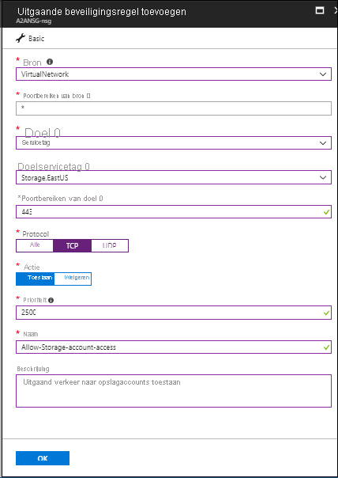

# Problemen met azure-to-Azure VM-netwerkconnectiviteit oplossen

In dit artikel worden de veelvoorkomende problemen beschreven die verband houden met netwerkconnectiviteit wanneer u virtuele Azure-machines van de ene regio naar de andere regio repliceert en herstelt. Zie de [verbindingsvereisten voor het repliceren van Azure VM's voor](azure-to-azure-about-networking.md)meer informatie over netwerkvereisten.

Als replicatie van siteherstel werkt, is uitgaande connectiviteit met specifieke URL's of IP-bereiken vereist van de VM. Als uw vm zich achter een firewall bevindt of NSG-regels (Network Security Group) gebruikt om uitgaande connectiviteit te beheren, u met een van deze problemen worden geconfronteerd.

**Url** | **Details**  
--- | ---
*.blob.core.windows.net | Vereist zodat gegevens vanaf de VM naar het cacheopslagaccount in het brongebied kunnen worden geschreven. Als u alle cacheopslagaccounts voor uw VM's kent, u de specifieke URL's van het opslagaccount (bijvoorbeeld cache1.blob.core.windows.net en cache2.blob.core.windows.net) toestaan in plaats van *.blob.core.windows.net
login.microsoftonline.com | Vereist voor autorisatie en verificatie voor de URL's van de siteherstelservice.
*.hypervrecoverymanager.windowsazure.com | Vereist zodat de servicecommunicatie siteherstel vanuit de VM kan plaatsvinden. U het bijbehorende 'Site Recovery IP' gebruiken als uw firewallproxy IP's ondersteunt.
*.servicebus.windows.net | Vereist zodat de siteherstelcontrole- en diagnostische gegevens kunnen worden geschreven vanuit de VM. U het bijbehorende 'Site Recovery Monitoring IP' gebruiken als uw firewallproxy IP's ondersteunt.

## Uitgaande connectiviteit voor URL's of IP-bereiken voor siteherstel (foutcode 151037 of 151072)

## Probleem 1: Kan geen virtuele Azure-machine registreren met siteherstel (151195)  
- **Mogelijke oorzaak**  
  - Verbinding kan niet worden gemaakt met sitehersteleindpunten als gevolg van een STORING in de DNS-resolutie.
  - Dit komt vaker voor tijdens het opnieuw beveiligen, wanneer u een failover hebt uitgevoerd voor de virtuele machine maar de DNS-server niet bereikbaar is vanuit de DR-regio.

- **Afsluiting**
   - Als u aangepaste DNS gebruikt, controleert u of de DNS-server toegankelijk is vanuit het gebied Rampherstel. Ga naar het VM-> Disaster Recovery-netwerk> DNS-servers om te controleren of u een aangepaste DNS hebt. Probeer vanaf de virtuele machine toegang te krijgen tot de DNS-server. Als het niet toegankelijk is, maakt u het toegankelijk door te falen via de DNS-server of door de sitelijn tussen het DR-netwerk en DNS te maken.

    

## Probleem 2: Configuratie van siteherstel is mislukt (151196)

> [!NOTE]
> Als de virtuele machines achter **Standard** interne load balancer, zou het geen toegang hebben tot O365 IP's (dat wil zeggen, login.microsoftonline.com) standaard. Wijzig deze in het type **Basisinterne** load balancer of maak uitgaande toegang zoals vermeld in het [artikel.](https://aka.ms/lboutboundrulescli)

- **Mogelijke oorzaak**  
  - Er kan geen verbinding worden gemaakt met IP4-eindpunten voor verificatie en identiteit van Office 365.

- **Afsluiting**
  - Azure Site Recovery vereiste toegang tot Office 365 IP-bereiken voor verificatie.
    Als u NSG-regels/firewallproxy (Azure Network Security Group) gebruikt om uitgaande netwerkconnectiviteit op de VM te beheren, moet u ervoor zorgen dat u communicatie toestaat naar O365-IPranges. Een [OP Azure Active Directory (Azure AD)-servicetag](../virtual-network/security-overview.md#service-tags) gebaseerde NSG-regel maken voor het toestaan van toegang tot alle IP-adressen die overeenkomen met Azure AD
      - Als er in de toekomst nieuwe adressen aan Azure AD worden toegevoegd, moet u nieuwe NSG-regels maken.

### Voorbeeld NSG-configuratie

In dit voorbeeld ziet u hoe u NSG-regels configureert voor een vm die moet worden gerepliceerd.

- Als u NSG-regels gebruikt om uitgaande connectiviteit te beheren, gebruikt u 'HTTPS-uitgaande regels toestaan voor poort:443 voor alle vereiste IP-adresbereiken.
- Het voorbeeld gaat ervan uit dat de VM-bronlocatie "Oost-VS" is en dat de doellocatie 'Centraal VS' is.

### NSG regels - Oost-VS

1. Maak een uitgaande HTTPS (443) beveiligingsregel voor "Storage.EastUS" op de NSG, zoals weergegeven in de onderstaande schermafbeelding.

      

2. Maak een uitgaande HTTPS(443) beveiligingsregel voor 'AzureActiveDirectory' op de NSG, zoals in de onderstaande schermafbeelding.

      

3. Uitgaande HTTPS-regels (443) maken voor de IP's siteherstel die overeenkomen met de doellocatie:

   **Locatie** | **IP-adres siteherstel** |  **IP-adres siteherstelcontrole**
    --- | --- | ---
   VS - centraal | 40.69.144.231 | 52.165.34.144

### NSG regels - Centrale VS

Deze regels zijn vereist, zodat replicatie kan worden ingeschakeld van het doelgebied naar het brongebied na de failover:

1. Maak een uitgaande HTTPS(443) beveiligingsregel voor 'Storage.CentralUS' op de NSG.

2. Maak een uitgaande HTTPS-beveiligingsregel (443) voor 'AzureActiveDirectory' op de NSG.

3. Uitgaande HTTPS-regels (443) maken voor de IP's van siteherstel die overeenkomen met de bronlocatie:

   **Locatie** | **IP-adres siteherstel** |  **IP-adres siteherstelcontrole**
    --- | --- | ---
   VS - centraal | 13.82.88.226 | 104.45.147.24
## Probleem 3: Configuratie van siteherstel is mislukt (151197)
- **Mogelijke oorzaak**  
  - Er kan geen verbinding worden gemaakt met eindpunten van de Azure Site Recovery-service.

- **Afsluiting**
  - Azure Site Recovery vereist toegang tot de [IP-bereiken van Site Recovery](https://docs.microsoft.com/azure/site-recovery/azure-to-azure-about-networking#outbound-connectivity-using-service-tags) afhankelijk van de regio. Zorg ervoor dat de vereiste IP-bereiken toegankelijk zijn vanaf de virtuele machine.

## Probleem 4: A2A-replicatie is mislukt wanneer het netwerkverkeer via on-premises proxyserver gaat (151072)
- **Mogelijke oorzaak**  
  - De aangepaste proxy-instellingen zijn ongeldig en de Azure Site Recovery Mobility Service-agent heeft de proxy-instellingen van IE niet automatisch gedetecteerd

- **Afsluiting**
  1. Mobility Service agent detecteert de proxy-instellingen van IE op Windows en / etc / omgeving op Linux.
  2. Als u de proxy alleen voor Azure Site Recovery Mobility Service wilt instellen, u de proxygegevens opgeven in ProxyInfo.conf op: 
     - ``/usr/local/InMage/config/``op ***Linux***
     - ``C:\ProgramData\Microsoft Azure Site Recovery\Config``op ***Windows***
  3. ProxyInfo.conf moet de proxy-instellingen in de volgende INI-indeling hebben. 
                *[proxy]* 
                *Adres=http://1.2.3.4* 
                *Port=567* 
  4. Azure Site Recovery Mobility Service-agent ondersteunt alleen ***niet-geverifieerde proxy's.***

### Het probleem oplossen
Volg de stappen in het [netwerkrichtlijnendocument](site-recovery-azure-to-azure-networking-guidance.md)om [de vereiste URL's](azure-to-azure-about-networking.md#outbound-connectivity-for-urls) of de [vereiste IP-bereiken](azure-to-azure-about-networking.md#outbound-connectivity-using-service-tags)toe te staan .

## Volgende stappen
[Virtuele Azure-machines repliceren](site-recovery-replicate-azure-to-azure.md)
