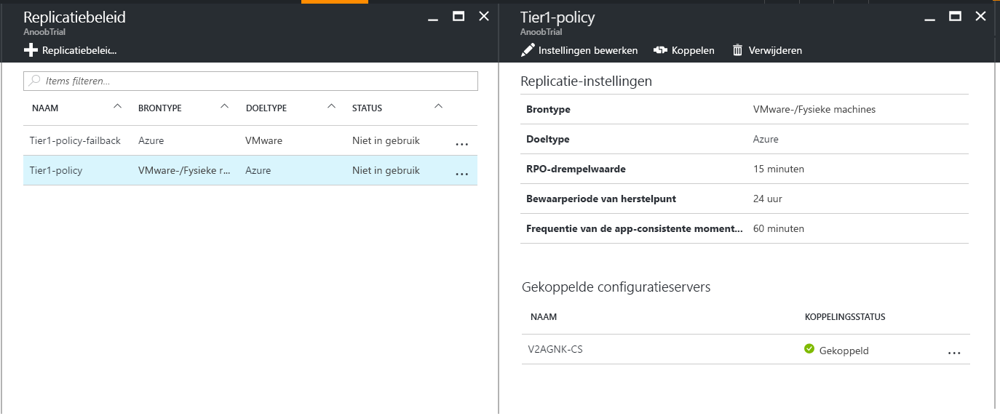

# Replicatiebeleid configureren en beheren voor VMware-noodherstel

In dit artikel wordt beschreven hoe u een replicatiebeleid configureert wanneer u Vm's van VMware-vm's aan Azure repliceert met [Azure Site Recovery](site-recovery-overview.md).

## Beleid maken

1. Selecteer**Siteherstelinfrastructuur** **beheren** > .
2. Selecteer **replicatiebeleid**voor **VMware en fysieke machines**.
3. Klik **op +Replicatiebeleid**en geef de beleidsnaam op.
4. Geef in **RPO-drempelwaarde**de RPO-limiet op. Waarschuwingen worden gegenereerd wanneer continue replicatie deze limiet overschrijdt.
5. Geef in **Bewaarperiode van het herstelpunt** de duur (in uren) op dat elk herstelpunt moet worden bewaard. Beveiligde machines kunnen binnen een bepaald tijdsvenster te allen tijde worden hersteld naar een willekeurig punt. Een bewaarperiode van maximaal 24 uur wordt ondersteund voor computers die worden gerepliceerd naar Premium Storage. Tot 72 uur wordt ondersteund voor standaard opslag.
6. Kies in **de momentopnamefrequentie van App-consistent**uit de vervolgkeuzelijst hoe vaak (in uren) herstelpunten die toepassingsconsistente momentopnamen bevatten, moeten worden gemaakt. Als u de consistentiepunten voor de toepassing wilt uitschakelen, kiest u de waarde 'Uit' in de vervolgkeuzelijst.
7. Klik op **OK**. Het beleid wordt binnen 30 seconden tot 60 minuut gemaakt.

Wanneer u een replicatiebeleid maakt, wordt automatisch een overeenkomend failback-replicatiebeleid gemaakt, met het achtervoegsel 'failback'. Nadat u het beleid hebt hebt geselecteerd, u het bewerken door het > **Instellingen bewerken**te selecteren.

## Een configuratieserver koppelen

Koppel het replicatiebeleid aan uw on-premises configuratieserver.

1. Klik **op Koppelen**en selecteer de configuratieserver.

    
2. Klik op **OK**. De configuratieserver wordt binnen één tot twee minuten gekoppeld.

    

## Een beleidsregel bewerken

U een replicatiebeleid wijzigen nadat u het hebt maken.

- Wijzigingen in het beleid worden toegepast op alle machines die het beleid gebruiken.
- Als u gerepliceerde machines wilt koppelen aan een ander replicatiebeleid, moet u de beveiliging voor de relevante machines uitschakelen en opnieuw inschakelen.

Een beleid als volgt bewerken:
1. Selecteer **Replicatiebeleid voor** > **siteherstelinfrastructuur** > **beheren**.
2. Selecteer het replicatiebeleid dat u wilt wijzigen.
3. Klik **op Instellingen bewerken**en werk de gewenste tijdsvelden voor het behoud van de RPO-drempel/herstelpunt/app-consistente momentopname.
4. Als u de consistentiepunten voor de toepassing wilt uitschakelen, kiest u de waarde 'Uit' in de vervolgkeuzelijst van de **consistentmomentopnameveld app.**
5. Klik op **Opslaan**. Het beleid moet in 30 tot 60 seconden worden bijgewerkt.

## Een replicatiebeleid loskoppelen of verwijderen

1. Kies het replicatiebeleid.
    a. Als u het beleid wilt scheiden van de configuratieserver, controleert u of er geen gerepliceerde machines het beleid gebruiken. Klik vervolgens op **Dissociaat**.
    b. Als u het beleid wilt verwijderen, controleert u of het niet is gekoppeld aan een configuratieserver. Klik vervolgens op **Verwijderen**. Het duurt 30-60 seconden om te verwijderen.
2. Klik op **OK**.
