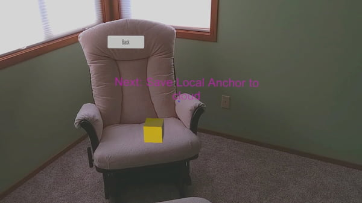

# Quickstart: Een Unity HoloLens-app maken die gebruikmaakt van Azure Spatial Anchors

In deze quickstart maakt u een Unity HoloLens-app die gebruikmaakt van [Azure Spatial Anchors](../overview.md). Spatial Anchors is een platformoverschrijdende ontwikkelaarsservice waarmee u mixed reality-ervaringen kunt maken met objecten die hun locatie in de loop van de tijd op meerdere apparaten behouden. Als u klaar bent, hebt u een HoloLens-app met Unity gemaakt waarmee een ruimtelijk anker kan worden opgeslagen en teruggehaald.

U leert het volgende:

- Een Spatial Anchors-account maken.
- Build-instellingen voor Unity voorbereiden.
- De Spatial Anchors-account-id en -accountsleutel configureren.
- Het HoloLens Visual Studio-project exporteren.
- De app implementeren en uitvoeren op een HoloLens-apparaat.

[!INCLUDE [quickstarts-free-trial-note](../../../includes/quickstarts-free-trial-note.md)]

## Vereisten

Dit zijn de vereisten voor het voltooien van deze snelstart:

- U hebt een Windows-computer nodig waarop <a href="https://unity3d.com/get-unity/download" target="_blank">Unity 2019.4 (LTS)</a> en <a href="https://www.visualstudio.com/downloads/" target="_blank">Visual Studio 2019</a> of hoger zijn geïnstalleerd. Uw installatie van Visual Studio moet de workload **Universeel Windows-platform ontwikkeling** en het onderdeel **Windows 10 SDK (10.0.18362.0 of later)** omvatten. U moet ook <a href="https://git-scm.com/download/win" target="_blank">Git voor Windows</a> en <a href="https://git-lfs.github.com/">Git LFS</a> installeren.
- U hebt een HoloLens-apparaat nodig waarvoor de [ontwikkelaarsmodus](/windows/mixed-reality/using-visual-studio) is ingeschakeld. [Update voor Windows van 10 mei 2020](/windows/mixed-reality/whats-new/release-notes-may-2020) moet op het apparaat zijn geïnstalleerd. Als u wilt bijwerken naar de nieuwste release op HoloLens, opent u de app **Instellingen**, gaat u naar **Bijwerken en beveiliging** en selecteert u vervolgens **Controleren op updates**.
- In uw app moet u de functie **SpatialPerception** inschakelen. Deze instelling bevindt zich in **Build-instellingen** > **Spelerinstellingen** > **Publicatie-instellingen** > **Functies**.
- In uw app moet u **Virtual Reality ondersteund** inschakelen met **Windows Mixed Reality SDK**. Deze instelling bevindt zich in **Build-instellingen** > **Spelerinstellingen** > **XR-instellingen**.

[!INCLUDE [Create Spatial Anchors resource](../../../includes/spatial-anchors-get-started-create-resource.md)]

## Het Unity-voorbeeldproject downloaden en openen

[!INCLUDE [Clone Sample Repo](../../../includes/spatial-anchors-clone-sample-repository.md)]

[!INCLUDE [Open Unity Project](../../../includes/spatial-anchors-open-unity-project.md)]

Open **Build Settings** door **File** > **Build Settings** te selecteren.

in de sectie **Platform** selecteert u **Universeel Windows-platform**. Wijzig **Doelapparaat** in **HoloLens**.

Selecteer **Switch Platform** om het platform te wijzigen in **Universeel Windows-platform**. U kunt worden gevraagd UWP-ondersteuningsonderdelen te installeren als deze ontbreken.

Sluit het venster **Build Settings**.

[!INCLUDE [Configure Unity Scene](../../../includes/spatial-anchors-unity-configure-scene.md)]

## Het HoloLens Visual Studio-project exporteren

[!INCLUDE [Export Unity Project](../../../includes/spatial-anchors-unity-export-project-snip.md)]

Selecteer **Build**. Selecteer in het dialoogvenster een map waarnaar het HoloLens Visual Studio-project kan worden geëxporteerd.

Als het exporteren is voltooid, wordt er een map weergegeven met het geëxporteerde HoloLens-project.

## HoloLens-toepassing implementeren

Dubbelklik in de map op **HelloAR U3D.sln** om het project in Visual Studio te openen.

Wijzig **Solution Configuration** in **Release**, wijzig het **Solution Platform** in **x86** en selecteer **Device** uit de opties voor het implementatiedoel.

Als u HoloLens 2 gebruikt, gebruikt u **ARM64** als het **Solution Platform**, in plaats van **x86**.

   

Schakel het HoloLens-apparaat in, meld u aan en sluit het apparaat aan op de pc via een USB-kabel.

Selecteer **Debug** > **Start debugging** om de app te implementeren en de foutopsporing te starten.

Selecteer in de app **BasicDemo** met behulp van de pijlen en selecteer vervolgens de knop **Go!** om de demo uit te voeren. Volg de instructies om een anker te plaatsen en terug te halen.

Stop de app in Visual Studio door **Stop Debugging** of Shift+F5 te selecteren.

[!INCLUDE [Clean-up section](../../../includes/clean-up-section-portal.md)]

[!INCLUDE [Next steps](../../../includes/spatial-anchors-quickstarts-nextsteps.md)]

> [!div class="nextstepaction"]
> [Zelfstudie: Spatial Anchors met meerdere apparaten delen](../tutorials/tutorial-share-anchors-across-devices.md)

> [!div class="nextstepaction"]
> [Procedure: Azure Spatial Anchors configureren in een Unity-project](../how-tos/setup-unity-project.md)